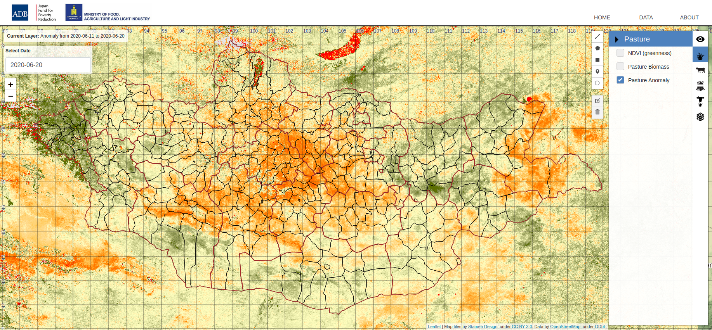
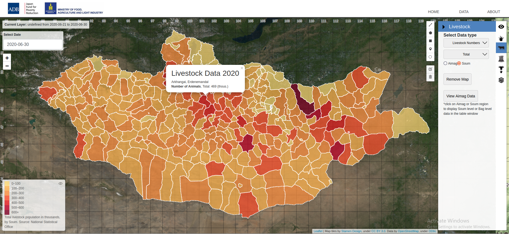
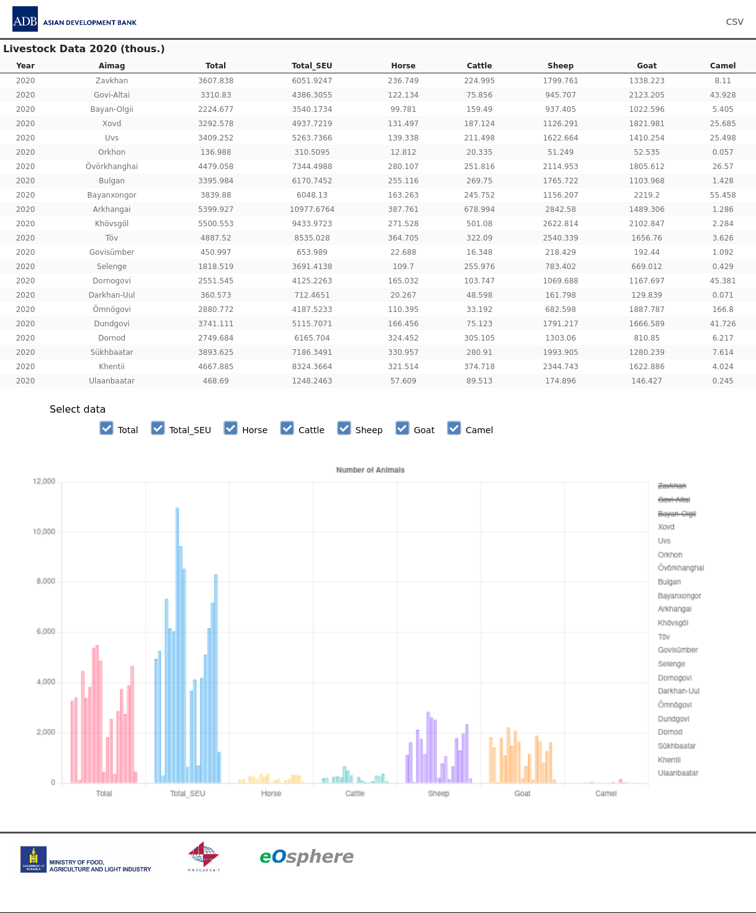
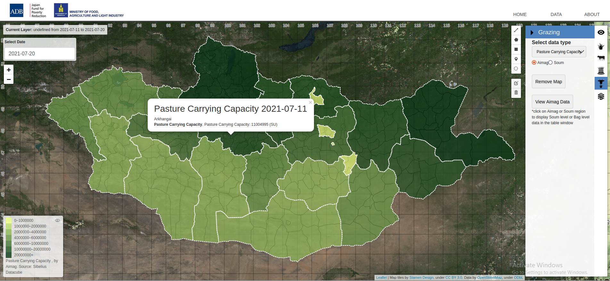
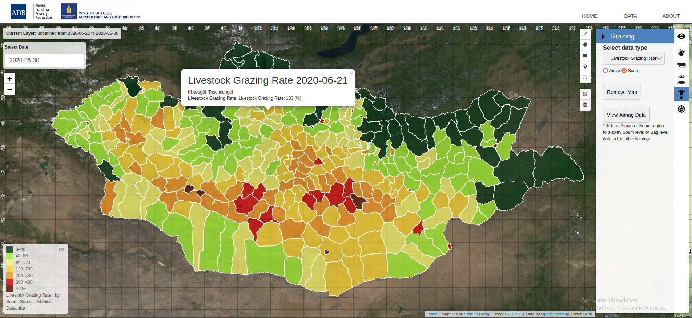
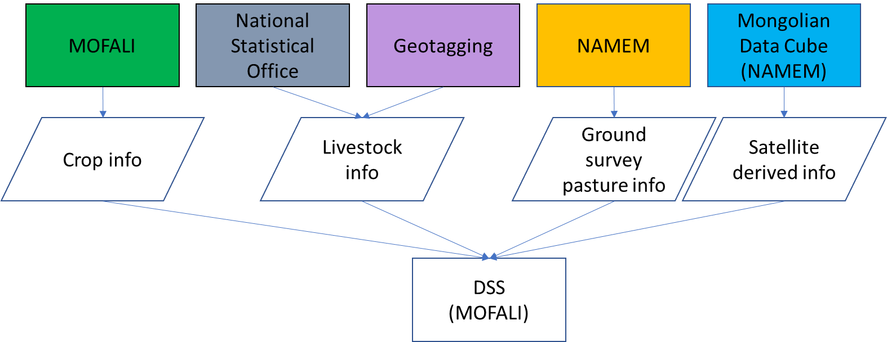

<h1 align="center">DSS-ийн функцийн танилцуулга</h1>

**Дүрсийг томруулж, жижгэрүүлж харуулах /Zoom/:** Газрын зургийг томруулж, газрын зургийг чирэх, гүйлгэж болно. Дэлгэцийн зураг томрох тусам газрын зургийн давхарга нь хамгийн өндөр нарийвчлалтай (MSI ба OLI) болон бага нарийвчлалтай (MODIS ба VIIRS) өгөгдлийн хооронд автоматаар шилждэг. Газрын зургийн хэсэгт олон үйлдлийг хийх боломжтой бөгөөд баруун, зүүн курсораар тухайн аймаг, сумын зураглал дата мэдээг хүснэгтэн байдлаар харуулах боломжтой.   

**Огноо /Date/:**  Зураглал дээрх огноог сүүлийн үеийн мэдээлэл болон өмнөх онуудын мэдээ мэдээлэлийг гарган харьцуулж харах боломжтой.   

**Хэмжилт хийх:** Зурган дээрх зай, талбайг хэмжих шугам, полигон зурах боломжийг олгодог. Энэ нь нэг бүсээс нөгөөд хүрэх томоохон замын сүлжээний хоорондох зайг тооцоолоход онцгой ач холбогдолтой.  

**Бэлчээр:** Оптик, Бэлчээр, Мал аж ахуй, Тэжээл, Бэлчээрээр тэжээх, Давхцал гэсэн 6-н цэсээр бүрдэнэ. Одоогоор DSS систем нь нэг хиймэл дагуулын давхаргыг харуулах боломжтой.  

**Бүтээгдэхүүн:** DSS систем нь үндсэн мэдээллээ одоогийн байдлаар 2 эх сурвалжаас авч ашиглаж байна. Энэ нь дунд зэргийн нарийвчлал (250 м) нь Монгол орны тухай ерөнхий том зураглалыг харуулах, томруулан харахад DSS автоматаар өндөр нарийвчлалтай өгөгдөл рүү (10 м)-т шилжин зураглалыг харуулах боломжтой.  

DSS нь хиймэл дагуулаас авсан гурван төрлийн бэлчээрийн бүтээгдэхүүнийг харуулдаг. Үүнд:  Ургамалжилтын индекс, Бэлчээрийн ногоон масс, Бэлчээрийн даацын олон жилийн дундаж:  
- Ургамалжилтын индекс нь газар ургамалын хэр их ургамал ургадаг болохыг тодорхойлдог. NDVI нь ургамлын улаан болон хэт улаан туяаны тусгал, шингээлтээр тодорхойлогддог. Ургамалжилтын индекс нь -1 ээс 1-ийн хооронд байна. 1 нь маш өндөр ургамалжилтыг дүрсэлдэг бол 0 нь огт ургамалгүй нүцгэн газрыг дүрсэлнэ. Харин 0-ээс бага утга нь ихэвчлэн ус, цас, үүл эсвэл бусад ургамлын бус үзэгдлүүдийг дүрсэлдэг.   
- Бэлчээрийн ногоон масс нь ургамалжилтын индексийн өгөгдлийг ургамалжилтын индексийн газрын хэмжилтийн өгөгдөлтэй харьцуулсан тэгшитгэлийг ашиглан кг/га-аар бэлчээрийн ногоон масс болгон хувиргана. Үүнийг зөвхөн газар дээр байгаа бэлчээрийн ногоон массыг харуулсан үзүүлэлт гэж үзнэ.   
- “Бэлчээрийн даацын олон жилийн дундаж” бүтээгдэхүүн нь тухайн үеийн бэлчээрийн ногоон массын утгыг өмнөх үеийн дундаж утгатай харьцуулдаг. Энэ нь бүтээгдэхүүн хэдэн хувийн өсөлт бууралттай ургаж байгааг харуулна. Энэ бүтээгдэхүүн нь бэлчээр сайжирч, доройтсоныг харуулдаг. -100% нь одоогийн бэлчээр урт хугацааны дунджаас 100% бага байна гэсэн үг юм, харин 100% нь одоогийн бэлчээр урт хугацааны дунджаас 100% их байгааг харуулна. Хэрэв бэлчээрийн ногоон масс нь олон жилийн дундажтай ижил байвал 0 гэсэн утга өгнө. Заримдаа энэ хүрээнээс гадуур утгыг буцааж өгч болох боловч хэт доогуур эсвэл өндөр эсэхээс хамаарч эдгээр утгыг -100% эсвэл 100% болгон бууруулдаг. Цагаан пиксел нь цас хаана байгааг илтгэнэ. Бэлчээрийн даацын олон жилийн дундажийн /Anamoly/ нэг давуу тал нь өнөөгийн нөхцөл байдлыг олон жилийн дундажтай харьцуулан харуулах боломжтой.  
 **Зураг.2** DSS Бэлчээрийн даацын олон жилийн дундажын харьцуулалт.  

Бэлчээрийн даацын олон жилийн дундаж нь бэлчээрийн нөхцөлтэй холбоотой асуудлууд улирлын эхэн үед хаана илүү байгааг тодорхойлоход маш хэрэгтэй байдаг. Энэхүү зурган дээрх бэлчээрийн даацын дундаж нь 2020 оны 6-р сараас эхлэн бэлчээр нь жилийн дунджаас муу байгаа өргөн тархсан бүс нутгуудыг (улаанаар тодруулсан) харуулсан болно.  

**Малын тоо толгой, хадлан тэжээл:** Мал аж ахуй тэжээлийн цэс нь малын тоо толгой, ургацын гарц, тариалсан тэжээлийн талбайтай холбоотой мэдээ мэдээллийг Үндэсний Статистикийн Хороо /ҮСХ/ -оос авч боловсруулан зурагладаг.   

Нийт малын тоог аймаг, сумын түвшинд харуулах боломжтой. Мөн ялгаатай шинж чанараар ялган үзүүлсэн газрын зургийг шинэ вектор давхарга болгон зурахад ашиглаж болно. Өөр өөр бүс нутгийг тухайн бүс нутагт хамааралтай өгөгдлийг хэрэглэгч сонгон харах боломжтой.  

2020 оны сумын малын мэдээллийг ялгаатай шинж чанараар ялган үзүүлсэн газрын зураг хэлбэрээр үзүүлэв. 

Аймгийн мэдээллийг харах цэсийг ашиглан сонгосон өгөгдлийг графиктай хүснэгт хэлбэрээр харуулах шинэ цонхыг нээх боломжтой. Хүснэгт ба графикт үзүүлсэн өгөгдлийн багануудыг "Өгөгдөл сонгох" товчийг ашиглан өөрчлөх бөгөөд баруун талын ялгах тэмдэг дээрх бүс нутгийг сонгосноор өгөгдлийг улам нарийвчлалтай болгож болно. График дээрх тодорхой багана дээгүүр гүйлгэх нь өгөгдлийг харуулах цонхыг нээнэ. Тодорхой аймаг, сум, багийн мэдээллийг харахын тулд хэрэглэгч газрын зургийн цонх руу буцах үйлдэл хийж хүссэн аймгаа  сонгон харж болно. 

2020 оны малын мэдээллийг хүснэгт болон зураасан график хэлбэрээр харуулав.

**Бэлчээр, малын мэдээлэл:** Бэлчээрлэх цэс нь хэрэглэгчдэд бэлчээрийн даац (PCC) болон малын бэлчээрийн хувь (LGR) ялгаатай шинж чанараар ялган үзүүлсэн газрын зургийг үзэх боломжийг олгодог:  
- Бэлчээрийн даац (PCC) нь бэлчээрийн өнөөгийн түвшингээр (хонин толгойн) юм. 
- Малын бэлчээрийн хувь (LGR) нь бэлчээрийн өнөөгийн түвшин (хиймэл дагуулын өгөгдлөөр тооцоолсон) одоогийн малын тоо толгойг (ҮСХ)-с авч зураглал боловсруулсан.  
- PCC нь Насагийн хиймэл дагуулын дүрслэлийг ашиглан SIBELIUs системийн (Datacube) доторх ногоон массын таамаглал/тооцооллоос бий болдог. 

 PCC нь Насагийн хиймэл дагуулын дүрслэлийг ашиглан SIBELIUs системийн датакуб доторх ногоон массын зураглалыг бий болдог. Энэхүү мэдээллийн сан нь талбайн амьтдын тоог (хонин толгой) илэрхийсэн бөгөөд цулгай бэлчээрийн мэдээллийг харуулаагүй болно. Малын бэлчээрийн хувь нь бэлчээрийн даац болон ҮСХ-оос гаралтай малын тоог ашиглан тухайн бүс нутагт бэлчээрийн даац хэтэрсэн байдлыг тодорхойлдог. Бэлчээрийн даацын мэдээллийн санг бүтэн жилийн турш 10 хоног тутамд шинэчилдэг бөгөөд энэ нь цас хайлж ургамлын ургалтын улирал эхэлмэгц хэрэглэгчдийн бэлчээрийн менежментийг хийх боломжийг олгодог. Гэсэн хэдий ч малын бэлчээрийн ургац, даацын мэдээлэл нь бүс нутгийн малын тоо болон олон хүчин зүйлээс хамаардаг бөгөөд УЦУОШГазраас жилд нэг удаа бэлчээрийн даацын судалгааг газар дээр авч өвөлжилт, хаваржилтын мэдээг бэлтгэдэг.  

Мэдээллийг аймгийн түвшинд эсвэл сумын түвшинд үзүүлэх боломжтой. Дээд талын зураг дээр хамгийн сүүлийн үеийн аймгийн түвшний Бэлчээрийн даацын газрын зургийг харуулав. Доод талын зурган дээр сумын түвшний Малын бэлчээрийн хувийн газрын зургийг харуулав. 

**Газарзүйн давхцал:** Сүүлийн цэс болох “Давхцлууд” (Overlays) нь нуур, гол, зам, төмөр замын шугам, сум, аймгийн бүс нутгийн хил хязгаар, бүс нутгийн төв гэх мэт дэлгэцийн векторын өгөгдлийн өөр өөр сонголтуудаар харуулах боломжтой.  

DSS хяналтын самбарт мэдээллийг харуулах болно.

DSS хяналтын самбарт орсон газрын зургийн давхаргууд: 
- Топографийн үндсэн газрын зураг (растер) давхаргууд: 
    - Шулуун хавтан (WMS интернэт хандалт) 
- Топографийн давхцал (вектор) давхаргууд:
    - Захиргааны хил хязгаар - бүс нутаг, аймаг, сум, баг 
    - Гол мөрөн, нуурууд 
    - Тээврийн сүлжээ (авто зам, төмөр зам гэх мэт) 
- Дэлхий ажиглалт (EO) хиймэл дагуулын бүтээгдэхүүн (SIBELIUs MDC WMS): 
    - Жинхэнэ өнгө (RGB)  
    - Ургамалжилтын индекс, Бэлчээрийн даац, Ногоон масс
- Бэлчээрийн бүтээгдэхүүн: 
    - Хиймэл дагуулаас авсан бэлчээрийн ногоон масс болон бэлчээрийн даац 
    - Хиймэл дагуулаас авсан бэлчээрийн даац 
    - Нэг малд ногдох даацын харьцаа (ҮСХ -ны малын статистик мэдээллийг ашигласан) 
- Мал аж ахуйн мэдээлэл: 
    - ҮСХ-ны багийн түвшний малын статистик тоо, хоньтой дүйцэх нэгж (SEU) -аас авсан малын тоог төрөл, нийт дүн 

DSS хяналтын самбарын ирээдүйн шинэчлэлтүүдэд авч үзэж болох газрын зургийн давхаргууд: 
- Топографийн үндсэн газрын зураг (растер) давхаргууд: 
    - OpenStreetMap (WMS интернэт хандалт) 
    - Орон нутгийн үндсэн газрын зургийн давхарга 
- Топографийн давхцал (вектор) давхаргууд: 
    - Захиргааны хил хязгаар 
    - Эдийн засаг эсвэл байгаль орчны бүс нутаг 
- Бэлчээрийн бүтээгдэхүүн: 
    - Газар дээрх судалгаа (ЦУОШГ) -ын бэлчээрийн ногоон масс ба бэлчээрийн даацын олон жилийн дундаж 
    - Газар дээрх судалгаа (ЦУОШГ) -ын бэлчээрийн даац 
- Бусад векторын давхаргууд: 
    - Хөдөө аж ахуйн бусад газар нутаг (ХХААХҮЯ) 
    - Нөөц газар (ХХААХҮЯ) 
    - Тэжээлийн ургамал тариалах талбай (ХХААХҮЯ)
- Мал аж ахуйн мэдээлэл: 
    - Мал аж ахуйн газарзүйн байршил, зам. (амьтан, сүргээр) 
    - Газарзүйн тэмдэглэлийн өгөгдлийг ашиглаж тооцсон малын тоо 
- Тэжээлийн ургацын бүтээгдэхүүн: 
    - Газар тариалангийн эрүүл мэнд/стрессийн индекс, ургац, хэвийн бус байдал 
    - Малын тэжээлийн сэрэмжлүүлэг 
    - Тэжээлийн үнийн мэдээлэл 
- Бусад давхаргууд: 
    - Цаг агаарын мэдээлэл (NAMEM) 

DSS системээс мэдээлэл авах бол энэ холбоосоор орно уу. 

 https://docs.google.com/document/d/1DF3KHg3Hn7tWA-vBNa3lQYZe_ZoZEuQxRSZm9-UdyFw/edit#heading=h.gjbt1c9gomjc
 

 