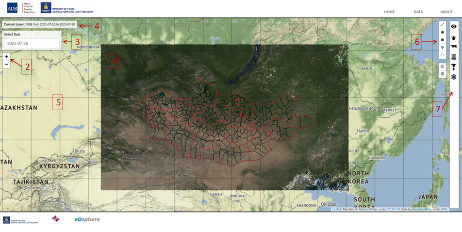

<h1 align="center">DSS-ийн товч танилцуулга
</h1>

DSS систем нь Монгол орны тэжээлийн тогтвортой менежментийг бий болгохоор ХХААХҮЯ-ны мэдээ мэдээллийг цахим хэлбэрт оруулах хялбаршуулах зорилгоор хийгдсэн. DSS мэдээллийн сан нь бэлчээр, тэжээл, бусад хүчин зүйлийн өнөөгийн болон олон жилийн дундаж үзүүлэлтийн талаарх датаг дараах зураглал бүтээгдэхүүний хэлбэрээр бэлтгэн гаргадаг. Үүнд:  
- Хиймэл дагуулын зураг болон түүний гаралтай бүтээгдэхүүнүүдийг боловсруулан гаргадаг. SIBELIUs төслийн хүрээнд хийгдсэн WMS/WCS дата cube сервер дээр түшиглэн ажилдаг.
- Судалгааны үр дүнд бэлчээрийн олон жилийн даац багтаамжийн мэдээ мэдээлэл. 
- Үндэсний Статистикийн Хороо (ҮСХ) -ын мэдээллийн сангаас авсан мал аж ахуй, тэжээлийн ургацын мэдээлэлийг зураглан оруулсан.
- Малын тоо төрлийн мэдээ мэдээлэл.
- Эдийн засаг, байгаль орчин болон бусад мэдээлэл. 
Эдийн засаг, байгаль орчин болон бусад мэдээлэл. 

DSS сервер нь вэб аппликейшн бөгөөд дурын интернэт вэб хөтөч дээр ажиллуулах боломжтой.  

*Зураг.1 DSS хяналтын самбарыг харуулав.*  

Зураг.1 DSS хяналтын самбарын веб апликейшн   
1. Газрын зургийн хамрах хүрээ
2. Газрын зургийн томруулалтын хяналт
3. Огноо сонгогч
4. Одоогийн давхаргын мэдээлэл
5. Үндсэн газрын зураг
6. Газрын зураг зурах/хэмжих хяналт
7. Өгөгдлийг хажуугийн самбарыг дүрсээр дамжуулан сонгох үндсэн хэрэгсэл