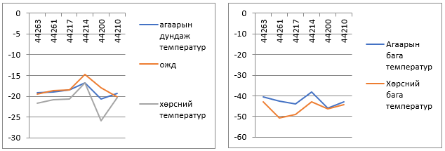
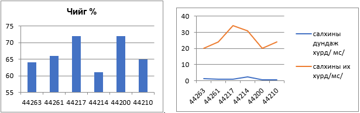
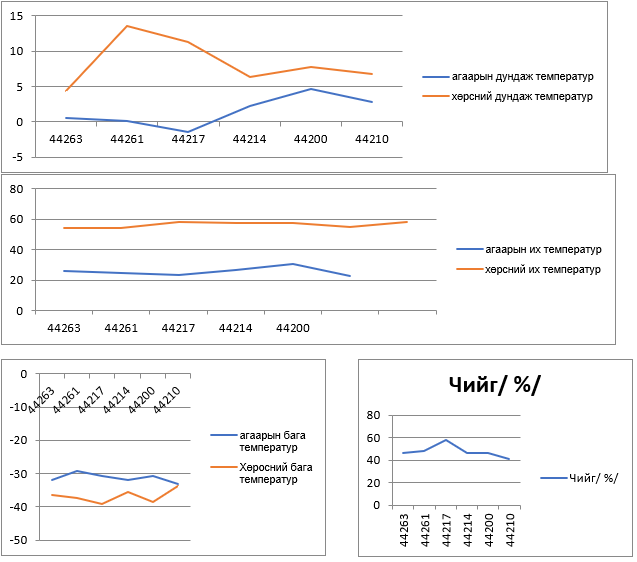
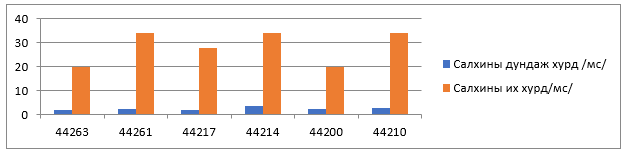
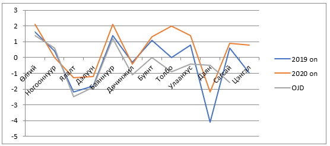
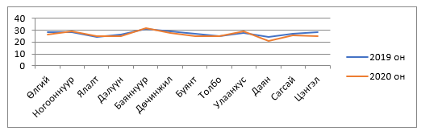

<h1 align="center">Аймгуудын уур амьсгалын мэдээлэл</h1>

#### ГОВЬСҮМБЭР АЙМАГ

- **Газарзүйн байршил, нийгэм эдийн засгийн өнөөгийн байдал**

Баян-Өлгий аймаг нь 1940 оны 8 дугаар сард байгуулагдсан. Нийслэл Улаанбаатараас 1760 км  зайд  оршдог, аймгийн төв Өлгий хот. нийслэл Улаанбаатараас 1760 км  зайд  оршдог,Засаг захиргаа нутаг дэвсгэрийн нэгжийн  хувьд 13 сум, 1 тосгоно, 95 багтай, Хүн амын тоо 105750. Хүн амын 93 хувь казак үндэстнүүд бөгөөд үлдсэн хувийг   дөрвөд,  урианхай,   тува,  халх ястангууд эзэлдэг.  
Баян-Өлгий аймаг нь баруун талаараа  Алтайн нурууны хяр дагаж БНХАУ-ын Шинжаан-Уйгарын Өөртөө засах оронтой 450 км, хойт талаараа Сийлхэмийн нуруу дагаж ОХУ-ын Бүгд Найрамдах Алтай Улстай 225 км, зүүн талаараа Увс аймагтай 165 км, зүүн ба урд талаараа Ховд аймагтай 450 км нутгаар хиллэдэг. Далайн түвшнээс дээш 1301-4374 метрт оршино, нутаг дэвсгэрийн 95,3% нь 1600 метрээс дээш өндөрт байна. Аймгийн хамгийн өндөр цэг нь Монгол улсын хамгийн өндөр цэг болох Алтай Таван Богд уулын Хүйтэн оргил (4374 м) ба хамгийн нам цэг нь Баяннуур сумын төв (1301 м) юм.  
Баян-Өлгий аймаг нь  45.8 мянган хавтгай дөрвөлжин километр нутаг дэвсгэртэй, хөдөө аж ахуйн газраас 3,5 сая га газрыг бэлчээрийн газар эзэлж байна.  
Аймгийн эдийн засгийн суурь салбар нь мал аж ахуй, 2020 оны эцсээр 2.224.677 мянган толгой мал тоологдсон.  

- **Уур амьсгалын нөхцөл, мужлал**

Аймгийн нутаг дэвсгэр нь байрлалаар дэлхийн бөмбөрцгийн хойт хагасын дундад өргөрөгт багтдаг учир эх газрын эрс тэс уур амьсгалтай. Далайн түвшнээс их өндөрт оршдогоос сэрүүн уур амьсгалтай, хүрээлэн оршдог өндөр уулс гаднаас агаарын урсгалаар ирсэн чийгийг биедээ татдаг учир Алтайн нурууны өндөрлөг хэсэгт хур тундасны жилийн дундаж хэмжээ 400-500 мм-д хүрдэг байна. Өөрөөр хэлбэл говь, цөлийн нөлөөнд ихээхэн автагдсан, өндөр уулын өвөрмөц уур амьсгал, эмзэг экосистемтэй. Салхины жилийн дундаж хурд 4-9 м/секунд хүрдэг.

- **Уур амьсгалын өөрчлөлт, дулаарал**

Баян-Өлгий аймгийн нутаг нь далайн түвшнээс дээш 1350-4374 метр өргөгдсөн, өндөр уулсаар хүрээлэгдсэн учир эх газрын эрс тэс уур амьсгалтай юм. Манай аймгийн нутаг  дэвсгэр нь  Монгол Алтайн нурууны бүсэд байдаг мөнх цастай, өндөр уул хадтай, шовх сарьдаг, гол мөрний сав газар ихтэй.  
Манай уулсын хамгийн өндөр уул Таван богд 4374 м, Цамбагарав 4108 м,  Цэнгэл хайрхан 3978 м зэрэг оргилууд оршдог. Монгол  Алтайн нууруудын хооронд хотгорууд олон байдаг. Тэдгээрийн томхон нь Даян, Толбо нуурын хотгор юм. Баян-Өлгий аймгийн нутгаар агаарын жилийн дундаж температур сүүлийн /1964-2004 он/  40 жилд 0,6 градусаар дулаарсанаас дулааны улиралд 0,28 градусаар, хүйтний улиралд 0,55 градусаар дулаарсан.   
Жилийн 230-250 хоног нь цэлмэг, өвлийн улирал нь урт /дундажаар 231-255 хоног/ хур тунадас бага ихэнх нь 6,7,8 саруудад ордог онцлогтой.
Уур амьсгалын улирлын заагийг хоногийн дундаж агаарын температур тодорхой заагийг давж дулаарах, хүйтрэх хугацааг баримтлан авдаг. Манай аймгийн нутагт өвлийн улирал аравдугаар сарын 20-30-ны үеэс эхлэн гуравдугаар сарын 3-10 хоног хүртэл 140-150 хоног үргэлжилдэг.  
Дулааны улирлаар авч үзэхэд агаарын хамгийн их температур  нам доор газар болох Баяннуур, Ногооннуур нутгаар 33,8-34,9 градус дулаарсан,  уулархаг газар болох Алтай, Дэлүүн, Булган Толбо,  Даян,  Цэнгэл, Буянт нутгаар  25,2-29,0 градус, тал газрууд болох Өлгий Улаанхус, Сагсай нутгаар  29,0-32,0 граудус дулаан бөгөөд олон жилийн үнэмлэхүй их температуртай харьцуулахад 2,0 градусаар  дулаарсан үзүүлэлттэй байна. Манай аймгийн нутагт өвлийн улирал аравдугаар сарын 20-30-ны үеэс эхлэн гуравдугаар сарын 3-10 хоног хүртэл 140-150 хоног үргэлжилдэг.  
Хамгийн хүйтэн нэгдүгээр сарын агаарын дундаж температур нь 18,2-20,7 градус хүйтэн бөгөөд үнэмлэхүй хамгийн бага температур 38,2-46,1 градус  хүрсэн. Уур амьсгалын  жилийн дундажтай харьцуулахад 0,7 градусаар хүйтэн гарсан.  
Түүнчлэн хөрсний гадаргын температур  нэгдүгээр сард дунджаар  16,8-25,9 градус хүйтэн байдаг бөгөөд үнэмлэхүй хамгийн бага температур 42,8-50,9 градус байна.  

Чийгийн горим: Өвлийн улиралд нийт нутгаар 61-72 %-ын чийгтэй хэлбэлзэж  байжээ. Хамгийн их чийг Алтай/ 44217/ Баяннуур сумд/ 44200/ 72% -тай. Хамгийн бага чийг 60%  Өлгийд гарсан байна.  

- **Салхины горим**

Салхины горим: Өвөл салхины дундаж хурд 0,7-1,2 м/с хүрдэг байна. Салхины их хурд 2015 оны хоёрдугаар сард Алтай суманд 34 м/с хүрч аюулын үзэгдэл гарсан байна.  

Салхины зонхилох чиглэл Өлгий  баруунаас, Алтай баруун өмнөөс, Булган, Дэлүүн  баруун ба баруун хойноос Ногооннуур, Баяннуур зүүн өмнөөс  тус тус салхилдаг.  
Хаврын улирал: Манай аймгийн нутагт хаврын улирал 3 дугаар сарын 3 арав хоногоос 5 дугаар сарын 10-20 хүртэл дунджаар 50-60 хоног үргэлжилнэ.  
Цаг агаар маш тогтворгүй  эрс тэс өөрчлөмтгий шинжтэй. Тавдугаар сар нийтдээ хүйтэвтэр  хоногийн температур хэлбэлзэл ихтэй. Агаарын дундаж температур 1,4 градус хүйтнээс 4,7 градус дулаан байдаг.  Агаарын хамгийн  их температур 22,4-30,8 градус дулаан байдаг бөгөөд Баяннуурт  30,8 градус дулаарсан. Харин хамгийн бага температур Ногооннуур, Өлгий, Булган, Баяннуур нутгаар 31,8.. 33,1 градус хүйтний эрч чангарсан байна. Хаврын эцсээр цочир хүйтрэлт орой тохиолдоно. Хөрсний дундаж температур 4,4-13 градус дулаан гарсан байна. Хөрсний хамгийн их  Алтайд 53,8 градус дулаарсан. Мөн Алтай сумд 39 градусаар хөрсөнд цочир  хүйтэрсэн байна.  
Чийгийн горим: Хаврын агаарын температур түргэн нэмэгдэхийн хамт хур тунадас бага учраас харьцангуй чийгшил  хамгийн бага 41 % болдог.  

Салхины горим:  хаврын улиралд чиглэл тус бүрийн салхины хурд ихсэж дунджаар 3-4 м/с болдог бөгөөд шороон шуурга олонтоо тохиолдоно.  

Зуны улирал:  
Зуны улирал тавдугаар сарын 20-ны үеэс есдүгээр сарын эхний 10 хоног хүртэл 100-110 хоног үргэлжилнэ. Зуны улирлын гол шинж нь хур тунадас их ордог, дулаан болдог явдал юм. Сарын дундаж температур 12,1-17,5 градус дулаан болдог байна. Үнэмлэхүй хамгийн их температур 30,1-39,6 градус хүрдэг бөгөөд 2004 оны 7 сард Баяннуур сумд 39,6 градус болж хэт дулааралт явагдсан. Уур амьсгалын олон жилийн дундажтай харьцуулахад 0,4 градусаар дулаан гарсан байна.  

Хөрсний дундаж температур 17-23 градус дулаан байсан байна.Үнэмлэхүй хамгийн их температур Баяннуур сумд 68 градусын  хөрсөнд хэт дулааралт явагдсан байна.  

Чийгийн горим:  
Харьцангуй чийг 50-62 % тай хэлбэлзэж байна. Хамгийн их чийг нь Алтайд 88-92%-ийн чийг 1999-2000 оны зургаадугаар сард ажиглагдсан байна.  
Салхины горим:  
Салхины дундаж хурд 2-3 мс хүрдэг бөгөөд салхи ихтэй байсан байна. Хамгийн их хурд 2015 оны долоодугаар сард  Өлгийд  34 м/с хүрсэн байна.  
Намрын улирал:  
Манай аймагт намрын улирал есдүгээр сарын 1 арав хоногоос аравдугаар сарын сүүлч хүртэл 50-60 хоног үргэлжилнэ.   
Намрын эхэн үе есдүгээр сарын агаарын дундаж температур 0 градусаас доош  -2,9 градус хүйтэн байдаг бөгөөд Ногооннуур, Баяннуур сумд 0-аас дээш 1,4 градус дулаан гарсан байна.  
Намрын улиралд агаарын температур сэрүүсэх нь хавар дулаарахтай бараг адил огцом явагддаг. Чийг, хур тунадас эрс багасч шороон шуургатай өдрийн тоо ихэсдэг.  

- **Баян-Өлгий аймгийн 2019-2020 оны цаг агаарын өөрчлөлтийн байдал**

Агаарын дундаж температур сүүлийн 2 жилээр авч үзвэл  агаарын дундаж температур нь 0,2 градусаар дулаарсан бөгөөд 1991-2020 оны уур амьсгалын нормтой харьцуулахад дундажын орчим байна. Даян сумдаар олон жилийн дунджаас 3,5 градусаар хүйтэн байв.  

- **Агаарын дундаж температурын утгын хамаарал**

Агаарын үнэмлэхүй дулаан нь Баяннуур сумын нутгаар 2020 оны 7 дугаар сард 31,4 градус орчим ба агаарын хүйтэн нь Даян сумд 2019 оны 1 дүгээр сард 40 градус хүйтэн ажиглагдсан.  

- **Агаарын хамгийн үнэмлэхүй их температур**

Агаарын хамгийн үнэмлэхүй бага температур.  

Жилийн хамгийн хүйтэн сар 1 сар бөгөөд 2020 оны 1 дүгээр сар нь 1981-2010 оны олон жилийн дунджаас 1,4 0С –аар дулаан буюу 1940 оноос хойш тохиолдож байгаа 14 дэхь дулаан сар байлаа.Манай аймгийн уур амьсгалыг авч үзвэл:   
**Агаарын температур:** 1 дүгээр сард агаарын дундаж температур -14,8...-20,3 0С хүйтэн байсан бөгөөд өндөр намаас хамааран газар бүрд харилцан адилгүй байна. Тухайлбал: 1 сард Баяннуур, Ногооннуур, Дөчинжил нутгаар - -20 0С орчим, бусад нутгаар -14...19 0С хүйтэн байлаа. Агаарын дундаж темпеартурыг олон жилийн дундажтай харьцуулвал /1981-2010/2020 оны 1 дүгээр сарын дундаж температур 2.7 гардусаар дулаан гарсан байна./ зураг-1/  

**1 дүгээр сарын агаарын температурын олон жилийн явц/  С/**
Агаарын хамгийн их температур Өлгийд -0,4 -0С хүйтэн, агаарын хамгийн бага температур Даян, Ногооннуур, Баяннур нутгаар -33,0...-34,5 0С хүйтэн гарсан байна./Зураг 2,3/  

**Хөрсний температур:**  
 Хөрсний дундаж температур -16...-24 0С хүйтэн бөгөөд Даян харуул -20-0С-аас их , Дөчин-жил,Баяннуур, Ногооннуур, Ялалт, Улаанхус, Цэнгэл нутгаар -20-0С-ийн хооронд хүйтэн, бусад нутгаар -16...-18 0С хүйтэн  гарсан байна. /Зураг 4/   

**Хөрсний дундаж температур С**  
Хөрсний хамгийн их температур Өлгий, Ялалт нутгаар 5...7 0С дулаан, хамгийн бага температур Даян, Цэнгэл, Дэлүүн нутгаар -36...-40 0С, бусад нутгаар -300С орчим хүйтэн гарсан байна./Зураг 5/   

**Хөрсний хамгийн бага температур С**  
**Хур тунадасны хувьд:** 2011-2020 оны нийлбэр хур тунадас орсон   байдлаар авч үзвэл:  

Даян нутгийн хэмжээгээр нийтдээ сүүлийн 10 жилд  1841,6 мм буюу дунджаар 165,2 мм хэмжээний тунадас орсон байна.Хамгийн бага тунадас Баяннуур нутгаар 1019,7 мм буюу 92,3 мм хэмжээгээр орсон байна.Дэлүүн, Толбо, Цэнгэл нутгаар 95,9-98,2 мм, Сагсай, Булган сумдын нутгаар 111,5-115,7 мм,Өлгий ,Ногооннуур  сумдын нутгаар 104,5-108,8 мм ,Ялалт ,Улаанхус сумдын нутгаар 132,0-133,4 мм хэмжээний тунадас орсон байна.  

**Харин  2020 оны 1 ба 7  сараар нь авч үзвэл:**  
Тус сард Монгол орны хэмжээнд дунджаар 0,8 мм тунадас орсон. Манай аймгийн 1 дүгээр сард нийт нутгаар 6,3 мм хэмжээний тунадас орсон бөгөөд олон жилийн дундажтай харьцуулвал 2,5 мм-ээр бага хэмжээтэй орсон байна. Хамгийн их тунадас 0,9....1,1 мм хэмжээгээр Улаанхус, Ялалт, Даян нутгаар орсон байна. Бусад нутгаар 0...0,6 мм хэмжээний тунадас орсон байна. Хамгийн бага хэмжээний тунадас  Ногооннуур, Дэлүүн нутгаар 0,0 мм хэмжээний тунадас орсон байна. /Зураг-6,7/  

Жилийн хамгийн дулаан сар 7 дугаар сар бөгөөд агаарын дундаж олон жилийн дунджаар (1981-2010 оны дунджаар)  7 дугаар  сарын агаарын дундаж температур (1981-2010 оны дунджаар)   14,8°С -аас 20°С ) байдаг байна.     
    2020 оны 7 дугаар сарын агаарын дундаж температур 2019 оноос -0.3°С-аар хүйтэн, ОЖД-аас 1,1°С-аар хүйтэн сар болж  өнгөрлөө. (график 1)  

**Агаарын дундаж температурын явц**  

Агаарын хамгийн их температур нь Баяннуур нутгаар 29,4°С дулаан , хамгийн бага температур Даянд 1,3°С дулаан гарсан байна. (Зураг 1,2)  

Агаарын үнэмлэхүй их температур °С             Агаарын үнэмлэхүй бага температур°С 
       7 дугаар сард 30°С-аас халуун өдөр  ажиглагдаагүй.  

**Хөрсний дундаж температур**  
20°С дулаан гарсан байна. Хөрсний хамгийн их температур  Дөчин жил нутгаар 60°С дулаан , хамгийн бага температур  Даян нутгаар -3°С-аар хүйтэн байв.   (Зураг 2)    

Хөрсний дундаж температур°С  
   Хур тунадасны хувьд: Олон жилийн нийлбэр  дундажтай харьцуулвал 35,7 мм, харин 2019 оны нийлбэр дундажтай харьцуулвал 9,8 мм –ээр  ахиу тунадас орсон байна. (график 2)   

Салхины горим: 2020 оны салхины дундаж хурд 2,1 м/с хурдтай байсан ба 2019 оны дундаж хурдтай харьцуулвал 0,2 м/с-ээр бага гарсан. Ногооннуур ,Өлгий, Дөчин жил нутгаар 18-22м/с –ийн хурдтай салхилсан бөгөөд бусад нутгаар 8-14 м/с байв. Өмнөх оны 7 сартай харьцуулвал энэ сард бага салхи ихтэй байв.  

Чийгийн горим:Өмнөх оны чийгтэй харьцуулахад 0,3%-иар өссөн байна. 2020 оны хамгийн их чийг нь Даянд 70%-тай гарсан байна. 
30-аас бага чийгтэй тоо 91 удаа 80 их чийгийн тоо 141 удаа тохиолдсон байна.  

2020 оны шороон шуургатай өдрийн тоог 2019 онтой харьцуулахад 98 дахин буурсан үзүүлэлттэй байна. Өлгий, Ногооннуур,  Буянт, Алтай нутгуудаар хамгийн их шуургатай байсан өдрийн тоо 27-59 удаа тохиолдсон байна. Өлгий, Ногооннуур нутгаар илүү их шуурсан байна.  

**Шороон шуургатай өдрийн тоо** 

Аадар бороотой өдрийн тоо 2020 онд  262 удаа буюу 55 дахин  илүү орсон байна. Баяннуур, Дэлүүн, Өлгийн  нутгуудаар 2020 онд нийтдээ 33-36 удаа аадар бороо илүү орсон байна.  

**Аадар бороотой өдрийн тоо**  

**Баян –Өлгийн  аймгийн  нийт нутгаар  ажиглагдсан агаарын болон хур тунадас орсон  байдлыг оноор  нь авч үзвэл:**  

**Хадлан бэлчээр, өвс тэжээл**  
Тус аймагт тэжээлийн таримлыг Баяннуур, Алтанцөгц, Ногооннуур, Сагсай сумдад тариалж байгаа ба голчлон олон наст, ерхөг, согоовор тариалж байна.   
Алтанцөгц сумд Өлгий Агро ХХК нь малын хорголжин тэжээл үйлдвэрлэж аймгийг хангаж байна.   

