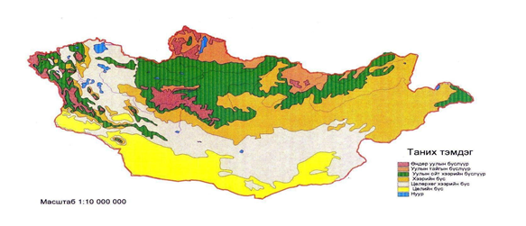
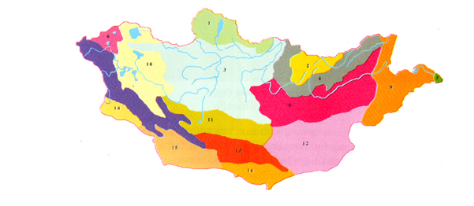

<h1 align="center">Аймгуудын уур амьсгалын мэдээлэл</h1>

#### ДОРНОД АЙМАГ

Дорнод аймаг нь Монгол улсын хамгийн зүүн хязгаарт оршдог 124000 км2  газар нутагтай бөгөөд хэмжээгээрээ аймгуудаас эхний 3-т ордог. Дорнод аймгийн хүн ам одоогийн байдлаар 86.1 хүн амтай. Халх, буриад, барга , үзэмчин үндэстэн ястангууд оршин суудаг. Засаг захиргааны нэгжийн хувьд 14 сум 67 багтай. Нийт хүн амын 55 хувь нь Зүүн бүсийн хөгжлийн тулгуур төв, Цэргийн гавьяаны одонт аймгийн төв Чойбалсан хотод амьдардагДорнод аймаг нэг хүнд ноогдох дотоодын нийт бүтээгдэхүүний хэмжээгээрээ аймгуудаас 3-р байранд байна.  
Дорнод аймаг нь  ОХУ-н Өвөрбайгалийн хязгаар,  БНХАУ-н ӨМӨЗО-ны Хөлөнбуйр, Хянган, Шилийн гол аймгуудтай хиллэдэг. Хилийн зургаан боомттойгоос  ОХУ-тай авто замын 2, төмөр замын нэг, БНХАУ-тай авто замын 3, агаарын 1 боомтоор  харилцдаг бөгөөд Монгол улсын Зүүн хойд Азийн орнуудтай  холбодох хамгийн ойрын  гарц юм.  
Монгол улсын Улсын их хурлаас  баталсан Бүсчилсэн хөгжлийн үзэл баримтлалаар зүүн бүсийг аялал жуулчлалын  салбараар хөгжүүлэхээр тодорхойлсон. Дорнод аймагт аялал жуулчлалыг хөгжүүлэх боломж бүхий түүхийн  дурсгалт болон байгалийн үзэсгэлэнт газруудтай  .Тухайлбал Халхголын бүс нутаг,  Буйр нуур, Их бурхант, Мэнэнгийн тал, Цагаан зээр, Хэрлэн бар хотын туурь, Өүлэн эхийн өлгий нутаг гадаад дотоодын жуулчдын анхаарлыг зүй ёсоор татдаг.  

- **Газарзүйн онцлог**

Монгол орны зүүн , зүүн өмнөд хязгаарт орших Дорнод аймаг хуурай хээрийн бүсэд хамаарагдана. Дорнод аймаг нь далайн түвшинээс дээш 600-1200 метр өргөгдсөн, ухаа гүвээ, тэгш талархаг гадаргатай. Байгалийн бүс бүслүүрийн хувьд ойт-хээр, хээрийн бүс зонхилсон, 123.5 мянган хавтгай дөрвөлжин километр нутагтай. Баруун, баруун хойт зүгийн агаарын урсгалаар ирэх чийгийн ихэнх нь Хэнтийн нуруунд саатдагаас Дорнод тал нутаг бол чийглэгдүү-сэрүүн, хуурайдуу-сэрүүвтэр, хуурайдуу дулаавтар уур амьсгалтай. Байгалийн бүс бүслүүрийн хувьд ойт-хээр, хээрийн бүс зонхилсон, 123.5 мянган хавтгай дөрвөлжин километр нутагтай. Баруун, баруун хойт зүгийн агаарын урсгалаар ирэх чийгийн ихэнх нь Хэнтийн нуруунд саатдагаас Дорнод тал нутаг бол чийглэгдүү-сэрүүн, хуурайдуу-сэрүүвтэр, хуурайдуу дулаавтар уур амьсгалтай Аймгийн баруун хойд талаараа Хэнтийн нурууны салбар Эрээн давааны нуруу, Энх, Жаварт хошуу, Онцгой, Хараат, Бүрэнхаан, зүүн зүүн өмнөд хэсгээрээ Их Хянганы салбар Нөмрөг, Соёлз зэрэг далайн түвшинээс дээш 532 метрт орших Хөх нуур хэмээх тэгш тал байдаг. \Дорнод аймгийн уур амьсгалын эмхэтгэл 1998 он.  

- **Уур амьсгалын онцлог**

Дорнод аймаг нь баруун, баруун хойт зүгийн агаарын урсгалаар ирэх чийгийн ихэнх нь Хэнтийн нуруунд саатдагаас дорнод тал нутаг бол чийглэгдүү сэрүүн хуурайдуу сэрүүн хуурайдуу агаарын урсгалтай. Жилийн 251-260 өдөр нь нартай цэлмэг. Жилд дунджаар 150-300 мм тундас унаж цаг агаар дундаж температур өвөлдөө хасах 27 хэм зундаа нэмэх 21 хэм байдаг. Дорнод аймгийн хувьд агаарын жилийн дундаж температур 1971-2018 оны хооронд 1.1°С-аар дулаарсан. Нийлбэр хур тунадасны хувьд 1971-2018 оны хооронд 13%- иар бага зэрэг буурсан хандлагатай байна.  

- **Хөрс**

    -Уулын хүрэн хөрс.  

Механик бүрэлдэхүүний хувьд хөнгөн шавранцар,элсэнцэр хөрс зонхилно. Хээрийн хүрэн хөрс үүсэх үйл явц уулын хажуугийн элэгдлийн үйл явц хосолж явагдсаны дүнд үүссэн байна. Уулын хөрсний шимт давхраа сул хөгжилтэй нимгэн хад чулуу элбэгтэй хажуугийн элэгдлийн нөлөөгөөр хөрсний дээд давхрага байнга эвдэрдэг.  Хөрс үүсэх явц үргэлж залуугаараа байдаг. Давсны хүчлийн нөлөөнд буцлах гүн жигд биш, заримдаа өнгөнөөсөө эхлэн буцалдаг.  
 
    - Хүрэн хөрс.

Дорнод Монголын хөрсөн бүрхэвчийн ихэнх хэсгийг эзэлнэ. Хэнтийн уулархаг нутгийн урд талаас өмнө зүгт өргөн хөндий тэгш тал, намхавтар уулс, дов толгодоор тархсан байдаг. Хүрэн хөрс баруун талаараа өргөн зурвас газраар манай орны гүн тийш үргэлжилж, зүүн талаараа улсын хилээс цааш үргэлжилж тархана. Нутгийн урд хэсэгт цайвар хүрэн хөрсөнд аажмаар шилжиж байна. Хүрэн хөрсөн дээрх ургамал тачир сийрэг учраас хөрсөнд орох органик үлдэгдлийн хэмжээ ерөнхийдөө бага байна. Механик бүрэлдэхүүнээрээ ихэвчлэн хөнгөн шавранцар ба элсэнцэр сайр чулуугаар элбэг байдаг. Ялзмагт үеийн зузаан 20-30 см-аас ихгүй. Хүрэн хөрсөн дэх ялзмагийн хэмжээ ялзмагт үеийн зузаанаас хамаарч хар хүрэн, хүрэн цайвар, хүрэн гэж 3-н хэв шинжид ялгана.      
 
    - Хар хүрэн хөрс.

Дорнод Монголын хойд ба баруун хойд нутгаар их элбэг тархана. Мөн арай хуурай бүсийн нам газруудаар тохиолдоно. Хар хүрэн хөрс дангаараа үргэлжилсэн бүс үүсгэхгүй, алаг цоог тархсан байдаг. Хар хүрэн хөрс нь 1,6 сая га талбайг эзэлдэг. Ялзмагт үеийн зузаан 30-40 см, заримдаа 50 см буюу түүнээс илүү гарах явдал үзэгдэнэ. Механик бүрэлдэхүүний хувьд жигд биш, шавранцар, хөнгөн шавранцар хөрс зонхилж, хаяа шаварлаг хөрс тохиолдоно. Хар хүрэн хөрсөнд ялзмаг болон тэжээлийн бодис нилээн арвин хуралдах учир агро үйлдвэрлэлийн шинжээр сайн чанартайд тооцдог.  
 
    - Цайвар хүрэн хөрс.

Дорнод Монголын нутгийн баруун урд хэсгээр 0,1 сая/га талбайг эзлэн тархсан байна. Цайвар хүрэн хөрс механик бүрэлдхүүний хувьд цайрархаг ба энэ нь хөрсний бүх давхаргад үзэгдэнэ. Хөрсний ялзмагт үеийн зузаан 10-20 см, ялзмагаар маш ядуу, үржил шимээр дорой. Дорнод Монголын талд дээрх үндсэн 2 төрлийн хөрснөөс гадна хужир, марзат хөрс, голын хагшаас хурдаст нугын хөрс мөн хагас бэхжсэн ба сул элс харьцангуй бага талбайг эзэлдэг. Хужир марзат хөрс 0,9 га эзэлдэг. Хонхор хотгоруудын ¸ёроол, голын хөндий, нуурын эрэг хөвөө орчмын нам дор газар ихээхэн тархана. Хужир марзат хөрс нь давслагийн зүйлээр хэт их учир хөдөө аж ахуйн ач холбогдолгүй.  

Голын хагшааст хурдаст нугын хөрс 1,1 сая га талбайг эзлэн, уулын хоорондох нарийн ам хөндий, голуудын татам газарт тогтсон байдаг. Ялзмагт үеийн зузаан 35-40 см орчим юм. Механик бүрэлдýхүүнээрээ хөнгөн шавранцараас хүнд шавранцар, шавар хүртэл янз бүр байна. Ялзмагийн хэмжээ өнгөн хэсэгтээ 8% орчим. Уг хөрс нь үр шимээрээ дунд ба доод зэрэгт ордог. Нугын хөрс малын бэлчээр, хадланд ашиглахад тохиромжтой.  

Голын хагшааст хурдаст нугын хөрс 1,1 сая га талбайг эзлэн, уулын хоорондох нарийн ам хөндий, голуудын татам газарт тогтсон байдаг. Ялзмагт үеийн зузаан 35-40 см орчим юм. Механик бүрэлдýхүүнээрээ хөнгөн шавранцараас хүнд шавранцар, шавар хүртэл янз бүр байна. Ялзмагийн хэмжээ өнгөн хэсэгтээ 8% орчим. Уг хөрс нь үр шимээрээ дунд ба доод зэрэгт ордог. Нугын хөрс малын бэлчээр, хадланд ашиглахад тохиромжтой.  

- **Ургамалжилт**

Дорнод Монголын нутаг нь маш олон төрөл, зүйлийн ургамалтай. Хэнтийн нурууны салбар уулсын хоорондох хөндий, уулсын энгэр хажуу хормойгоор уулын хар шороон ба хар хүрэн хөрстэй газрын алаг өвс улалж, жижиг дэгнүүлт, биелэг өвс  зонхилно. Хэнтийн нурууны салбар уулсын зүүн хэсгийн намхан уулсаар, мөн Хянганы уулсын баруун талаар хар шороон ба нугат /хээрийн/ хүрэн хөрсөн дээр тохиолдох нам уулсын зүр өвст нугын хээр зонхилно. Дорнод аймгийн хойд ба зүүн өмнөд талаар, Хэнтийн уулын зүүн, Хянганы салбар уулсын баруун хаяагаар зүр өвст хялганат, зүр өвст алаг өвст хялганат хээр зонхилно. Хэнтий нурууны зах сэжүүрийн уулс хоорондын хөндийд Дорнодын зүүн хойд сумдын нутгаар мөн Халхгол сумын нутагт тархсан нугын шинжтэй хөнгөн шавранцар хар хүрэн хөрстэй газар элбэг тохиолдох алаг өвс хиаг- хялганат хээр зонхилж байна. Мөн энд сонгинолог ургамал элбэг тохиолдоно. Дорнодын тал Хэнтий аймгийн төв хэсгээр, Сүхбаатарын зүүн, зүүн урд талаар тархсан шавранцар хар хүрэн хөрстэй газрын хиаг бүхий жижиг дэгнүүлт, үетэнт-хялганат, харганат хиаг хялганат жижиг дэгнүүлт үетэнт хээр тохиолдоно. Дорнод аймгийн урд Сүхбаатар аймгийн зүүн хэсгээр бага хэмжээний талбайг эзлэх шавранцар, мараалаг хүрэн хөрстэй газрын-- хиаг, таана ширэг улалж-хялганат хээр тархсан байна. Эндээс үзэхэд Дорнод Монголын нутаг дэвсгэрийн байгалийн нөөцийн чухал хэсэг нь байгалийн тэжээлийн ургамал юм. Энэ нь дэвсгэр нутгийн 90%-ийг эзлэн тархсан байна.  

- **Байгалийн бүс бүслүүр**

 Дорнод аймгийн нутаг хуурай хээр болон ойт хээрийн бүсэд хамрагддаг.

 

*Уулын ойт хээрийн бүслүүр*

Жилдээ 300-400 мм, салбар уулсаар 200-300 мм тунадас унадаг. Хүйтрэлгүй хугацаа 112-125 хоног үргэлжилдэг. Хавар, намар хуурайдуу юмуу хуурай. Карбонаттай юмуу нунтаг карбонатгүй хар хүрэн хөрс зонхилно. Үетэнт, алаг өвс-хялганат, хазаар өвс-хялганат, хялганат-агьт, ботууль-агьт уулын хээр болоод нугархаг хээртэй. Томоохон голуудын хөндий дагаж үржил шим сайтай тутмын нуга тааралдана. Монголын газар тариалангийн гол бүс нутаг болгох ба эрчимжсэн мал аж ахуй эрхлэхэд нэн тохиромжтой.     

*Хээрийн бүс*

Хээрийн бүс нь хуурайсаг ургамал зонхилдгоороо онцлог. Монголын хээр нь Мажар Улсын Дунайн “пушти” хэмээх хээрээс Дорнод Азийн Манжуурын хээр хүртэл үргэлжлэх хээрийн дорнод хэсэг болно. Манай хээр бусад хээрээс харгана, агь мэтийн сөөг, сөөгөнцөр элбэгтэй байдгаараа ялгаатай.  
Энд хээрийн үржил шим сайтай, нунтаг карбонаттай ба карбонатгүй хүрэн, элсэнцэр цайвар хүрэн хөрс зонхилно. Хотос, хоолой дагаж хужир давстай шорвог хөрсний төрөл бас дайралдана.  
Хээрийн бүсэд жилдээ 125-250 мм тунадас унадаг. Нутгийн хойт хагас болон Халхын гол орчимд газар тариаланд тохиромжтой хөрс ихтэй.  

- **Ургамал-газарзүйн мужлал**

Дорнод аймаг нь ургамал-газарзүйн мужлалын хувьд Монгол-дагуурын уулын ойт хээрийн тойрог, Дорнод монголын хээрийн тойрогт тус бүр багтддаг.  

*Газар тариалан*

Дорнод аймаг нь газар тариалангийн үйлдвэрлэлийн хамгийн их нөөцтэй аймгийн нэг бөгөөд улсын хадлангийн нийт талбайн 54 хувь, тариаланд тохиромжтой талбайн 22 хувь тус аймагт оршдог. Газар тариалангийн үйлдвэрлэл сүүлийн жилүүдэд сэргэж буй бөгөөд харьцангуй дулаан, чийглэг уур амьсгалтай, хөрсний үржил шим сайтай тул үр тариа болон хүнсний ногооны тариалалтыг нэмэгдүүлж, аймгийн хэрэгцээг бүрэн хангаж, илүүдэл бүтээгдэхүүнийг дотоодын хэрэгцээнд төдийгүй гадаад зах зээлд нийлүүлэх боломжтой. Цаашид гурилаас гадна нэмүү өртөг шингэсэн үйлдвэрлэлийг хөгжүүлэх үүднээс талх, нарийн боов, гоймон зэрэг гурилан бүтээгдэхүүний үйлдвэр, жимсний чанамал, шүүс, ургамлын тос, малын тэжээл, даршны үйлдвэрүүдийг хөгжүүлэх боломжтой.  

