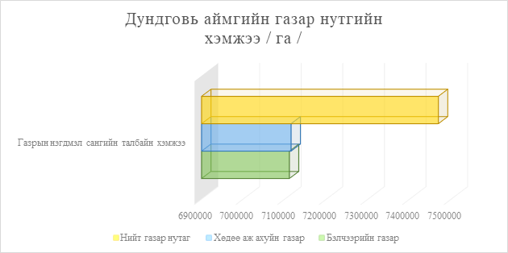
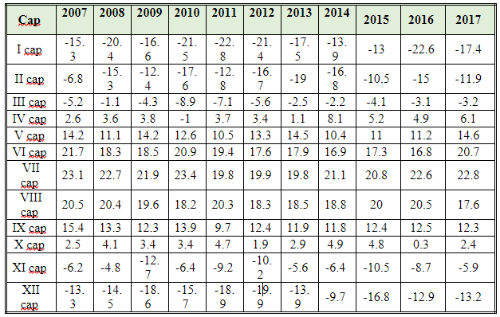
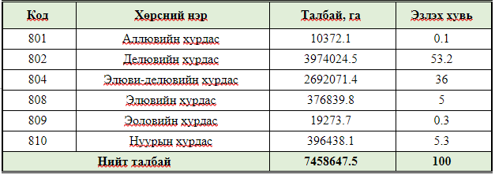
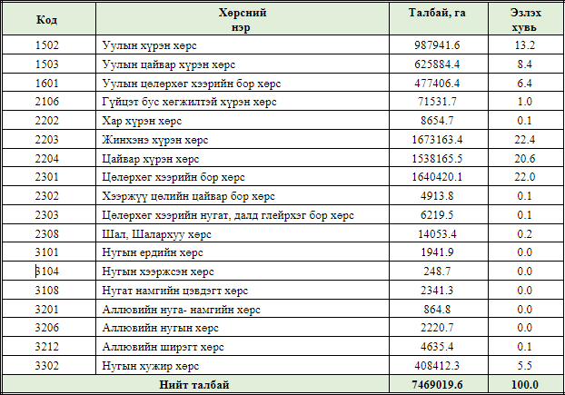

<h1 align="center">Аймгуудын уур амьсгалын мэдээлэл</h1>

#### ДУНДГОВЬ АЙМАГ 

  - **Газарзүйн байршил, нийгэм эдийн засгийн өнөөгийн байдал**

  Дундговь аймаг нь 1941 онд Өмнөговь аймгаас 8 сум, Дорноговь аймгаас 3 сум, Төв аймгаас 7 сум тус тус шилжүүлэн 18 сумтайгаар одоогийн Өлзийт сумын нутаг Ембүү дэрсэнэ ус гэдэг газар Шарангад аймаг нэртэйгээр байгуулагджээ. 1942 онд аймгийн нэрийг Дундговь хэмээн өөрчилж аймгийн төв Мандалговь хот одоогийн оршин байгаа Зоогийн хар овооны энгэрт суурьшсан байна. Засаг захиргаа нутаг дэвсгэрийн нэгжийн  хувьд 15 сум, 68 багтай, 2019 оны жилийн эцсийн байдлаар аймгийн нийт хүн ам 46383 болж өмнөх оноос 686 иргэнээр буюу 1.9 хувиар өссөн.  
  Дундговь аймаг нь хойд талаараа Төв аймаг, урд талаараа Өмнөговь аймагтай, баруун талаараа Өвөрхангай аймаг, зүүн, зүүн хойд талаараа Говьсүмбэр аймагтай, зүүн урд талаараа Дорноговь аймагтай тус тус хиллэдэг. Аймгийн эдийн засгийн суурь салбар нь мал аж ахуй, 2019 оны эцсээр 3539.0 мянган толгой мал тоологдсон бөгөөд нэг малчин өрхөд ногдох малын тоогоор улсдаа тэргүүлдэг.   
  Дундговь аймаг нь 7469.0 мянган га нутаг дэвсгэртэй, газар нутгийн хэмжээгээр Монгол улсын нутаг дэвсгэрийн 4.5 хувийг эзэлдэг. Нийт газар нутгийн 90.7 хувь  буюу 7115047.37 га  газрыг Хөдөө аж ахуйн газар, хөдөө аж ахуйн газраас 7110980.52 га газрыг бэлчээрийн газар эзэлж байна.  

 - **Газрын гадарга**

 Дундговь аймаг нь Монгол орны физик-газарзүйн мужлалаар Говийн их мужийн Алтайн ар говийн мужийн Нууруудын хөндий тойрог, Хангайн өмнөд бэгэлцэгийн тойрог, Дорнод говийн мужийн Умарт талын гүвээт талын тойрог, Монголын Дорнод талын их мужийн Халхын Дундад ба Дарьгангын талархаг мужийн Ухаа Гүвээт Халхын дундад тал тойрогт багтаж байна.  
    - Сайхан-Овоо, Дэлгэрхангай сумд Говийн их мужийн Алтайн ар говийн мужийн Нууруудын хөндий тойрогт 
    - Эрдэнэдалай сумын баруун хэсэг Говийн их мужийн Алтайн ар говийн Хангайн өмнөд бэгэлцэгийн тойрогт 
    - Хулд, Луус сумын баруун хэсэг Говийн их мужийн Алтайн ар говийн мужийн Нууруудын хөндий тойрогт 
    - Эрдэнэдалай, Луус, Хулд сумын зүүн хэсэг Говийн их мужийн Дорнод говийн мужийн Умарт талын гүвээт талын тойрогт 
    - Цагаандэлгэр сумын урд хэсэг Говийн их мужийн Дорнод говийн мужийн Умарт талын гүвээт талын тойрогт 
    - Цагаандэлгэр сумын хойд хэсэг Монголын Дорнод талын их мужийн Халхын Дундад ба Дарьгангын талархаг мужийн Ухаа Гүвээт Халхын дундад тал тойрогт Адаацаг, Дэлгэрцогт, Дэрэн, Говь-Угтаал, Сайнцагаан, Гурвансайхан, Баянжаргалан, Өндөршил, Өлзийт сумд Говийн их мужийн Дорнод говийн мужийн Умарт талын гүвээт талын тойрогт тус тус багтаж байна.  

 Монгол орны хотгор гүдгэрийн орчин үеийн ерөнхий төрх байдал, дэлхийн гадаад дотоод хүчний хавсарсан үйлдлийн үр дүнд бүрэлдэн бий болжээ. Дотоод хүчинд уул тогтоох хөдөлгөөн асар их нөлөө үзүүлж, галт уулын ажиллагаа зэрэг бусад хүчин зүйлийн хувь оролцоо ханьцангуй бага байдаг. Гадаад хүчний нөлөө нь олон үйл явцаас бүрдэх бөгөөд ус, мөсдөл, байгалийн өгөршил хамгийн чухал үүрэгтэй байдаг. Газрын гадаргын хотгор гүдгэр нь нутаг бүрийн геологийн болон тектоникийн бүтэц харилцан адилгүй, мөн гадаад хүчний төрөл зүйл, үйлдэл газар бүрт өөр өөр ялгаатайн улмаас хотгор гүдгэрийн дүрс хэлбэр олон янз болсон байдаг. Иймд Дундговь аймгийн газар нутгийн хотгор гүдгэрийг ерөнхий төрх байдал, гарал үүслийн үүднээс авч үзэхэд цав толгод болон ухаа гүвээт тал гэсэн хэв шинжид багтана.   
  Дундговь аймгийн өндөржилт нь далайн түвшинээс дээш 1100-1350 метрт өргөгдсөн, нутгийн хамгийн өндөр цэг нь 1926 м өндөрт орших Дэлгэрхангай уул бөгөөд Их, Бага газрын чулуу зэрэг уулс бий. Тус аймгийн газрын гадарга нь хэсэгчилсэн уулс, говь тал хөндий хоолой, дов толгод хосолсон, газрын гадаргад үндсэн чулуулаг ойрхон байдаг учир толгодын оройгоор ил гарч хад хэлбэрийг үүсгэж байгалийн сонин тогтоцыг үүсгэсэн газар нутаг элбэгтэй.  

 - **Уур амьсгалын нөхцөл, мужлал**

 Дундговь аймаг нь уур амьсгалын мужлалаар нутгийн хойд хэсэг хуурай сэрүүн, дулаавтар зунтай, хагас чийглэг мужид, нутгийн урд хэсэг халуувтар зунтай, хуурайвтар мужид, нутгийн дунд хэсэг дулаан зунтай чийгээр дутмаг мужид багтаж байна. Үүнд: 
    - Дэлгэрцогт, Дэрэн, Цагаандэлгэр сумын зүүн хэсэг, Дэлгэрхангай, Эрдэнэдалай сумын баруун хэсэг дулаавтар зунтай хагас чийглэг уур амьсгалын мужид 
    - Эрдэнэдалай, Дэлгэрхангай сумын зүүн хэсэг, Дэлгэрцогт, Дэрэн, Цагаандэлгэр сумын баруун хэсэг, Өлзийт, Өндөршил сумын хойд хэсэг, Адаацаг, Луус, Сайнцагаан, Гурвансайхан, Говь-Угтаал, Баянжаргалан сумд халуувтар зунтай, хуурайвтар мужид 
    - Өлзийт, Өндөршил сумын урд хэсэг дулаан зунтай чийгээр дутмаг мужид тус тус багтаж байна (Цэгмид, 1969).  

 Уур амьсгалын мэдээг Дундговь аймгийн ус цаг уур орчны шинжилгээний төвөөс авсан бөгөөд аймгийн хэмжжэд 6 цаг уурын өртөөтэй байна. Мандалговь өртөө, Эрдэнэдалай өртөө, Сайхан-Овоо өртөө, Гурвансайхан өртөө, Цагаандэлгэр өртөө, Говь-Угтаал өртөө гэсэн 6 цаг уурын өртөөтэй байна.  

 - **Агаарын харьцангуй чийгшил**

 Нэг шоо дөрвөлжин метр агаарт байгаа усны уурын хэмжээ буюу түүний жинг үнэмлэхүй чийг гэдэг бөгөөд граммаар (одоо миллибараа) илэрхийлнэ. Энэ хэмжигдэхүүн агаарын температураас ихээхэн шалтгаална. Өөрөөр хэлбэл, агаарын температур ихсэж байхад, ууршилт ихсэж, улмаар нэгж хэмжээний агаарт гарах усны уурын хэмжээ буюу үнэмлэхүй чийг их болдог. Гэхдээ эх газарт дулаан улирлын өдрийн цагт агаарын өгсөх хөдөлгөөн идэвхтэй явагддагийн улмаас газрын гадарга орчимд хуримтлагдаж байсан усны уур дээш дэгдэж агаарын дээд давхарга хүртэл тарах учраас газрын гадарга орчмын нэгж агаарт байсан усны уурын хэмжээ багасах талтай болдог.  
 Үүнээс шалтгаалж үнэмлэхүй чийгийн хамгийн их хэмжээ хоногт 2 удаа үдээс урд, мөн нар шингэхээс өмнөхөн ажиглагдана. Түүнчлэн үнэмлэхүй чийгийн хамгийн бага хэмжээ нэг нь үдийн үед, нар мандахаас өмнөхөн мөн 2 удаа тус тус тохиолдоно. Харин жилийн явцын хувьд үнэмлэхүй чийгийн хамгийн их хэмжээ дулаан улиралд, хамгийн бага хэмжээ хүйтэн улиралд тохиолдоно.  
 Дундговь аймгийн хувьд агаарын солилцоо их болдгоос хүйтний эрч арай бага болж үнэмлэхүй чийг 0.5-1.0 мб хүрдэг. Хавар үнэмлэхүй чийг 5-6 мб хүрдэг. Жилийн дулаан улиралд үнэмлэхүй чийг улам ихэссээр, хамгийн их хэмжээндээ 7-р сард хүрэх бөгөөд энэ үеийн үнэмлэхүй чийг ерөнхийдөө 13-15 мб-ын дотор хэлбэлздэг.  
 Цаашлаад 8-р сараас эхлээд дулааны эрч хүч буурч, чийг ч буурч эхэлнэ. Нутгийн газарзүйн онцлог нөхцөл байдлаас шалтгаалж үнэмлэхүй чийгийн зуны хэлбэлзэл харилцан адилгүй байдаг бол өвлийнх нилээд жигд юм.  
 Газар орны уур амьсгал чийглэг, хуурайг илэрхийлэх маш чухал элемент бол харьцангуй чийг юм. Энэ нь агаар усны уураар хир зэрэг ханасныг харуулах хэмжигдэхүүн юм. Тус аймагт өдрийн цагт агаар дунджаар 30-50 хувь ийн чийгтэй байдаг. Тэгэхдээ агаар өвөл нилээд хүйтэн болохоор усны уураар ханах байдалд их ойртож харьцангуй чийгийн хэмжээ үд дундын үед 60-70 хувь хүрдэг. Харин зуны улиралд хэдийгээр бороо ордог ч гэсэн харьцангуй чийг өдрийн цагт 30-50 хувь болж багасдаг. Ялангуяа хавар 5-р сард өдрийн цагт бүр ч бага 20-30 хувь байна. Өөрөөр хэлбэл 4-р сараас 10-р сар хүртэл хугацаанд өдрийн цагт, ялангуяа үдээс урд агаар ихээхэн хуурай байдаг.  
 Харьцангуй чийгийн жилийн хуваарилалт нилээд өвөрмөц байдалтай юм. Тус аймагт дунджаар 45-50 хувийн чийглэгтэй байна. Жилийн хамгийн хуурай улирал хавар, намар хоёр юм. Ялангуяа хавар бүр ч их хуурай болдог. 11-р сараас эхлээд 3-р сарыг хүртэлх хугацаанд харьцангуй чийг 60-80 хувь хүртэл ихэсдэг бөгөөд 1-р сард нэн их хэмжээтэй болдог.  
 Аймгийн жилийн дундаж чийгшлийг харууллаа. Үүнээс үзэхэд олон жилийн дунджаар Дундговь аймгийн нутгийн хойд хэсгээр буюу Эрдэнэдалай, Адаацаг, Дэрэн, Цагаандэлгэр сумдын хойд хэсэг, Дэлгэрцогт, Говь-Угтаал сумын төвийн хэсгүүдэд 40-45 хувийн чийгшилтэй байна. Харин Сайхан-Овоо, Дэлгэрхангай, Өлзийт, Луус, Гурвансайхан, Сайнцагаан, Өндөршил, Баянжаргалан сумдын нийт нутгаар, мөн Цагаандэлгэр, Дэрэн, Дэлгэрцогт, Адаацаг, Эрдэнэдалай сумдын урд хэсгээр олон жилийн дунджаар 45-50 хувийн чийгшилтэй байна.  

 - **Салхины горим**

Их даралттай газраас бага даралттай газар руу чиглэж буй агаарын урсгалыг салхи гэнэ. Агаарын даралтын зөрүү нь салхи үүсгэх шалтгаан болдог. Монгол орны салхины горим өвлийн ид дунд 1-р сард ихэвчлэн баруун хойд, хойд, зүүн хойд зүгийн салхи зонхилно. Зуны улиралд баруун хойд болон баруун хойноос зүүн хойд зүг хүртэлх зовхисын салхи зонхилно. Тэхдээ баруунаас хойд зүг хүртэлх зовхисын салхины давтагдал 44-46 хувь, баруун хойноос зүүн хойд зүг хүртэлх зовхисынх 37-53 хувь, хойноос зүүн зүг хүртэлх зовхисын 14-61 хувь байдгаас үзвэл зуны улиралд салхины зүг чиг өвлийнхийг бодоход төдийлөн тогтвортой биш юм. Дулаан, хүйтэн улирлын салхины чиглэл нь монгол оронд жилдээ бараг нийт нутагт баруун хойноос зүүн хойд зүг хүртэлх зовхисын салхи голлодог ч гэсэн ихэнх нутагт баруун хойд зүгийн салхи дийлэнх болж давтагдал нь 40-70 хувь хүрдэг.  
Салхины чиглэл нь тухайн газар орны хотгор гүдгэрийн онцлогоор голчлон тодорхойлогдоно. Газрын гадаргын халалт хөрөлт өдөр шөнийн цагт янз бүр байдгаас шалтгаалж шөнө газрын гадарга орчимд салхины хурд хамгийн бага хэмжээтэй байснаа нар мандахаас эхлээд ихсэж үдээс хойш хамгийн их хэмжээнд хүрээд цаашид буурна.  
Тэгэхдээ хуурай говь, цөл нутагт салхины хоногийн хэлбэлзэл бусад газрынхаас илүү их хэмжээтэй байна. Үүний нөгөө талаар салхины хурдын хоногийн хэлбэлзэл улирлын ялгаа, хотгор гүдгэр зэргээс ихээхэн хамаарна. Өдөр шөнийн температурын хэлбэлзэл хавар, намар 2 их байдаг учраас салхины хурдын хоногийн хэлбэлзэл чухам энэ улиралуудад их байна. Харин өвлийн улиралд газрын гадаргуу их бага ч гэсэн цасан бүрхүүлээр хучигдсаны үрээр түүний халалт хөрөлт жигд болж салхины хурдын хоногийн хэлбэлзэл багасна.  
Салхины хурд жилийн явц үндсэндээ 2 максимумтай 2 минимумтай юм. Үндсэн максимум буюу хамгийн их хэмжээ тус орны аль нутагт 4, 5-р сард, 2-р максимум нь намар 9- р сард ажиглагдах бол үндсэн минимум буюу хамгийн бага хэмжээ өвөл голдуу 1-р сард, 2-р минимум голдуу 7-р сард тус тус тохиолдоно.  
Дундговь аймагт салхины хурдны 2-р минимум нь 7-р сараас гадна 8-р сард таардаг. Харин жилийн максимум хавар буюу 5-р сард тохиолдож, дундаж хурдны хэмжээ нь 3-6 м/сек хүрнэ. 1-р минимумын үед салхины хурд зарим газар бусдаас илүү болдгийн зэрэгцээгээр уулсын хоорондын хөндий хонхорт салхины хурд бага болж дунджаар 4.2-5.5 м/сек-ийн дотор хэлбэлзэнэ. Монгол орны аль ч нутагт үе үе хүчтэй салхи болж салхины хурд 15 м/сек хүрэх буюу түүнээс илүү гарах явдал цөөнгүй тохиолдох бөгөөд энэ нь тус орны салхины горимын онцлог юм. Ийм хүчтэй салхи ялангуяа говь тал нутагт болдог байна.  

- **Агаарын температур**

Дэлхийн бөмбөрцгийн сэрүүн бүсэнд багтсан Монгол орон далай тэнгисээс алслагдсан, тал бүрээсээ өндөр уулаар хүрээлэгдэж далайн түвшинээс дээш их өндөрт өргөгдсөн зэргээс шалтгаалан манай оронд агаарын температур ихээхэн ялгавартай, эрс тэс байдалтай юм. Энэ нь өвлийн улирал урт, хүйтэн, зун дулаан, хавар намрын улирал богинохон халуун хүйтэн нь эрс солигдож байдаг. Температурын горимын ийм онцлог нь агаарын температурын жил, сар, хоногийн явц, тэдгээрийн газарзүйн тархалтын байдалд зохих илрэлээ олно.  
Монгол орны нутаг бүрийн агаарын температурын хуваарилалтыг авч үзвэл хоногийн температурын хамгийн их, бага хэмжээ хоногт тус бүр нэг удаа тохиолддог буюу ердийн хуваарилалттай юм (Цэгмид, 1969).    
Аймгийн хувьд агаарын жилийн дундаж температур +31.30С, хамгийн дулаан 7-р сар буюу +21.40С, хамгийн хүйтэн 1-р сар буюу -18.10С олон жилийн дунджаар үнэмлэхүй их температур +38.80С, олон жилийн дунджаар үнэмлэхүй бага температур -24.7oС байна.  

Хүснэгт 1. Агаарын дундаж температур  

- **Хөрс, хөрсөн бүрхэвч**

Дундговь аймгийн нутаг дэвсгэрт аллювийн хурдас, делювийн хурдас, алюви- делювийн хурдас, элювийн хурдас, эоловийн хурдас, нуурын хурдасууд тархсан байна. Мөн нутаг дэвсгэрийн хамгийн их талбайг буюу 53.2 хувийг делювийн хурдас эзэлж байна. Алюви- делювийн хурдас нийт нутаг дэвсгэрийн 36 хувийг эзэлж байна.  

Хүснэгт 2. Хөрс үүсгэгч чулуулгийн байдал  

- **Хөрсний хэв шинж**

Дундговь аймгийн нутгийн хойт хэсэг нь хээрийн хүрэн хөрсний, өмнөд хэсэг нь цөлөрхөг хээрийн говийн бор хөрсний мужид хамрагдана. Аймгийн нутаг нь газрын гадаргын өндөр нам, хотгор гүдгэрийн харилцан адилгүйгээс хөрс үүсгэгч эх чулуулаг нь нэлээд олон янз юм. Нутгийн ихэнх хэсэгт гол төлөв дөрөвдөгч галтын үеийн чулуулгийн хурдсууд зонхилон тархана. Аймгийн нутгийн хөрсөн бүрхэвч уулын хөрс, /уулын хүрэн, цайвар хүрэн, бор/, уулсын хоорондох хөндийн нугын хужир, мараалаг карбонатлаг, алювийн нугын, уулсын хооронд хөндийн хүрэн ба цайвар хүрэн, цөлөрхөг хээрийн бор, элсэн хужаастай болон хад цохио гэсэн хэв шинжид хуваагдаж байна.   

Аймгийн хөрсний хэв шижийн зургийг үндэслэн тэдгээрийн эзлэх талбайн хэмжээг тодорхойлж дараах хүснэгтэд үзүүлэв.  

Хүснэгт 3. Хөрсний хэв шинж  

Хүснэгтээс үзэхэд тус аймгийн нутагт нийт 18 хэв шинжийн хөрс тархаж байгаа тэдгээрийн дотор жинхэнэ хүрэн хөрс хамгийн их буюу 1673.1 мян.га буюу 22.4 хувийг, цөлөрхөг хээрийн бор хөрс 1640.4 мян.га буюу 22 хувийн эдгээр хэв шинжийн хөрс 64.8 хувийг эзэлж байна.  

- **Хадлан бэлчээр, өвс тэжээл**

Ногоон тэжээлийг чанар сайтай ногоон өвс бэлтгэх, намар бэлчээрийн ургамал хагдарч, ургац буурсан үед шим сайтай ногоон ургамал малд идүүлэх зорилгоор тариална.   
Байгаль-уур амьсгалын эрс тэс ширүүн, гандуу хуурай нөхцөлд тэжээл үйлдвэрлэл нь нэгдүгээрт-цөлжилт, ган-зудын эрсдлийг бууруулах, хоёрдугаарт-бэлчээрийн мал аж ахуйн таваарлаг чадавхыг дээшлүүлэх, гуравдугаарт-эрчимжсэн мал аж ахуйг (өндөр ашиг шимтэй сүүний үхэр сүрэг, түргэн өсөлттэй гахай, шувууны аж ахуй) хөгжүүлэх өргөн хүрээтэй асуудал юм.  
Манай байгалийн хадлангийн ургац бага, тэжээллэг чанар ядмагхан болно. Тухайбал уулын хээрийн хадланд боролзгоно, харгана, нохойн хошуу, тавилгана элбэг, ойт хээрийн хадланд зогдор улалж, хээрийн бүсийн хадланд шивээ хялгана, Хар ус нуур, говийн баян бүрдийн хадланд зэгс, намгархаг газар өлөн өвс зонхилдог.   