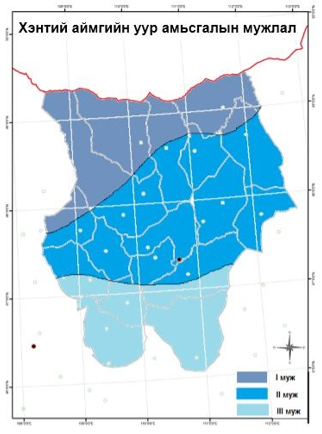
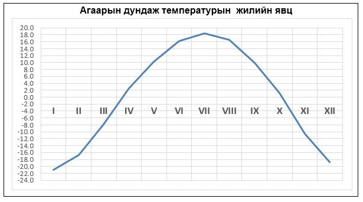
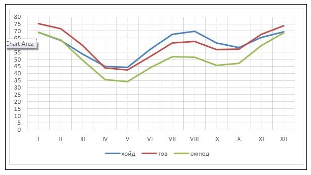
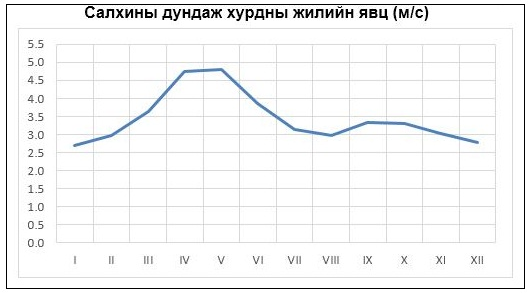

<h1 align="center">Аймгуудын уур амьсгалын мэдээлэл</h1>

#### ХЭНТИЙ АЙМАГ

- **Газарзүйн байршил, нийгэм эдийн засгийн өнөөгийн байдал**

Эзэн богд Чингис хааны өлгий нутаг – Хан хэнтий аймаг Богд хаант Монгол улсын ууган 4 аймгийн нэг бөгөөд эдийн засгийн Дорнод бүсэд хамаарагдсан Хэнтийн уулархаг нутгийн ихэнхийг эзэлж , Хэрлэн Онон голуудын сав нутагт оршин,Дорнод,Сүхбаатар,Дорноговь,Говьсүмбэр,Төв,Сэлэнгэ аймаг ОХУ-тай хил залгана.  
Хэнтий аймаг – Хэнтийн нурууны зүүн захын дундаж өндөр салбар уулс,Онон-Балж,Хэрлэн голын сав ухаат талархаг нутгийг эзэлсэн 83 мянган хавтгай дөрвөлжин км нутагтай.Аймгийн нутгийн баруун хойд талаар далайн түвшинээс дээш  2451м хүртэл өргөгдсөн Бага Хэнтийн уул,Дэлгэрхаан уул / 2110м /, орших бөгөөд аймгийн нутгийн төв хэсгээр Баянхутаг уул / 1580м /, зүүн талд нь Эрээн даваа / 1433м /, тус тус байрлах ба хойноосоо урагшлах тусам улам намсан талархаг нутагт шилжинэ.  
Хэнтий аймгийн эдийн засгийн гол салбар нь хөдөө ау ахуй, түүний дотор мал ау ахуй голлоно.Мөн уул уурхайн олзворлох салбар,барилга болон жижиг дунд үйлдвэр эрчимтэй хөгжиж байна.  

- **Уур амьсгалын нөхцөл, мужлал**

Аймгийн уур амьсгалын ерөнхий мужлалыг үйлдэхдээ ургамал ургах үеийн чийг дулааны үзүүлэлтийг үндэс болгон нутгийн хотгор гүдгэр болон байгалийн бусад онцлогийг харгалзан үзэж тус аймгийн нутаг дэвсгэрийг 3 муж болгон хуваасан болно.   

1. Чийглэг нэн сэрүүн муж

Энэ муж нь жилд 350мм-с их хур тунадастай, аймгийн нутгийн хойд хэсэг буюу Батширээт, Дадал сумын нутаг, Биндэр, Баян-Адрага, Норовлин сумын хойд тал баруун хойд хэсэг буюу Өмнөдэлгэр,Цэнхэрмандал сумын хойд тал хамаарагдана.Чийглэгдүү нэн сэрүүн муж нь мөнх цэвдэгтэй,монгол орны усны хагалбар  газарт хамаарагдана.Хөрсний хувьд уулын нугын ба хүлэрт хөрс,ойн саарал хөрс зонхилно.  

2. Чийглэгдүү сэрүүн муж

Энэ мужид аймгийн нутгийн төв хэсэг буюу ихэнх нутаг хамаарагдана.  Хур тунадас чийгшлийн хувьд 1-р мужаас арай татруу жилд 200-300 мм хур тунадастай байдаг байна.Хөрсний хувьд Хар хүрэн,хүрэн ба бараан хөрстэй.  

3. Хуурайвтар сэрүүн муж

Энэ мужид Дархан,Галшар сумын нутаг,Дэлгэрхаан,Баянмөнх,Баянхутаг сумын өмнөд хэсэг орно.Тунадасны аувьд 200 мм-с бага тунадас ордог дулаавтар өвөл,дулаан зунтай муж юм.  

- **Агаарын температур**

Тухайн орон нутгийн дулаан хүйтний горим нь нарны цацраг,агаарын орчил урсгалын горим, болон газрын гадаргын хотгор гүдгэрийн байдлаар тодорхойлогдоно.Хэнтий аймгийн нутаг нь уул нуруу,тал хөндий хосолсон газарын гадаргын хувьд харилцан адилгүй тул дулаан хүйтний хэлбэлзэл ихтэй байдаг.Аймгийн жилийн дундаж агаарын температур нь +2°С.... -2° С –ийн хооронд тэгш хэмтэй хэлбэлзэнэ. 
Жилийн хамгийн хүйтэн 1 дүгээр сард агаарын дундаж температур -18...-24°С хүйтэн байх боловч газарын гадарга өндөр намаас хамааран газар бүрд харилцан адилгүй байна.  Жилийн хамгийн дулаан 7 сард аймгийн нутгийн зүүн өмнөд хэсэг болох Галшар сумын нутгаар +20°С-аас дулаан байдаг бол нутгийн баруун хойд хэсгээр +15°С-с сэрүүн байдаг байна.Ийнхүү зуны улиралд агаарын температур газар өндөрсөх тутам буурах хандлага илэрхий харагддаг.  

- **Агаарын харьцангуй чийгшил**

Харьцангуй чийгшил нь агаарт байгаа усны уур ханах хүртэлх чийгшлийн хэмжээг %-иар илэрхийлсэн тоо юм. Харьцангуй чийгшил нь агаарын чийгшлийн үзүүлэлтүүдээс хамгийн хувьсамтгай үзүүлэлтийн нэг юм. Хэнтий аймгийн нутагт жилийн дундаж харьцангуй чийгшил 47-62% байх бөгөөд нутгийн хойд уулархаг хэсгээр тал хээрийн нутгийг бодвол арай их байна.Харьцангуй чийгийн жилийн явцад 2 удаа их,2 удаа бага утга ажиглагдана. Өвлийн улиралд агаарын чийг агуулах чадвар мууддаг учраас Харьцангуй чийгийн үндсэн их утга ажиглагдана. Энэ үед нутгийн төв хэсэг буюу Хэрлэн голын сав дагуух нутаг Өндөрхаан,Баян-овоо орчмоор 73-75%, бусад нутгаар 61-70% байх ба хоёрдох их утга 7-8 сард нутгийн хойд хэсгээр 67-70%,төв хэсгээр 60-64% байдаг бол нутгийн өмнөд хэсгээр 49-54% байдаг.Харин Харьцангуй чийгийн жилийн хамгийн бага утга хавар тохиолддог.  

- **Салхины горим**

Их даралттай газраас бага даралттай газар руу чиглэж буй агаарын урсгалыг салхи гэнэ. Агаарын даралтын зөрүү нь салхи үүсгэх шалтгаан болдог.  Салхины горим нь агаар мандлын орчил урсгал,тухайн орон нутгийн уул зүйн онцлогоос шалтгаална. Манай орны физик газар зүйн байршил, түүний хотгор гүдгэрийн жигд бишээс салхины горим тун өвөрмөц онцлогтой,нутгийн салхины шинж төлөвтэй. Түүнчлэн жилийн дулаан хүйтэн улиралд агаарын даралтын тогтоц эсрэгээр солигддог нь салхины горимд онцлог нөлөө үзүүлнэ.Салхины дундаж хурдны  их утга аль ч бүс нутагт хавар 4-5 сард тохиолдох бөгөөд нутгийн хойд уулархаг хэсгээр 2,8-4,0м/с,бусад нутгаар 4,5-6,0 м/с байдаг.  
Газрын гадаргын хэлбэр байдлын нөлөөний дор ихэнх тохиолдолд газрын гадарга орчмын салхи хөндий дагуу салхилдаг.Аймгийн нутагт баруун өмнөөс баруун хойд зовхисын салхи зонхилох боловч цаг уурын өртөө харуулын орчны хотгор гүдгэрийн байдлаас болж газар бүр өөр өөр байдаг.  

Манай орны салхины горимын нэг онцлог бол салхигүй байх тохиолдол цөөнгүй байдаг явдал юм. Ялангуяа уулс хоорондох хонхор,хотгор,хөндий газар өвлийн улиралд салхигүй үе олон тохиолддог.  

