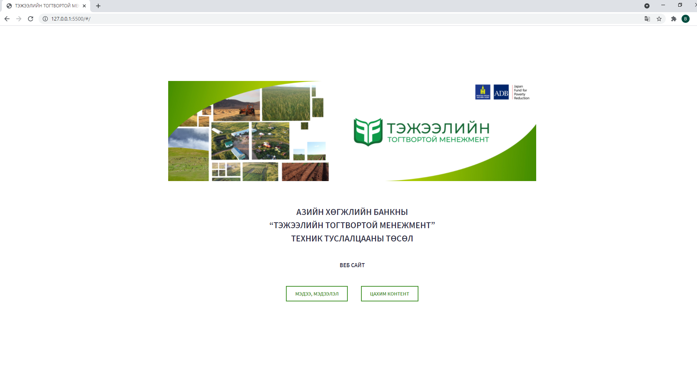
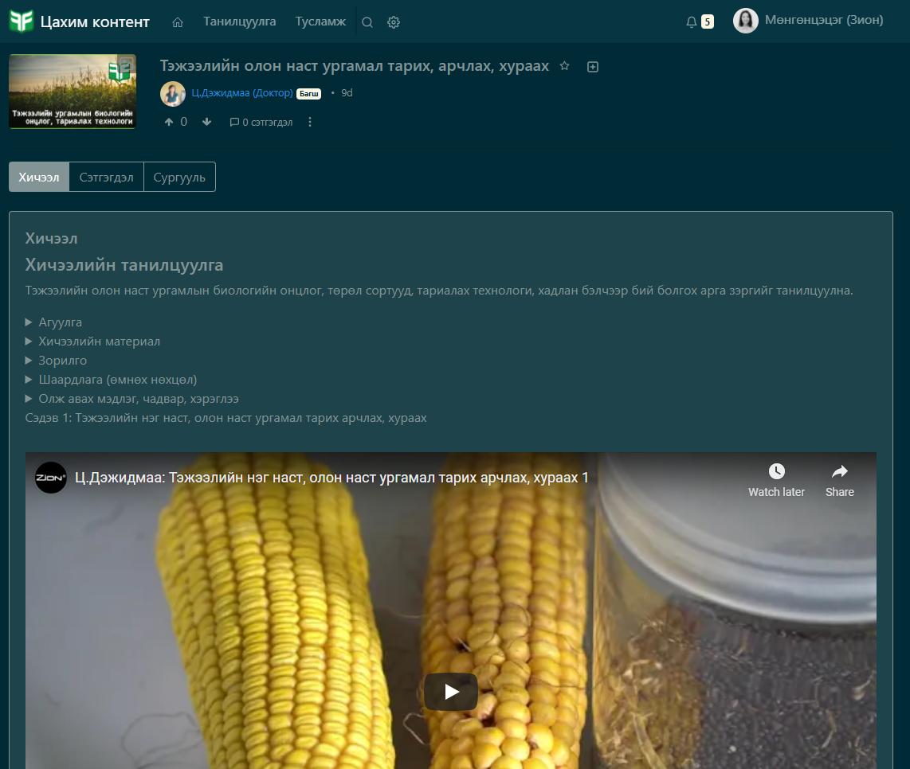
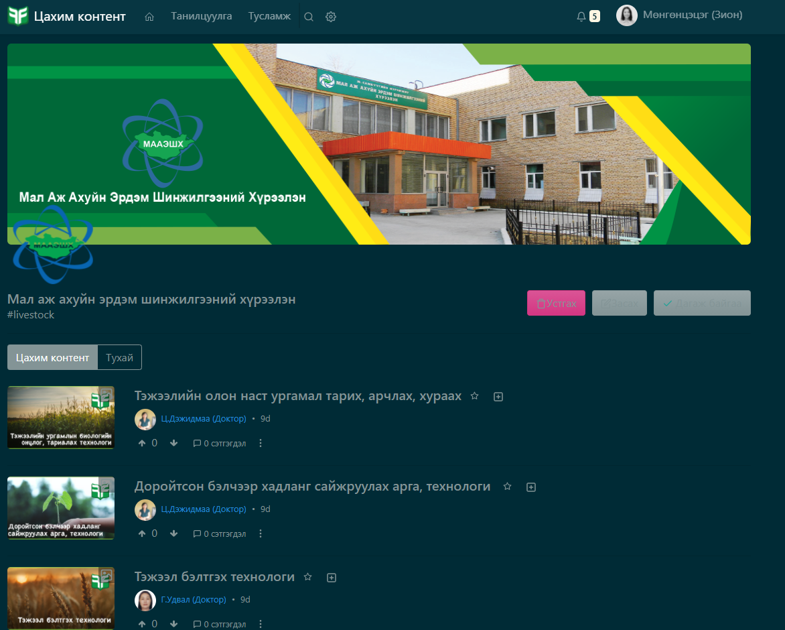
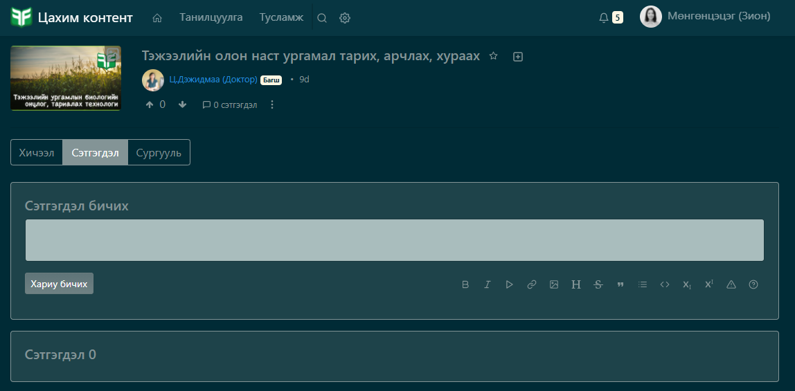

<h1 align="center">Вебсайт ашиглах заавар</h1>

Вэб аппликейшн нь сургалтын систем, тусламж мэдээлэл гэсэн үндсэн 2 хэсгээс бүрдэнэ. Сургалтын систем нь малчид, тариаланчид, мэргэжилтнүүдэд бэлчээр, тэжээлийн талаар ерөнхий суурь ойлголт өгөх, чадавхжуулахад чиглэсэн цахим контентуудыг бүртгэх, удирдан зохион байгуулах, вэб аппликейшнээр дамжуулан тухайн хичээлүүдийг хэрэглэгчдэд хүргэх зорилготой юм. Харин тусламж мэдээлэл хэсэг нь малчид, тариаланчид, мэргэжилтнүүдийг бусад хэрэгцээт мэдээллээр нэг дороос хангах зорилготой юм.  

*Тэжээлийн тогтвдртой менежмент төслийн веб сайт руу нэвтрэхийн тулд дараах линк дээр дарна уу.*  
https://learn.zion.mn/help/#/  

 **Вебсайтруу нэвтрэхэд Нүүр хуудас дараах байдлаар гарч ирнэ.**  

**Цахим контент** хэсгийг сонгон дарахад Цахим контентийн веб сайтын нүүр хуудасруу шилжинэ. Цахим контентийн веб сайтын нүүр хуудас харагдана. 

1. Цахим контентийн нүүр хуудас.

2. **Танилцуулга** хэсэг дээр дарахад Тэжээлийн тогтвортой менежмент төслийн танилцуулга гарч ирнэ.  

3. **Тусламж** хэсэг дээр дарахад үндсэн цонхруу шилжинэ.  

4. **Хайлтын цонх**-оор дамжуулан дурын цахим контентийг нэрээр нь хайж олох боломжтой.  

5. **Тохиргоо** цэсийг зөвхөн Админ ашиглах боломжтой.  
Админ нь Тохиргоо хэсгээр дамжуулан шинэ мэдээлэл, видео хичээл мөн бусад хэрэгцээт зүйлсийг нэмэх болон хасах боломжтой.  

6. Хэрэглэгч нь **Profile** товч дээр даран өөрийн профайл хэсэг рүү орно. Өөрийн профайлийн нүүр зураг, ковер зураг болон дэвсгэр өнгийг хэрэглэгч өөрт тохиромжтойгоор оруулан хадгалах боломжтой. 
Мөн профайл хэсэгт хэрэглэгчийн нэмэлт мэдээллийг хадгалах 4 төрлийн цонх байрлана. 
    - *Тухай* гэсэн хэсэгт хэрэглэгч өөрийн намтар, товч мэдээлэл, танилцуулга зэргиsйг оруулах боломжтой.
    - *Сургууль* гэсэн хэсэгт хэрэглэгч өөрийн багшилдаг сургуулийг бүртгэхээс гадна мөн хэрэглэгчийн дагаж байгаа сургуулиуд ч харагдах юм. 
    - *Цахим контент* хэсэгт хэрэглэгчийн бэлтгэн оруулсан контент, видео хичээлүүд байна. 
    - *Хадгалсан* хэсэгт тухайн хэрэглэгчийн дараа үзэхээр хадгалсан хичээлүүд харагдана. 

**Цахим контентийн мэдээлэл.**

Цахим контент хэсэгт орох үед 19 хичээлийн мэдээлэл гарч ирнэ.  
Хичээл тус бүр дараах товч мэдээллийг агуулна.  

 

1. Цахим контентийн нэр.

Цахим контентийн нэр дээр дарж ороход хичээлийн сэдэв, танилцуулга болон видео хичээл гарч ирнэ.  

2. Агуулгыг боловсруулсан сургууль.

Агуулгыг боловсруулсан сургууль дээр дарахад тухайн хичээлийн агуулгыг боловсруулсан сургуулийн профайл гарч ирнэ. Профайлд тухайн сургуулийн талаарх дэлгэрэнгүй мэдээлэл, тухайн сургуулийн багш нарын мэдээлэл болон бусад боловсруулсан хичээлүүд харагдана. Багшийн нэр дээр дарахад тухайн багшийн профайлруу орно.    

3. Сэтгэгдэл. 

Сэтгэгдэл хэсэгт цахим контентод өгсөн хэрэглэгчийн сэтгэгдэл харагдахаас гадна сэтгэгдэл үлдээх хэсэг харагдана. Нэвтэрж ороогүй тохиолдолд сэтгэгдэл үлдээх боломжгүй. 

