<h1 align="center">Салбар нэгж модулийн үйлдэл</h1>

Салбар нэгжийн мэдээллийн өөрчлөлт, үндсэн салбар нэгж болгох, түр түдгэлзүүлэх, татан буулгах, устгах... зэрэг үйлдлүүдийг хэрэглэгчид зөвшөөрөгдсөн эрхийн дагуу хийж болно.

## Үйлдэл хийх арга зам
Үйлдлийг хийхдээ жагсаалт цонхноос 2 төрлийн арга замаар хийнэ.

- ### 1. Ерөнхий цэс

  Жагсаалтын цонхны баруун дээд буланд байршина.

  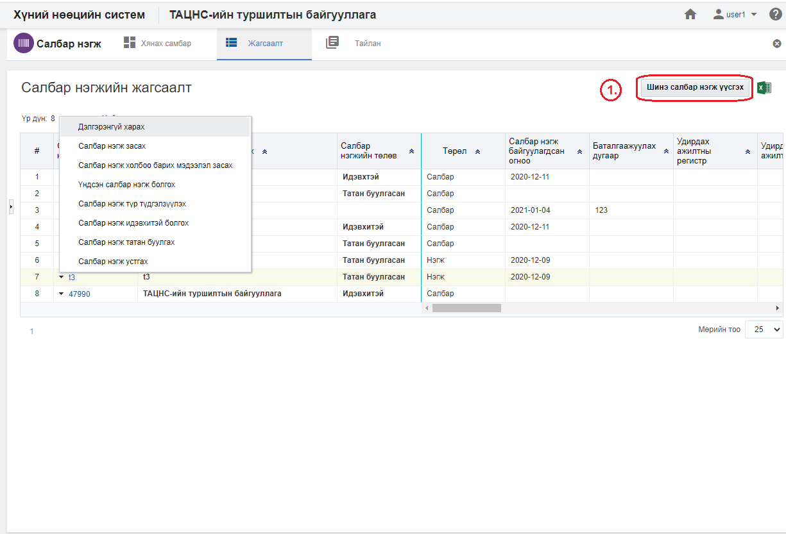

- ### 2. Контекст цэс

  Жагсаалтын цонхны үр дүн харуулах хэсэгт мөр дэх жижиг сум хэлбэртэй цэсийг контекст цэс гэнэ.

  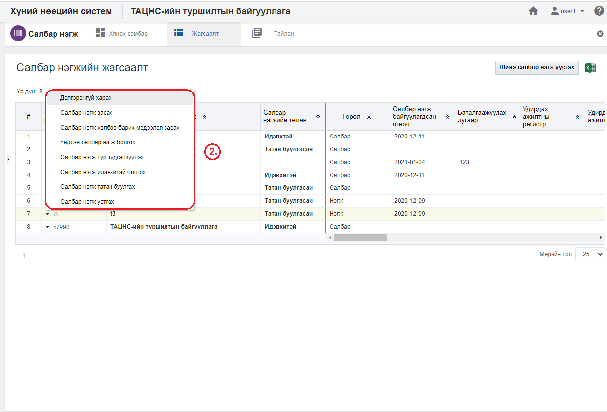

## Салбар нэгж модулийн үйлдлүүд
Салбар нэгж модуль дээр дараах үйлдлүүдийг хийж болно.

**Үүнд:**

- [Шинэ салбар нэгж үүсгэх](Business_units/action.md?id=Шинэ-салбар-нэгж-үүсгэх)
- [Жагсаалт экспортлох](Business_units/action.md?id=Жагсаалт-экспортлох)
- [Салбар нэгжийн профайль](Business_units/action.md?id=Салбар-нэгжийн-профайль)
- [Салбар нэгж засах](Business_units/action.md?id=Салбар-нэгж-засах)
- [Үндсэн салбар нэгж болгох](Business_units/action.md?id=Үндсэн-салбар-нэгж-болгох)
- [Салбар нэгж түр түдгэлзүүлэх](Business_units/action.md?id=Салбар-нэгж-түр-түдгэлзүүлэх)
- [Салбар нэгж идэвхтэй болгох](Business_units/action.md?id=Салбар-нэгж-идэвхтэй-болгох)
- [Салбар нэгж татан буулгах](Business_units/action.md?id=Салбар-нэгж-татан-буулгах)
- [Салбар нэгж устгах](Business_units/action.md?id=Салбар-нэгж-устгах)

### Шинэ салбар нэгж үүсгэх

**Шинэ салбар нэгж үүсгэх** үйлдэл нь байгууллагад шинэ салбар нэгж мэдээллийн санд нэмэх үйлдэл юм.

#### Үйлдлийн өмнөх нөхцөл
  Энэхүү үйлдлийг хийхээс өмнө ямар нөхцөл бүрдсэн байхыг энэ хэсэгт жагсаалтаар зааж байна. Үүнд:
  - Салбар нэгжийг үүсгэх албан байгууллага системд үүссэн байх

#### Үйлдлийн нөлөөлөл
  Энэхүү үйлдлийг хийх үед бусад мэдээлэлд хэрхэн нөлөөлөх нөлөөллийг заана. Үүнд:
  - Салбар нэгжийн хянах самбарын график тоон мэдээлэл өөрчлөгдөнө.
  - Салбар нэгжийн жагсаалтад шинэ бичлэг нэмэгдэнэ.
  - Салбар нэгжийн тайлангийн тоон мэдээлэл өөрчлөгдөнө.

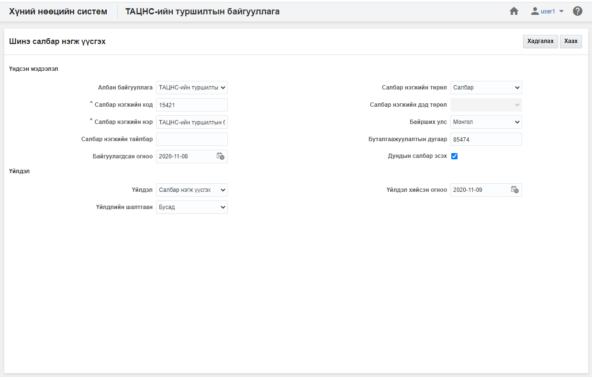

### Жагсаалт экспортлох

**Жагсаалт экспортлох** үйлдэл нь хайлт шүүлтийн үр дүнг майкрософт эксел файлаар экспортлон авах үйлдэл юм.

#### Үйлдлийн өмнөх нөхцөл
  Энэхүү үйлдлийг хийхээс өмнө ямар нөхцөл бүрдсэн байхыг энэ хэсэгт жагсаалтаар зааж байна. Үүнд:
  - Экспортлох мэдээллээ зөв шүүсэн эсэхээ шалгах

#### Үйлдлийн нөлөөлөл
  Энэхүү үйлдлийг хийх үед бусад мэдээлэлд хэрхэн нөлөөлөх нөлөөллийг заана. Үүнд:
  - Систем дээр ямар нэгэн нөлөөлөл байхгүй байна

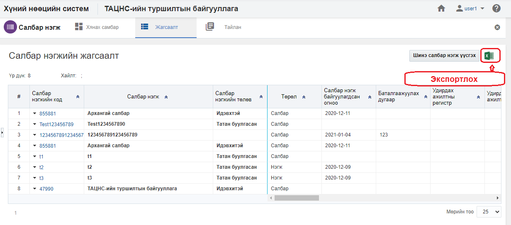

### Салбар нэгжийн профайль

**Салбар нэгжийн профайль** үйлдэл нь тухайн сонгосон салбар нэгжийн мэдээллийг нэг цонхноос авах боломжийг бүрдүүлнэ.

#### Үйлдлийн өмнөх нөхцөл
  Энэхүү үйлдлийг хийхээс өмнө ямар нөхцөл бүрдсэн байхыг энэ хэсэгт жагсаалтаар зааж байна. Үүнд:
  - Зөв салбар нэгж сонгосон эсэхээ шалгах

#### Үйлдлийн нөлөөлөл
  Энэхүү үйлдлийг хийх үед бусад мэдээлэлд хэрхэн нөлөөлөх нөлөөллийг заана. Үүнд:
  - Систем дээр ямар нэгэн нөлөөлөл байхгүй байна

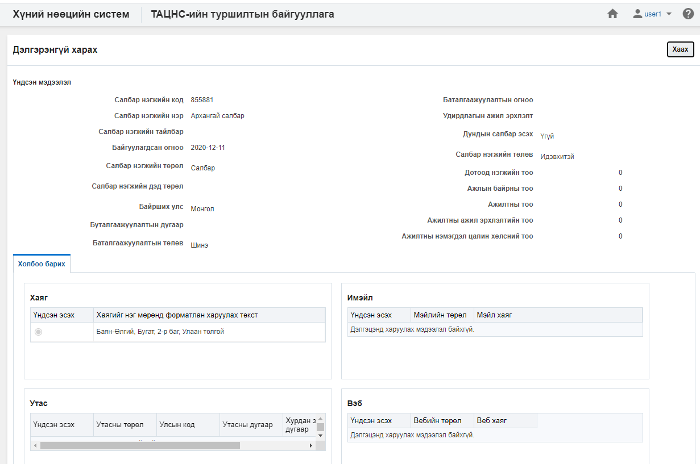

### Салбар нэгж засах

**Салбар нэгж засах** үйлдэл нь тухайн сонгосон салбар нэгжийн мэдээллийг өөрчлөх боломжийг бүрдүүлнэ.

#### Үйлдлийн өмнөх нөхцөл
  Энэхүү үйлдлийг хийхээс өмнө ямар нөхцөл бүрдсэн байхыг энэ хэсэгт жагсаалтаар зааж байна. Үүнд:
  - Зөв салбар нэгж сонгосон эсэхээ шалгах

#### Үйлдлийн нөлөөлөл
  Энэхүү үйлдлийг хийх үед бусад мэдээлэлд хэрхэн нөлөөлөх нөлөөллийг заана. Үүнд:
  - Салбар нэгжийн хянах самбарын график тоон мэдээлэл өөрчлөгдөнө.
  - Салбар нэгжийн жагсаалтын мэдээлэл өөрчлөгдөнө.
  - Салбар нэгжийн тайлангийн тоон мэдээлэл өөрчлөгдөнө.

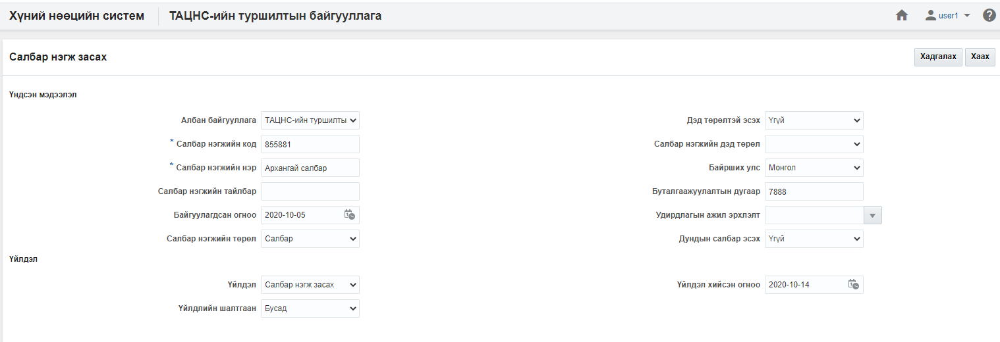

### Үндсэн салбар нэгж болгох

**Үндсэн салбар нэгж болгох** үйлдэл нь сонгосон салбар нэгжийг нэгжийн үндсэн салбар нэгж болгох үйлдэл юм. Энэ үйлдэл нь тухайн байгууллага дээр олон салбар нэгж байх үед ашиглагдах бөгөөд зөвхөн **үндсэн салбар нэгж биш** нэгж дээр хийгдэх боломжтой.

#### Үйлдлийн өмнөх нөхцөл
  Энэхүү үйлдлийг хийхээс өмнө ямар нөхцөл бүрдсэн байхыг энэ хэсэгт жагсаалтаар зааж байна. Үүнд:
  - Зөв салбар нэгж сонгосон эсэхээ шалгах

#### Үйлдлийн нөлөөлөл
  Энэхүү үйлдлийг хийх үед бусад мэдээлэлд хэрхэн нөлөөлөх нөлөөллийг заана. Үүнд:
  - Салбар нэгжийн хянах самбарын график тоон мэдээлэл өөрчлөгдөнө.
  - Салбар нэгжийн жагсаалтын мэдээлэл өөрчлөгдөнө.
  - Салбар нэгжийн тайлангийн тоон мэдээлэл өөрчлөгдөнө.

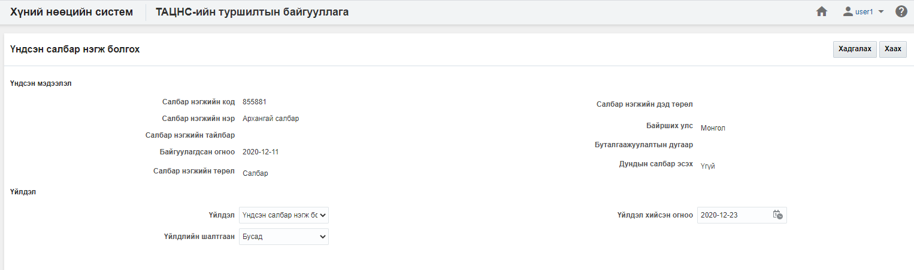

### Салбар нэгж түр түдгэлзүүлэх

**Салбар нэгж түр түдгэлзүүлэх** үйлдэл нь тухайн сонгосон салбар нэгжийн төлөвийг түр түдгэлзүүлсэн төлөвт шилжүүлэх бөгөөд хэрэв салбар нэгж нь түр түдгэлзүүлсэн төлөвт шилжсэн бол тухайн салбар нэгж дээр ямар нэгэн үйлдэл хийх боломж түр хаагдана. Энэ үйлдлийг зөвхөн **идэвхтэй төлөвтэй салбар нэгж** дээр хийх боломжтой.

#### Үйлдлийн өмнөх нөхцөл
  Энэхүү үйлдлийг хийхээс өмнө ямар нөхцөл бүрдсэн байхыг энэ хэсэгт жагсаалтаар зааж байна. Үүнд:
  - Зөв салбар нэгж сонгосон эсэхээ шалгах
  - Сонгосон салбар нэгжийн төлөв нь идэвхтэй эсэхийг шалгах

#### Үйлдлийн нөлөөлөл
  Энэхүү үйлдлийг хийх үед бусад мэдээлэлд хэрхэн нөлөөлөх нөлөөллийг заана. Үүнд:
  - Салбар нэгжийн хянах самбарын график тоон мэдээлэл өөрчлөгдөнө.
  - Салбар нэгжийн жагсаалтын мэдээлэл өөрчлөгдөнө
  - Салбар нэгжийн тайлангийн тоон мэдээлэл өөрчлөгдөнө.
  - Салбар нэгжийн өөрчлөх үйлдлүүд хийх боломжгүй болно.
  - Дотоод нэгжийн өөрчлөх үйлдлүүд хийх боломжгүй болно.
  - Ажлын байрны өөрчлөх үйлдлүүд хийх боломжгүй болно.
  - Ажилтан, ажил эрхлэлтийн өөрчлөх үйлдлүүд хийх боломжгүй болно.
  - Цалин хөлсний өөрчлөх үйлдлүүд хийх боломжгүй болно.

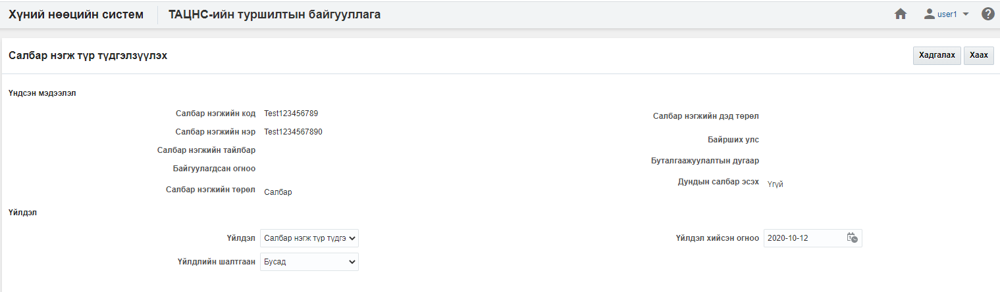

### Салбар нэгж идэвхтэй болгох

**Салбар нэгж идэвхтэй болгох** үйлдэл нь тухайн сонгосон салбар нэгжийн төлөвийг идэвхтэй төлөвт шилжүүлэх үйлдэл юм. Энэ үйлдэл нь зөвхөн **түр түдгэлзүүлсэн төлөвтэй нэгж** дээр хийгдэх боломжтой.

#### Үйлдлийн өмнөх нөхцөл
  Энэхүү үйлдлийг хийхээс өмнө ямар нөхцөл бүрдсэн байхыг энэ хэсэгт жагсаалтаар зааж байна. Үүнд:
  - Зөв салбар нэгж сонгосон эсэхээ шалгах
  - Сонгосон салбар нэгжийн төлөв түр түдгэлзүүлсэн эсэхийг шалгах

#### Үйлдлийн нөлөөлөл
  Энэхүү үйлдлийг хийх үед бусад мэдээлэлд хэрхэн нөлөөлөх нөлөөллийг заана. Үүнд:
  - Салбар нэгжийн хянах самбарын график тоон мэдээлэл өөрчлөгдөнө.
  - Салбар нэгжийн жагсаалтад шинэ бичлэг нэмэгдэнэ.
  - Салбар нэгжийн тайлангийн тоон мэдээлэл өөрчлөгдөнө.
  - Салбар нэгжийн өөрчлөх үйлдлүүд хийх боломжтой болно.
  - Дотоод нэгжийн өөрчлөх үйлдлүүд хийх боломжтой болно.
  - Ажлын байрны өөрчлөх үйлдлүүд хийх боломжтой болно.
  - Ажилтан, ажил эрхлэлтийн өөрчлөх үйлдлүүд хийх боломжтой болно.
  - Цалин хөлсний өөрчлөх үйлдлүүд хийх боломжтой болно.

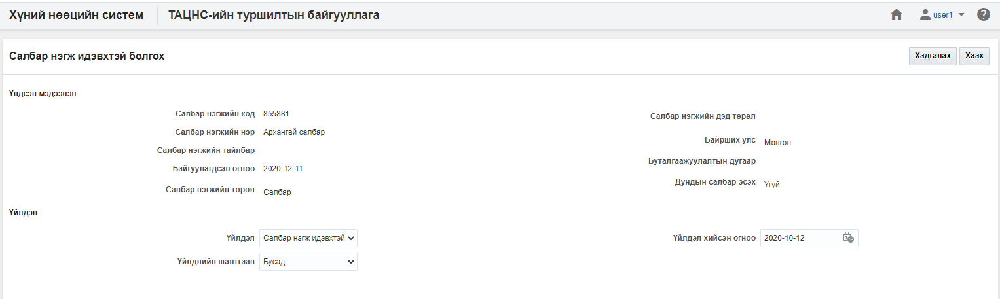

### Салбар нэгж татан буулгах

**Салбар нэгж татан буулгах** үйлдэл нь тухайн сонгосон салбар нэгжийг цаашид ашиглахгүйгээр бүр мөсөн хаах шаардлага үүссэн үед ашиглах бөгөөд хэрэв энэ үйлдлийг хийвэл тухайн салбар нэгжийг татан буугдсан төлөвт шилжүүлнэ. Энэ төлөвт шилжсэн салбар нэгж дээр ямар нэгэн засах, өөрчлөх үйлдэл хийх боломжгүй бөгөөд системд энэ төлөвөөр архивлан авах үйлдэл юм.

#### Үйлдлийн өмнөх нөхцөл
  Энэхүү үйлдлийг хийхээс өмнө ямар нөхцөл бүрдсэн байхыг энэ хэсэгт жагсаалтаар зааж байна. Үүнд:
  - Зөв салбар нэгж сонгосон эсэхийг шалгах
  - Сонгосон салбар нэгжийн төлөв нь идэвхтэй эсвэл түр түдгэлзүүлсэн төлөвт байгаа эсэхийг шалгах
  - Сонгосон салбар нэгжийн идэвхтэй ажил эрхлэлт байгаа эсэхийг шалгах
  - Сонгосон салбар нэгжийн идэвхтэй ажлын байр байгаа эсэхийг шалгах
  - Сонгосон салбар нэгжийн идэвхтэй дотоод нэгж байгаа эсэхийг шалгах

#### Үйлдлийн нөлөөлөл
  Энэхүү үйлдлийг хийх үед бусад мэдээлэлд хэрхэн нөлөөлөх нөлөөллийг заана. Үүнд:
  - Салбар нэгжийн хянах самбарын график тоон мэдээлэл өөрчлөгдөнө.
  - Салбар нэгжийн жагсаалтын мэдээлэл өөрчлөгдөнө.
  - Салбар нэгжийн тайлангийн тоон мэдээлэл өөрчлөгдөнө.
  - Салбар нэгжийн өөрчлөх үйлдлүүд хийх боломжгүй болно.
  - Дотоод нэгжийн өөрчлөх үйлдлүүд хийх боломжгүй болно.
  - Ажлын байрны өөрчлөх үйлдлүүд хийх боломжгүй болно.
  - Ажилтан, ажил эрхлэлтийн өөрчлөх үйлдлүүд хийх боломжгүй болно.
  - Цалин хөлсний өөрчлөх үйлдлүүд хийх боломжгүй болно.

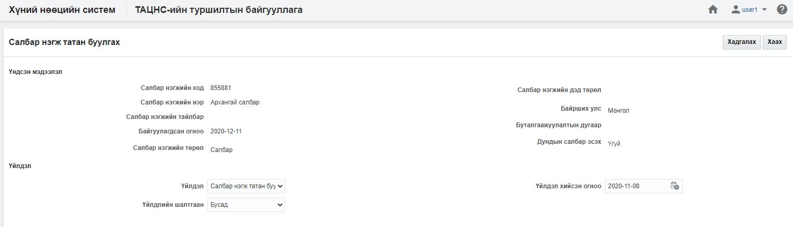

### Салбар нэгж устгах

**Салбар нэгж устгах** үйлдэл нь тухайн сонгосон салбар нэгжийг буруу үүсгэсэн үед ашиглах бөгөөд тухайн салбар нэгж болон түүнтэй холбоотой бүх мэдээллийг систем дээрээс бүр мөсөн устгах үйлдэл юм. Энэ үйлдлийг хийснээс хойш салбар нэгжийн төлөвийг [энд](legal/delete_policy.md) заагдсан хугацааны турш **устгасан төлөвт** байлгах бөгөөд түүний дараа систем автоматаар устгана.

#### Үйлдлийн өмнөх нөхцөл
  Энэхүү үйлдлийг хийхээс өмнө ямар нөхцөл бүрдсэн байхыг энэ хэсэгт жагсаалтаар зааж байна. Үүнд:
  - Зөв салбар нэгж сонгосон эсэхийг шалгах
  - Сонгосон салбар нэгжийн төлөв нь идэвхтэй, түр түдгэлзүүлсэн төлөвт байгаа эсэхийг шалгах
  - Тухайн салбар нэгжийг бусад  дотоод нэгж, ажлын байр, ажилтан, ажил эрхлэлт, цалин хөлс, сахилгын зөрчил, нөөцийн бүртгэл зэрэг бүртгэлүүдэд ашиглагдсан эсэхийг шалгах

#### Үйлдлийн нөлөөлөл
  Энэхүү үйлдлийг хийх үед бусад мэдээлэлд хэрхэн нөлөөлөх нөлөөллийг заана. Үүнд:
  - Салбар нэгжийн хянах самбарын график тоон мэдээлэл өөрчлөгдөнө.
  - Салбар нэгжийн жагсаалтын мэдээлэл өөрчлөгдөнө.
  - Салбар нэгжийн тайлангийн тоон мэдээлэл өөрчлөгдөнө.
  - Салбар нэгжийн өөрчлөх үйлдлүүд хийх боломжгүй болно.
  - Дотоод нэгжийн өөрчлөх үйлдлүүд хийх боломжгүй болно.
  - Ажлын байрны өөрчлөх үйлдлүүд хийх боломжгүй болно.
  - Ажилтан, ажил эрхлэлтийн өөрчлөх үйлдлүүд хийх боломжгүй болно.
  - Цалин хөлсний өөрчлөх үйлдлүүд хийх боломжгүй болно.
  - Тухайн салбар нэгжийг ашигласан бүх мэдээлэл устана.

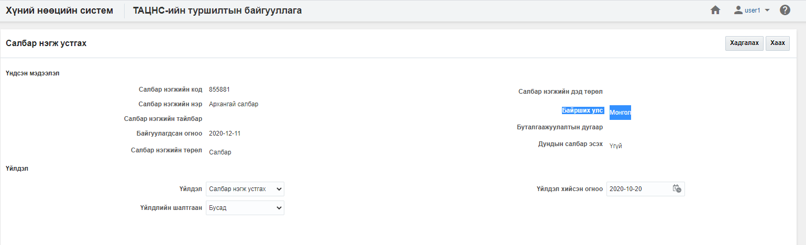

