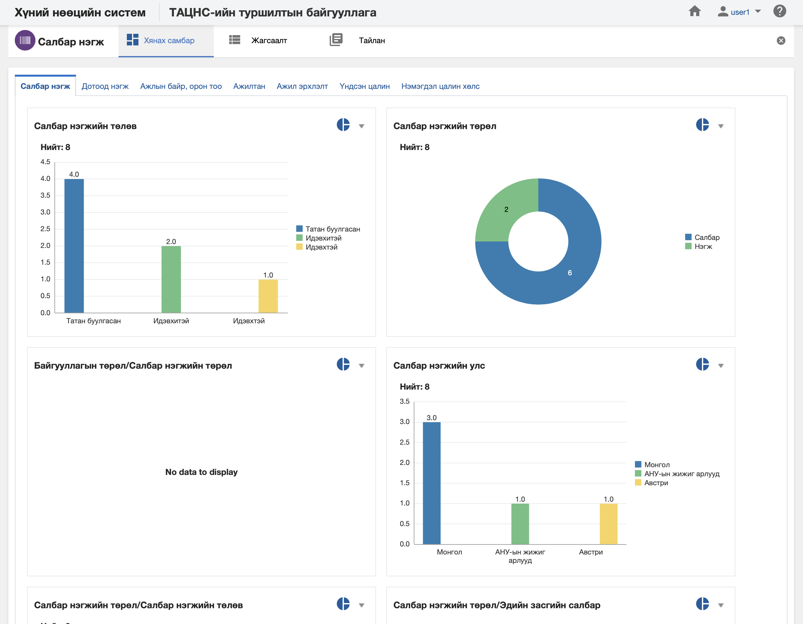

<h1 align="center">Салбар нэгж модулийн хянах самбар</h1>

**Салбар нэгж модулийн хянах самбар** нь тухайн салбар нэгж, түүний харъяаллын мэдээллийг бодит цаг хугацааны мэдээлэл дээр хяналт, шинжилгээ хийх боломжийг олгоно.

> Хянах самбартай ажиллах талаар ерөнхий ойлголтыг [хянах самбартай ажиллах](how-it-works?id=_4-Хянах-самбартай-ажиллах) хэсгээс харна уу.

 

**Салбар нэгж модулийн хянах самбар нь дараах таб анализуудаас бүрдэнэ.** 

|Хянах самбарын таб|Тайлбар|
|:-----|:------|
|**Салбар нэгж**|Салбар нэгжийн мэдээллээр анализ хийх|
|**Дотоод нэгж**|Салбар нэгжийн мэдээлэл болон дотоод нэгжийн мэдээллээр кросс анализ хийх|
|**Ажлын байр, орон тоо**|Салбар нэгжийн мэдээлэл болон ажлын байр, орон тооны мэдээллээр кросс анализ хийх|
|**Ажилтан**|Салбар нэгжийн мэдээлэл болон ажилтны мэдээллээр кросс анализ хийх|
|**Ажил эрхлэлт**|Салбар нэгжийн мэдээлэл болон ажил эрхлэлтийн мэдээллээр кросс анализ хийх|
|**Үндсэн цалин**|Салбар нэгжийн мэдээлэл болон үндсэн цалингийн мэдээллээр кросс анализ хийх|
|**Нэмэгдэл цалин хөлс**|Салбар нэгжийн мэдээлэл болон нэмэгдэл цалин хөлсний мэдээллээр кросс анализ хийх|