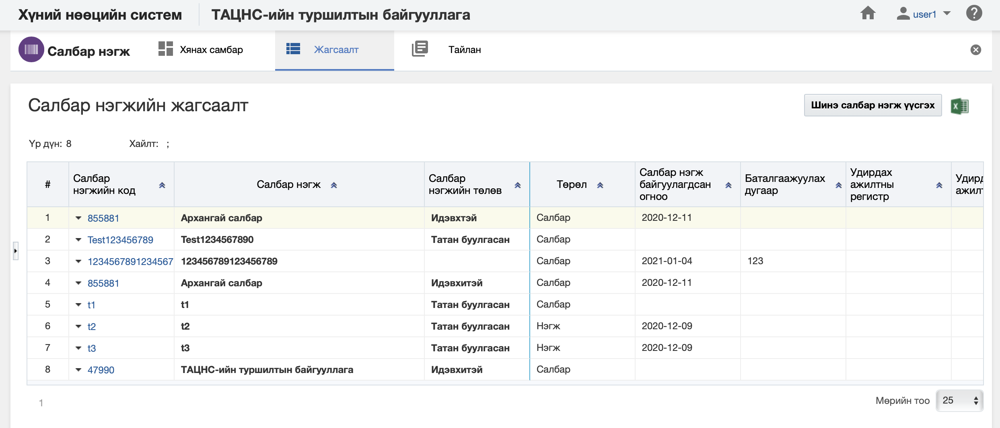
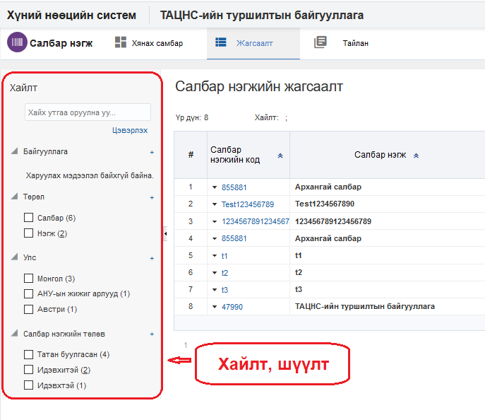
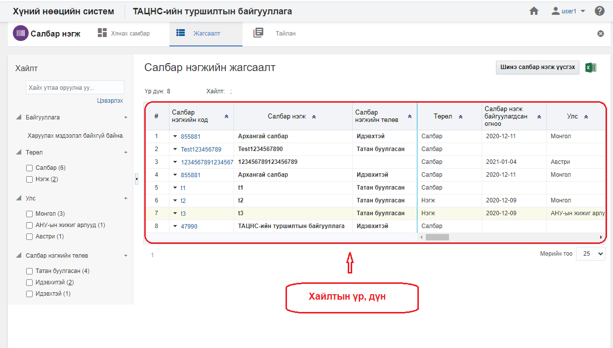

<h1 align="center">Салбар нэгж модулийн жагсаалт, хайлт</h1>

Тухайн байгууллагад хамаарах нийт салбар нэгжийн жагсаалтыг энэ хэсэгт харуулах ба хэрэглэгчийн эрх, үүргийн дагуу үйлдэл хийх боломжийг олгоно.

> Жагсаалт, хайлттай ажиллах талаар ерөнхий ойлголтыг [жагсаалт, хайлттай ажиллах](how-it-works?id=_3-Жагсаалт-хайлттай-ажиллах) хэсгээс харна уу.

Салбар нэгжийн жагсаалтын энэ хэсэгт үйлдлүүдийг хийнэ.

### Нарийвчилсан хайлт

Салбар нэгжийг дараах төрлүүдээр нарийвчилан хайх боломжтой.

> Дээрх зурганд салбар, нэгжийн хайлт, шүүлтийн хэсгийг харуулж байна.

#### Нарийвчилсан хайлтын төрөл:

- **Байгууллага**
     Байгууллага. Салбар нэгжийн байгууллага байна.

- **Төрөл**
     Төрөл. Салбар нэгжийн төрөл байна.

- **Улс**
     Улс. Салбар нэгж байрлах сонгогдсон улсыг харуулна.

- **Салбар нэгжийн төлөв**
     Салбар нэгжийн төлөв. Салбар нэгж нь идэвхтэй, татан буугдсан... гэх мэт төлөвтэй байна.
 

### Жагсаалтын мэдээлэл

Салбар нэгжийн хайлтын үр дүнг жагсаалт хэлбэрээр харуулна.

> Дээрх зурганд салбар нэгжийн жагсаалтын үр дүнг харуулж байна.

#### Хайлтын үр дүнгийн мэдээлэл:

- **Салбар нэгжийн код**
     Салбар нэгжийн  давхцахгүй код
- **Салбар нэгж**
     Салбар нэгжийн нэр
- **Салбар нэгжийн төлөв**
     Салбар нэгжийн төлөвийн мэдээлэл
- **Төрөл**
     Салбар нэгжийн төрөл
- **Салбар нэгж байгуулагдсан огноо**
     Салбар нэгжийг байгуулсан огноо
- **Баталгаажуулах дугаар**
     Салбар нэгжийг баталгаажуулах дугаар
- **Удирдах ажилтны регистр**
     Салбар нэгжийг удирдах ажилтны регистр
- **Удирдах ажилтан**
     Салбар нэгжийг удирдах ажилтны нэр
- **Удирдах ажилтны эцэг /эх/-ийн нэр**
     Удирдах ажилтны эцэг /эх/-ийн нэр
- **Удирдах ажилтны албан тушаал**
     Удирдах ажилтны албан тушаал
- **Үндсэн утасны дугаар**
     Үндсэн утасны дугаар /олон дугаараас үндсэн гэж тэмдэглэсэн дугаар/
- **Үндсэн вэб хаяг**
     Үндсэн вэб хаяг /олон вэб хаягаас үндсэн гэж тэмдэглэсэн хаяг/
- **Үндсэн мэйл хаяг**
     Үндсэн мэйл хаяг /олон мэйл хаягаас үндсэн гэж тэмдэглэсэн хаяг/
- **Үндсэн нийгмийн сүлжээ**
     Үндсэн нийгмийн сүлжээ /олон нийгмийн сүлжээний төрлөөс үндсэн гэж тэмдэглэсэн хаяг/
- **Үндсэн хаяг**
     Салбар нэгжийн үндсэн хаяг /олон хаягийн мэдээлэл оруулсан бол үндсэн гэж тэмдэглэсэн хаяг/
- **Улс**
     Байрлах улс
- **Дотоод нэгж**
     Салбар нэгжийн дотоод нэгж
- **Ажлын байр**
     Салбар нэгжид хамаарах ажлын байр
- **Ажилтан**
     Салбар нэгжид харьяалах ажилтан
- **Ажилтны ажил эрхлэлт**
     Салбар нэгжид харьяалах ажилтны ажил эрхлэлт
- **Ажилтны нэмэгдэл цалин, хөлс**
     Ажилтны нэмэгдэл цалин, хөлс