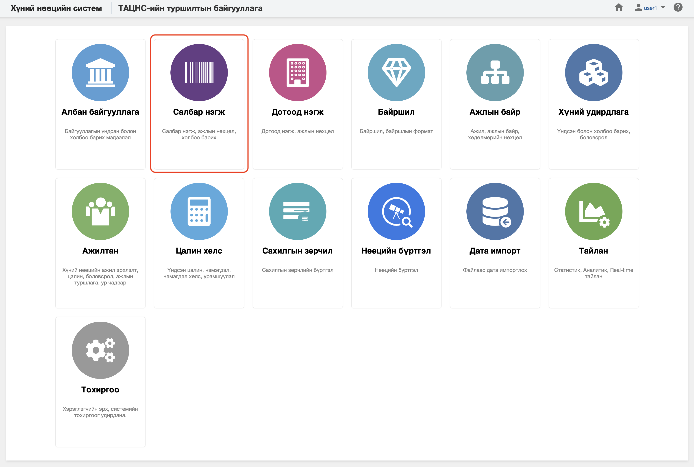

<h1 align="center">Салбар нэгж модуль</h1>
Байгууллагын үйл ажиллагааг бүхэлд нь буюу хэсэгчилэн хэрэгжүүлдэг, тухайн байгууллагад харьяалагдах салбар нэгж, төлөөлөгчийн газрыг бүртгэж, өөрчлөлтийг удирдахад зориулсан модулийг төрийн албаны хүний нөөцийн нэгдсэн системд **салбар нэгж** гэж ойлгоно. 
 

Төрийн албаны хүний нөөцийн нэгдсэн системийн салбар нэгж модуль нь дараах хэсгээс бүрдэнэ.

Үүнд:

- [Хянах самбар](business_units/dashboard.md)
- [Жагсаалт, хайлт](business_units/list.md)
- [Тайлан](business_units/report.md)
- [Үйлдэл](business_units/action.md)