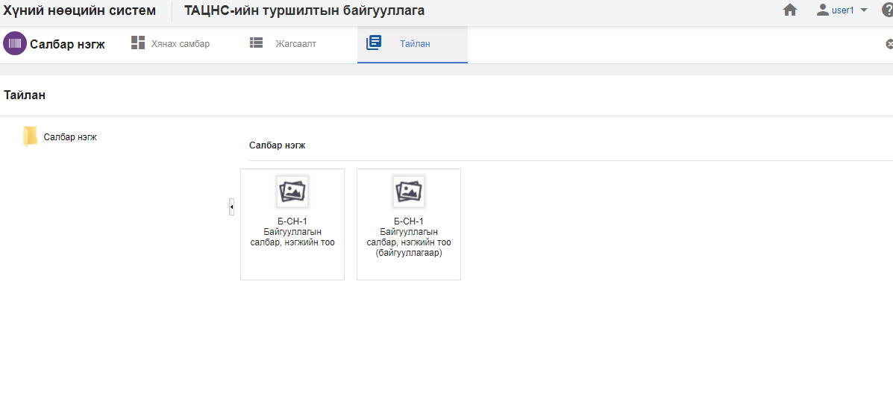

<h1 align="center">Салбар нэгж модулийн тайлан</h1>

Албан байгууллагын салбар нэгж дэх мэдээлэлд шинжилгээ хийж дата шинжилгээний үр дүнг урьдчилан бэлтгэсэн тайлангуудын загвараар гаргана.

> Тайлантай хэрхэн ажиллах талаар ерөнхий ойлголтыг [тайлантай ажиллах](how-it-works?id=_5-Тайлантай-ажиллах) хэсгээс харна уу.

Салбар нэгж модуль дээр дараах тайлангуудыг урьдчилан тодорхойлсон байна.

**Үүнд:**

- **Б-СН-1 Салбар нэгжийн тоо**
   Байгууллагын салбар нэгжийн тоог тайлангийн үзүүлэлтээр гаргах тайлан (Салбар нэгжээр)  
- **Н-СН-1 Салбар нэгжийн тоо (байгууллагаөр)**
   Байгууллагын салбар нэгжийн тоог тайлангийн үзүүлэлтээр гаргах тайлан (Байгууллагаар)  
