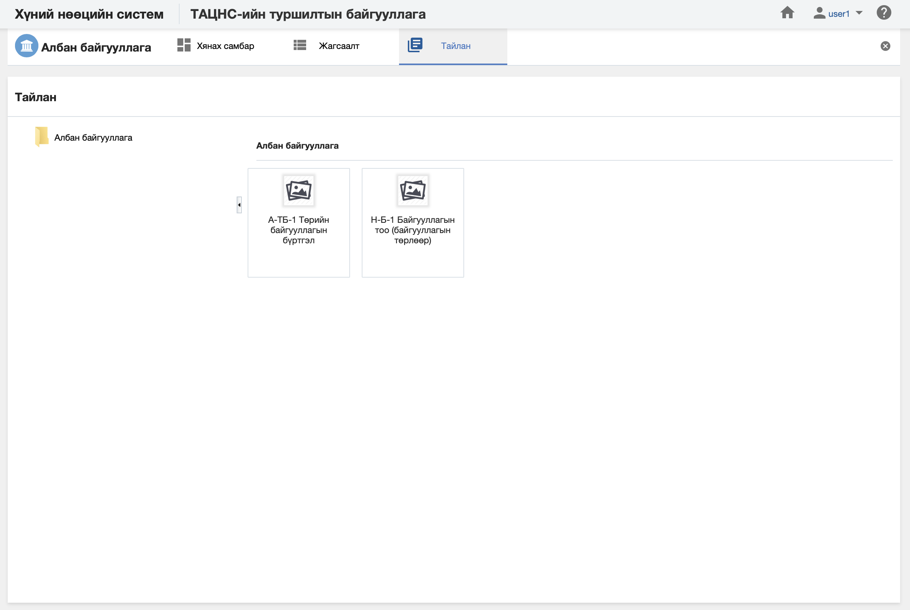

<h1 align="center">Албан байгууллагын тайлан</h1>

Албан байгууллагийн дотоод үйл ажиллагааны нарийн түвэгтэй мэдээлэл дээр шинжилгээ хийн тухайн байгууллагын бизнесийн үйл ажиллагааг системээр дэмжих зориулалт бүхий дата шинжилгээний үр дүн болох урьдчилан бэлтгэсэн тайлангуудыг санал болгож байна.

> Тайлантай хэрхэн ажиллах талаар ерөнхий ойлголтыг [тайлантай ажиллах](how-it-works?id=_5-Тайлантай-ажиллах) хэсгээс харна уу.

Албан байгууллага дээр дараах тайлангуудыг урьдчилан тодорхойлсон байна.

**Үүнд:**

- **A-ТБ-1 Төрийн байгууллагын бүртгэл**
   Төрийн албан байгууллагын бүртгэлийг анкет хэлбэрээр харуулах тайлан  
- **Н-Б-1 Байгууллагын тоо (байгууллагын төрлөөр)**
   Байгууллагыг төрлөөр нь статистик тоон үзүүлэлтийг харуулах тайлан  

