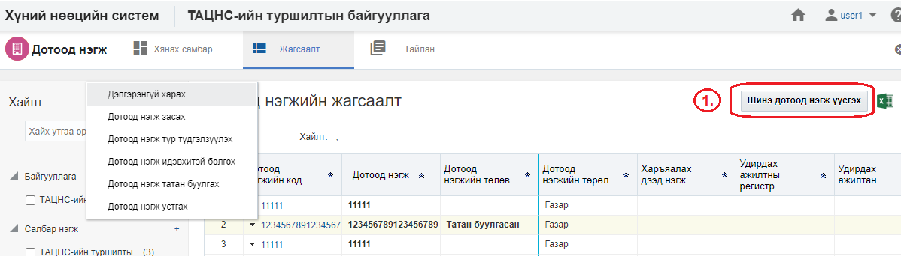
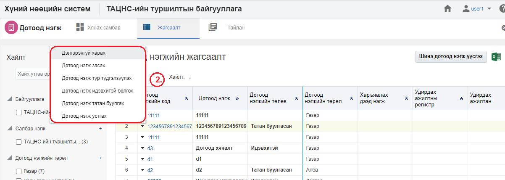
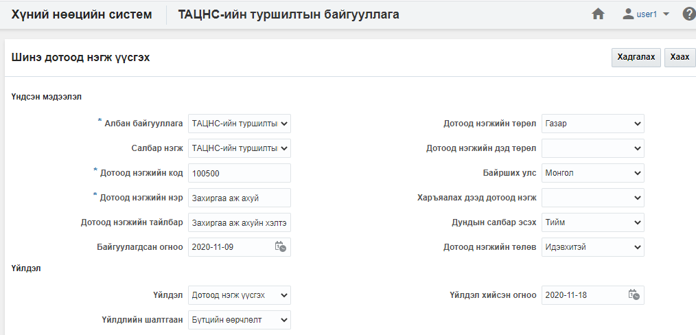
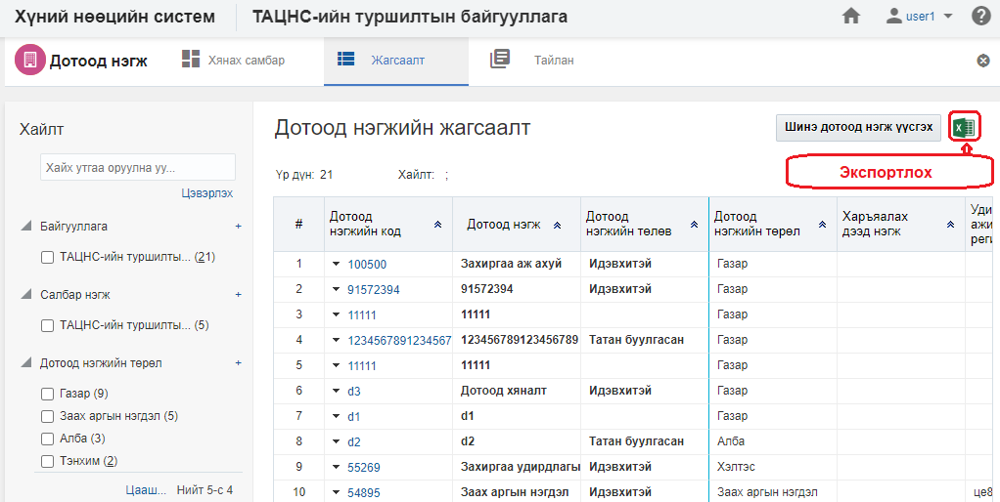
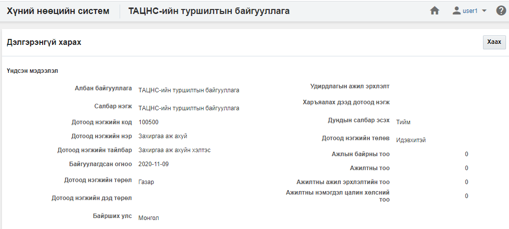
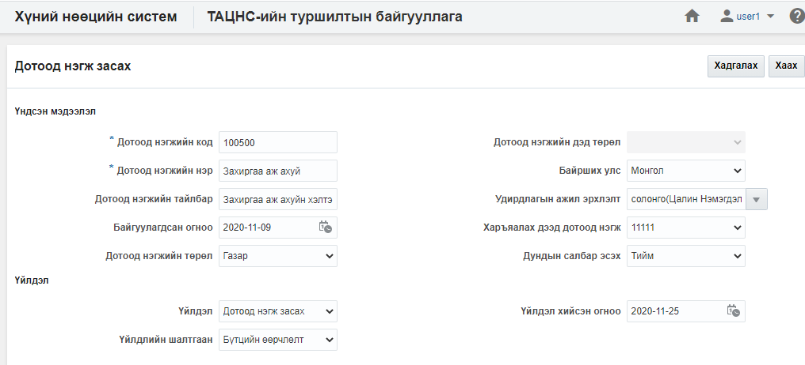
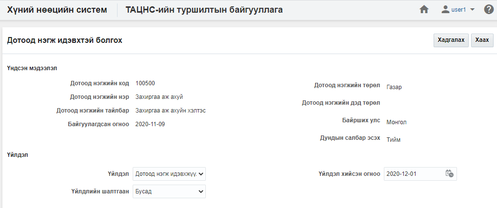
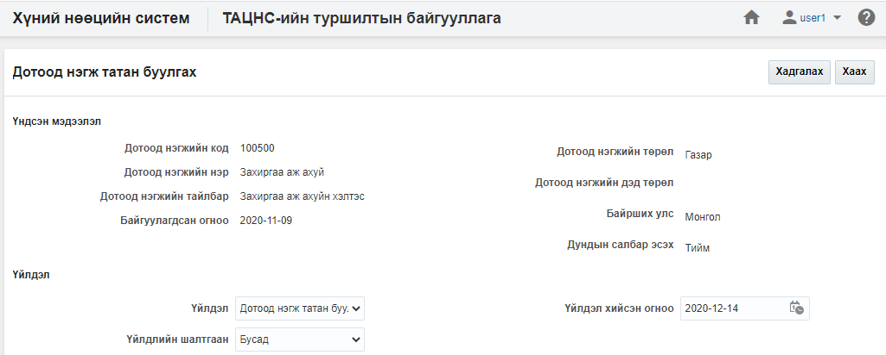
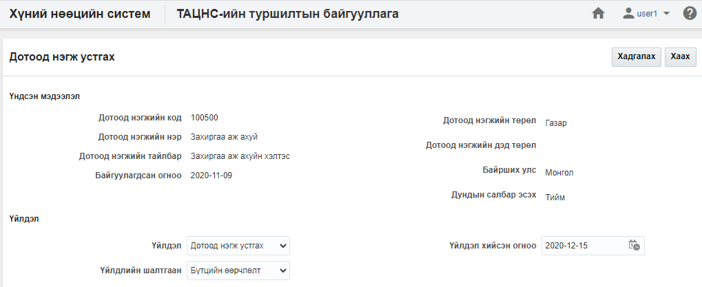

<h1 align="center">Дотоод нэгж модулийн үйлдэл</h1>
Дотоод нэгжийн мэдээллийн өөрчлөлт, түр түдгэлзүүлэх, татан буулгах, устгах... зэрэг үйлдлүүдийг хэрэглэгчид зөвшөөрөгдсөн эрхийн дагуу хийж болно.

## Үйлдэл хийх арга зам
Үйлдлийг хийхдээ жагсаалт цонхноос 2 төрлийн арга замаар хийнэ.

- ### 1. Ерөнхий цэс

  Жагсаалтын цонхны баруун дээд буланд байршина.

  

- ### 2. Контекст цэс

  Жагсаалтын цонхны үр дүн харуулах хэсэгт мөр дэх жижиг сум хэлбэртэй цэсийг контекст цэс гэнэ.

  

## Дотоод нэгж модулийн үйлдлүүд
Дотоод нэгж модуль дээр дараах үйлдлүүдийг хийж болно.

**Үүнд:**

- [Шинэ дотоод нэгж үүсгэх](Departments/action.md?id=Шинэ-дотоод-нэгж-үүсгэх)
- [Жагсаалт экспортлох](Departments/action.md?id=Жагсаалт-экспортлох)
- [Дотоод нэгжийн профайль](Departments/action.md?id=Дотоод-нэгжийн-профайль)
- [Дотоод нэгж засах](Departments/action.md?id=Дотоод-нэгж-засах)
- [Дотоод нэгж түр түдгэлзүүлэх](Departments/action.md?id=Дотоод-нэгж-түр-түдгэлзүүлэх)
- [Дотоод нэгж идэвхтэй болгох](Departments/action.md?id=Дотоод-нэгж-идэвхтэй-болгох)
- [Дотоод нэгж татан буулгах](Departments/action.md?id=Дотоод-нэгж-татан-буулгах)
- [Дотоод нэгж устгах](Departments/action.md?id=Дотоод-нэгж-устгах)

### Шинэ дотоод нэгж үүсгэх

**Шинэ дотоод нэгж үүсгэх** үйлдэл нь байгууллагад шинэ дотоод нэгж мэдээллийн санд нэмэх үйлдэл юм.

#### Үйлдлийн өмнөх нөхцөл
  Энэхүү үйлдлийг хийхээс өмнө ямар нөхцөл бүрдсэн байхыг энэ хэсэгт жагсаалтаар зааж байна. Үүнд:
  - Дотоод нэгжийг үүсгэх албан байгууллага системд үүссэн байх

#### Үйлдлийн нөлөөлөл
  Энэхүү үйлдлийг хийх үед бусад мэдээлэлд хэрхэн нөлөөлөх нөлөөллийг заана. Үүнд:
  - Дотоод нэгжийн хянах самбарын график тоон мэдээлэл өөрчлөгдөнө.
  - Дотоод нэгжийн жагсаалтад шинэ бичлэг нэмэгдэнэ.
  - Дотоод нэгжийн тайлангийн тоон мэдээлэл өөрчлөгдөнө.

### Жагсаалт экспортлох

**Жагсаалт экспортлох** үйлдэл нь хайлт шүүлтийн үр дүнг майкрософт эксел файлаар экспортлон авах үйлдэл юм.

#### Үйлдлийн өмнөх нөхцөл
  Энэхүү үйлдлийг хийхээс өмнө ямар нөхцөл бүрдсэн байхыг энэ хэсэгт жагсаалтаар зааж байна. Үүнд:
  - Экспортлох мэдээллээ зөв шүүсэн эсэхээ шалгах

#### Үйлдлийн нөлөөлөл
  Энэхүү үйлдлийг хийх үед бусад мэдээлэлд хэрхэн нөлөөлөх нөлөөллийг заана. Үүнд:
  - Систем дээр ямар нэгэн нөлөөлөл байхгүй байна

### Дотоод нэгжийн профайль

**Дотоод нэгжийн профайль** үйлдэл нь тухайн сонгосон дотоод нэгжийн мэдээллийг нэг цонхноос авах боломжийг бүрдүүлнэ.

#### Үйлдлийн өмнөх нөхцөл
  Энэхүү үйлдлийг хийхээс өмнө ямар нөхцөл бүрдсэн байхыг энэ хэсэгт жагсаалтаар зааж байна. Үүнд:
  - Зөв дотоод нэгж сонгосон эсэхээ шалгах

#### Үйлдлийн нөлөөлөл
  Энэхүү үйлдлийг хийх үед бусад мэдээлэлд хэрхэн нөлөөлөх нөлөөллийг заана. Үүнд:
  - Систем дээр ямар нэгэн нөлөөлөл байхгүй байна

### Дотоод нэгж засах

**Дотоод нэгж засах** үйлдэл нь тухайн сонгосон дотоод нэгжийн мэдээллийг өөрчлөх боломжийг бүрдүүлнэ.

#### Үйлдлийн өмнөх нөхцөл
  Энэхүү үйлдлийг хийхээс өмнө ямар нөхцөл бүрдсэн байхыг энэ хэсэгт жагсаалтаар зааж байна. Үүнд:
  - Зөв дотоод нэгж сонгосон эсэхээ шалгах

#### Үйлдлийн нөлөөлөл
  Энэхүү үйлдлийг хийх үед бусад мэдээлэлд хэрхэн нөлөөлөх нөлөөллийг заана. Үүнд:
  - Дотоод нэгжийн хянах самбарын график тоон мэдээлэл өөрчлөгдөнө.
  - Дотоод нэгжийн жагсаалтын мэдээлэл өөрчлөгдөнө.
  - Дотоод нэгжийн тайлангийн тоон мэдээлэл өөрчлөгдөнө.

### Дотоод нэгж түр түдгэлзүүлэх

**Дотоод нэгж түр түдгэлзүүлэх** үйлдэл нь тухайн сонгосон дотоод нэгжийн төлөвийг түр түдгэлзүүлсэн төлөвт шилжүүлэх бөгөөд хэрэв дотоод нэгж нь түр түдгэлзүүлсэн төлөвт шилжсэн бол тухайн дотоод нэгж дээр ямар нэгэн үйлдэл хийх боломж түр хаагдана. Энэ үйлдлийг зөвхөн **идэвхтэй төлөвтэй дотоод нэгж** дээр хийх боломжтой.

#### Үйлдлийн өмнөх нөхцөл
  Энэхүү үйлдлийг хийхээс өмнө ямар нөхцөл бүрдсэн байхыг энэ хэсэгт жагсаалтаар зааж байна. Үүнд:
  - Зөв дотоод нэгж сонгосон эсэхээ шалгах
  - Сонгосон дотоод нэгжийн төлөв нь идэвхтэй эсэхийг шалгах

#### Үйлдлийн нөлөөлөл
  Энэхүү үйлдлийг хийх үед бусад мэдээлэлд хэрхэн нөлөөлөх нөлөөллийг заана. Үүнд:
  - Дотоод нэгжийн хянах самбарын график тоон мэдээлэл өөрчлөгдөнө.
  - Дотоод нэгжийн жагсаалтын мэдээлэл өөрчлөгдөнө
  - Дотоод нэгжийн тайлангийн тоон мэдээлэл өөрчлөгдөнө.
  - Дотоод нэгжийн өөрчлөх үйлдлүүд хийх боломжгүй болно.
  - Ажлын байрны өөрчлөх үйлдлүүд хийх боломжгүй болно.
  - Ажилтан, ажил эрхлэлтийн өөрчлөх үйлдлүүд хийх боломжгүй болно.
  - Цалин хөлсний өөрчлөх үйлдлүүд хийх боломжгүй болно.

### Дотоод нэгж идэвхтэй болгох

**Дотоод нэгж идэвхтэй болгох** үйлдэл нь тухайн сонгосон дотоод нэгжийн төлөвийг идэвхтэй төлөвт шилжүүлэх үйлдэл юм. Энэ үйлдэл нь зөвхөн **түр түдгэлзүүлсэн төлөвтэй нэгж** дээр хийгдэх боломжтой.

#### Үйлдлийн өмнөх нөхцөл
  Энэхүү үйлдлийг хийхээс өмнө ямар нөхцөл бүрдсэн байхыг энэ хэсэгт жагсаалтаар зааж байна. Үүнд:
  - Зөв дотоод нэгж сонгосон эсэхээ шалгах
  - Сонгосон дотоод нэгжийн төлөв түр түдгэлзүүлсэн эсэхийг шалгах

#### Үйлдлийн нөлөөлөл
  Энэхүү үйлдлийг хийх үед бусад мэдээлэлд хэрхэн нөлөөлөх нөлөөллийг заана. Үүнд:
  - Дотоод нэгжийн хянах самбарын график тоон мэдээлэл өөрчлөгдөнө.
  - Дотоод нэгжийн жагсаалтад шинэ бичлэг нэмэгдэнэ.
  - Дотоод нэгжийн тайлангийн тоон мэдээлэл өөрчлөгдөнө.
  - Дотоод нэгжийн өөрчлөх үйлдлүүд хийх боломжтой болно.
  - Ажлын байрны өөрчлөх үйлдлүүд хийх боломжтой болно.
  - Ажилтан, ажил эрхлэлтийн өөрчлөх үйлдлүүд хийх боломжтой болно.
  - Цалин хөлсний өөрчлөх үйлдлүүд хийх боломжтой болно.

### Дотоод нэгж татан буулгах

**Дотоод нэгж татан буулгах** үйлдэл нь тухайн сонгосон дотоод нэгжийг цаашид ашиглахгүйгээр бүр мөсөн хаах шаардлага үүссэн үед ашиглах бөгөөд хэрэв энэ үйлдлийг хийвэл тухайн дотоод нэгжийг татан буугдсан төлөвт шилжүүлнэ. Энэ төлөвт шилжсэн дотоод нэгж дээр ямар нэгэн засах, өөрчлөх үйлдэл хийх боломжгүй бөгөөд системд энэ төлөвөөр архивлан авах үйлдэл юм.

#### Үйлдлийн өмнөх нөхцөл
  Энэхүү үйлдлийг хийхээс өмнө ямар нөхцөл бүрдсэн байхыг энэ хэсэгт жагсаалтаар зааж байна. Үүнд:
  - Зөв дотоод нэгж сонгосон эсэхийг шалгах
  - Сонгосон дотоод нэгжийн төлөв нь идэвхтэй эсвэл түр түдгэлзүүлсэн төлөвт байгаа эсэхийг шалгах
  - Сонгосон дотоод нэгжийн идэвхтэй ажил эрхлэлт байгаа эсэхийг шалгах
  - Сонгосон дотоод нэгжийн идэвхтэй ажлын байр байгаа эсэхийг шалгах

#### Үйлдлийн нөлөөлөл
  Энэхүү үйлдлийг хийх үед бусад мэдээлэлд хэрхэн нөлөөлөх нөлөөллийг заана. Үүнд:
  - Дотоод нэгжийн хянах самбарын график тоон мэдээлэл өөрчлөгдөнө.
  - Дотоод нэгжийн жагсаалтын мэдээлэл өөрчлөгдөнө.
  - Дотоод нэгжийн тайлангийн тоон мэдээлэл өөрчлөгдөнө.
  - Дотоод нэгжийн өөрчлөх үйлдлүүд хийх боломжгүй болно.
  - Ажлын байрны өөрчлөх үйлдлүүд хийх боломжгүй болно.
  - Ажилтан, ажил эрхлэлтийн өөрчлөх үйлдлүүд хийх боломжгүй болно.
  - Цалин хөлсний өөрчлөх үйлдлүүд хийх боломжгүй болно.

### Дотоод нэгж устгах

**Дотоод нэгж устгах** үйлдэл нь тухайн сонгосон дотоод нэгжийг буруу үүсгэсэн үед ашиглах бөгөөд тухайн дотоод нэгж болон түүнтэй холбоотой бүх мэдээллийг систем дээрээс бүр мөсөн устгах үйлдэл юм. Энэ үйлдлийг хийснээс хойш дотоод нэгжийн төлөвийг [энд](legal/delete_policy.md) заагдсан хугацааны турш **устгасан төлөвт** байлгах бөгөөд түүний дараа систем автоматаар устгана.

#### Үйлдлийн өмнөх нөхцөл
  Энэхүү үйлдлийг хийхээс өмнө ямар нөхцөл бүрдсэн байхыг энэ хэсэгт жагсаалтаар зааж байна. Үүнд:
  - Зөв дотоод нэгж сонгосон эсэхийг шалгах
  - Сонгосон дотоод нэгжийн төлөв нь идэвхтэй, түр түдгэлзүүлсэн төлөвт байгаа эсэхийг шалгах
  - Тухайн дотоод нэгжийг бусад  дотоод нэгж, ажлын байр, ажилтан, ажил эрхлэлт, цалин хөлс, сахилгын зөрчил, нөөцийн бүртгэл зэрэг бүртгэлүүдэд ашиглагдсан эсэхийг шалгах

#### Үйлдлийн нөлөөлөл
  Энэхүү үйлдлийг хийх үед бусад мэдээлэлд хэрхэн нөлөөлөх нөлөөллийг заана. Үүнд:
  - Дотоод нэгжийн хянах самбарын график тоон мэдээлэл өөрчлөгдөнө.
  - Дотоод нэгжийн жагсаалтын мэдээлэл өөрчлөгдөнө.
  - Дотоод нэгжийн тайлангийн тоон мэдээлэл өөрчлөгдөнө.
  - Дотоод нэгжийн өөрчлөх үйлдлүүд хийх боломжгүй болно.
  - Ажлын байрны өөрчлөх үйлдлүүд хийх боломжгүй болно.
  - Ажилтан, ажил эрхлэлтийн өөрчлөх үйлдлүүд хийх боломжгүй болно.
  - Цалин хөлсний өөрчлөх үйлдлүүд хийх боломжгүй болно.
  - Тухайн дотоод нэгжийг ашигласан бүх мэдээлэл устана.

