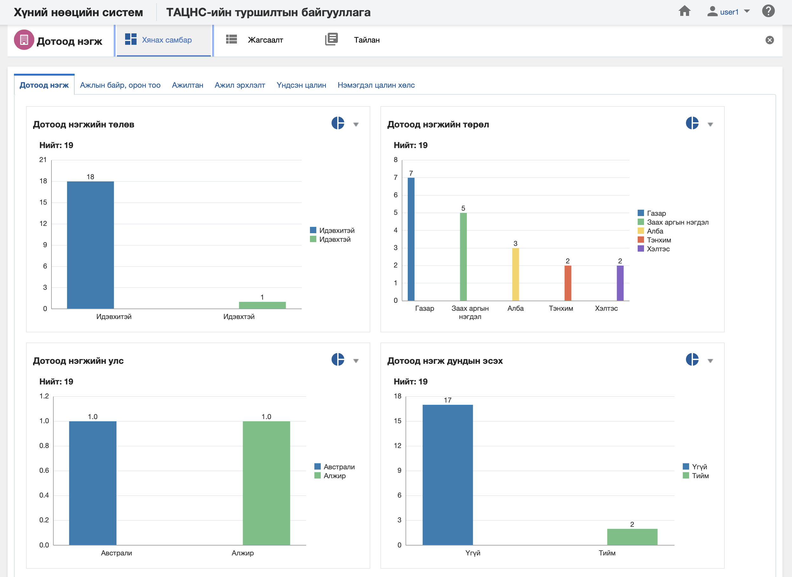

<h1 align="center">Дотоод нэгж модулийн хянах самбар</h1>

**Дотоод нэгж модулийн хянах самбар** нь тухайн дотоод нэгж, түүний харъяалагдах мэдээллийг бодит цаг хугацааны мэдээлэл дээр хяналт, шинжилгээ хийх боломжийг олгоно.

> Хянах самбартай ажиллах талаар ерөнхий ойлголтыг [хянах самбартай ажиллах](how-it-works?id=_4-Хянах-самбартай-ажиллах) хэсгээс харна уу.

 

**Дотоод нэгж модулийн хянах самбар нь дараах таб анализуудаас бүрдэнэ.** 

|Хянах самбарын таб|Тайлбар|
|:-----|:------|
|**Дотоод нэгж**|Дотоод нэгжийн мэдээллээр анализ хийх|
|**Ажлын байр, орон тоо**|Дотоод нэгжийн мэдээлэл болон ажлын байр, орон тооны мэдээллээр кросс анализ хийх|
|**Ажилтан**|Дотоод нэгжийн мэдээлэл болон ажилтны мэдээллээр кросс анализ хийх|
|**Ажил эрхлэлт**|Дотоод нэгжийн мэдээлэл болон ажил эрхлэлтийн мэдээллээр кросс анализ хийх|
|**Үндсэн цалин**|Дотоод нэгжийн мэдээлэл болон үндсэн цалингийн мэдээллээр кросс анализ хийх|
|**Нэмэгдэл цалин хөлс**|Дотоод нэгжийн мэдээлэл болон нэмэгдэл цалин хөлсний мэдээллээр кросс анализ хийх|