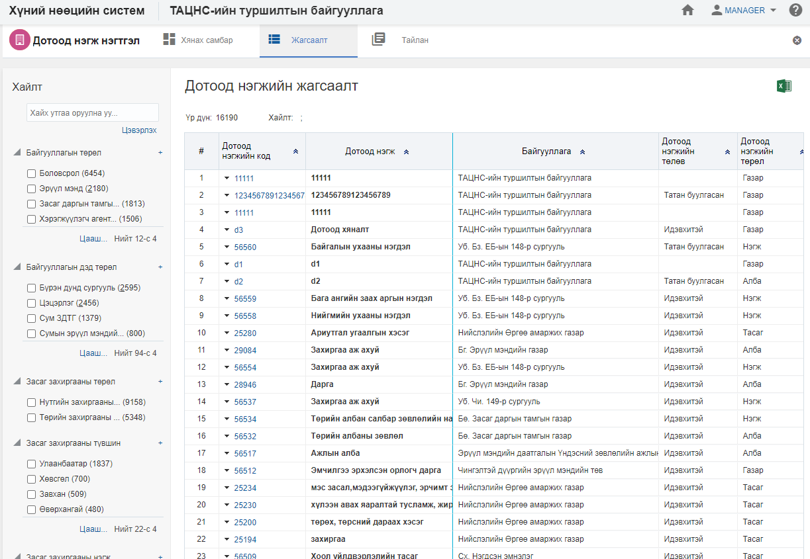
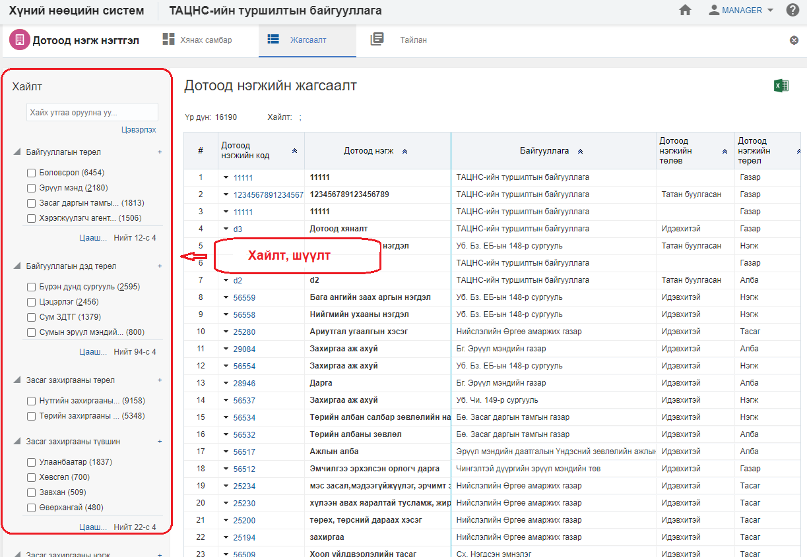
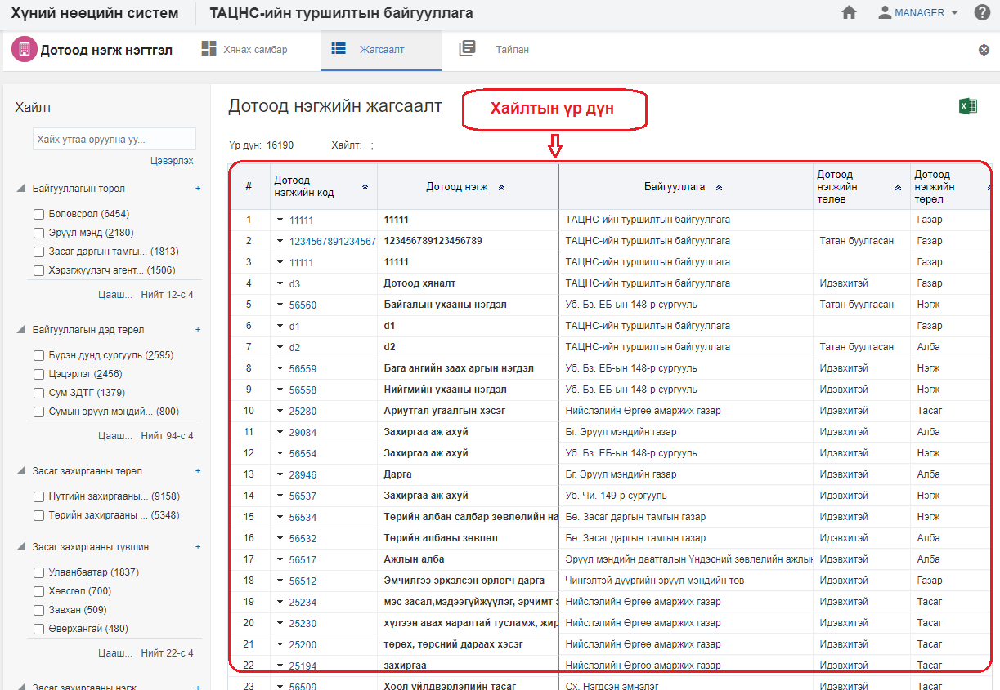

<h1 align="center">Дотоод нэгж модулийн жагсаалт, хайлт</h1>

Тухайн байгууллагад харьяалах нийт дотоод нэгжийн жагсаалтыг энэ хэсэгт харуулах ба хэрэглэгчийн эрх, үүргийн дагуу үйлдэл хийх боломжийг олгоно.

> Жагсаалт, хайлттай ажиллах талаар ерөнхий ойлголтыг [жагсаалт, хайлттай ажиллах](how-it-works?id=_3-Жагсаалт-хайлттай-ажиллах) хэсгээс харна уу.

Дотоод нэгжийн жагсаалтын энэ хэсэгт үйлдлүүдийг хийнэ.

### Нарийвчилсан хайлт

Дотоод нэгжийг дараах төрлүүдээр нарийвчилан хайх боломжтой.

> Дээрх зурганд дотоод  нэгжийн хайлт, шүүлтийн хэсгийг харуулж байна.

#### Нарийвчилсан хайлтын төрөл:

- **Байгууллага**
     Байгууллага. Дотоод нэгжийн байгууллага 

- **Салбар нэгж**
     Салбар нэгж. Дотоод нэгжийн харьяалах салбар нэгж 

- **Дотоод нэгжийн төрөл**
     Дотоод нэгжийн төрөл. Дотоод нэгжийг төрлөөр харуулна.

- **Харьяалах дээд дотоод нэгж**
     Харьяалах дээд дотоод нэгж. Дотоод нэгжийн харьяалах дээд дотоод нэгж. Үүссэн дотоод нэгжээс сонгох боломжтой.

- **Дотоод нэгжийн төлөв**
     Дотоод нэгжийн төлөв. Дотоод нэгжийн идэвхтэй, түр түдгэлзүүлэх, засах, татан буулгах .... гэх мэт

- **Улс**
     Улс. Дотоод нэгж байрлах сонгогдсон улсыг харуулна.
 
### Жагсаалтын мэдээлэл

Дотоод нэгжийн хайлтын үр дүнг жагсаалт хэлбэрээр харуулна.

> Дээрх зурганд Дотоод нэгжийн жагсаалтын үр дүнг харуулж байна.

#### Хайлтын үр дүнгийн мэдээлэл:

- **Дотоод нэгжийн код**
     Дотоод нэгжийн давхцахгүй код  
- **Дотоод нэгж**
     Дотоод нэгжийн нэр  
- **Дотоод нэгжийн төлөв**
     Дотоод нэгжийн төлвийн мэдээлэл  
- **Төрөл**
     Дотоод нэгжийн төрөл  
- **Дотоод нэгжийн төрөл**
     Дотоод нэгжийн төрөл  
- **Дотоод нэгжийн харьяалах дээд нэгж**
     Дотоод нэгжийн харьяалах дээд дотоод нэгж  
- **Удирдах ажилтны регистр**
     Удирдах ажилтны регистрийн дугаар  
- **Удирдах ажилтны эцэг /эх/-ийн нэр**
     Удирдах ажилтны эцэг /эх/-ийн нэр  
- **ҮУдирдах ажилтан**
     Удирдах ажилтны нэр  
- **Удирдах ажилтны албан тушаал**
     Удирдах ажилтны албан тушаал  
- **Салбар нэгж**
     Дотоод нэгж харьяалах салбар нэгжийн нэр  
- **Байгууллага**
     Дотоод нэгж харьяалах байгууллагын нэр  
- **Ажлын байр**
     Дотоод нэгжид харьяалах ажлын байр  
- **Ажилтан**
     Дотоод нэгжид харьяалах ажилтан  
- **Ажилтны ажил эрхлэлт**
     Дотоод нэгжид харьяалах ажилтны ажил эрхлэлт  
- **Ажилтны нэмэгдэл цалин, хөлс**
     Ажилтны нэмэгдэл цалин, хөлс  