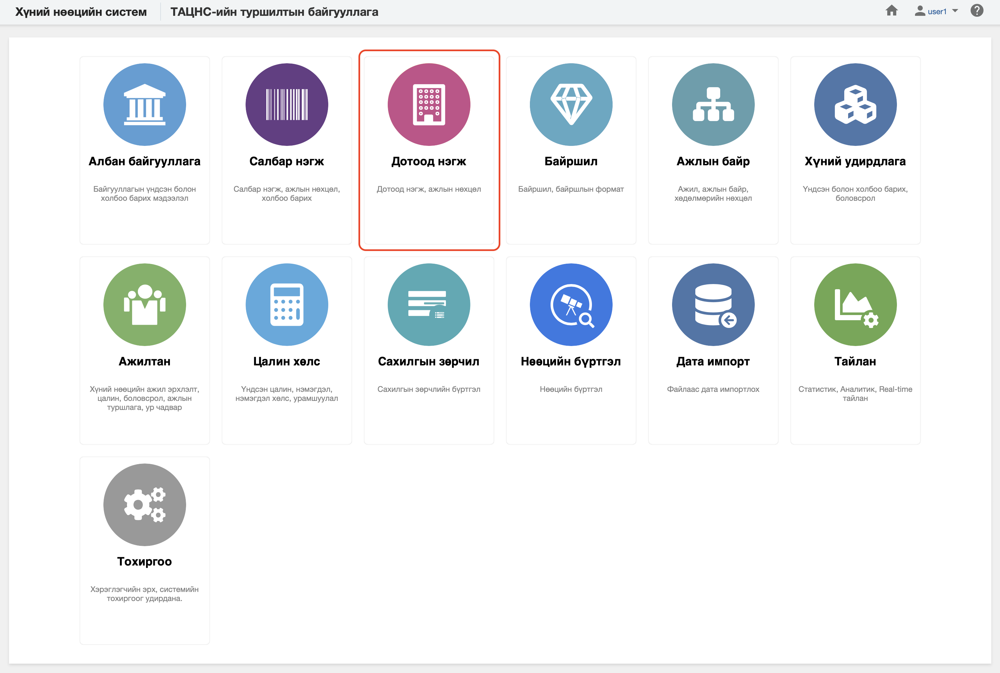

<h1 align="center">Дотоод нэгж модуль</h1>

Байгууллага нь өөрийн зорилго, зорилт, үйл ажиллагааны чиглэлээсээ хамаарч байгууллагын дотоод бүтэц, нэгжүүдээ үүсгэдэг. Байгууллагын дотоод нэгжийг бүртгэх, өөрчлөлтийг удирдахад зориулсан модулийг төрийн албаны хүний нөөцийн нэгдсэн системд  **дотоод нэгж** гэж ойлгоно. 
 

Төрийн албаны хүний нөөцийн нэгдсэн системийн дотоод нэгж модуль нь дараах хэсгээс бүрдэнэ.

Үүнд:

- [Хянах самбар](departments/dashboard.md)
- [Жагсаалт, хайлт](departments/list.md)
- [Тайлан](departments/report.md)
- [Үйлдэл](departments/action.md)