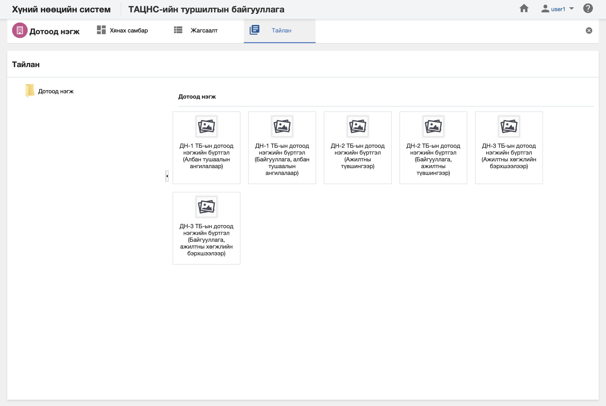

<h1 align="center">Дотоод нэгж модулийн тайлан</h1>

Албан байгууллагын дотоод нэгж дэх мэдээлэлд шинжилгээ хийж дата шинжилгээний үр дүнг урьдчилан бэлтгэсэн тайлангуудын загвараар гаргана.

> Тайлантай хэрхэн ажиллах талаар ерөнхий ойлголтыг [тайлантай ажиллах](how-it-works?id=_5-Тайлантай-ажиллах) хэсгээс харна уу.

Дотоод нэгж дээр дараах тайлангуудыг урьдчилан тодорхойлсон байна.

**Үүнд:**

- **ДН-1 Дотоод нэгжийн бүртгэл**
   Байгууллагын дотоод нэгжийн тоог тайлангийн үзүүлэлтээр гаргах тайлан (Албан тушаалын ангилалаар)  
- **ДН-1 Дотоод нэгжийн тоо (Байгууллага, албан тушаалын ангилалаар)**
   Байгууллагын дотоод нэгжийн тоог тайлангийн үзүүлэлтээр гаргах тайлан (Байгууллага, албан тушаалын ангилалар)  
- **ДН-2 Дотоод нэгжийн бүртгэл**
   Байгууллагын дотоод нэгжийн тоог тайлангийн үзүүлэлтээр гаргах тайлан (Ажилтны түвшингээр)  
- **ДН-2 Дотоод нэгжийн тоо (Байгууллага, ажилтны түвшингээр)**
   Байгууллагын дотоод нэгжийн тоог тайлангийн үзүүлэлтээр гаргах тайлан (Байгууллага, ажилтны түвшингээр)  
- **ДН-3 Дотоод нэгжийн бүртгэл**
   Байгууллагын дотоод нэгжийн тоог тайлангийн үзүүлэлтээр гаргах тайлан (Ажилтны хөгжлийн бэрхшээлээр)  
- **ДН-3 Дотоод нэгжийн тоо (Байгууллага, ажилтны хөгжлийн бэрхшээлээр)**
   Байгууллагын дотоод нэгжийн тоог тайлангийн үзүүлэлтээр гаргах тайлан (Байгууллага, ажилтны хөгжлийн бэрхшээлээр)  