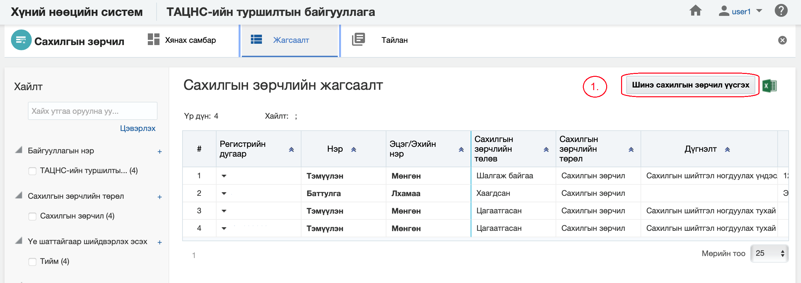
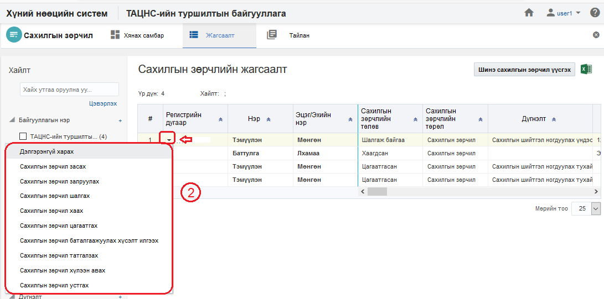
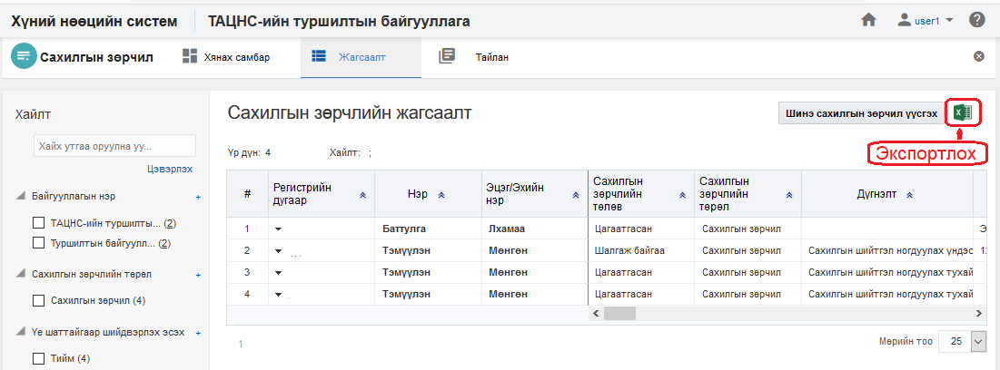
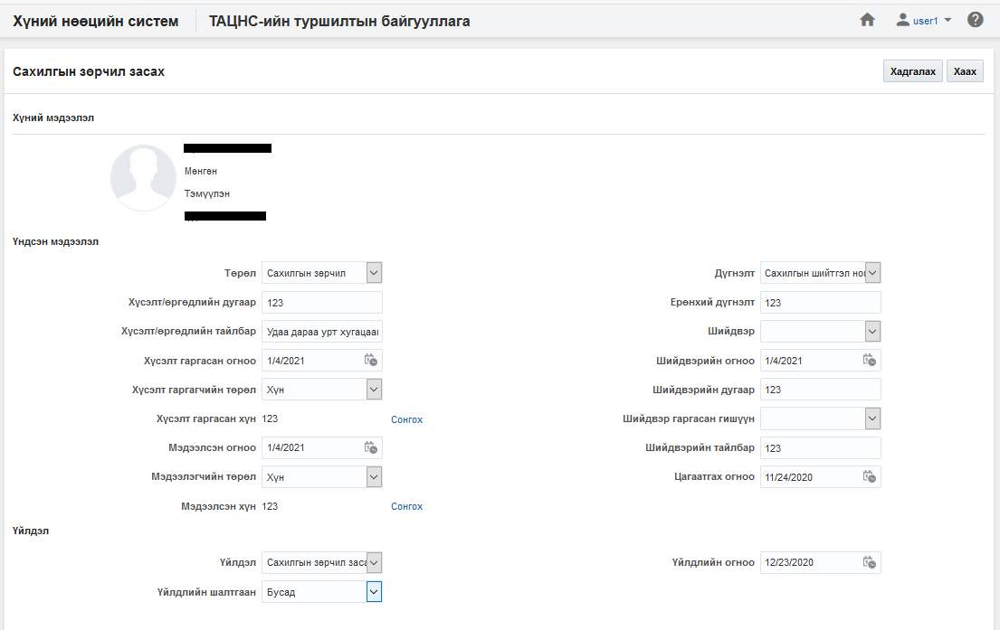
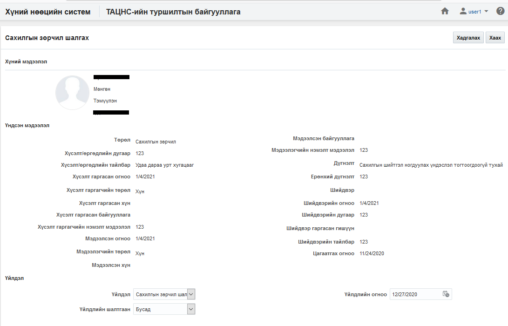
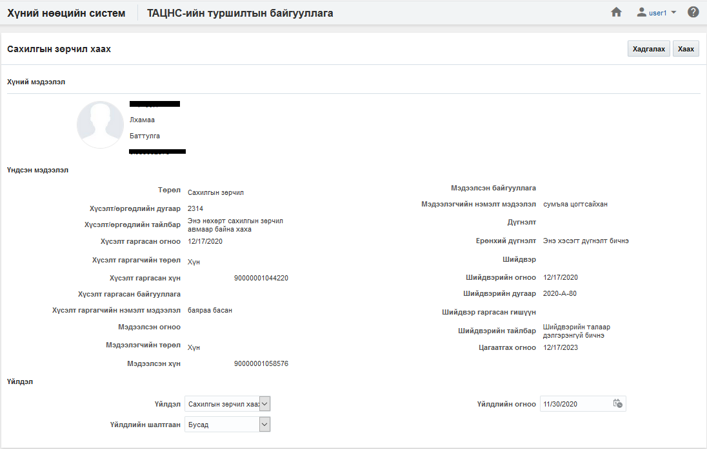
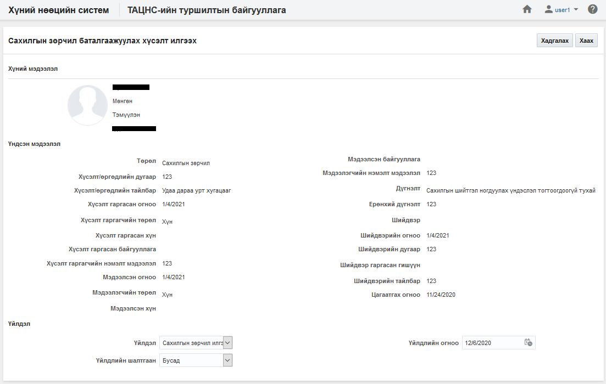
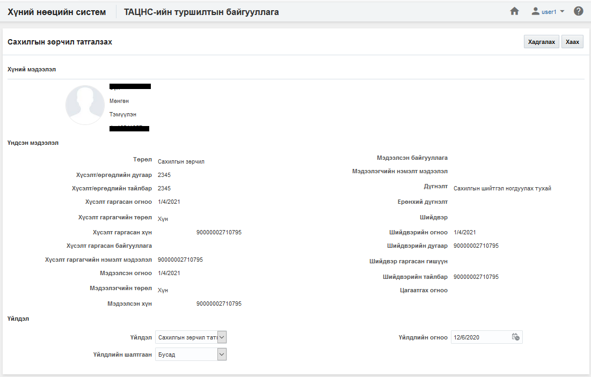
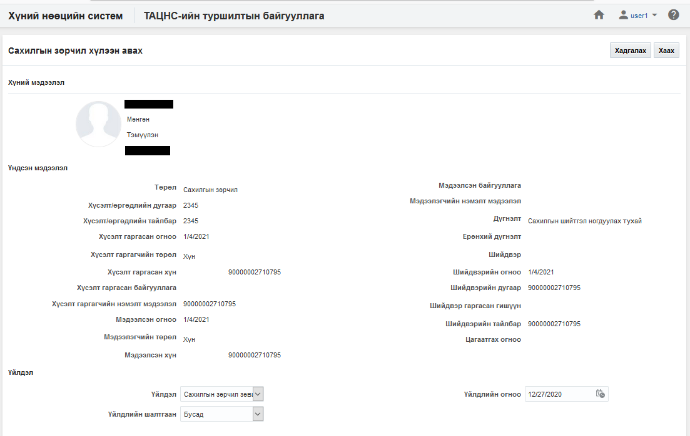
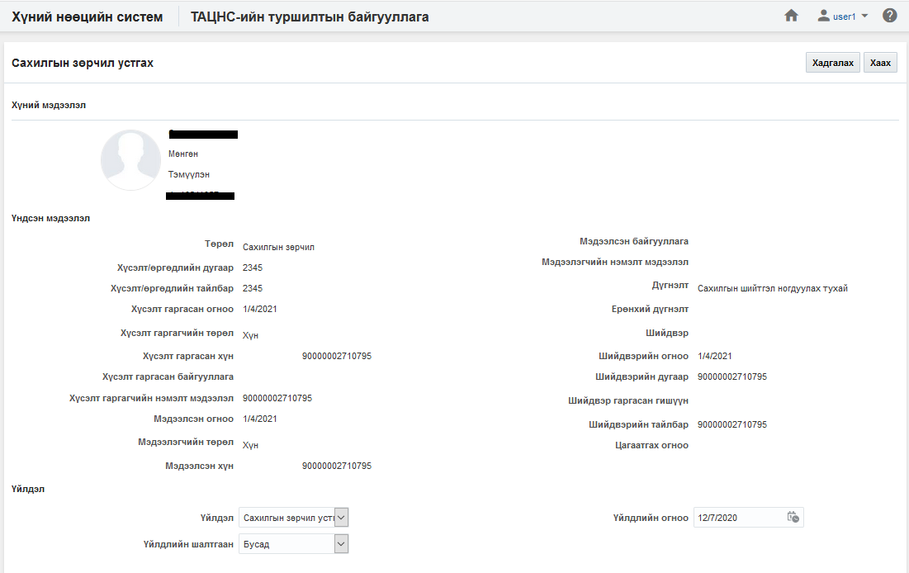

<h1 align="center">Сахилгын зөрчил модулийн үйлдэл</h1>

Сахилгын зөрчлийн бүртгэлийг шалгах, хаах, цагаатгах, залруулах, татгалзах, өөрчлөх, баталгаажуулах хүсэлт илгээх, устгах... зэрэг үйлдлүүдийг хэрэглэгчид зөвшөөрөгдсөн эрхийн дагуу хийж болно.

## Үйлдэл хийх арга зам
Үйлдлийг хийхдээ жагсаалт цонхноос 2 төрлийн арга замаар хийнэ.

- ### 1. Ерөнхий цэс

  Жагсаалтын цонхны баруун дээд буланд байршина.

  

- ### 2. Контекст цэс

  Жагсаалтын цонхны үр дүн харуулах хэсэгт мөр дэх жижиг сум хэлбэртэй цэсийг контекст цэс гэнэ.

  

## Сахилгын зөрчлийн үйлдлүүд
Сахилгын зөрчил модуль дээр дараах үйлдлүүдийг хийж болно.

**Үүнд:**

- [Шинэ сахилгын зөрчил үүсгэх](Disciplinaries/action.md?id=Шинэ-сахилгын-зөрчил-үүсгэх)
- [Жагсаалт экспортлох](Disciplinaries/action.md?id=Жагсаалт-экспортлох)
- [Сахилгын зөрчлийн бүртгэлийн профайль](Disciplinaries/action.md?id=Сахилгын-зөрчлийн-бүртгэлийн-профайль)
- [Сахилгын зөрчил засах](Disciplinaries/action.md?id=Сахилгын-зөрчил-засах)
- [Сахилгын зөрчил залруулах](Disciplinaries/inaction.md?id=Сахилгын-зөрчил-залруулах)
- [Сахилгын зөрчил шалгах](Disciplinaries/action.md?id=Сахилгын-зөрчил-шалгах)
- [Сахилгын зөрчил хаах](Disciplinaries/action.md?id=Сахилгын-зөрчил-хаах)
- [Сахилгын зөрчил цагаатгах](Disciplinaries/action.md?id=Сахилгын-зөрчил-цагаатгах)
- [Сахилгын зөрчил баталгаажуулах хүсэлт илгээх](Disciplinaries/action.md?id=Сахилгын-зөрчил-баталгаажуулах-хүсэлт-илгээх)
- [Сахилгын зөрчил татгалзах](Disciplinaries/action.md?id=Сахилгын-зөрчил-татгалзах)
- [Сахилгын зөрчил хүлээн авах](Disciplinaries/action.md?id=Сахилгын-зөрчил-хүлээн-авах)
- [Сахилгын зөрчил устгах](Disciplinaries/action.md?id=Сахилгын-зөрчил-устгах)

### Шинэ сахилгын зөрчил үүсгэх

**Шинэ сахилгын зөрчил үүсгэх** үйлдэл нь байгууллагад шинэ сахилгын зөрчил мэдээллийн санд нэмэх үйлдэл юм.

#### Үйлдлийн өмнөх нөхцөл
  Энэхүү үйлдлийг хийхээс өмнө ямар нөхцөл бүрдсэн байхыг энэ хэсэгт жагсаалтаар зааж байна. Үүнд:
  - Сахилгын зөрчлийн бүртгэлийг үүсгэх албан байгууллага системд үүссэн байх

#### Үйлдлийн нөлөөлөл
  Энэхүү үйлдлийг хийх үед бусад мэдээлэлд хэрхэн нөлөөлөх нөлөөллийг заана. Үүнд:
  - Сахилгын зөрчлийн хянах самбарын график тоон мэдээлэл өөрчлөгдөнө.
  - Сахилгын зөрчлийн жагсаалтад шинэ бичлэг нэмэгдэнэ.
  - Сахилгын зөрчлийн тайлангийн тоон мэдээлэл өөрчлөгдөнө.

### Жагсаалт экспортлох

**Жагсаалт экспортлох** үйлдэл нь хайлт шүүлтийн үр дүнг майкрософт эксел файлаар экспортлон авах үйлдэл юм.

#### Үйлдлийн өмнөх нөхцөл
  Энэхүү үйлдлийг хийхээс өмнө ямар нөхцөл бүрдсэн байхыг энэ хэсэгт жагсаалтаар зааж байна. Үүнд:
  - Экспортлох мэдээллээ зөв шүүсэн эсэхээ шалгах

#### Үйлдлийн нөлөөлөл
  Энэхүү үйлдлийг хийх үед бусад мэдээлэлд хэрхэн нөлөөлөх нөлөөллийг заана. Үүнд:
  - Систем дээр ямар нэгэн нөлөөлөл байхгүй байна

### Сахилгын зөрчлийн бүртгэлийн профайль

**Сахилгын зөрчлийн бүртгэлийн профайль** үйлдэл нь тухайн сонгосон сахилгын зөрчлийн мэдээллийг нэг цонхноос авах боломжийг бүрдүүлнэ.

#### Үйлдлийн өмнөх нөхцөл
  Энэхүү үйлдлийг хийхээс өмнө ямар нөхцөл бүрдсэн байхыг энэ хэсэгт жагсаалтаар зааж байна. Үүнд:
  - Зөв хүн сонгосон эсэхээ шалгах

#### Үйлдлийн нөлөөлөл
  Энэхүү үйлдлийг хийх үед бусад мэдээлэлд хэрхэн нөлөөлөх нөлөөллийг заана. Үүнд:
  - Систем дээр ямар нэгэн нөлөөлөл байхгүй байна

### Сахилгын зөрчил засах

**Сахилгын зөрчил засах** үйлдэл нь тухайн сонгосон сахилгын зөрчлийн мэдээллийг өөрчлөх боломжийг бүрдүүлнэ.

#### Үйлдлийн өмнөх нөхцөл
  Энэхүү үйлдлийг хийхээс өмнө ямар нөхцөл бүрдсэн байхыг энэ хэсэгт жагсаалтаар зааж байна. Үүнд:
  - Зөв хүнийг сонгосон эсэхээ шалгах

#### Үйлдлийн нөлөөлөл
  Энэхүү үйлдлийг хийх үед бусад мэдээлэлд хэрхэн нөлөөлөх нөлөөллийг заана. Үүнд:
  - Сахилгын зөрчлийн хянах самбарын график тоон мэдээлэл өөрчлөгдөнө.
  - Сахилгын зөрчлийн жагсаалтын мэдээлэл өөрчлөгдөнө.
  - Сахилгын зөрчлийн тайлангийн тоон мэдээлэл өөрчлөгдөнө.

### Сахилгын зөрчил залруулах

**Сахилгын зөрчил залруулах** үйлдэл нь тухайн сонгосон сахилгын зөрчлийн бүртгэлийг залруулга хийх боломжийг бүрдүүлнэ. Энэ нь өмнө оруулсан мэдээллийг дарж залруулга хийж байгаа үйлдэл юм.

#### Үйлдлийн өмнөх нөхцөл
  Энэхүү үйлдлийг хийхээс өмнө ямар нөхцөл бүрдсэн байхыг энэ хэсэгт жагсаалтаар зааж байна. Үүнд:
  - Зөв хүн сонгосон эсэхээ шалгах

#### Үйлдлийн нөлөөлөл
  Энэхүү үйлдлийг хийх үед бусад мэдээлэлд хэрхэн нөлөөлөх нөлөөллийг заана. Үүнд:
  - Сахилгын зөрчлийн хянах самбарын график тоон мэдээлэл өөрчлөгдөнө.
  - Сахилгын зөрчлийн жагсаалтын мэдээлэл өөрчлөгдөнө.
  - Сахилгын зөрчлийн тайлангийн тоон мэдээлэл өөрчлөгдөнө.

### Сахилгын зөрчил шалгах

**Сахилгын зөрчил шалгах** үйлдэл нь тухайн сонгосон сахилгын зөрчлийн төлөвийг шалгаж байгаа төлөвт шилжүүлнэ. Энэ үйлдлийг зөвхөн **хүлээн авсан төлөвтэй сахилгын зөрчил** дээр хийх боломжтой.

#### Үйлдлийн өмнөх нөхцөл
  Энэхүү үйлдлийг хийхээс өмнө ямар нөхцөл бүрдсэн байхыг энэ хэсэгт жагсаалтаар зааж байна. Үүнд:
  - Зөв хүн сонгосон эсэхээ шалгах
  - Сонгосон сахилгын зөрчлийн бүртгэлийн төлөв нь хүлээн авсан эсэхийг шалгах

#### Үйлдлийн нөлөөлөл
  Энэхүү үйлдлийг хийх үед бусад мэдээлэлд хэрхэн нөлөөлөх нөлөөллийг заана. Үүнд:
  - Сахилгын зөрчлийн бүртгэлийн хянах самбарын график тоон мэдээлэл өөрчлөгдөнө.
  - Сахилгын зөрчлийн бүртгэлийн жагсаалтын мэдээлэл өөрчлөгдөнө
  - Сахилгын зөрчлийн бүртгэлийн тайлангийн тоон мэдээлэл өөрчлөгдөнө.

### Сахилгын зөрчил хаах

**Сахилгын зөрчил хаах** үйлдэл нь тухайн сонгосон сахилгын зөрчлийг хаах төлөвт шилжүүлнэ. Энэ үйлдлийг зөвхөн **хүлээн авсан эсвэл шалгаж байгаа төлөвтэй сахилгын зөрчлийн бүртгэл** дээр хийх боломжтой.

#### Үйлдлийн өмнөх нөхцөл
  Энэхүү үйлдлийг хийхээс өмнө ямар нөхцөл бүрдсэн байхыг энэ хэсэгт жагсаалтаар зааж байна. Үүнд:
  - Зөв хүн сонгосон эсэхээ шалгах
  - Сонгосон сахилгын зөрчлийн бүртгэлийн төлөв нь хүлээн авсан эсвэл шалгаж байгаа эсэхийг шалгах

#### Үйлдлийн нөлөөлөл
  Энэхүү үйлдлийг хийх үед бусад мэдээлэлд хэрхэн нөлөөлөх нөлөөллийг заана. Үүнд:
  - Сахилгын зөрчил хянах самбарын график тоон мэдээлэл өөрчлөгдөнө.
  - Сахилгын зөрчил жагсаалтын мэдээлэл өөрчлөгдөнө
  - Сахилгын зөрчил тайлангийн тоон мэдээлэл өөрчлөгдөнө.
  - Сахилгын зөрчлийн бүртгэлийн өөрчлөх үйлдлүүд хийх боломжгүй болно.

### Сахилгын зөрчил цагаатгах

**Сахилгын зөрчил цагаатгах** үйлдэл нь тухайн сонгосон сахилгын зөрчлийн бүртгэлийн төлөвийг цагаатгах төлөвт шилжүүлэх үйлдэл юм. Энэ үйлдэл нь зөвхөн **хаагдсан** сахилгын зөрчлийн бүртгэл дээр хийгдэх боломжтой.

#### Үйлдлийн өмнөх нөхцөл
  Энэхүү үйлдлийг хийхээс өмнө ямар нөхцөл бүрдсэн байхыг энэ хэсэгт жагсаалтаар зааж байна. Үүнд:
  - Зөв хүн сонгосон эсэхээ шалгах
  - Сонгосон сахилгын зөрчлийн бүртгэлийн төлөв хаагдсан эсэхийг шалгах

#### Үйлдлийн нөлөөлөл
  Энэхүү үйлдлийг хийх үед бусад мэдээлэлд хэрхэн нөлөөлөх нөлөөллийг заана. Үүнд:
  - Сахилгын зөрчил хянах самбарын график тоон мэдээлэл өөрчлөгдөнө.
  - Сахилгын зөрчил жагсаалтын мэдээлэл өөрчлөгдөнө
  - Сахилгын зөрчил тайлангийн тоон мэдээлэл өөрчлөгдөнө.

### Сахилгын зөрчил баталгаажуулах хүсэлт илгээх

**Сахилгын зөрчил баталгаажуулах хүсэлт илгээх** үйлдэл нь тухайн сонгосон сахилгын зөрчлийн бүртгэлийн төлөвийг зөвшөөрөх болон татгалзах төлөвт шилжүүлэх үйлдэл юм. Энэ үйлдэл нь зөвхөн **шинэ** болон **татгалзсан** сахилгын зөрчлийн бүртгэл дээр хийгдэх боломжтой.

#### Үйлдлийн өмнөх нөхцөл
  Энэхүү үйлдлийг хийхээс өмнө ямар нөхцөл бүрдсэн байхыг энэ хэсэгт жагсаалтаар зааж байна. Үүнд:
  - Зөв хүн сонгосон эсэхээ шалгах
  - Сонгосон сахилгын зөрчлийн бүртгэлийн төлөв шинэ эсвэл татгалзсан эсэхийг шалгах

#### Үйлдлийн нөлөөлөл
  Энэхүү үйлдлийг хийх үед бусад мэдээлэлд хэрхэн нөлөөлөх нөлөөллийг заана. Үүнд:
  - Сахилгын зөрчил хянах самбарын график тоон мэдээлэл өөрчлөгдөнө.
  - Сахилгын зөрчил жагсаалтын мэдээлэл өөрчлөгдөнө
  - Сахилгын зөрчил тайлангийн тоон мэдээлэл өөрчлөгдөнө.

### Сахилгын зөрчил татгалзах

**Сахилгын зөрчил татгалзах** үйлдэл нь тухайн сонгосон сахилгын зөрчлийг эрх бүхий этгээд татгалзах үйлдэл юм. Энэ үйлдэл нь сахилгын зөрчлийн бүртгэл хүлээгдэж байгаа үед хийх боломжтой.

#### Үйлдлийн өмнөх нөхцөл
  Энэхүү үйлдлийг хийхээс өмнө ямар нөхцөл бүрдсэн байхыг энэ хэсэгт жагсаалтаар зааж байна. Үүнд:
  - Зөв хүн сонгосон эсэхийг шалгах
  - Сонгосон сахилгын зөрчил хүлээгдэж байгаа эсэхийг шалгах 

#### Үйлдлийн нөлөөлөл
  Энэхүү үйлдлийг хийх үед бусад мэдээлэлд хэрхэн нөлөөлөх нөлөөллийг заана. Үүнд:
  - Сахилгын зөрчил хянах самбарын график тоон мэдээлэл өөрчлөгдөнө.
  - Сахилгын зөрчил жагсаалтын мэдээлэл өөрчлөгдөнө
  - Сахилгын зөрчил тайлангийн тоон мэдээлэл өөрчлөгдөнө.

### Сахилгын зөрчил хүлээн авах

**Сахилгын зөрчил хүлээн авах** үйлдэл нь тухайн сонгосон сахилгын зөрчлийг бхүлээн авах үйлдэл юм. Энэ үйлдэл нь хүлээгдэж байгаа сахилгын зөрчлийг зөвшөөрөх үед хийгдэнэ.

#### Үйлдлийн өмнөх нөхцөл
  Энэхүү үйлдлийг хийхээс өмнө ямар нөхцөл бүрдсэн байхыг энэ хэсэгт жагсаалтаар зааж байна. Үүнд:
  - Зөв хүн сонгосон эсэхийг шалгах
  - Сонгосон сахилгын зөрчлийн бүртгэлийн төлөв хүлээгдэж байгаа эсэхийг шалгах 

#### Үйлдлийн нөлөөлөл
  Энэхүү үйлдлийг хийх үед бусад мэдээлэлд хэрхэн нөлөөлөх нөлөөллийг заана. Үүнд:
  - Сахилгын зөрчил хянах самбарын график тоон мэдээлэл өөрчлөгдөнө.
  - Сахилгын зөрчил жагсаалтын мэдээлэл өөрчлөгдөнө
  - Сахилгын зөрчил тайлангийн тоон мэдээлэл өөрчлөгдөнө.

### Сахилгын зөрчил устгах

**Сахилгын зөрчил устгах** үйлдэл нь сахилгын зөрчлийн бүртгэлийг буруу үүсгэсэн үед ашиглах бөгөөд тухайн сахилгын зөрчлийн бүртгэл болон түүнтэй холбоотой бүх мэдээллийг систем дээрээс бүр мөсөн устгах үйлдэл юм. Энэ үйлдлийг хийснээс хойш сахилгын зөрчлийн бүртгэлийн төлөвийг [энд](legal/delete_policy.md) заагдсан хугацааны турш **устгасан төлөвт** байлгах бөгөөд түүний дараа систем автоматаар устгана.

#### Үйлдлийн өмнөх нөхцөл
  Энэхүү үйлдлийг хийхээс өмнө ямар нөхцөл бүрдсэн байхыг энэ хэсэгт жагсаалтаар зааж байна. Үүнд:
  - Зөв хүн сонгосон эсэхийг шалгах
  - Сонгосон сахилгын зөрчлийн бүртгэлийн төлөв нь шинэ байгаа эсэхийг шалгах

#### Үйлдлийн нөлөөлөл
  Энэхүү үйлдлийг хийх үед бусад мэдээлэлд хэрхэн нөлөөлөх нөлөөллийг заана. Үүнд:
  - Сахилгын зөрчил хянах самбарын график тоон мэдээлэл өөрчлөгдөнө.
  - Сахилгын зөрчил жагсаалтын мэдээлэл өөрчлөгдөнө
  - Сахилгын зөрчил тайлангийн тоон мэдээлэл өөрчлөгдөнө.

