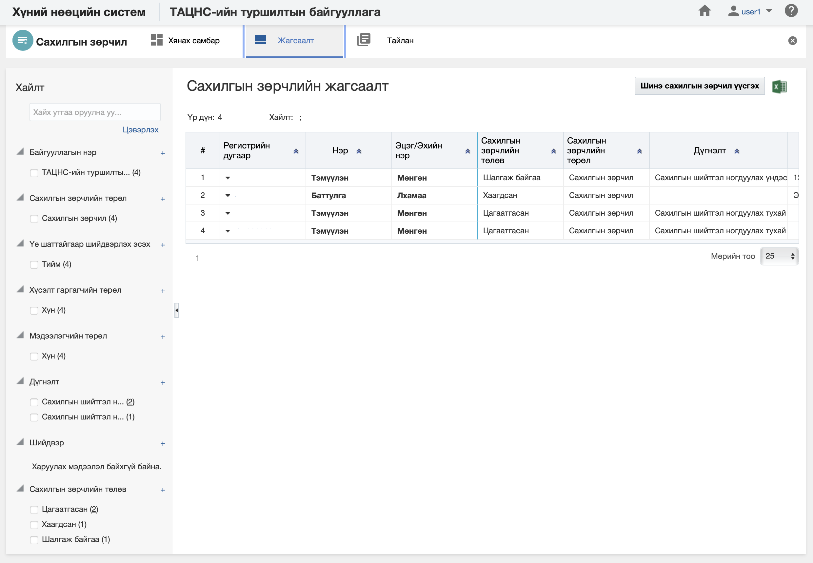
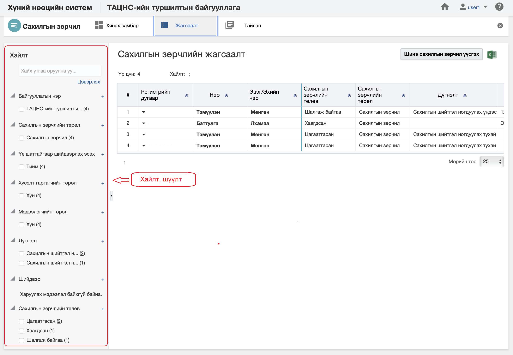
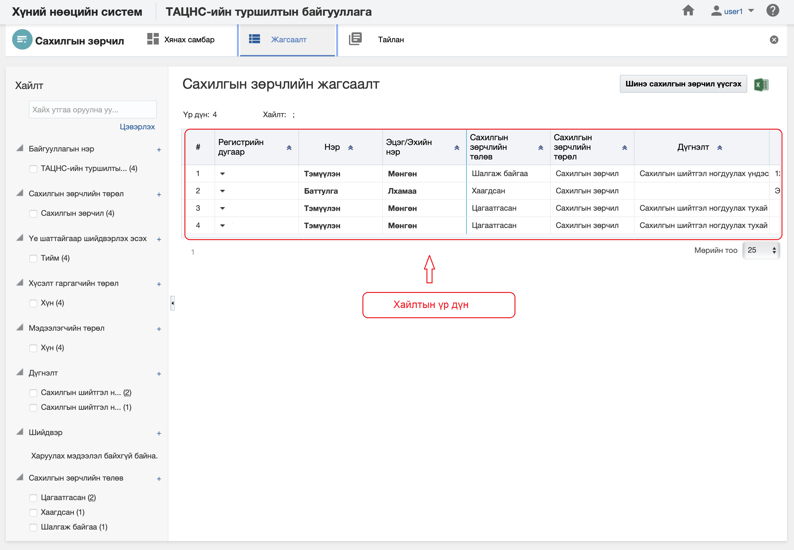

<h1 align="center">Сахилгын зөрчил модулийн жагсаалт, хайлт</h1>

Тухайн байгууллагад бүртгэсэн нийт сахилгын зөрчлийн жагсаалтыг энэ хэсэгт харуулах ба хэрэглэгчийн эрх, үүргийн дагуу үйлдэл хийх боломжийг олгоно.

> Жагсаалт, хайлттай ажиллах талаар ерөнхий ойлголтыг [жагсаалт, хайлттай ажиллах](how-it-works?id=_3-Жагсаалт-хайлттай-ажиллах) хэсгээс харна уу.

Сахилгын зөрчлийн жагсаалтын энэ хэсэгт үйлдлүүдийг хийнэ.

### Нарийвчилсан хайлт

Сахилгын зөрчлийг дараах төрлүүдээр нарийвчилан хайх боломжтой.

> Дээрх зурганд сахилгын зөрчлийн хайлт, шүүлтийн хэсгийг харуулж байна.

#### Нарийвчилсан хайлтын төрөл:

- **Байгууллага**
     Байгууллага. Сахилгын зөрчлийг бүртгэх байгууллага 
- **Сахилгын зөрчлийн төрөл**
     Сахилгын зөрчлийн төрөл. Сахилгын зөрчлийн төрөл
- **Үе шаттайгаар шийдвэрлэх эсэх**
     Үе шаттайгаар шийдвэрлэх эсэх. Сахилгын зөрчлийг үе шаттайгаар шийдвэрлэх эсэх
- **Хүсэлт гаргагчийн төрөл**
     Хүсэлт гаргагчийн төрөл. Сахилгын зөрчлийн хүсэлт гаргагч нь хүн эсвэл байгууллага гэсэн төрөлтэй байна.
- **Мэдээлэгчийн төрөл**
     Мэдээлэгчийн төрөл. Сахилгын зөрчлийн мэдээлэгч нь хүн эсвэл байгууллага гэсэн төрөлтэй байна.
- **Дүгнэлт**
     Дүгнэлт. Сахилгын зөрчлийн дүгнэлт нь сахилгын шийтгэл ногдуулах эсвэл сахилгын шийтгэл ногдуулах үндэслэл тогтоогдоогүй
- **Шийдвэр**
     Шийдвэр. Шийдвэр
- **Сахилгын зөрчлийн төлөв**
     Сахилгын зөрчлийн төлөв. Сахилгын зөрчил нь цагаатгасан, хаагдсан, шалгаж байгаа... гэх мэт төлөвтэй

### Жагсаалтын мэдээлэл

Сахилгын зөрчлийн бүртгэлийн хайлтын үр дүнг жагсаалт хэлбэрээр харуулна.

> Дээрх зурганд сахилгын зөрчлийн бүртгэлийн жагсаалтын үр дүнг харуулж байна.

#### Хайлтын үр дүнгийн мэдээлэл:

- **Регистрийн дугаар**
     Регистрийн дугаар. Сахилгын зөрчилд бүртгэлтэй байгаа хүний регистрийн дугаар
- **Нэр**
     Нэр. Сахилгын зөрчилд бүртгэлтэй хүний нэр
- **Эцэг /эх/-ийн нэр**
     Эцэг /эх/-ийн нэр. Сахилгын зөрчилд бүртгэлтэй хүний эцэг /эх/-ийн нэр
- **Сахилгын зөрчлийн төлөв**
     Сахилгын зөрчлийн төлөв. Сахилгын зөрчилд бүртгэлтэй хүний сахилгын зөрчлийн бүртгэл дэх төлөв.
- **Сахилгын зөрчлийн төрөл**
     Сахилгын зөрчлийн төрөл. Сахилгын зөрчилд бүртгэлтэй хүний сахилгын зөрчлийн төрөл
- **Дүгнэлт**
     Дүгнэлт. Сахилгын зөрчилд бүртгэлтэй хүний сахилгын зөрчлийн дүгнэлт
- **Дүгнэлтийн тайлбар**
     Дүгнэлтийн тайлбар. Сахилгын зөрчилд бүртгэлтэй хүний сахилгын зөрчлийн дүгнэлтийн тайлбар
- **Шийдвэр**
     Шийдвэр. Сахилгын зөрчилд бүртгэлтэй хүний шийдвэр
- **Тушаал/шийдвэрийн огноо**
     Тушаал /шийдвэрийн огноо. Сахилгын зөрчилд бүртгэсэн тушаал /шийдвэрийн огноо
- **Тушаал /шийдвэрийн дугаар**
     Тушаал /шийдвэрийн дугаар. Сахилгын зөрчилд бүртгэсэн тушаал /шийдвэрийн дугаар
- **Тушаал /шийдвэр гаргасан гишүүн**
     Тушаал /шийдвэр гаргасан гишүүн. Сахилгын зөрчилд бүртгэсэн  бүртгэлийн тушаал /шийдвэр гаргасан гишүүн
- **Тушаал /шийдвэрийн тайлбар**
     Тушаал /шийдвэрийн тайлбар. Сахилгын зөрчилд бүртгэсэн тушаал /шийдвэрийн тайлбар
- **Хүсэлт/Өргөдлийн дугаар**
     Хүсэлт/Өргөдлийн дугаар. Сахилгын зөрчилд бүртгэсэн хүсэлт/Өргөдлийн дугаар
- **Хүсэлт/Өргөдөл гаргасан огноо**
     Хүсэлт/Өргөдөл гаргасан огноо. Сахилгын зөрчилд бүртгэсэн хүсэлт/Өргөдөл гаргасан огноо
- **Хүсэлт/Өргөдлийн тайлбар**
     Хүсэлт/Өргөдлийн тайлбар. Сахилгын зөрчилд бүртгэсэн хүсэлт/Өргөдлийн тайлбар
- **Хүсэлт гаргагчийн төрөл**
     Хүсэлт гаргагчийн төрөл. Сахилгын зөрчилд бүртгэсэн бүртгэлийн хүсэлт гаргагчийн төрөл
- **Хүсэлт гаргагч хүний регистр**
     Хүсэлт гаргагч хүний регистр. Сахилгын зөрчилд бүртгэсэн бүртгэлийн хүсэлт гаргагч хүний регистр
- **Хүсэлт гаргагч хүний нэр**
     Хүсэлт гаргагч хүний нэр. Сахилгын зөрчилд бүртгэсэн бүртгэлийн хүсэлт гаргагч хүний нэр
- **Хүсэлт гаргагч хүний эцэг /эх/-ийн нэр**
     Хүсэлт гаргагч хүний эцэг /эх/-ийн нэр. Сахилгын зөрчилд бүртгэсэн бүртгэлийн Хүсэлт гаргагч хүний эцэг /эх/-ийн нэр
- **Хүсэлт гаргагч хүний иргэншил**
     Хүсэлт гаргагч хүний иргэншил. Сахилгын зөрчилд бүртгэсэн бүртгэлийн хүсэлт гаргагч хүний иргэншил
- **Хүсэлт гаргагч байгууллага**
     Хүсэлт гаргагч байгууллага. Сахилгын зөрчилд бүртгэсэн бүртгэлийн хүсэлт гаргагч байгууллага
- **Мэдээлсэн огноо**
     Мэдээлсэн огноо. Сахилгын зөрчилд бүртгэсэн бүртгэлийг мэдээлсэн огноо
- **Мэдээлэгчийн төрөл**
     Мэдээлэгчийн төрөл. Сахилгын зөрчилд бүртгэсэн бүртгэлийн мэдээлэгчийн төрөл
- **Мэдээлэгч хүний регистр**
     Мэдээлэгч хүний регистр. Сахилгын зөрчилд бүртгэсэн бүртгэлийг мэдээлэгч хүний регистр
- **Мэдээлэгч хүний нэр**
     Мэдээлэгч хүний нэр. Сахилгын зөрчилд бүртгэсэн бүртгэлийн мэдээлэгч хүний нэр
- **Мэдээлэгч хүний эцэг /эх/-ийн нэр**
     Мэдээлэгч хүний эцэг /эх/-ийн нэр. Сахилгын зөрчилд бүртгэсэн бүртгэлийг мэдээлэгч хүний эцэг /эх/-ийн нэр
- **Мэдээлэгч хүний хүйс**
     Мэдээлэгч хүний хүйс. Сахилгын зөрчилд бүртгэсэн бүртгэлийг мэдээлэгч хүний хүйс
- **Мэдээлэгч хүний иргэншил**
     Мэдээлэгч хүний иргэншил. Сахилгын зөрчилд бүртгэсэн бүртгэлийг мэдээлэгч хүний иргэншил
- **Мэдээлэгч байгууллага**
     Мэдээлэгч байгууллага. Сахилгын зөрчилд бүртгэсэн бүртгэлийг мэдээлэгч байгууллага
- **Үе шаттайгаар шийдвэрлэх эсэх**
     Үе шаттайгаар шийдвэрлэх эсэх. Сахилгын зөрчилд бүртгэсэн бүртгэлийг үе шаттайгаар шийдвэрлэх эсэх
- **Цагаатгах эсэх**
     Цагаатгах эсэх. Сахилгын зөрчилд бүртгэсэн бүртгэлийг цагаатгах эсэх   
- **Цагаатгах хугацаа (хоногоор)**
     Цагаатгах хугацаа (хоногоор). Сахилгын зөрчилд бүртгэсэн бүртгэлийг цагаатгах бол цагаатгах хугацааг -хоногоор
- **Цагаатгах огноо**
     Цагаатгах огноо. Сахилгын зөрчилд бүртгэсэн бүртгэлийг цагаатгах бол цагаатгах огноо