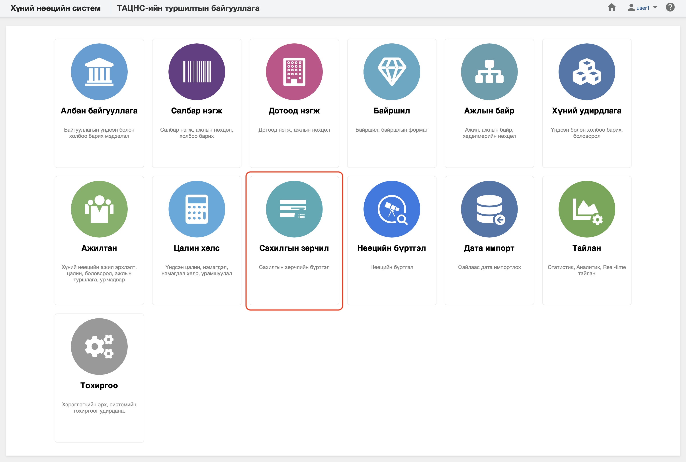

<h1 align="center">Сахилгын зөрчил модуль</h1>

Байгууллага нь сахилгын зөрчлийг бүртгэх, мэдээллийг өөрчлөх, удирдахыг төрийн албаны хүний нөөцийн нэгдсэн системд **сахилгын зөрчил** модулиар зохион байгуулна. 
 

Төрийн албаны хүний нөөцийн нэгдсэн системийн сахилгын зөрчил модуль нь дараах хэсгээс бүрдэнэ.

Үүнд:

- [Хянах самбар](disciplinaries/dashboard.md)
- [Жагсаалт, хайлт](disciplinaries/list.md)
- [Тайлан](disciplinaries/report.md)
- [Үйлдэл](disciplinaries/action.md)
