<h1 align="center">Системтэй хэрхэн ажиллах вэ?</h1>

Төрийн албаны хүний нөөцийн нэгдсэн системтэй ажиллахдаа дараах ойлголтуудыг мэдэх шаардлагатай. 

**Үүнд:**
- [Системтэй ажиллах дараалал](how-it-works.md?id=Системтэй-ажиллах-дараалал)
- [🏠 Системийн нүүр хуудастай ажиллах](how-it-works.md?id=🏠-Системийн-нүүр-хуудастай-ажиллах)
- [🔍 Модулийн нүүр хуудастай ажиллах](how-it-works.md?id=🔍-Модулийн-нүүр-хуудастай-ажиллах)
- [📋 Үйлдэл хийх цонхтой ажиллах](how-it-works.md?id=📋-Үйлдэл-хийх-цонхтой-ажиллах)

## Системтэй ажиллах дараалал

Төрийн албаны хүний нөөцийн нэгдсэн системд хэрэглэгчийн нэр, нууц үгийг ашиглан нэвтэрсний дараа эдгээр энгийн 3 алхмын дагуу модультай ажиллана.

- 🏠 Системийн нүүр хуудас
- 🔍 Модулийн нүүр хуудас
- 📋 Үйлдэл хийх цонх

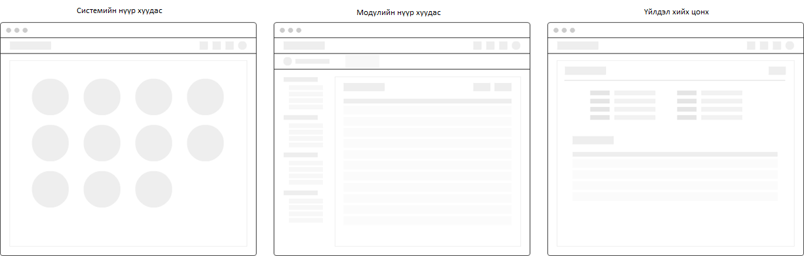

- 🏠 Системийн нүүр хуудас

Нүүр хуудас нь үйл ажиллагааны чиглэлийг бүлэглэсэн системийн модуль сонгох цэсүүдээс бүрдэнэ. 
Жишээ нь албан байгууллага, салбар нэгж, дотоод нэгж, ажлын байр, ажилтан, цалин хөлс,... гэх мэт.

- 🔍 Модулийн нүүр хуудас

Ерөнхий цэс дээр дарахад тухайн үйл ажиллагааны чиглэлээр системд бүртгэсэн мэдээллийг жагсаалт хэлбэрээр харуулна. Мөн жагсаалтаас олон төрлийн нөхцлөөр хялбар, нарийвчилсан хайлт хийх боломжтой.

- 📋 Үйлдэл хийх цонх

Жагсаалтын цонхноос хийх үйлдлийг сонгосноор тухайн үйлдлийн дэлгэрэнгүй цонх руу шилжинэ. 
Үйлдэл нь шинэ бүртгэл хийх, мэдээллийн өөрчлөлт хийх,... зэрэг олон төрлийнх байх ба тухайн үйлдлээс хамаарч ажиллах цонх өөр өөр гарч ирнэ. 

## 🏠 Системийн нүүр хуудастай ажиллах

Системийн нүүр хуудас дараах бүтэцтэй байна.

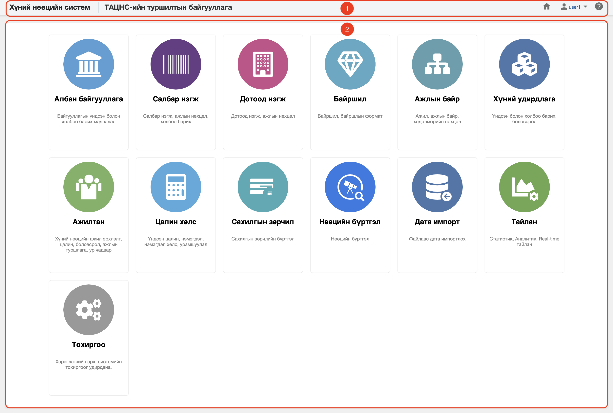

**Тайлбар:**

- [1. Системийн толгойн мэдээлэл](how-it-works.md?id=_1-Системийн-толгойн-мэдээлэл)
- [2. Системийн ажлын талбар](how-it-works.md?id=_2-Системийн-ажлын-талбар)
- [3. Системийн хөлний мэдээлэл](how-it-works.md?id=_3-Системийн-хөлний-мэдээлэл)

### 1. Системийн толгойн мэдээлэл

**Системийн толгойн мэдээлэл** нь системийн нэр, нэвтэрсэн хэрэглэгчийн байгууллагын нэр, нүүр хуудасруу үсрэх үйлдэл, нэвтэрсэн хэрэглэгчийн цэс болон онлайн тусламжийн системрүү шилжих үйлдэл зэргээс тогтоно.

**Тайлбар:**

- **1. Системийн нэр**
    > Төрийн албаны хүний нөөцийн нэгдсэн системийн нэр байна.
- **2. Байгууллагын нэр**
    > Системд нэвтэрсэн хэрэглэгчийн байгууллагын нэр байна.
- **3. Нүүр хуудасруу шилжих үйлдэл**
    > Ямар ч үйлдэл хийх цонхруу орсон байсан ч 🏠үйлдэл нь нүүр хуудасруу шилжүүлнэ.
- **4. Системд нэвтэрсэн хэрэглэгчийн нэр, хэрэглэгчийн цэс**
    > Системд нэвтэрсэн хэрэглэгчийн нэр байх ба энэ хэсэг дээр дарахад хэрэглэгчийн цэс гарч ирнэ. Хэрэглэгчийн цэснээс [системээс гарах](how-it-works.md?id=_1-Системийн-толгойн-мэдээлэл), [хэрэглэгчийн тохиргоо](how-it-works.md?id=_1-Системийн-толгойн-мэдээлэл),... зэрэг үйлдлүүд хийж болно.
- **5. Системийн онлайн тусламжруу шилжих үйлдэл**
    > [Онлайн тусламжийн систем](https://hemis.edu.mn/help/)-рүү шилжих үйлдэл хийнэ.

### 2. Системийн ажлын талбар

**Системийн ажлын талбар** хэсэгт тухайн сонгогдсон цэсний ажиллах талбарыг харуулах ба хэрэв нүүр хуудас сонгогдсон бол модуль сонгох цэс гарч ирнэ.

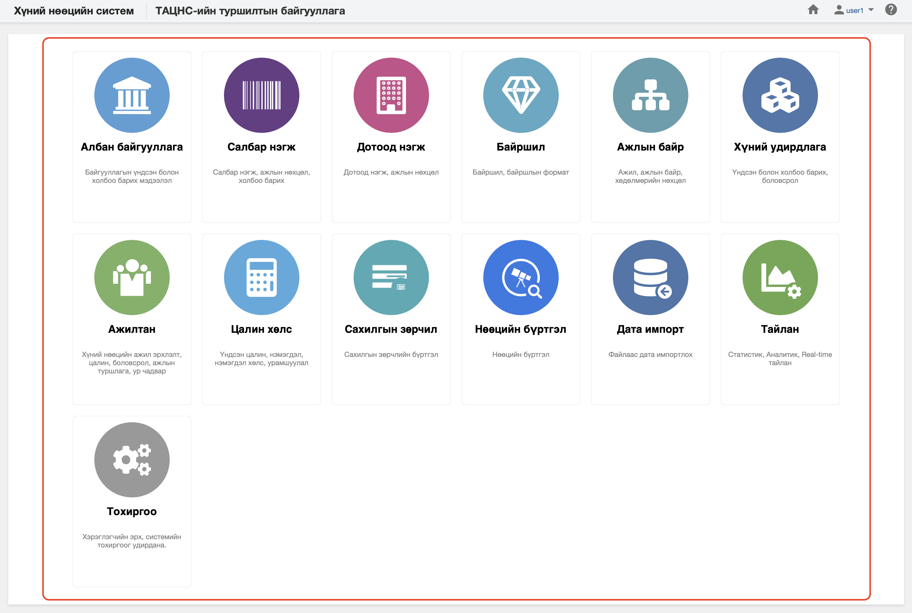

**Тайлбар:**

- **1. Модуль сонгох цэс**
    > Манай байгууллага, Салбар нэгж, Дотоод нэгж, Ажилтан,... зэрэг системийн модуль сонгох цэс байна.

### 3. Системийн хөлний мэдээлэл

**Системийн хөлний мэдээлэл** хэсэгт системийн оюуны өмчийн мэдээллийг харуулна.

**Тайлбар:**

- **1. Оюуны өмчийн мэдээлэл**
    > Төрийн албаны хүний нөөцийн нэгдсэн системийн оюуны өмчийн мэдээлэл байна.

## 🔍 Модулийн нүүр хуудастай ажиллах

Модулийн нүүр хуудас дараах бүтэцтэй байна.

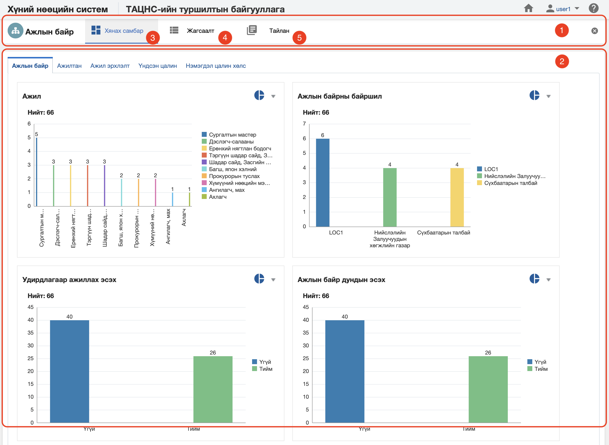

**Тайлбар:**

- [1. Модулийн толгойн мэдээлэл](how-it-works.md?id=_1-Модулийн-толгойн-мэдээлэл)
- [2. Модулийн ажлын талбар](how-it-works.md?id=_2-Модулийн-ажлын-талбар)
- [3. Жагсаалт, хайлттай ажиллах](how-it-works.md?id=_3-Жагсаалт-хайлттай-ажиллах)
- [4. Хянах самбартай ажиллах](how-it-works.md?id=_4-Хянах-самбартай-ажиллах)
- [5. Тайлантай ажиллах](how-it-works.md?id=_5-Тайлантай-ажиллах)

### 1. Модулийн толгойн мэдээлэл

**Модулийн толгойн мэдээлэл** нь модулийн нэр, модулийн дэд хэсэг болон модуль хаах үйлдэл зэргээс тогтоно.

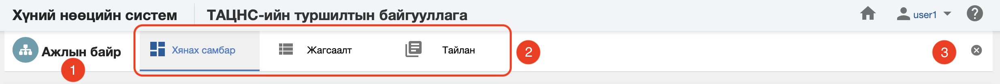

**Тайлбар:**

- **1. Модулийн нэр**
    > Системийн сонгогдсон модулийн нэр байна.
- **2. Модулийн дэд хэсэг**
    > Тухайн модуль нь хэд хэдэн дэд хэсгээс бүрдэх ба ихэвчлэн хянах самбар, жагсаалт, тайлан... зэрэг хэсгээс бүрдэнэ.
- **3. Модуль хаах үйлдэл**
    > Энэ үйлдэл нь модулийн цонхыг хааж нүүр хуудасруу шилжүүлнэ.

### 2. Модулийн ажлын талбар

**Модулийн ажлын талбар** нь модулийн дэд хэсэгт ямар дэд хэсэг сонгогдсон байхаас хамаарч тухайн дэд хэсгийн ажиллах талбарыг гаргана.

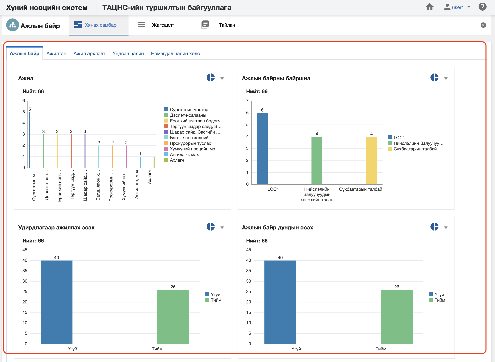

> Хэрэв модулийн дэд хэсгээс жагсаалт сонгосон бол ажлын талбар хэсэгт тухайн модулийн жагсаалтыг, эсвэл хянах самбар сонгосон бол хянах самбартай ажиллах талбарыг тус тус харуулна.

### 3. Жагсаалт, хайлттай ажиллах

**Жагсаалт, хайлттай ажиллах** хэсэгт мэдээллийг оновчтой хайх, нарийвчилан шүүх болон тухайн мэдээлэл дээр үйлдэл хийх боломжийг олгоно.

Жагсаалт, хайлтын цонх нь дараах бүтэцтэй байна.

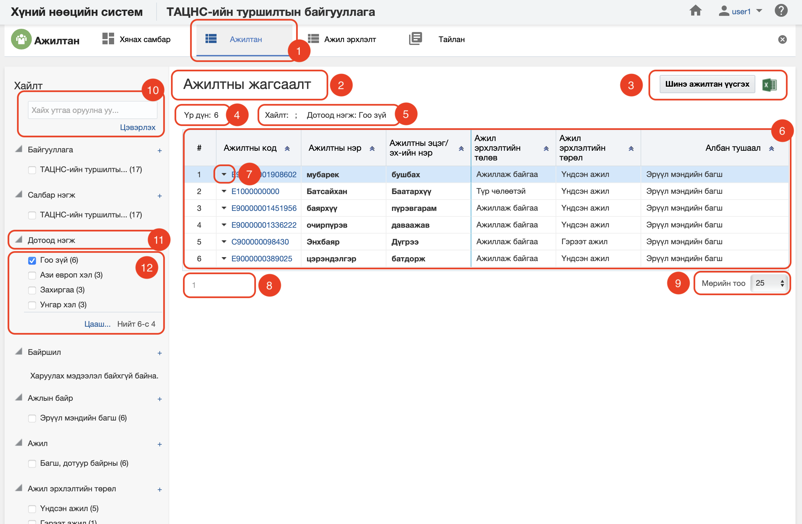

**Тайлбар:**

- **1. Жагсаалт таб**
    > Модулийн нүүр хуудсанаас жагсаалт табыг сонгох.

- **2. Жагсаалтны нэр**
    > Тухайн жагсаалт юуны жагсаалт вэ гэдгийг тодорхойлох жагсаалтын нэр

- **3. Ерөнхий үйлдэл**
    > Тухайн модулийн ерөнхий хийх үйлдлүүд, цэс байна.

- **4. Үр дүн**
    > Хайлтаар хичнээн үр дүн гарч байгааг илэрхийлнэ.

- **5. Хайлт, шүүлтийн мэдээлэл**
    > Нарийвчилсан хайлт дээр ямар шүүлт хийсэн байгааг харуулна.

- **6. Жагсаалт**
    > Хайлтаас гарч ирэх үр дүнг харуулах хэсэг

- **7. Жагсаалт дээрх үйлдэл**
    > Тухайн жагсаалтын мөр дээр хийгдэх үйлдлийн цэс гарч ирнэ.

- **8. Хуудаслалт**
    > Хайлтын үр дүнг хуудаслан харуулах бөгөөд хэдэн мөрөөр хуудаслахыг мөрийн тоо хэсгээс харна уу.

- **9. Мөрийн тоо**
    > Хайлтын үр дүнг нэг дэлгэцэн дээр хичнээн мөр бичлэгийг харуулах тоог заана.

- **10. Түлхүүр үгээр хайх**
    > Жагсаалт дээр түлхүүр үгээр хайх хэсэг

- **11. Нарийвчилсан хайлтын төрөл**
    > Хайлтыг илүү нарийвчилан хайхад энэ хэсгийг ашиглана.

- **12. Нарийвчилсан хайлтын сонголт**
    > Хайлтыг илүү нарийвчилан хайх сонголтууд байх бөгөөд тухайн сонголтыг сонгосноор үр дүнг нарийвчилан тогтоох боломжтой.

### 4. Хянах самбартай ажиллах

**Хянах самбар** нь тухайн модулийн мэдээлэл дээр хяналт, шинжилгээ хийх боломжийг олгох ба **real-time** байна.

Хянах самбар нь дараах бүтэцтэй байна.

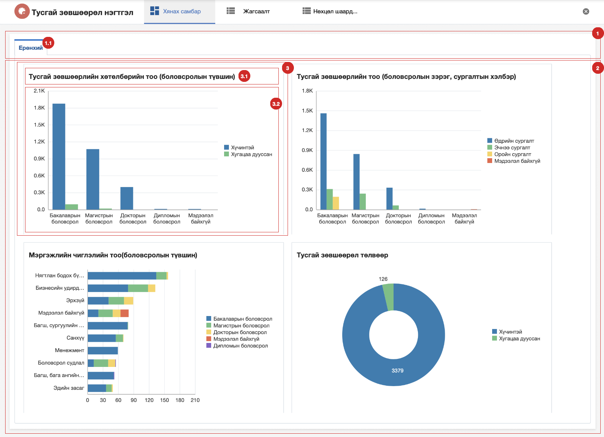

**Тайлбар:**

- **1. Хянах самбарын толгойн мэдээлэл**
    > Хянах самбар нь агуулгаасаа хамаарч нэг болон хэдэн хуудсаас бүрдэнэ.
    - **1.1 Хянах самбарын хуудас сонгох хэсэг**
- **2. Хянах самбарын хуудасны мэдээлэл**
    > Сонгогдсон хуудас нь хэд хэдэн **анализ**ийг агуулах ба тухайн хуудас дээрх бүх анализ дээр зэрэг шүүлт хийх боломжтой байна.
- **3. Анализ**
    > Мэдээлэл дээр ойлгомжтой графикаар хяналт, шинжилгээ хийх боломжийг олгоно. Анализ нь нэр, төрлөөс хамаарч харагдах байдал нь өөр өөр байна.
    - **3.1 Анализын нэр**
    - **3.2 Анализын график**

### 5. Тайлантай ажиллах

**Тайлан** нь тухайн модулийн мэдээлэл дээр дэлгэрэнгүй комплекс анализ хийх боломжийг олгох ба цаг хугацааны давтамжтай мэдээлэл хадгалах дата агуулахтай холбогдож ажиллана.

Тайлантай ажиллахад дараах ойлголтуудыг мэдэх шаардлагатай. Үүнд:

- Тайлангийн зохион байгуулалт
- Тайлангийн бүтэц

#### Тайлангийн зохион байгуулалт

Тайлангийн зохион байгуулалт дараах бүтэцтэй байна.

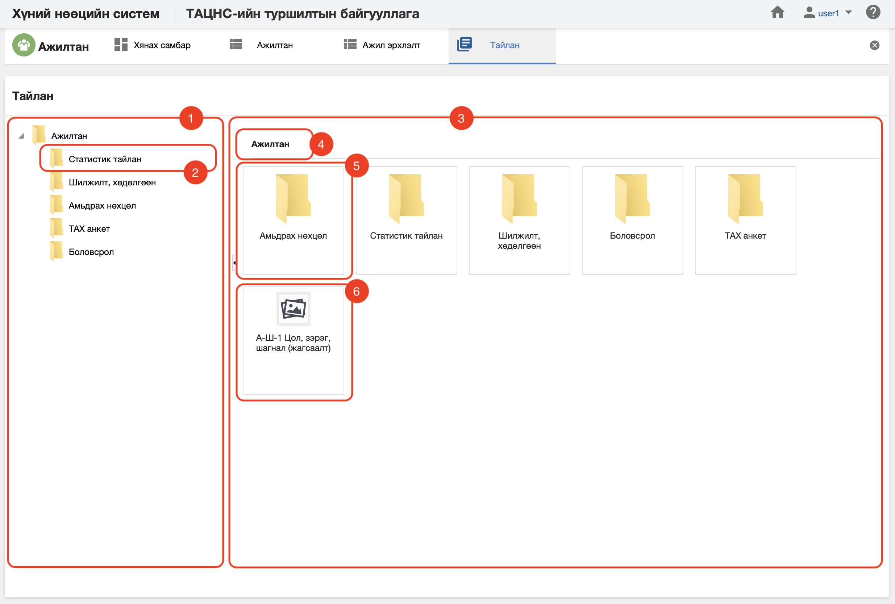

**Тайлбар:**

- **1. Тайлангийн каталогийн хиерархи**
    > Тайлан заавал нэг каталогт хамаарах ба нэг каталог нь нөгөө каталогтоо хиерахи байдлаар харъяалагдаж болно.

- **2. Дэд каталог**
    > Тайлан заавал нэг каталогт хамаарах ба нэг каталог нь нөгөө каталогтоо хиерахи байдлаар харъяалагдаж болно.

- **3. Сонгогдсон каталогийн мэдээлэл**
    > Тухайн сонгогдсон каталогиос хамаарч энэ хэсэгт харъяалагдах тайлан болон дэд каталогиудыг харуулна.

- **4. Сонгогдсон каталогийн нэр**
    > Сонгогдсон каталогийн нэр байна.

- **5. Дэд каталогууд**
    > Сонгогдсон каталогит хамаарах дэд каталоги байх ба тухайн каталог дээр дарвал түүний доторх мэдээлэлрүү үсэрнэ.

- **6. Харьяалагдах тайлан**
    > Сонгогдсон каталогит хамаарах тайлан байх ба тухайн тайлан дээр дарвал тайлангийн дэлгэрэнгүй мэдээллийн цонхруу үсэрнэ.

#### Тайлангийн бүтэц

Тайлангийн зохион байгуулалтын хэсгээс тайланг сонгоход дараах цонх харагдана.

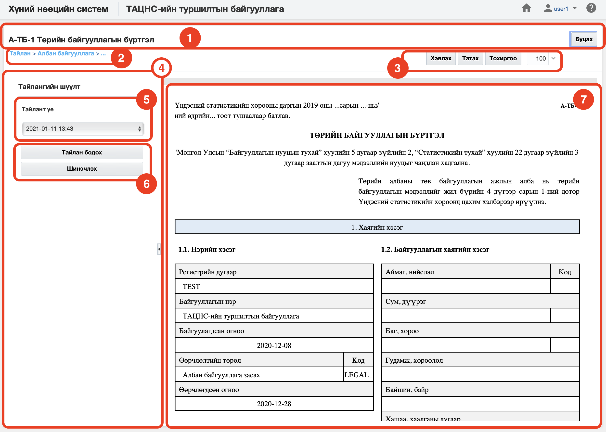

**Тайлбар:**

- **1. Тайлангийн толгойн мэдээлэл**
    > Сонгогдсон тайлангийн нэр болон буцах товчлуур байх ба буцах товчлуур дээр дарахад өмнөх хуудасруу шилжинэ.
- **2. Тайлангийн дэд мэдээлэл**
    > Тухайн тайлангийн байршлын мэдээлэл болон хэвлэх, татаж авах, тохиргоо хийх,... зэрэг тайлан дээр хийгдэх үйлдлүүдийг агуулна.
    - **2. Тайлангийн байршил**
    - **3. Тайлан дээр хийх үйлдэл**
- **4. Тайлангийн шүүлт**
    > Тайлангийн мэдээллийг харуулахдаа тухайн тайлангаас хамаарсан нэмэлт хайлт, шүүлт хийх боломжтой. Шүүлт хийсний дараа **Тайлан бодох** товчлуур дээр дарж тайлангаа бодуулна. Хэрэв хайлт болон шүүлтээ арилгах бол **шинэчлэх** товчлуур дээр дарна
    - **5. Шүүлтийн төрөл, шүүлт хийх утга**
    - **6. Тайлан бодох болон Шинэчлэх үйлдэл**
- **7. Тайлан**

## 📋 Үйлдэл хийх цонхтой ажиллах

Үйлдэл хийх цонхыг тухайн модулийн жагсаалтнаас сонгож хийнэ. 
> [Жагсаалт, хайлттай ажиллах](how-it-works.md?id=_3-Жагсаалт-хайлттай-ажиллах) хэсгийн **7. Жагсаалт дээр хийх үйлдлүүд** болон **3. Үйлдэл хийх ерөнхий цэс** хэсгийг харна уу.

Үйлдэл хийх цонхны дараах бүтэцтэй байна.

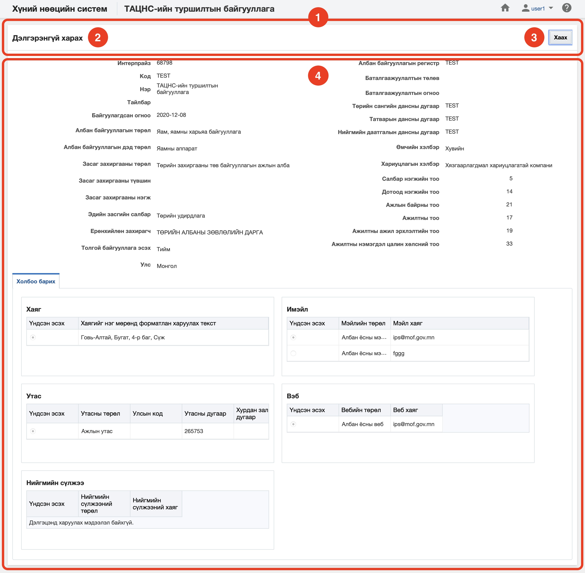

**Тайлбар:**

- **1. Үйлдлийн цонхны толгойн мэдээлэл**
    > Үйлдэл хийх цонх нь тухайн үйлдлээс хамаарч өөр өөр байна.
- **2. Үйлдлийн цонхны нэр**
- **3. Цонхон дээр хийх нэмэлт үйлдлүүд**
- **4. Үйлдлийн агуулга**
    > Үйлдлийн агуулга нь тухайн үйлдлээс хамаарч өөр өөр байна.

