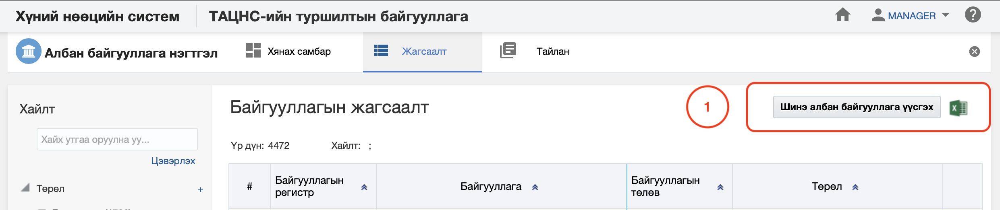
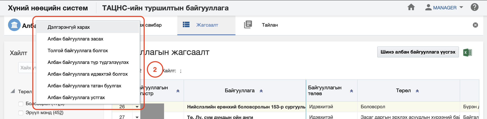
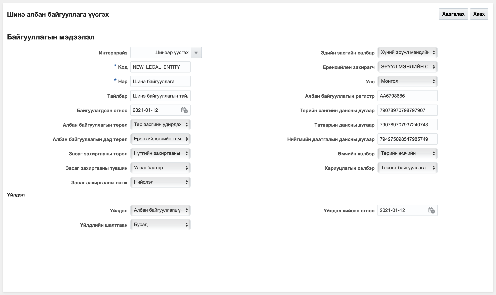
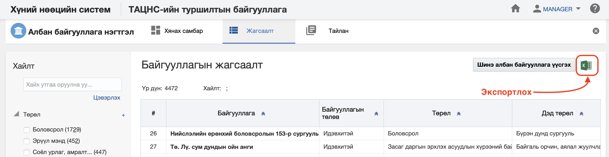
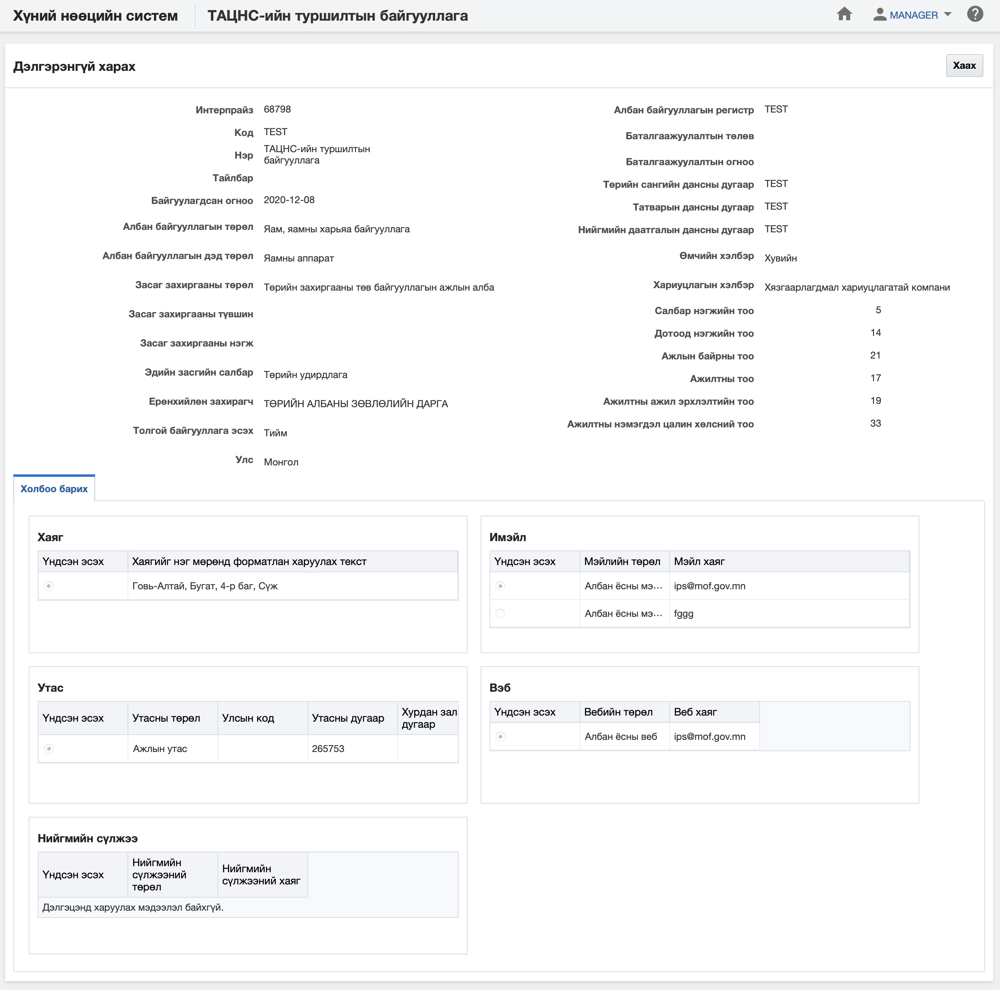
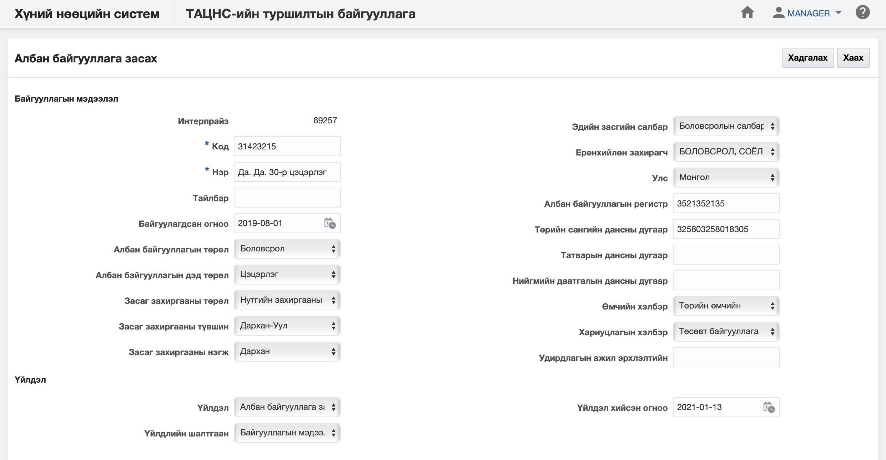
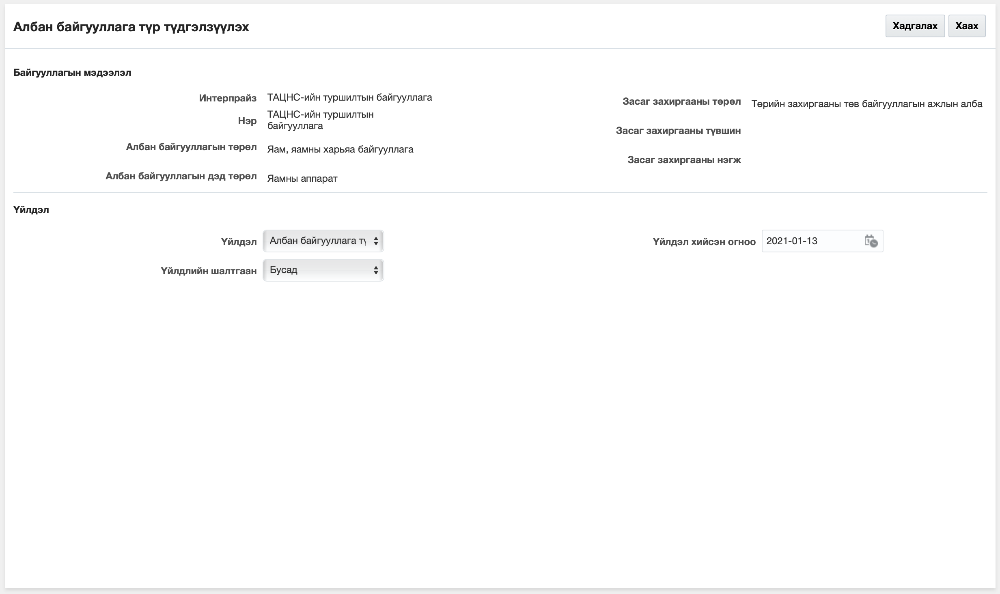
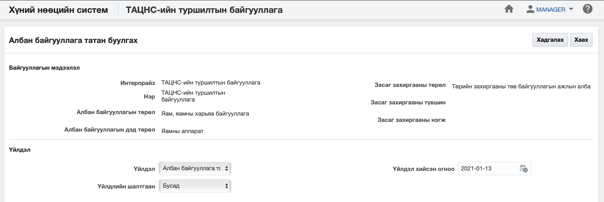
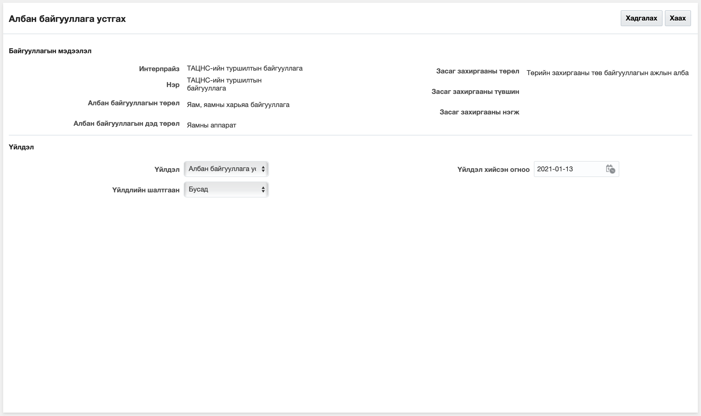

<h1 align="center">Албан байгууллага модуль дээр хийх үйлдэл</h1>

Албан байгууллагын мэдээллийн өөрчлөлт, түр түдгэлзүүлэх, татан буулгах, устгах... зэрэг үйлдлүүдийг тухайн хэрэглэгчид зөвшөөрөгдсөн эрхийн дагуу хийж болно.

## Үйлдэл хийх арга зам
Үйлдлийг хийхдээ жагсаалт цонхноос 2 төрлийн арга замаар хийнэ.

- ### 1. Ерөнхий цэс

  Жагсаалтын цонхны баруун дээд буланд байршина.

  

- ### 2. Контекст цэс

  Жагсаалтын цонхны үр дүн харуулах хэсэгт жижиг сум хэлбэртэй цэсийг контекст цэс гэнэ.

  

## Албан байгууллага модульд хийх үйлдлүүд
Албан байгууллага модуль дээр дараах үйлдлүүдийг хийж болно.

**Үүнд:**

- [Шинэ албан байгууллага үүсгэх](legal_entities/action.md?id=Шинэ-албан-байгууллага-үүсгэх)
- [Жагсаалт экспортлох](legal_entities/action.md?id=Жагсаалт-экспортлох)
- [Байгууллагын профайль](legal_entities/action.md?id=Байгууллагын-профайль)
- [Албан байгууллагын мэдээлэл засах](legal_entities/action.md?id=Албан-байгууллагын-мэдээлэл-засах)
- [Толгой байгууллага болгох](legal_entities/action.md?id=Толгой-байгууллага-болгох)
- [Албан байгууллага түр түдгэлзүүлэх](legal_entities/action.md?id=Албан-байгууллага-түр-түдгэлзүүлэх)
- [Албан байгууллага идэвхтэй болгох](legal_entities/action.md?id=Албан-байгууллага-идэвхтэй-болгох)
- [Албан байгууллага татан буулгах](legal_entities/action.md?id=Албан-байгууллага-татан-буулгах)
- [Албан байгууллага устгах](legal_entities/action.md?id=Албан-байгууллага-устгах)

### Шинэ албан байгууллага үүсгэх

**Шинэ албан байгууллага үүсгэх** үйлдэл нь шинэ албан байгууллага мэдээллийн санд нэмэх үйлдэл юм.

#### Үйлдлийн өмнөх нөхцөл
  Энэхүү үйлдлийг хийхээс өмнө ямар нөхцөл бүрдсэн байхыг энэ хэсэгт жагсаалтаар зааж байна. Үүнд:
  - Албан байгууллагыг хуулийн этгээдийн улсын бүртгэлд бүртгүүлсэн байх
  - Харъяа дүүргийн татварын газарт бүртгүүлсэн байх
  - Төрийн албаны зөвлөлийн баталсан албан байгууллагын бүртгэлийн жагсаалтад бүртгүүлсэн байх

#### Үйлдлийн нөлөөлөл
  Энэхүү үйлдлийг хийх үед бусад мэдээлэлд хэрхэн нөлөөлөх нөлөөллийг заана. Үүнд:
  - Албан байгууллагын хянах самбарын график тоон мэдээлэл өөрчлөгдөнө.
  - Албан байгууллагын жагсаалтад шинэ бичлэг нэмэгдэнэ.
  - Албан байгууллагын тайлангийн тоон мэдээлэл өөрчлөгдөнө.

### Жагсаалт экспортлох

**Жагсаалт экспортлох** үйлдэл нь хайлт шүүлтийн үр дүнг майкрософт эксел файлаар экспортлон авах үйлдэл юм.

#### Үйлдлийн өмнөх нөхцөл
  Энэхүү үйлдлийг хийхээс өмнө ямар нөхцөл бүрдсэн байхыг энэ хэсэгт жагсаалтаар зааж байна. Үүнд:
  - Экспортлох мэдээллээ зөв шүүсэн эсэхээ шалгах

#### Үйлдлийн нөлөөлөл
  Энэхүү үйлдлийг хийх үед бусад мэдээлэлд хэрхэн нөлөөлөх нөлөөллийг заана. Үүнд:
  - Систем дээр ямар нэгэн нөлөөлөл байхгүй байна

### Байгууллагын профайль

**Байгууллагын профайль** үйлдэл нь тухайн сонгосон албан байгууллагын мэдээллийг нэг цонхноос авах боломжийг бүрдүүлнэ.

#### Үйлдлийн өмнөх нөхцөл
  Энэхүү үйлдлийг хийхээс өмнө ямар нөхцөл бүрдсэн байхыг энэ хэсэгт жагсаалтаар зааж байна. Үүнд:
  - Зөв албан байгууллага сонгосон эсэхээ шалгах

#### Үйлдлийн нөлөөлөл
  Энэхүү үйлдлийг хийх үед бусад мэдээлэлд хэрхэн нөлөөлөх нөлөөллийг заана. Үүнд:
  - Систем дээр ямар нэгэн нөлөөлөл байхгүй байна

### Албан байгууллагын мэдээлэл засах

**Албан байгууллагын мэдээлэл засах** үйлдэл нь тухайн сонгосон албан байгууллагын мэдээллийг өөрчлөх боломжийг бүрдүүлнэ.

#### Үйлдлийн өмнөх нөхцөл
  Энэхүү үйлдлийг хийхээс өмнө ямар нөхцөл бүрдсэн байхыг энэ хэсэгт жагсаалтаар зааж байна. Үүнд:
  - Зөв албан байгууллага сонгосон эсэхээ шалгах

#### Үйлдлийн нөлөөлөл
  Энэхүү үйлдлийг хийх үед бусад мэдээлэлд хэрхэн нөлөөлөх нөлөөллийг заана. Үүнд:
  - Албан байгууллагын хянах самбарын график тоон мэдээлэл өөрчлөгдөнө.
  - Албан байгууллагын жагсаалтын мэдээлэл өөрчлөгдөнө.
  - Албан байгууллагын тайлангийн тоон мэдээлэл өөрчлөгдөнө.

### Толгой байгууллага болгох

**Толгой байгууллага болгох** үйлдэл нь тухайн сонгосон албан байгууллагыг тухайн энтерпрайзын үндсэн байгууллага болгох үйлдэл юм. Энэ үйлдэл нь тухайн энтерпрайз дээр олон албан байгууллага байх үед ашиглагдах бөгөөд зөвхөн **толгой байгууллага биш** байгууллага дээр хийгдэх боломжтой.

#### Үйлдлийн өмнөх нөхцөл
  Энэхүү үйлдлийг хийхээс өмнө ямар нөхцөл бүрдсэн байхыг энэ хэсэгт жагсаалтаар зааж байна. Үүнд:
  - Зөв албан байгууллага сонгосон эсэхээ шалгах

#### Үйлдлийн нөлөөлөл
  Энэхүү үйлдлийг хийх үед бусад мэдээлэлд хэрхэн нөлөөлөх нөлөөллийг заана. Үүнд:
  - Албан байгууллагын хянах самбарын график тоон мэдээлэл өөрчлөгдөнө.
  - Албан байгууллагын жагсаалтын мэдээлэл өөрчлөгдөнө.
  - Албан байгууллагын тайлангийн тоон мэдээлэл өөрчлөгдөнө.

### Албан байгууллага түр түдгэлзүүлэх

**Албан байгууллага түр түдгэлзүүлэх** үйлдэл нь тухайн сонгосон албан байгууллагын төлөвийг түр түдгэлзүүлсэн төлөвт шилжүүлэх бөгөөд хэрэв байгууллага нь түр түдгэлзүүлсэн төлөвт шилжсэн бол тухайн байгууллага дээр ямар нэгэн үйлдэл хийх боломж түр хаагдана. Энэ үйлдлийг зөвхөн **идэвхтэй төлөвтэй байгууллага** дээр хийх боломжтой.

#### Үйлдлийн өмнөх нөхцөл
  Энэхүү үйлдлийг хийхээс өмнө ямар нөхцөл бүрдсэн байхыг энэ хэсэгт жагсаалтаар зааж байна. Үүнд:
  - Зөв албан байгууллага сонгосон эсэхээ шалгах
  - Сонгосон албан байгууллагын төлөв нь идэвхтэй эсэхийг шалгах

#### Үйлдлийн нөлөөлөл
  Энэхүү үйлдлийг хийх үед бусад мэдээлэлд хэрхэн нөлөөлөх нөлөөллийг заана. Үүнд:
  - Албан байгууллагын хянах самбарын график тоон мэдээлэл өөрчлөгдөнө.
  - Албан байгууллагын жагсаалтын мэдээлэл өөрчлөгдөнө
  - Албан байгууллагын тайлангийн тоон мэдээлэл өөрчлөгдөнө.
  - Салбар нэгжийн өөрчлөх үйлдлүүд хийх боломжгүй болно.
  - Дотоод нэгжийн өөрчлөх үйлдлүүд хийх боломжгүй болно.
  - Ажлын байрны өөрчлөх үйлдлүүд хийх боломжгүй болно.
  - Ажилтан, ажил эрхлэлтийн өөрчлөх үйлдлүүд хийх боломжгүй болно.
  - Цалин хөлсний өөрчлөх үйлдлүүд хийх боломжгүй болно.

### Албан байгууллага идэвхтэй болгох

**Албан байгууллага идэвхтэй болгох** үйлдэл нь тухайн сонгосон албан байгууллагын төлөвийг идэвхтэй төлөвт шилжүүлэх үйлдэл юм. Энэ үйлдэл нь зөвхөн **түр түдгэлзүүлсэн төлөвтэй байгууллага** дээр хийгдэх боломжтой.

#### Үйлдлийн өмнөх нөхцөл
  Энэхүү үйлдлийг хийхээс өмнө ямар нөхцөл бүрдсэн байхыг энэ хэсэгт жагсаалтаар зааж байна. Үүнд:
  - Зөв албан байгууллага сонгосон эсэхээ шалгах
  - Сонгосон албан байгууллагын төлөв түр түдгэлзүүлсэн эсэхийг шалгах

#### Үйлдлийн нөлөөлөл
  Энэхүү үйлдлийг хийх үед бусад мэдээлэлд хэрхэн нөлөөлөх нөлөөллийг заана. Үүнд:
  - Албан байгууллагын хянах самбарын график тоон мэдээлэл өөрчлөгдөнө.
  - Албан байгууллагын жагсаалтад шинэ бичлэг нэмэгдэнэ.
  - Албан байгууллагын тайлангийн тоон мэдээлэл өөрчлөгдөнө.
  - Салбар нэгжийн өөрчлөх үйлдлүүд хийх боломжтой болно.
  - Дотоод нэгжийн өөрчлөх үйлдлүүд хийх боломжтой болно.
  - Ажлын байрны өөрчлөх үйлдлүүд хийх боломжтой болно.
  - Ажилтан, ажил эрхлэлтийн өөрчлөх үйлдлүүд хийх боломжтой болно.
  - Цалин хөлсний өөрчлөх үйлдлүүд хийх боломжтой болно.

### Албан байгууллага татан буулгах

**Албан байгууллага татан буулгах** үйлдэл нь тухайн сонгосон албан байгууллагыг цаашид ашиглахгүйгээр бүр мөсөн хаах шаардлага үүссэн үед ашиглах бөгөөд хэрэв энэ үйлдлийг хийвэл тухайн байгууллагыг татан буугдсан төлөвт шилжүүлнэ. Энэ төлөвт шилжсэн байгууллага дээр ямар нэгэн засах, өөрчлөх үйлдэл хийх боломжгүй бөгөөд системд энэ төлөвөөр архивлан авах үйлдэл юм.

#### Үйлдлийн өмнөх нөхцөл
  Энэхүү үйлдлийг хийхээс өмнө ямар нөхцөл бүрдсэн байхыг энэ хэсэгт жагсаалтаар зааж байна. Үүнд:
  - Зөв албан байгууллага сонгосон эсэхийг шалгах
  - Сонгосон албан байгууллагын төлөв нь идэвхтэй эсвэл түр түдгэлзүүлсэн төлөвт байгаа эсэхийг шалгах
  - Сонгосон албан байгууллагын идэвхтэй ажил эрхлэлт байгаа эсэхийг шалгах
  - Сонгосон албан байгууллагын идэвхтэй ажлын байр байгаа эсэхийг шалгах
  - Сонгосон албан байгууллагын идэвхтэй дотоод нэгж байгаа эсэхийг шалгах
  - Сонгосон албан байгууллагын идэвхтэй салбар нэгж байгаа эсэхийг шалгах

#### Үйлдлийн нөлөөлөл
  Энэхүү үйлдлийг хийх үед бусад мэдээлэлд хэрхэн нөлөөлөх нөлөөллийг заана. Үүнд:
  - Албан байгууллагын хянах самбарын график тоон мэдээлэл өөрчлөгдөнө.
  - Албан байгууллагын жагсаалтын мэдээлэл өөрчлөгдөнө.
  - Албан байгууллагын тайлангийн тоон мэдээлэл өөрчлөгдөнө.
  - Салбар нэгжийн өөрчлөх үйлдлүүд хийх боломжгүй болно.
  - Дотоод нэгжийн өөрчлөх үйлдлүүд хийх боломжгүй болно.
  - Ажлын байрны өөрчлөх үйлдлүүд хийх боломжгүй болно.
  - Ажилтан, ажил эрхлэлтийн өөрчлөх үйлдлүүд хийх боломжгүй болно.
  - Цалин хөлсний өөрчлөх үйлдлүүд хийх боломжгүй болно.

### Албан байгууллага устгах

**Албан байгууллага устгах** үйлдэл нь тухайн сонгосон албан байгууллагыг буруу үүсгэсэн үед ашиглах бөгөөд тухайн байгууллага болон түүнтэй холбоотой бүх мэдээллийг систем дээрээс бүр мөсөн устгах үйлдэл юм. Энэ үйлдлийг хийснээс хойш байгууллагын төлөвийг [энд](legal/delete_policy.md) заагдсан хугацааны турш **устгасан төлөвт** байлгах бөгөөд түүний дараа систем автоматаар устгана.

#### Үйлдлийн өмнөх нөхцөл
  Энэхүү үйлдлийг хийхээс өмнө ямар нөхцөл бүрдсэн байхыг энэ хэсэгт жагсаалтаар зааж байна. Үүнд:
  - Зөв албан байгууллага сонгосон эсэхийг шалгах
  - Сонгосон албан байгууллагын төлөв нь идэвхтэй, түр түдгэлзүүлсэн төлөвт байгаа эсэхийг шалгах
  - Тухайн албан байгууллагыг бусад салбар нэгж, дотоод нэгж, ажлын байр, ажилтан, ажил эрхлэлт, цалин хөлс, сахилгын зөрчил, нөөцийн бүртгэл зэрэг бүртгэлүүдэд ашиглагдсан эсэхийг шалгах

#### Үйлдлийн нөлөөлөл
  Энэхүү үйлдлийг хийх үед бусад мэдээлэлд хэрхэн нөлөөлөх нөлөөллийг заана. Үүнд:
  - Албан байгууллагын хянах самбарын график тоон мэдээлэл өөрчлөгдөнө.
  - Албан байгууллагын жагсаалтын мэдээлэл өөрчлөгдөнө.
  - Албан байгууллагын тайлангийн тоон мэдээлэл өөрчлөгдөнө.
  - Салбар нэгжийн өөрчлөх үйлдлүүд хийх боломжгүй болно.
  - Дотоод нэгжийн өөрчлөх үйлдлүүд хийх боломжгүй болно.
  - Ажлын байрны өөрчлөх үйлдлүүд хийх боломжгүй болно.
  - Ажилтан, ажил эрхлэлтийн өөрчлөх үйлдлүүд хийх боломжгүй болно.
  - Цалин хөлсний өөрчлөх үйлдлүүд хийх боломжгүй болно.
  - Тухайн албан байгууллагыг ашигласан бүх мэдээлэл устана.

