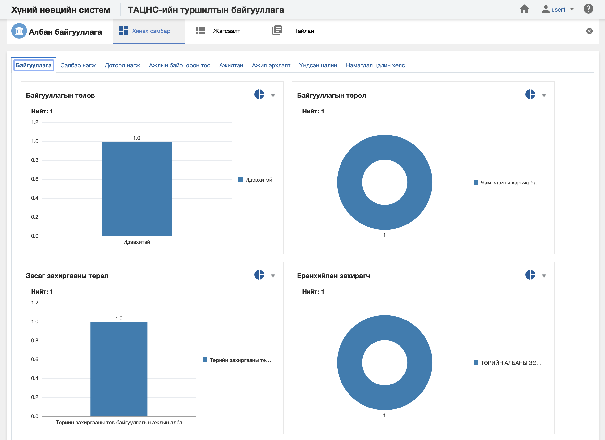

<h1 align="center">Албан байгууллага моудлийн хянах самбар</h1>

**Албан байгууллага модулийн хянах самбар** нь тухайн байгууллагын бодит цаг хугацааны мэдээлэл дээр хяналт, шинжилгээ хийх боломжийг олгоно.

> Хянах самбартай ажиллах талаар ерөнхий ойлголтыг [хянах самбартай ажиллах](how-it-works?id=_4-Хянах-самбартай-ажиллах) хэсгээс харна уу.

 

**Албан байгууллага модулийн хянах самбар нь дараах таб анализуудаас бүрдэнэ.** 

|Хянах самбарын таб|Тайлбар|
|:-----|:------|
|**Байгууллага**|Албан байгууллагын мэдээллийн анализ|
|**Салбар нэгж**|Албан байгууллагын мэдээлэл болон салбар нэгжийн мэдээллээр кросс анализ хийх|
|**Дотоод нэгж**|Албан байгууллагын мэдээлэл болон дотоод нэгжийн мэдээллээр кросс анализ хийх|
|**Ажлын байр, орон тоо**|Албан байгууллагын мэдээлэл болон ажлын байр, орон тооны мэдээллээр кросс анализ хийх|
|**Ажилтан**|Албан байгууллагын мэдээлэл болон ажилтны мэдээллээр кросс анализ хийх|
|**Ажил эрхлэлт**|Албан байгууллагын мэдээлэл болон ажил эрхлэлтийн мэдээллээр кросс анализ хийх|
|**Үндсэн цалин**|Албан байгууллагын мэдээлэл болон үндсэн цалингийн мэдээллээр кросс анализ хийх|
|**Нэмэгдэл цалин хөлс**|Албан байгууллагын мэдээлэл болон нэмэгдэл цалин хөлсний мэдээллээр кросс анализ хийх|