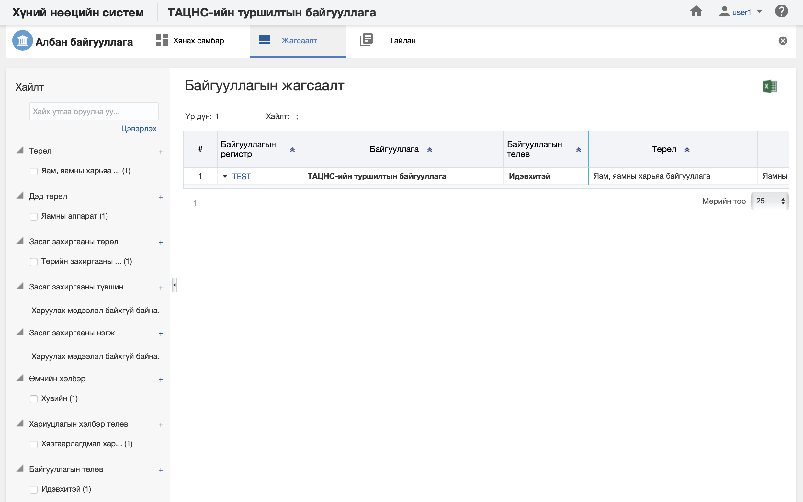
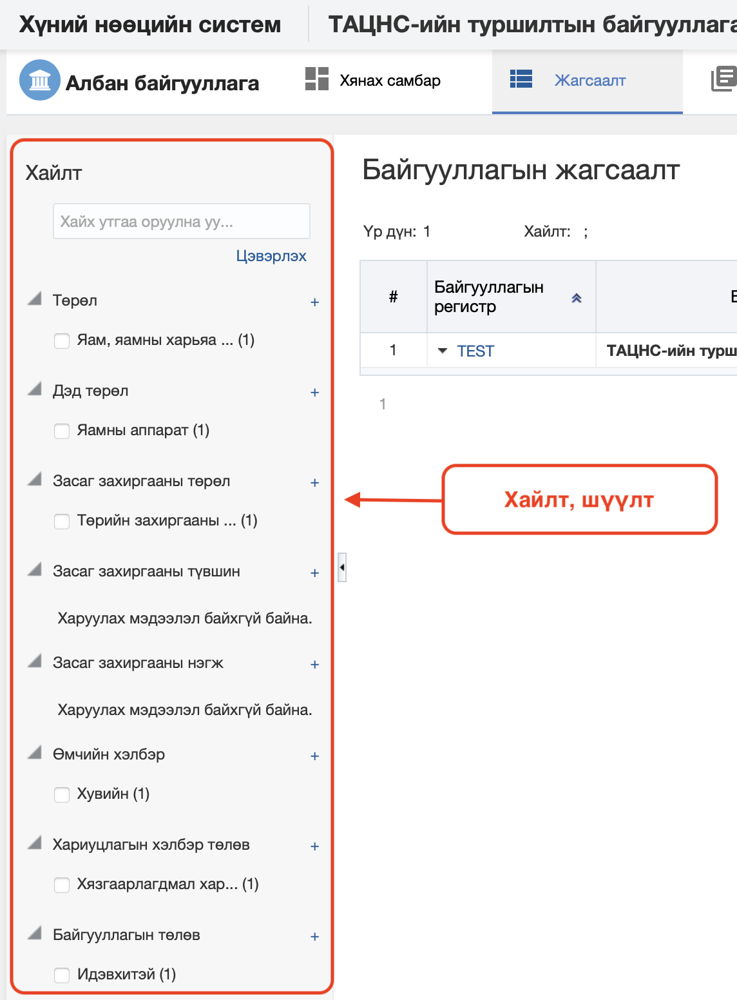
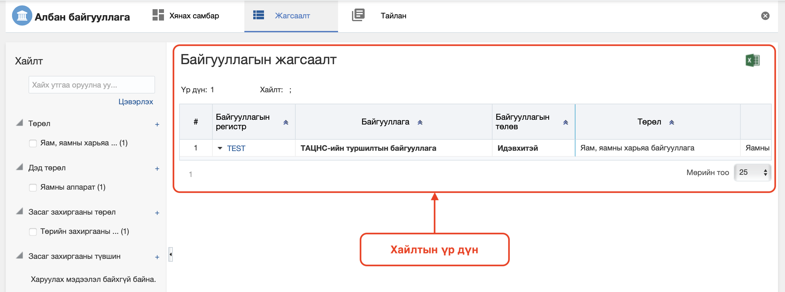

<h1 align="center">Албан байгууллага модулийн жагсаалт, хайлт</h1>

Тухайн энтерпрайзад хамаарах нийт албан байгууллагуудын жагсаалтыг энэ хэсэгт харагдах ба тухайн албан байгууллага дээр хэрэглэгчийн эрх үүргийн дагуу үйлдэл хийх боломжийг олгоно.

> Жагсаалт, хайлттай ажиллах талаар ерөнхий ойлголтыг [жагсаалт, хайлттай ажиллах](how-it-works?id=_3-Жагсаалт-хайлттай-ажиллах) хэсгээс харна уу.

Албан байгууллагын үйлдлүүдийг жагсаалт дээрээс хийнэ.

### Нарийвчилсан хайлт

Албан байгууллагыг дараах төрлүүдээр нарийвчилан хайх боломжтой.

> Дээрх зурганд албан байгууллагын хайлт, шүүлтийн хэсгийг харуулж байна.

#### Нарийвчилсан хайлтын төрөл:

- **Төрөл**
     Албан байгууллагын төрөл

- **Дэд төрөл**
     Албан байгууллагын дэд төрөл. Албан байгууллагын дэд төрөл нь албан байгууллагын төрлөөс шууд хамаарна.

- **Засаг захиргааны төрөл**
     Засаг захиргааны төрөл. Албан байгууллага нь төрийн захиргааны байгууллага, нутгийн захиргааны байгууллага гэсэн засаг захиргааны төрөлтэй байна.

- **Засаг захиргааны түвшин**
     Засаг захиргааны түвшин. Албан байгууллагын засаг захиргааны түвшин нь засаг захиргааны төрлөөс шууд хамаарна.

- **Засаг захиргааны нэгж**
     Засаг захиргааны нэгж. Албан байгууллагын засаг захиргааны нэгж нь засаг захиргааны түвшнөөс шууд хамаарна.

- **Өмчийн хэлбэр**
     Өмчийн хэлбэр. Албан байгууллага нь төрийн өмчийн, хувийн, орон нутгийн өмчийн,... гэх мэт өмчийн хэлбэртэй байна.

- **Хариуцлагын хэлбэр**
     Өмчийн хэлбэр. Албан байгууллага нь хязгаарлагдмал хариуцлагатай компани, улсын төсөвт үйлдвэрийн газар,.. гэх мэт хариуцлагын хэлбэртэй байна.

- **Байгууллагын төлөв**
     Албан байгууллагын төлөв. Албан байгууллага нь идэвхтэй, түр түдгэлзүүлсэн, татан буулгасан,.. гэх мэт төлөвтэй байна.

 

### Жагсаалтын мэдээлэл

Албан байгууллагын хайлтын үр дүнг жагсаалт хэлбэрээр харуулна.

> Дээрх зурганд албан байгууллагын жагсаалтын үр дүнг харуулж байна.

#### Хайлтын үр дүнгийн мэдээлэл:

- **Байгууллагын регистр**
     Албан байгууллагын регистрийн дугаар  
- **Байгууллагын код**
     Албан байгууллагын давхцахгүй код  
- **Байгууллагын нэр**
     Албан байгууллагын нэр  
- **Байгууллагын төлөв**
     Албан байгууллагын төлөв  
- **Байгууллагын төрөл**
     Албан байгууллагын төрөл  
- **Байгууллагын дэд төрөл**
     Албан байгууллагын дэд төрөл  
- **Өмчийн хэлбэр**
     Албан байгууллагын өмчийн хэлбэр  
- **Хариуцлагын хэлбэр**
     Албан байгууллагын хариуцлагын хэлбэр  
- **Төрийн сангийн дансны дугаар**
     Албан байгууллагын төрийн сангийн дансны дугаар  
- **Татварын дансны дугаар**
     Албан байгууллагын татварын дансны дугаар  
- **Нийгмийн даатгалын дансны дугаар**
     Албан байгууллагын нийгмийн даатгалын дансны дугаар  
- **Засаг захиргааны төрөл**
     Албан байгууллагын засаг захиргааны төрөл  
- **Засаг захиргааны түвшин**
     Албан байгууллагын засаг захиргааны түвшин  
- **Засаг захиргааны нэгж**
     Албан байгууллагын засаг захиргааны нэгж  
- **Байгуулагдсан огноо**
     Албан байгууллага байгуулагдсан огноо  
- **Ерөнхийлөн захирагч**
     Албан байгууллагын ерөнхийлөн захирагч  
- **Эдийн засгийн салбар**
     Албан байгууллагын эдийн засгийн салбар  
- **Удирдах ажилтны регистр**
     Албан байгууллагыг удирдах ажилтны регистр  
- **Удирдах ажилтны нэр**
     Албан байгууллагыг удирдах ажилтны нэр  
- **Удирдах ажилны эцэг/эхийн нэр**
     Албан байгууллагыг удирдах ажилтны эцэг/эхийн нэр  
- **Удирдах ажилтны албан тушаал**
     Албан байгууллагыг удирдах ажилтны албан тушаал  
- **Үндсэн утасны дугаар**
     Тухайн албан байгууллагын үндсэнээр сонгосон утасны дугаар  
- **Үндсэн веб хаяг**
     Тухайн албан байгууллагын үндсэнээр сонгосон веб хаяг  
- **Үндсэн хаяг**
     Тухайн албан байгууллагын үндсэнээр сонгосон хаяг  
- **Үндсэн нийгмийн сүлжээ**
     Тухайн албан байгууллагын үндсэнээр сонгосон нийгмийн сүлжээ  
- **Салбар нэгж**
     Тухайн албан байгууллагын салбар нэгжийн тоо  
- **Дотоод нэгж**
     Тухайн албан байгууллагын дотоод нэгжийн тоо  
- **Ажлын байр**
     Тухайн албан байгууллагын ажлын байрны тоо  
- **Ажилтан**
     Тухайн албан байгууллагын ажилтны тоо  
- **Ажилтны ажил эрхлэлт**
     Тухайн албан байгууллагын ажил эрхлэлтийн тоо  
- **Ажилтны нэмэгдэл цалин хөлс**
     Тухайн албан байгууллагын нэмэгдэл цалин хөлсний тоо  
