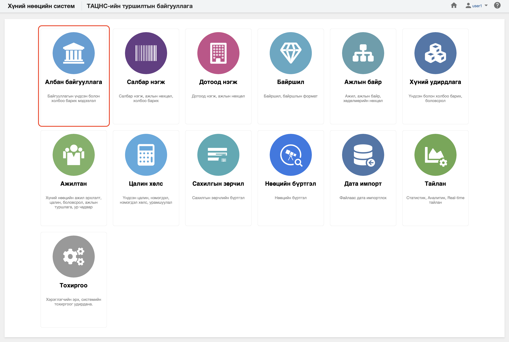

<h1 align="center">Албан байгууллага модуль</h1>

Хуулийн дагуу үйл ажиллагаа явуулах хуулийн этгээдийг төрийн албаны хүний нөөцийн нэгдсэн системд  **албан байгууллага** гэж ойлгоно. 
 

Төрийн албаны хүний нөөцийн нэгдсэн системийн албан байгууллага модуль нь дараах хэсгээс бүрдэнэ.

Үүнд:

- [Хянах самбар](legal_entities/dashboard.md)
- [Жагсаалт, хайлт](legal_entities/list.md)
- [Тайлан](legal_entities/report.md)
- [Үйлдэл](legal_entities/action.md)
