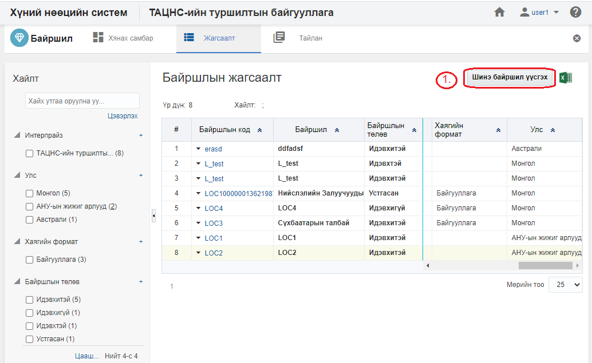
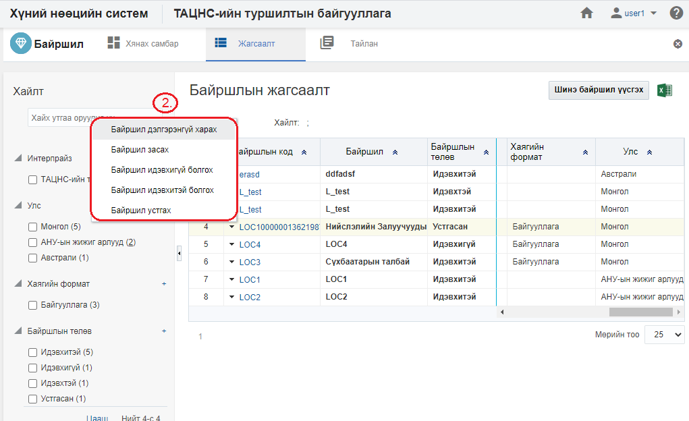
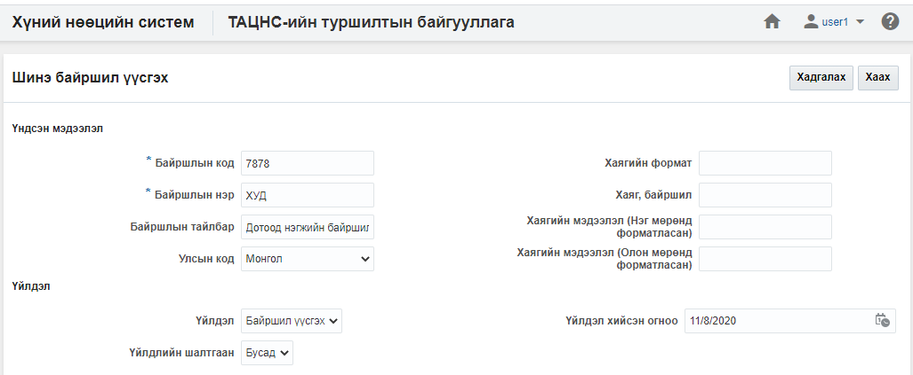
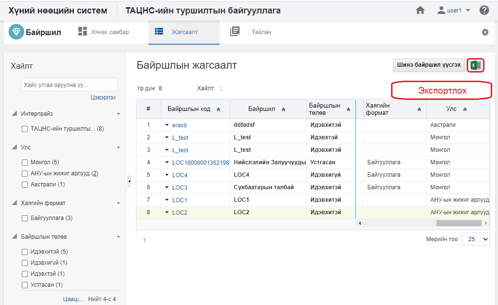
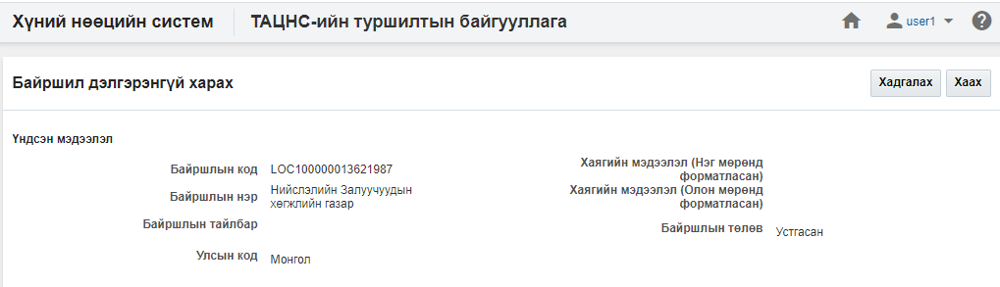
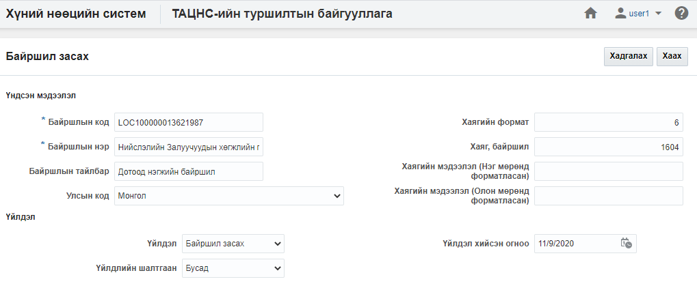
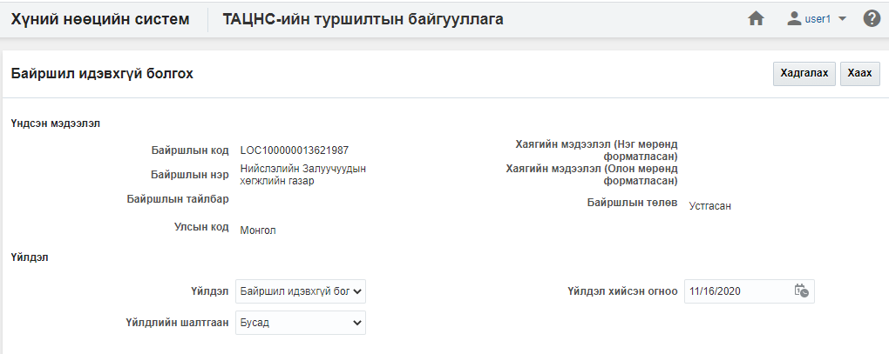
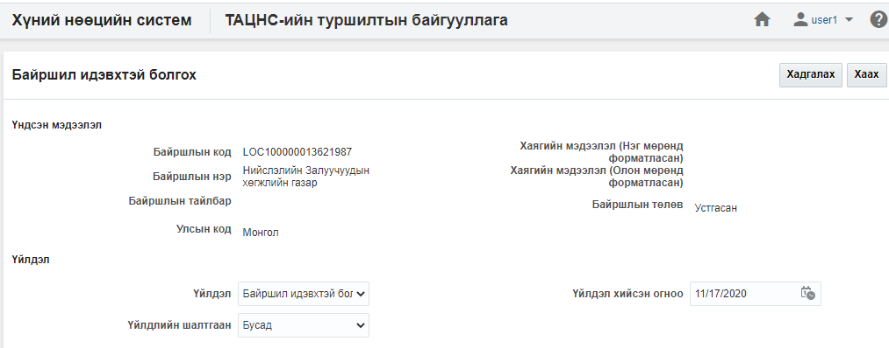
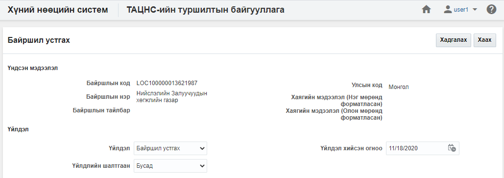

<h1 align="center">Байршил модулийн үйлдэл</h1>

Байршлын мэдээллийн өөрчлөлт, шинээр үүсгэх, идэвхтэй, идэвхгүй болгох, устгах... зэрэг үйлдлүүдийг хэрэглэгчид зөвшөөрөгдсөн эрхийн дагуу хийж болно.

## Үйлдэл хийх арга зам
Үйлдлийг хийхдээ жагсаалт цонхноос 2 төрлийн арга замаар хийнэ.

- ### 1. Ерөнхий цэс

  Жагсаалтын цонхны баруун дээд буланд байршина.

  

- ### 2. Контекст цэс

  Жагсаалтын цонхны үр дүн харуулах хэсэгт мөр дэх жижиг сум хэлбэртэй цэсийг контекст цэс гэнэ.

  

## Байршлын үйлдлүүд
Байршил модуль дээр дараах үйлдлүүдийг хийж болно.

**Үүнд:**

- [Шинэ байршил үүсгэх](Locations/action.md?id=Шинэ-байршил-үүсгэх)
- [Жагсаалт экспортлох](Locations/action.md?id=Жагсаалт-экспортлох)
- [Байршлын профайль](Locations/action.md?id=Байршлын-профайль)
- [Байршил засах](Locations/action.md?id=Байршил-засах)
- [Байршил идэвхгүй болгох](Locations/action.md?id=Байршил-идэвхгүй-болгох)
- [Байршил идэвхтэй болгох](Locations/action.md?id=Байршил-идэвхтэй-болгох)
- [Байршил устгах](Locations/action.md?id=Байршил-устгах)

### Шинэ байршил үүсгэх

**Шинэ байршил үүсгэх** үйлдэл нь байгууллагад шинэ байршил мэдээллийн санд нэмэх үйлдэл юм.

#### Үйлдлийн өмнөх нөхцөл
  Энэхүү үйлдлийг хийхээс өмнө ямар нөхцөл бүрдсэн байхыг энэ хэсэгт жагсаалтаар зааж байна. Үүнд:
  - Байршлыг үүсгэх албан байгууллага, салбар нэгж, дотоод нэгж системд үүссэн байх

#### Үйлдлийн нөлөөлөл
  Энэхүү үйлдлийг хийх үед бусад мэдээлэлд хэрхэн нөлөөлөх нөлөөллийг заана. Үүнд:
  - Байршлын хянах самбарын график тоон мэдээлэл өөрчлөгдөнө.
  - Байршлын жагсаалтад шинэ бичлэг нэмэгдэнэ.
  - Байршлын тайлангийн тоон мэдээлэл өөрчлөгдөнө.

### Жагсаалт экспортлох

**Жагсаалт экспортлох** үйлдэл нь хайлт шүүлтийн үр дүнг майкрософт эксел файлаар экспортлон авах үйлдэл юм.

#### Үйлдлийн өмнөх нөхцөл
  Энэхүү үйлдлийг хийхээс өмнө ямар нөхцөл бүрдсэн байхыг энэ хэсэгт жагсаалтаар зааж байна. Үүнд:
  - Экспортлох мэдээллээ зөв шүүсэн эсэхээ шалгах

#### Үйлдлийн нөлөөлөл
  Энэхүү үйлдлийг хийх үед бусад мэдээлэлд хэрхэн нөлөөлөх нөлөөллийг заана. Үүнд:
  - Систем дээр ямар нэгэн нөлөөлөл байхгүй байна

### Байршлын профайль

**Байршлын профайль** үйлдэл нь тухайн сонгосон байршлын мэдээллийг нэг цонхноос авах боломжийг бүрдүүлнэ.

#### Үйлдлийн өмнөх нөхцөл
  Энэхүү үйлдлийг хийхээс өмнө ямар нөхцөл бүрдсэн байхыг энэ хэсэгт жагсаалтаар зааж байна. Үүнд:
  - Зөв байршил сонгосон эсэхээ шалгах

#### Үйлдлийн нөлөөлөл
  Энэхүү үйлдлийг хийх үед бусад мэдээлэлд хэрхэн нөлөөлөх нөлөөллийг заана. Үүнд:
  - Систем дээр ямар нэгэн нөлөөлөл байхгүй байна

### Байршил засах

**Байршил засах** үйлдэл нь тухайн сонгосон байршлын мэдээллийг өөрчлөх боломжийг бүрдүүлнэ.

#### Үйлдлийн өмнөх нөхцөл
  Энэхүү үйлдлийг хийхээс өмнө ямар нөхцөл бүрдсэн байхыг энэ хэсэгт жагсаалтаар зааж байна. Үүнд:
  - Зөв байршил сонгосон эсэхээ шалгах

#### Үйлдлийн нөлөөлөл
  Энэхүү үйлдлийг хийх үед бусад мэдээлэлд хэрхэн нөлөөлөх нөлөөллийг заана. Үүнд:
  - Байршлын хянах самбарын график тоон мэдээлэл өөрчлөгдөнө.
  - Байршлын жагсаалтын мэдээлэл өөрчлөгдөнө.
  - Байршлын тайлангийн тоон мэдээлэл өөрчлөгдөнө.

### Байршил идэвхгүй болгох

**Байршил идэвхгүй болгох** үйлдэл нь тухайн сонгосон байршлын төлөвийг идэвхгүй болгох төлөвт шилжүүлэх бөгөөд хэрэв байршил нь идэвхгүй төлөвт шилжсэн бол тухайн байршил дээр ямар нэгэн үйлдэл хийх боломж түр хаагдана. Энэ үйлдлийг зөвхөн **идэвхтэй төлөвтэй байршил** дээр хийх боломжтой.

#### Үйлдлийн өмнөх нөхцөл
  Энэхүү үйлдлийг хийхээс өмнө ямар нөхцөл бүрдсэн байхыг энэ хэсэгт жагсаалтаар зааж байна. Үүнд:
  - Зөв байршил сонгосон эсэхээ шалгах
  - Сонгосон байршлын төлөв нь идэвхтэй эсэхийг шалгах

#### Үйлдлийн нөлөөлөл
  Энэхүү үйлдлийг хийх үед бусад мэдээлэлд хэрхэн нөлөөлөх нөлөөллийг заана. Үүнд:
  - Байршлын хянах самбарын график тоон мэдээлэл өөрчлөгдөнө.
  - Байршлын жагсаалтын мэдээлэл өөрчлөгдөнө
  - Байршлын тайлангийн тоон мэдээлэл өөрчлөгдөнө.
  - Байршлын өөрчлөх үйлдлүүд хийх боломжгүй болно.

### Байршил идэвхтэй болгох

**Байршил идэвхтэй болгох** үйлдэл нь тухайн сонгосон байршлын төлөвийг идэвхтэй төлөвт шилжүүлэх үйлдэл юм. Энэ үйлдэл нь зөвхөн **идэвхгүй** төлөв дээр хийгдэх боломжтой.

#### Үйлдлийн өмнөх нөхцөл
  Энэхүү үйлдлийг хийхээс өмнө ямар нөхцөл бүрдсэн байхыг энэ хэсэгт жагсаалтаар зааж байна. Үүнд:
  - Зөв байршил сонгосон эсэхээ шалгах
  - Сонгосон байршлын төлөв идэвхгүй эсэхийг шалгах

#### Үйлдлийн нөлөөлөл
  Энэхүү үйлдлийг хийх үед бусад мэдээлэлд хэрхэн нөлөөлөх нөлөөллийг заана. Үүнд:
  - Байршлын хянах самбарын график тоон мэдээлэл өөрчлөгдөнө.
  - Байршлын жагсаалтад шинэ бичлэг нэмэгдэнэ.
  - Байршлын тайлангийн тоон мэдээлэл өөрчлөгдөнө.
  - Байршлын өөрчлөх үйлдлүүд хийх боломжтой болно.

### Байршил устгах

**Байршил устгах** үйлдэл нь тухайн сонгосон байршлыг буруу үүсгэсэн үед ашиглах бөгөөд тухайн байршил болон түүнтэй холбоотой бүх мэдээллийг систем дээрээс бүр мөсөн устгах үйлдэл юм. Энэ үйлдлийг хийснээс хойш байршлын төлөвийг [энд](legal/delete_policy.md) заагдсан хугацааны турш **устгасан төлөвт** байлгах бөгөөд түүний дараа систем автоматаар устгана.

#### Үйлдлийн өмнөх нөхцөл
  Энэхүү үйлдлийг хийхээс өмнө ямар нөхцөл бүрдсэн байхыг энэ хэсэгт жагсаалтаар зааж байна. Үүнд:
  - Зөв байршил сонгосон эсэхийг шалгах
  - Сонгосон байршлын төлөв нь идэвхтэй, идэвхгүй төлөвт байгаа эсэхийг шалгах
  - Тухайн байршлыг албан байгууллага, салбар нэгж, дотоод нэгж, ажлын байр, ажилтан, ажил эрхлэлт, цалин хөлс, сахилгын зөрчил, нөөцийн бүртгэл зэрэг бүртгэлүүдэд ашиглагдсан эсэхийг шалгах

#### Үйлдлийн нөлөөлөл
  Энэхүү үйлдлийг хийх үед бусад мэдээлэлд хэрхэн нөлөөлөх нөлөөллийг заана. Үүнд:
  - Байршлын хянах самбарын график тоон мэдээлэл өөрчлөгдөнө.
  - Байршлын жагсаалтын мэдээлэл өөрчлөгдөнө.
  - Байршлын тайлангийн тоон мэдээлэл өөрчлөгдөнө.
  - Байршлын өөрчлөх үйлдлүүд хийх боломжгүй болно.
  - Тухайн байршлыг ашигласан бүх мэдээлэл устана.

