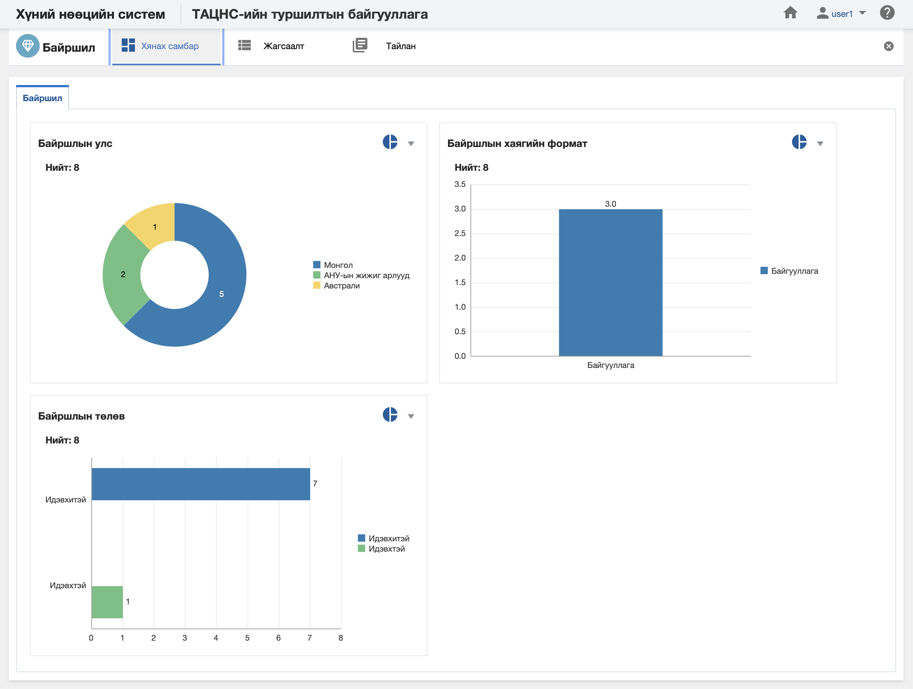

<h1 align="center">Байршил модулийн хянах самбар</h1>

**Байршил модулийн хянах самбар** нь тухайн хэрэглэгчийн харах эрхийн хүрээн дэх мэдээлэл дээр бодит цаг хугацаанд хяналт, шинжилгээ хийх боломжийг олгоно.

> Хянах самбартай ажиллах талаар ерөнхий ойлголтыг [хянах самбартай ажиллах](how-it-works?id=_4-Хянах-самбартай-ажиллах) хэсгээс харна уу.

 

**Байршил модулийн хянах самбар нь дараах таб анализуудаас бүрдэнэ.** 

|Хянах самбарын таб|Тайлбар|
|:-----|:------|
|**Байршил**|Байршлын мэдээллийн анализ|