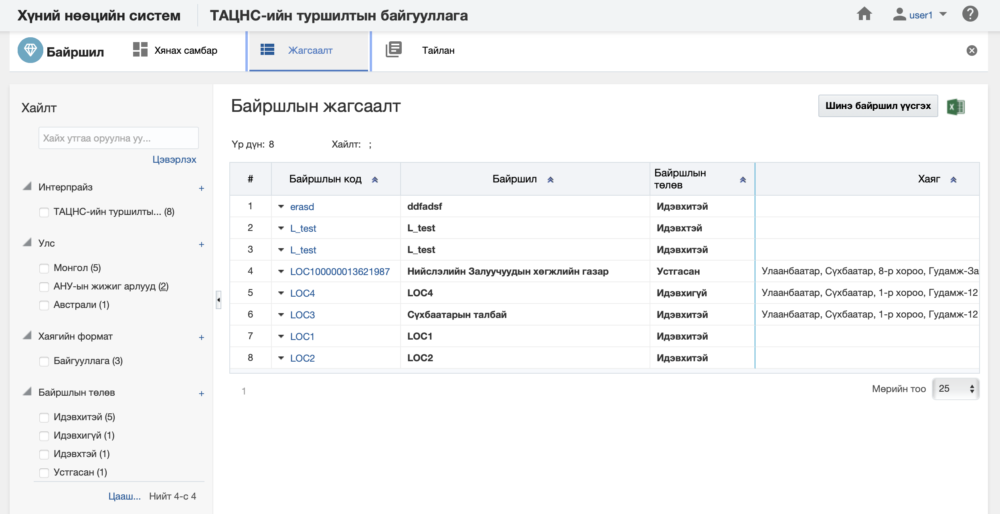
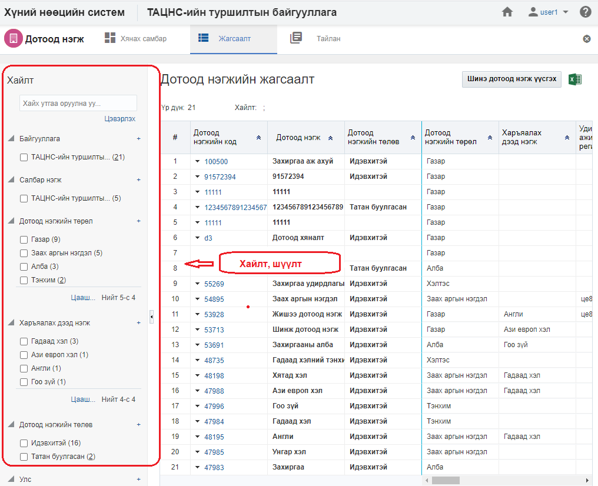
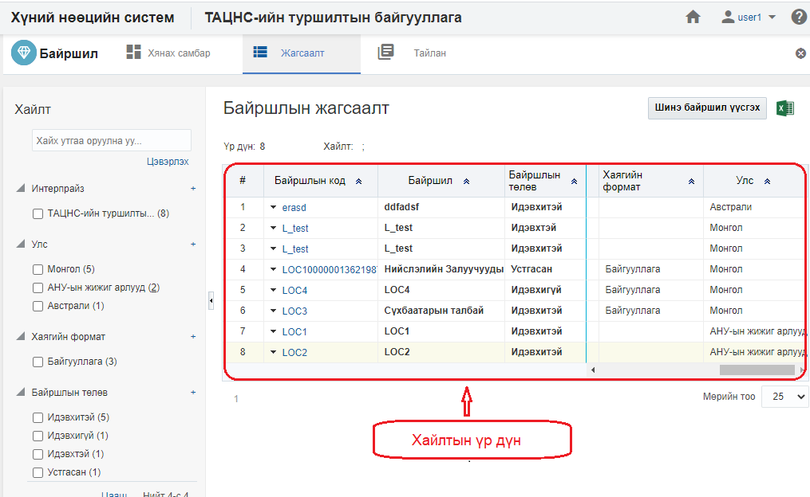

<h1 align="center">Байршил модулийн жагсаалт, хайлт</h1>

Тухайн байгууллагад харьяалах нийт байршлын жагсаалтыг энэ хэсэгт харуулах ба хэрэглэгчийн эрх, үүргийн дагуу үйлдэл хийх боломжийг олгоно.

> Жагсаалт, хайлттай ажиллах талаар ерөнхий ойлголтыг [жагсаалт, хайлттай ажиллах](how-it-works?id=_3-Жагсаалт-хайлттай-ажиллах) хэсгээс харна уу.

Байршлын жагсаалтын энэ хэсэгт үйлдлүүдийг хийнэ.

### Нарийвчилсан хайлт

Байршлыг дараах төрлүүдээр нарийвчилан хайх боломжтой.

> Дээрх зурганд байршлын хайлт, шүүлтийн хэсгийг харуулж байна.

#### Нарийвчилсан хайлтын төрөл:

- **Энтерпрайз**
     Энтерпрайз. Байршлын энтерпрайз. 
- **Улс**
     Улс. Байршлын харьяалах улс 
- **Хаягийн формат**
     Хаягийн формат. Хаягийн форматын төрөл
- **Байршлын төлөв**
     Байршлын төлөв. Байршлын идэвхтэй, идэвхгүй, засах.... гэх мэт

### Жагсаалтын мэдээлэл

Байршлын хайлтын үр дүнг жагсаалт хэлбэрээр харуулна.

> Дээрх зурганд Байршлын жагсаалтын үр дүнг харуулж байна.

#### Хайлтын үр дүнгийн мэдээлэл:

- **Байршлын код**
     Байршлын давхцахгүй код  
- **Байршил**
     Байршлын нэр  
- **Байршлын төлөв**
     Байршлын төлвийн мэдээлэл  
- **Хаяг**
     Хаягийн мэдээлэл  
- **Хаягийн формат**
     Хаягийн форматын мэдээлэл  
- **Улс**
     Улс  
