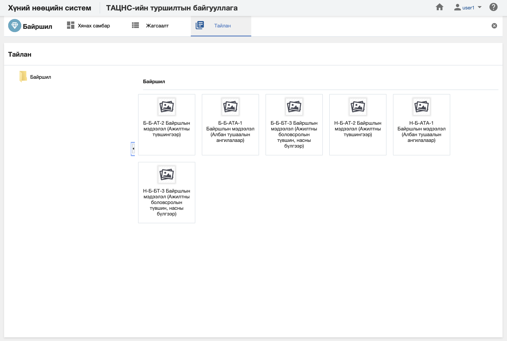

<h1 align="center">Байршил модулийн тайлан</h1>
Албан байгууллагын байршил дэх мэдээлэлд шинжилгээ хийж дата шинжилгээний үр дүнг урьдчилан бэлтгэсэн тайлангуудын загвараар гаргана.

> Тайлантай хэрхэн ажиллах талаар ерөнхий ойлголтыг [тайлантай ажиллах](how-it-works?id=_5-Тайлантай-ажиллах) хэсгээс харна уу.

Байршил модуль дээр дараах тайлангуудыг урьдчилан тодорхойлсон байна.

**Үүнд:**

- **Б-Б-АТ-2 Байршлын мэдээлэл**
   Байгууллагын байршлын мэдээллийг тайлангийн үзүүлэлтээр гаргах тайлан (Ажилтны түвшингээр)  
- **Б-Б-АТА-1 Байршлын мэдээлэл (Албан тушаалын ангилалаар)**
   Байгууллагын байршлын мэдээллийг тайлангийн үзүүлэлтээр гаргах тайлан (Албан тушаалын ангилалар)  
- **Б-Б-БТ-3 Байршлын мэдээлэл**
   Байгууллагын байршлын мэдээллийн тоог тайлангийн үзүүлэлтээр гаргах тайлан (Ажилтны боловсролын түвшин, насны бүлгээр)  
- **Н-Б-АТ-2 Байршлын мэдээлэл (Ажилтны түвшингээр)**
   Байгууллагын байршлын мэдээллийг тайлангийн үзүүлэлтээр гаргах тайлан (Ажилтны түвшингээр)  
- **Н-Б-АТА-1 Байршлын мэдээлэл**
   Байгууллагын байршлын мэдээллийн тоог тайлангийн үзүүлэлтээр гаргах тайлан (Албан тушаалын ангилалаар)  
- **Н-Б-БТ-3 Байршлын мэдээлэл (Ажилтны боловсролын түвшин насны бүлгээр)**
   Байгууллагын байршлын мэдээллийн тоог тайлангийн үзүүлэлтээр гаргах тайлан (Ажилтны боловсролын түвшин, насны бүлгээр)  
