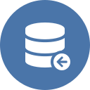

<h1 align="center">Системийн модуль</h1>

Төрийн албаны хүний нөөцийн нэгдсэн систем нь нэгж байгууллага, салбар байгууллага болон нэгтгэлийн түвшний үйл ажиллагааг хялбаршуулсан хүний нөөцийн үндсэн модулиудаас бүрдэнэ.

 

|                           |                       |                                                  |
| ------------------------- | --------------------- | ------------------------------------------------ |
| | **Албан байгууллага** | Албан байгууллагыг байгуулах, өөрчлөн байгуулах, мэдээлэл өөрчлөх, татан буулгах, ... зэрэг үйлдлийг удирдана. Дэлгэрэнгүй мэдээллийг [албан байгууллага](legal_entities/overview.md) хэсгээс харна уу. |
|  | **Салбар нэгж** | Албан байгууллагын салбар нэгж үүсгэх, өөрчлөх, татан буулгах үйлдлийг бүртгэж, удирдана. Дэлгэрэнгүй мэдээллийг [салбар нэгж](business_units/overview.md) хэсгээс харна уу. |
|  | **Дотоод нэгж** | Албан байгууллагын дотоод нэгж үүсгэх, өөрчлөх, татан буулгах үйлдлийг бүртгэж, удирдана. Дэлгэрэнгүй мэдээллийг [дотоод нэгж](departments/overview.md) хэсгээс харна уу. |
|  | **Байршил** | Албан байгууллагын хаяг байршлын мэдээлэл, бүртгэл хийх, өөрчлөх, устгах гэх мэт үйлдлийг удирдана.  Дэлгэрэнгүй мэдээллийг [байршил](locations/overview.md) хэсгээс харна уу. |
|  | **Ажлын байр** | Ажлын байр, орон тоо үүсгэх, өөрчлөх, түдгэлзүүлэх, идэвхгүй болгох, зөөх зэрэг холбоотой үйл ажиллагааг удирдана. Дэлгэрэнгүй мэдээллийг [ажлын байр](positions/overview.md) хэсгээс харна уу. |
|  | **Хүний удирдлага** | Албан байгууллагад бүртгэлтэй хүний мэдээлэл бүртгэх, өөрчлөх, идэвхгүй болгох гэх мэт хүнтэй холбоотой мэдээллийг удирдана. Дэлгэрэнгүй мэдээллийг [хүний удирдлага](grading/overview.md) хэсгээс харна уу. |
|  | **Ажилтан** | Ажилтны ажил эрхлэлт, давхар ажил эрхлэлт, албан тушаал өөрчлөх, ажлын харилцаа цуцлах гэх мэт  мэдээллийг удирдана. Дэлгэрэнгүй мэдээллийг [ажилтан](workers/overview.md) хэсгээс харна уу. |
|  | **Цалин хөлс** | Ажилтны үндсэн болон нэмэгдэл цалин хөлс бүртгэх, өөрчлөх, идэвхгүй болгох, түдгэлзүүлэх, залруулах гэх мэт мэдээлэл удирдана. Дэлгэрэнгүй мэдээллийг [цалин хөлс](salaries/overview.md) хэсгээс харна уу. |
|  | **Сахилгын зөрчил** | Сахилгын зөрчил үүсгэх, засах залруулах, өөрчлөх, цагаатгах, үр дүнг баталгаажуулах, зөрчил дуусгавар болох гэх мэт үйлдлийг удирдана. Дэлгэрэнгүй мэдээллийг [сахилгын зөрчил](disciplinaries/overview.md) хэсгээс харна уу. |
|  | **Нөөцийн бүртгэл** | Нөөцийн бүртгэлийг хийх, өөрчлөх, хугацаа дуусах гэх мэт холбоотой мэдээллийг удирдана. Дэлгэрэнгүй мэдээллийг [нөөцийн бүртгэл](resources/overview.md) хэсгээс харна уу. |
|  | **Тайлан** | Системийн модуль болон модуль хоорондын комплекс мэдээлэл дээр хяналт шинжилгээ, анализ хийх боломжтой. Дэлгэрэнгүй мэдээллийг [тайлан](reports/overview.md) хэсгээс харна уу. |
|  | **Дата импорт** | Мэдээллийг эксел файлаас импортлон оруулах. Дэлгэрэнгүй мэдээллийг [дата импорт](data_imports/overview.md) хэсгээс харна уу. |
|  | **Тохиргоо** | Системийн тохиргоог нэгдсэн байдлаар удирдана. Дэлгэрэнгүй мэдээллийг [тохиргоо](settings/overview.md) хэсгээс харна уу. |