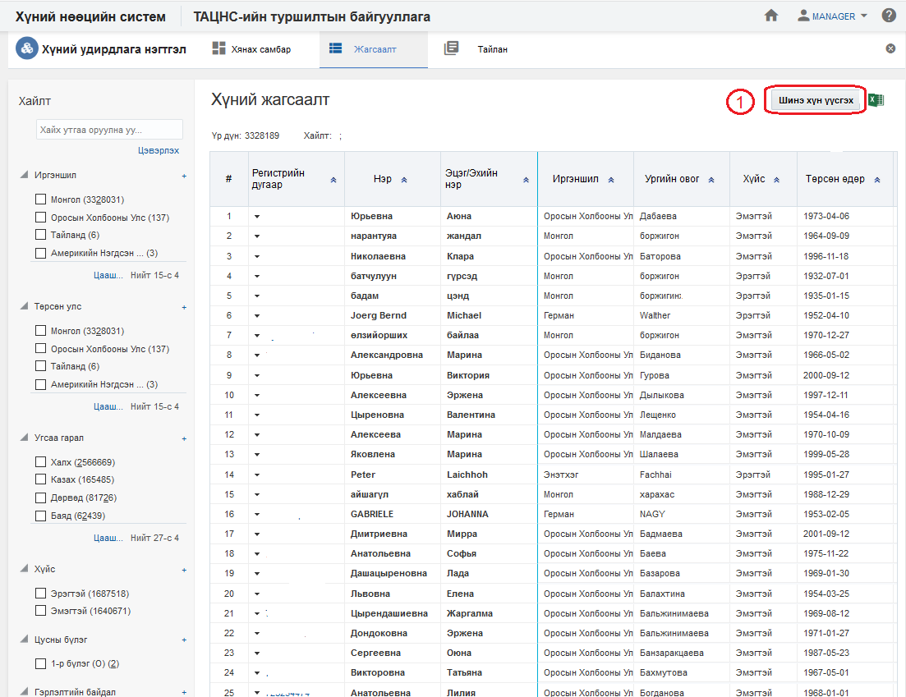
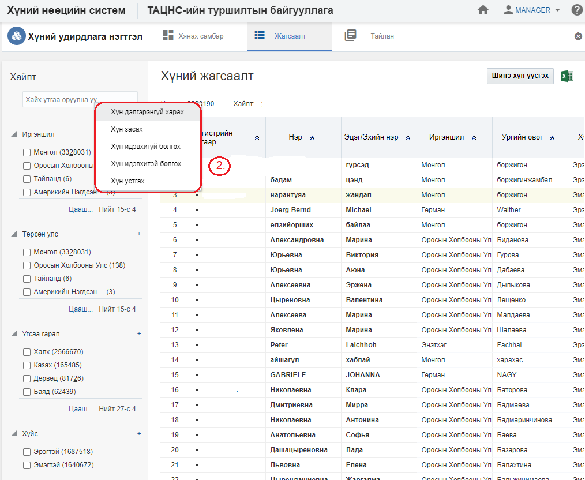
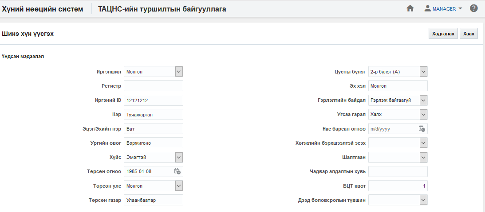
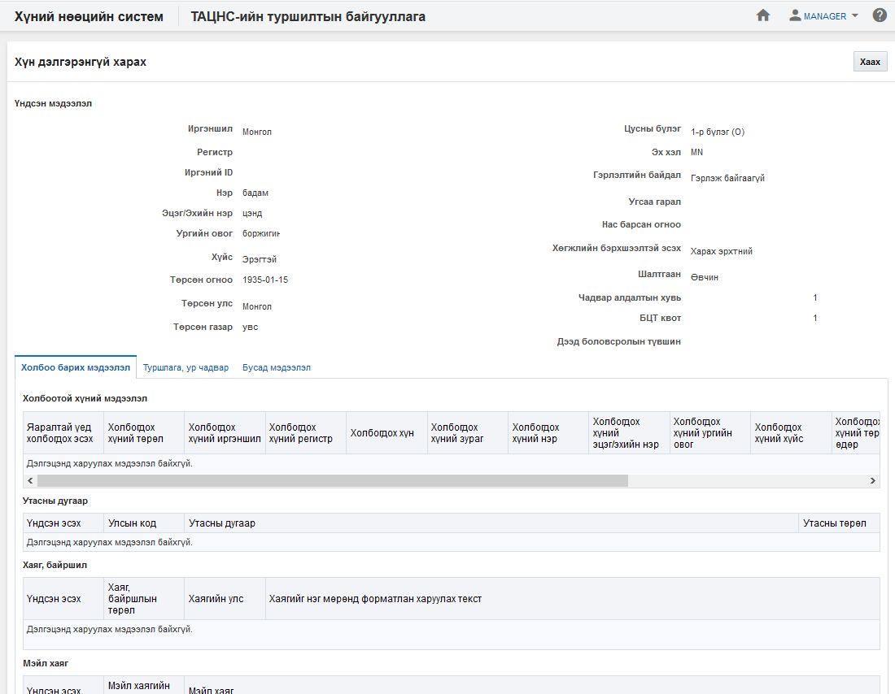
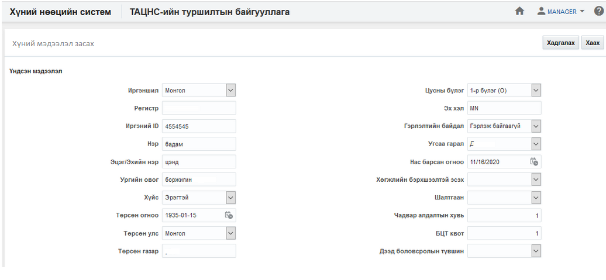
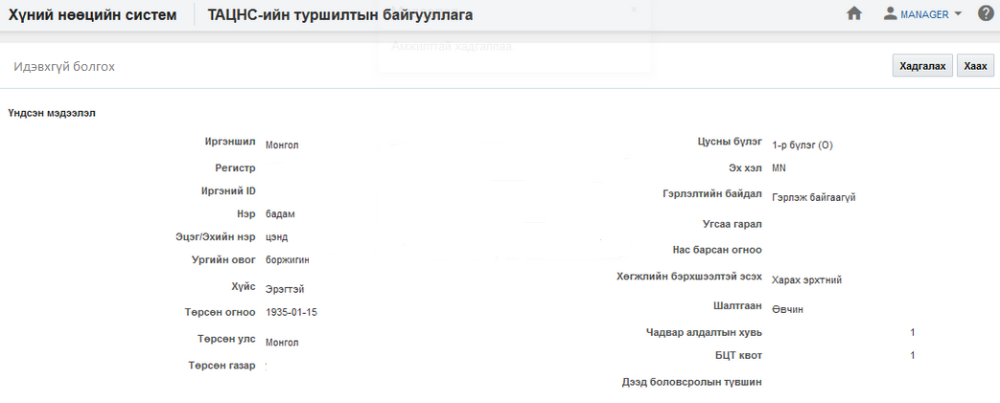
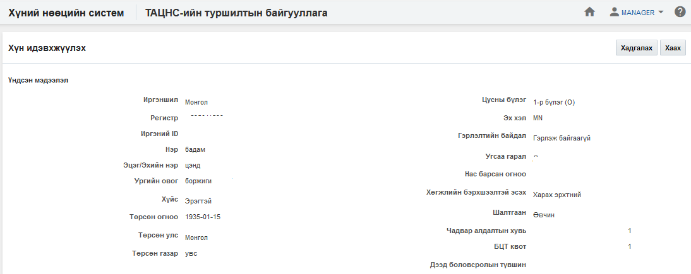
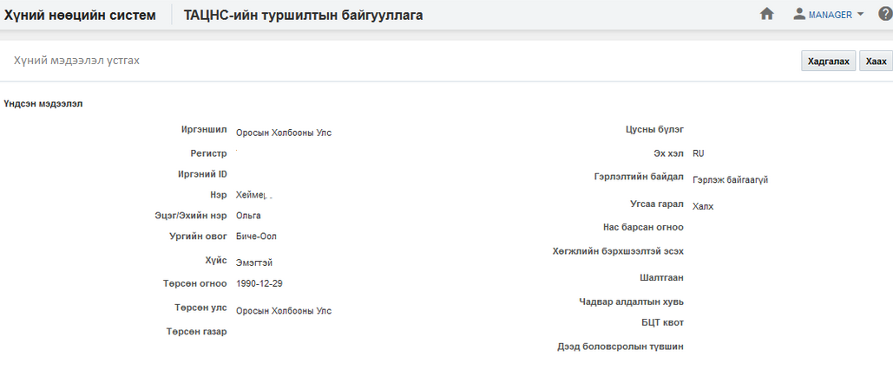

<h1 align="center">Хүний удирдлага модулийн үйлдэл</h1>

Хүний мэдээллийг засах, идэвхгүй болгох, идэвхтэй болгох, мэдээллийг устгах зэрэг үйлдлүүдийг хэрэглэгчид зөвшөөрөгдсөн эрхийн дагуу хийж болно.

## Үйлдэл хийх арга зам
Үйлдлийг хийхдээ жагсаалт цонхноос 2 төрлийн арга замаар хийнэ.

- ### 1. Ерөнхий цэс

  Жагсаалтын цонхны баруун дээд буланд байршина.

  

- ### 2. Контекст цэс

  Жагсаалтын цонхны үр дүн харуулах хэсэгт мөр дэх жижиг сум хэлбэртэй цэсийг контекст цэс гэнэ.

  

## Хүний удирдлагын үйлдлүүд
Хүний удирдлага модуль дээр дараах үйлдлүүдийг хийж болно.

**Үүнд:**

- [Шинэ хүн үүсгэх](People/action.md?id=Шинэ-хүн-үүсгэх)
- [Жагсаалт экспортлох](People/action.md?id=Жагсаалт-экспортлох)
- [Хүний профайль](People/action.md?id=Хүний-профайль)
- [Хүний мэдээлэл засах](People/action.md?id=Хүний-мэдээлэл-засах)
- [Хүний мэдээлэл идэвхгүй болгох](People/inaction.md?id=Хүний-мэдээлэл-идэвхгүй-болгох)
- [Хүний мэдээлэл идэвхтэй болгох](People/action.md?id=Хүний-мэдээлэл-идэвхтэй-болгох)
- [Хүний мэдээлэл устгах](People/action.md?id=Хүний-мэдээлэл-устгах)

### Шинэ хүн үүсгэх

**Шинэ хүн үүсгэх** үйлдэл нь шинэ хүн мэдээллийн санд нэмэх үйлдэл юм.

#### Үйлдлийн өмнөх нөхцөл
  Энэхүү үйлдлийг хийхээс өмнө ямар нөхцөл бүрдсэн байхыг энэ хэсэгт жагсаалтаар зааж байна. Үүнд:
  - Системд бүртгэлтэй эсэхийг шалгана. Бүртгэлгүй хүнийг бүртгэх боломжтой байна.

#### Үйлдлийн нөлөөлөл
  Энэхүү үйлдлийг хийх үед бусад мэдээлэлд хэрхэн нөлөөлөх нөлөөллийг заана. Үүнд:
  - Хүний удирдлагын хянах самбарын график тоон мэдээлэл өөрчлөгдөнө.
  - Хүний удирдлагын жагсаалтад шинэ бичлэг нэмэгдэнэ.
  - Хүний удирдлагын тайлангийн тоон мэдээлэл өөрчлөгдөнө.

### Жагсаалт экспортлох

**Жагсаалт экспортлох** үйлдэл нь хайлт шүүлтийн үр дүнг майкрософт эксел файлаар экспортлон авах үйлдэл юм.

#### Үйлдлийн өмнөх нөхцөл
  Энэхүү үйлдлийг хийхээс өмнө ямар нөхцөл бүрдсэн байхыг энэ хэсэгт жагсаалтаар зааж байна. Үүнд:
  - Экспортлох мэдээллээ зөв шүүсэн эсэхээ шалгах

#### Үйлдлийн нөлөөлөл
  Энэхүү үйлдлийг хийх үед бусад мэдээлэлд хэрхэн нөлөөлөх нөлөөллийг заана. Үүнд:
  - Систем дээр ямар нэгэн нөлөөлөл байхгүй байна

### Хүний профайль

**Хүний профайль** үйлдэл нь тухайн сонгосон хүний мэдээллийг нэг цонхноос авах боломжийг бүрдүүлнэ.

#### Үйлдлийн өмнөх нөхцөл
  Энэхүү үйлдлийг хийхээс өмнө ямар нөхцөл бүрдсэн байхыг энэ хэсэгт жагсаалтаар зааж байна. Үүнд:
  - Зөв хүн сонгосон эсэхээ шалгах

#### Үйлдлийн нөлөөлөл
  Энэхүү үйлдлийг хийх үед бусад мэдээлэлд хэрхэн нөлөөлөх нөлөөллийг заана. Үүнд:
  - Систем дээр ямар нэгэн нөлөөлөл байхгүй байна

### Хүний мэдээлэл засах

**Хүний мэдээлэл засах** үйлдэл нь тухайн сонгосон хүний мэдээллийг өөрчлөх боломжийг бүрдүүлнэ.

#### Үйлдлийн өмнөх нөхцөл
  Энэхүү үйлдлийг хийхээс өмнө ямар нөхцөл бүрдсэн байхыг энэ хэсэгт жагсаалтаар зааж байна. Үүнд:
  - Зөв хүн сонгосон эсэхээ шалгах

#### Үйлдлийн нөлөөлөл
  Энэхүү үйлдлийг хийх үед бусад мэдээлэлд хэрхэн нөлөөлөх нөлөөллийг заана. Үүнд:
  - Хүний удирдлагын хянах самбарын график тоон мэдээлэл өөрчлөгдөнө.
  - Хүний удирдлагын жагсаалтын мэдээлэл өөрчлөгдөнө.
  - Хүний удирдлагын тайлангийн тоон мэдээлэл өөрчлөгдөнө.

### Хүний мэдээлэл идэвхгүй болгох

**Хүний мэдээлэл идэвхгүй болгох** үйлдэл нь тухайн сонгосон хүний төлөвийг идэвхгүй төлөвт шилжүүлэх бөгөөд хэрэв хүн нь идэвхгүй төлөвт шилжсэн бол тухайн хүн дээр ямар нэгэн үйлдэл хийх боломжгүй болно. Энэ үйлдлийг зөвхөн **идэвхтэй төлөвтэй хүн** дээр хийх боломжтой.

#### Үйлдлийн өмнөх нөхцөл
  Энэхүү үйлдлийг хийхээс өмнө ямар нөхцөл бүрдсэн байхыг энэ хэсэгт жагсаалтаар зааж байна. Үүнд:
  - Зөв хүн сонгосон эсэхээ шалгах
  - Сонгосон хүний төлөв нь идэвхтэй эсэхийг шалгах

#### Үйлдлийн нөлөөлөл
  Энэхүү үйлдлийг хийх үед бусад мэдээлэлд хэрхэн нөлөөлөх нөлөөллийг заана. Үүнд:
  - Хүний удирдлагын хянах самбарын график тоон мэдээлэл өөрчлөгдөнө.
  - Хүний удирдлагын жагсаалтын мэдээлэл өөрчлөгдөнө
  - Хүний удирдлагын тайлангийн тоон мэдээлэл өөрчлөгдөнө.

### Хүний мэдээлэл идэвхтэй болгох

**Хүний мэдээлэл идэвхтэй болгох** үйлдэл нь тухайн сонгосон хүний төлөвийг идэвхтэй төлөвт шилжүүлэх үйлдэл юм. Энэ үйлдэл нь зөвхөн **идэвхгүй** хүн дээр хийгдэх боломжтой.

#### Үйлдлийн өмнөх нөхцөл
  Энэхүү үйлдлийг хийхээс өмнө ямар нөхцөл бүрдсэн байхыг энэ хэсэгт жагсаалтаар зааж байна. Үүнд:
  - Зөв хүн сонгосон эсэхээ шалгах
  - Сонгосон хүний төлөв идэвхгүй эсэхийг шалгах

#### Үйлдлийн нөлөөлөл
  Энэхүү үйлдлийг хийх үед бусад мэдээлэлд хэрхэн нөлөөлөх нөлөөллийг заана. Үүнд:
  - Хүний удирдлагын хянах самбарын график тоон мэдээлэл өөрчлөгдөнө.
  - Хүний удирдлагын жагсаалтад шинэ бичлэг нэмэгдэнэ.
  - Хүний удирдлагын тайлангийн тоон мэдээлэл өөрчлөгдөнө.
  - Хүний мэдээлэлд өөрчлөх үйлдлүүд хийх боломжтой болно.
  - Ажилтан, ажил эрхлэлтийн өөрчлөх үйлдлүүд хийх боломжтой болно.
  - Цалин хөлсний өөрчлөх үйлдлүүд хийх боломжтой болно.

### Хүний мэдээлэл устгах

**Хүний мэдээлэл устгах** үйлдэл нь тухайн сонгосон хүний мэдээллийг буруу үүсгэсэн үед ашиглах бөгөөд тухайн хүн болон түүнтэй холбоотой бүх мэдээллийг систем дээрээс бүр мөсөн устгах үйлдэл юм. Энэ үйлдлийг хийснээс хойш хүний төлөвийг [энд](legal/delete_policy.md) заагдсан хугацааны турш **устгасан төлөвт** байлгах бөгөөд түүний дараа систем автоматаар устгана.

#### Үйлдлийн өмнөх нөхцөл
  Энэхүү үйлдлийг хийхээс өмнө ямар нөхцөл бүрдсэн байхыг энэ хэсэгт жагсаалтаар зааж байна. Үүнд:
  - Зөв хүн сонгосон эсэхийг шалгах
  - Тухайн  хүн, ажилтан, ажил эрхлэлт, цалин хөлс, сахилгын зөрчил, нөөцийн бүртгэл зэрэг бүртгэлүүдэд ашиглагдсан эсэхийг шалгах

#### Үйлдлийн нөлөөлөл
  Энэхүү үйлдлийг хийх үед бусад мэдээлэлд хэрхэн нөлөөлөх нөлөөллийг заана. Үүнд:
  Хүний удирдлагын хянах самбарын график тоон мэдээлэл өөрчлөгдөнө.
  - Хүний удирдлагын жагсаалтад шинэ бичлэг нэмэгдэнэ.
  - Хүний удирдлагын тайлангийн тоон мэдээлэл өөрчлөгдөнө.
  - Хүний мэдээлэлд өөрчлөх үйлдлүүд хийх боломжгүй болно.
  - Ажилтан, ажил эрхлэлтийн өөрчлөх үйлдлүүд хийх боломжгүй болно.
  - Цалин хөлсний өөрчлөх үйлдлүүд хийх боломжгүй болно.
  - Тухайн хүнд ашигласан бүх мэдээлэл устана.

