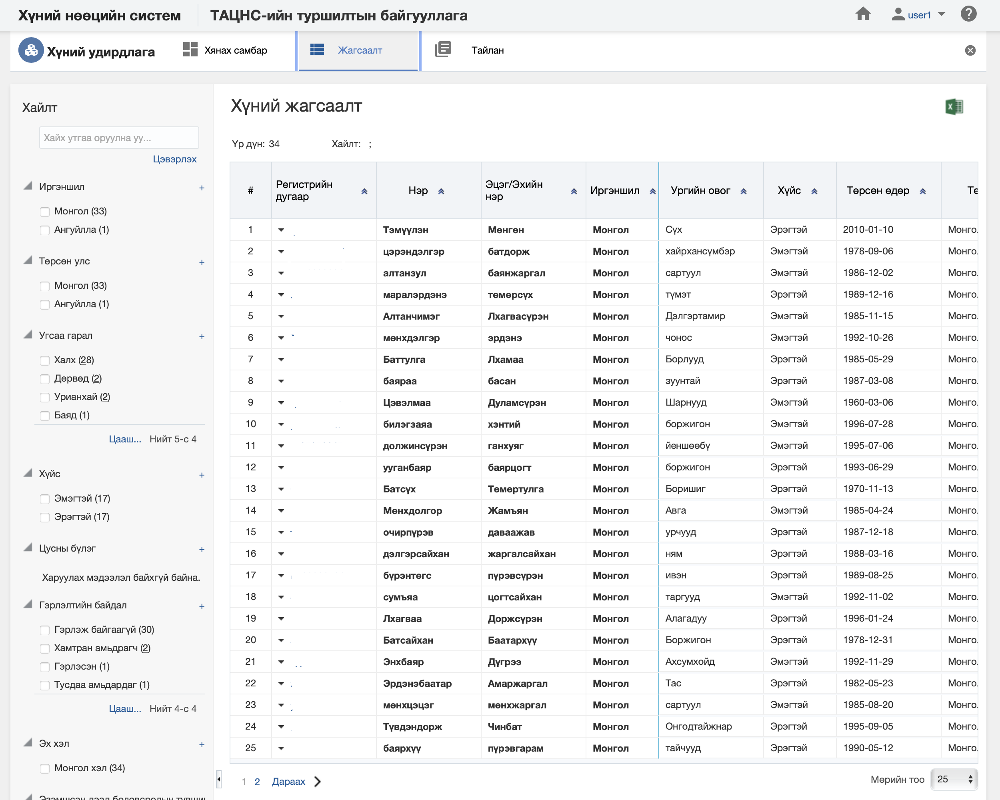
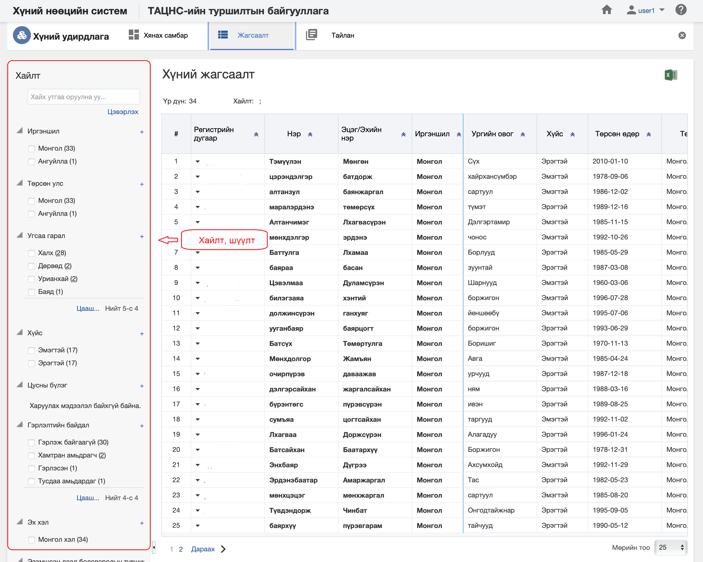
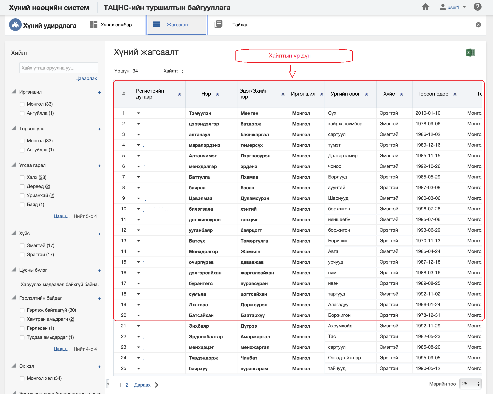

<h1 align="center">Хүний удирдлага модулийн жагсаалт, хайлт</h1>

Тухайн байгууллагад бүртгэсэн нийт хүний жагсаалтыг энэ хэсэгт харуулах ба хэрэглэгчийн эрх, үүргийн дагуу үйлдэл хийх боломжийг олгоно.

> Жагсаалт, хайлттай ажиллах талаар ерөнхий ойлголтыг [жагсаалт, хайлттай ажиллах](how-it-works?id=_3-Жагсаалт-хайлттай-ажиллах) хэсгээс харна уу.

Хүний жагсаалтын энэ хэсэгт үйлдлүүдийг хийнэ.

### Нарийвчилсан хайлт

Хүнийг дараах төрлүүдээр нарийвчилан хайх боломжтой.

> Дээрх зурганд хүний хайлт, шүүлтийн хэсгийг харуулж байна.

#### Нарийвчилсан хайлтын төрөл:

- **Иргэншил**
     Иргэншил. Хүний иргэншил
- **Төрсөн улс**
     Төрсөн улс. Хүний төрсөн улс
- **Угсаа гарал**
     Угсаа гарал. Хүний угсаа гарал буюу ястны төрөл
- **Хүйс**
     Хүйс. Хүний хүйсийн төрөл (Эрэгтэй, эмэгтэй)
- **Цусны бүлэг**
     Цусны бүлэг. Хүний цусны бүлэг
- **Гэрлэлтийн байдал**
     Гэрлэлтийн байдал. Хүний гэрлэлтийн байдал
- **Эх хэл**
     Эх хэл. Хүний төрөлх хэл
- **Эзэмшсэн дээд боловсролын түвшин**
     Эзэмшсэн дээд боловсролын түвшин. Хүний эзэмшсэн дээд боловсролын түвшин
- **Хөгжлийн бэрхшээлтэй эсэх**
     Хөгжлийн бэрхшээлтэй эсэх. Хүний хөгжлийн бэрхшээлийн мэдээлэл
- **Хөгжлийн бэрхшээлийн үндсэн шалтгаан**
     Хөгжлийн бэрхшээлийн үндсэн шалтгаан. Хөгжлийн бэрхшээлтэй бол төрөлхийн, Өвчин, Осол гэсэн сонголтой байна.
- **Утасны дугаар бүртгэсэн эсэх**
     Утасны дугаар бүртгэсэн эсэх. Хүний утасны дугаар бүртгэсэн эсэх
- **Мэйл хаяг бүртгэсэн эсэх**
     Мэйл хаяг бүртгэсэн эсэх. Хүний мэйл хаяг бүртгэсэн эсэх
- **Хаяг бүртгэсэн эсэх**
     Хаяг бүртгэсэн эсэх. Хүний хаяг бүртгэсэн эсэх
- **Вэб хаяг бүртгэсэн эсэх**
     Вэб хаяг бүртгэсэн эсэх. Хүний вэб хаяг бүртгэсэн эсэх
- **Нийгмийн сүлжээ бүртгэсэн эсэх**
     Нийгмийн сүлжээ бүртгэсэн эсэх. Хүний нийгмийн сүлжээ бүртгэсэн эсэх
- **Холбоо барих хүмүүс бүртгэсэн эсэх**
     Холбоо барих хүмүүс бүртгэсэн эсэх. Хүний холбоо барих хүмүүс бүртгэсэн эсэх
- **Гадаад хэл бүртгэсэн эсэх**
     Гадаад хэл бүртгэсэн эсэх. Хүний гадаад хэл бүртгэсэн эсэх

### Жагсаалтын мэдээлэл

Хүний хайлтын үр дүнг жагсаалт хэлбэрээр харуулна.

> Дээрх зурганд хүний жагсаалтын үр дүнг харуулж байна.

#### Хайлтын үр дүнгийн мэдээлэл:

- **Регистрийн дугаар**
     Регистрийн дугаар. Хүний регистрийн дугаар 
- **Нэр*
     Нэр. Хүний нэр
- **Эцэг /эх/-ийн нэр**
     Эцэг /эх/-ийн нэр. Хүний эцэг /эх/-ийн нэр
- **Иргэншил**
     Иргэншил. Хүний иргэншил
- **Ургийн овог**
     Ургийн овог. Хүний ургийн овог
- **Хүйс**
     Хүйс. Хүний хүйс (эрэгтэй, эмэгтэй)
- **Төрсөн өдөр**
     Төрсөн өдөр. Хүний төрсөн өдөр
- **Төрсөн улс**
     Төрсөн улс. Хүний төрсөн улс
- **Угсаа гарал**
     Угсаа гарал. Хүний угсаа гарал буюу ястны мэдээлэл
- **Эх хэл**
     Эх хэл. Хүний эх хэл буюу төрөлх хэл
- **Гэрлэлтийн байдал**
     Гэрлэлтийн байдал. Хүний гэрлэлтийн байдал
- **Цусны бүлэг**
     Цусны бүлэг. Хүний цусны бүлэг
- **Эзэмшсэн дээд боловсролын түвшин**
     Эзэмшсэн дээд боловсролын түвшин. Хүний зэмшсэн хамгийн өндөр боловсролын түвшин
- **Иргэний дугаар**
     Иргэний дугаар. Хүний иргэний дугаар давхцахгүй дугаар байна.
- **Утасны дугаар**
     Утасны дугаар. Хүний утасны дугаар
- **Мэйл хаяг**
     Мэйл хаяг. Хүний мэйл хаяг
- **Вэб хаяг**
     Вэб хаяг. Хүний вэб хаяг
- **Нийгмийн сүлжээ**
     Нийгмийн сүлжээ. Хүний нийгмийн сүлжээ.
- **Хаяг**
     Хаяг. Хүний хаяг.
- **Холбоо барих хүмүүс**
     Холбоо барих хүмүүс. Хүний холбоо барих хүмүүс
- **Гадаад хэл**
     Гадаад хэл. Хүний гадаад хэл
- **Хөгжлийн бэрхшээлтэй эсэх**
     Хөгжлийн бэрхшээлтэй эсэх. Хүний хөгжлийн бэрхшээлтэй эсэх.
- **Хөгжлийн бэрхшээлийн үндсэн шалтгаан**
     Хөгжлийн бэрхшээлийн үндсэн шалтгаан. Хүний хөгжлийн бэрхшээлийн үндсэн шалтгаан 
- **Чадвар алдалтын хувь**
     Чадвар алдалтын хувь. Хүний чадвар алдалтын хувь 
- **БЦТ квот**
     БЦТ квот. Бүтэн цагийн тэнцэтгэл