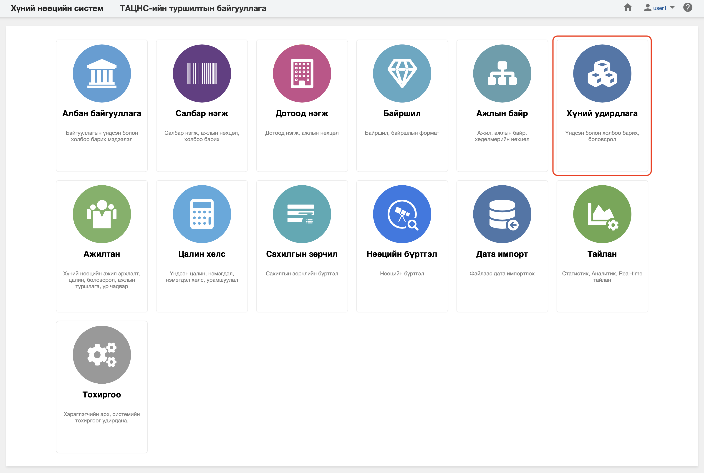

<h1 align="center">Хүний удирдлага модуль</h1>

Байгууллагатай холбогдсон хүнийг төрийн албаны хүний нөөцийн нэгдсэн системд  **хүний удирдлага** модуль зохион байгуулж удирдана.Энэхүү модульд ажилтны хувийн профайлийн мэдээллийг өөрчлөх боломжийг олгоно.
 

Төрийн албаны хүний нөөцийн нэгдсэн смстемийн "Хүний удирдлага" модуль нь дараах хэсгээс бүрдэнэ.

Үүнд:

- [Хянах самбар](people/dashboard.md)
- [Жагсаалт, хайлт](people/list.md)
- [Тайлан](people/report.md)
- [Үйлдэл](people/action.md)