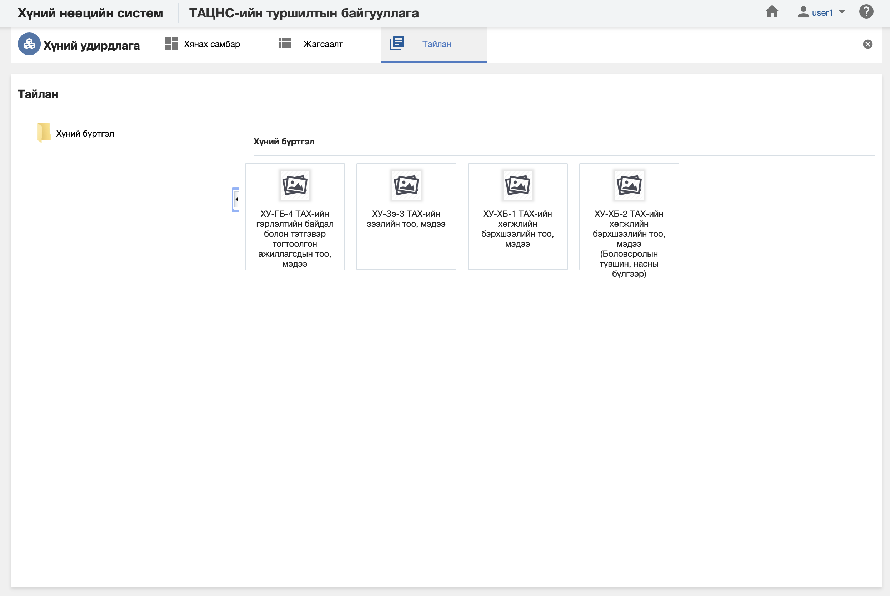

<h1 align="center">Хүний удирдлага модулийн тайлан</h1>

Албан байгууллагын хүн дэх мэдээлэлд шинжилгээ хийж дата шинжилгээний үр дүнг урьдчилан бэлтгэсэн тайлангуудын загвараар гаргана.

> Тайлантай хэрхэн ажиллах талаар ерөнхий ойлголтыг [тайлантай ажиллах](how-it-works?id=_5-Тайлантай-ажиллах) хэсгээс харна уу.

Хүний мэдээлэл дээр дараах тайлангуудыг урьдчилан тодорхойлсон байна.

**Үүнд:**

- **ХУ-ГБ-4 Хүний мэдээллийн тоо мэдээ (Гэрлэлтийн байдал болон тэтгэвэр тогтоолгон ажиллагсад)**
   Байгууллагын хүний мэдээллийн тоог тайлангийн үзүүлэлтээр гаргах тайлан (Гэрлэлтийн байдал, тэтгэвэр тогтоолгон ажиллагсад)  
- **ХУ-Зэ-3 Хүний мэдээллийн тоо мэдээ (Хүний зээлийн мэдээлэл)**
   Байгууллагын хүний мэдээллийн тоог тайлангийн үзүүлэлтээр гаргах тайлан (зээлийн мэдээлэл)  
- **ХУ-ХБ-1 Хүний мэдээллийн тоо мэдээ (Хөгжлийн бэрхшээл)**
   Байгууллагын хүний мэдээллийн тоог тайлангийн үзүүлэлтээр гаргах тайлан (Хөгжлийн бэрхшээлээр)  
- **ХУ-ХБ-2 Хүний мэдээллийн тоо мэдээ (Хөгжлийн бэрхшээл-Боловсролын түвшин, насны бүлгээр)**
   Байгууллагын хүний мэдээллийн тоог тайлангийн үзүүлэлтээр гаргах тайлан (Хөгжлийн бэрхшээл-Боловсролын түвшин, насны бүлгээр)  
