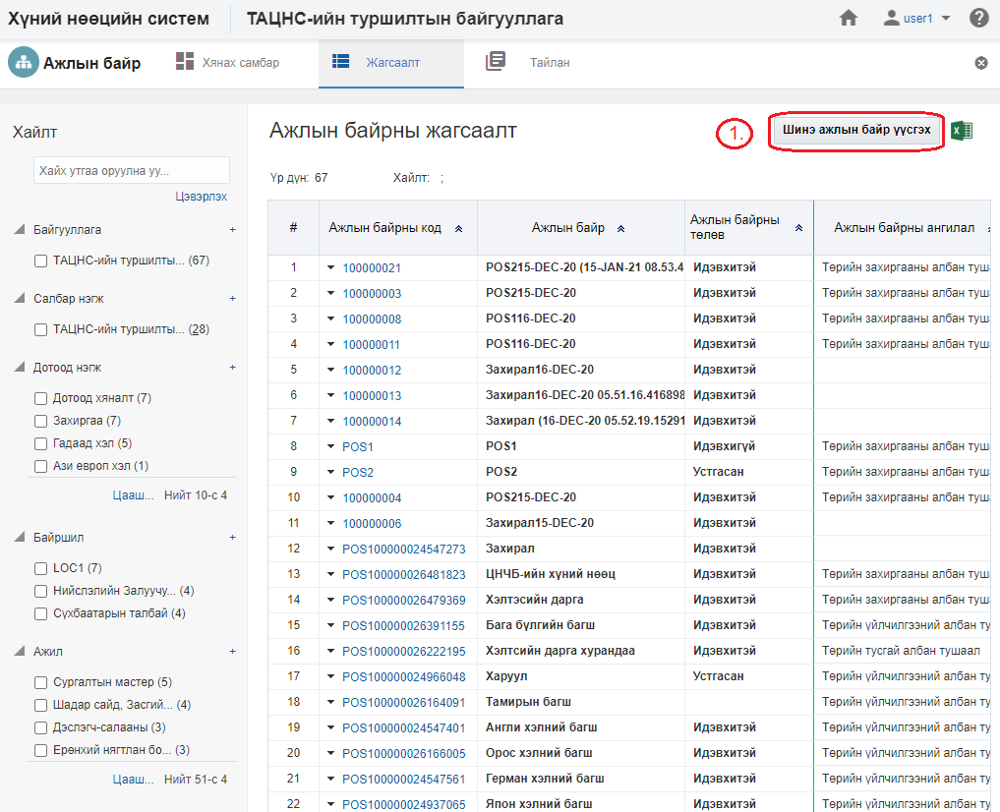
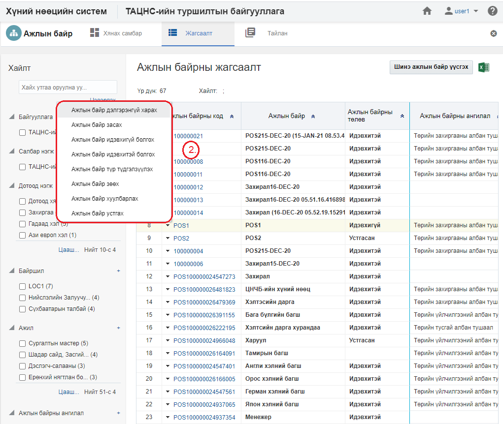
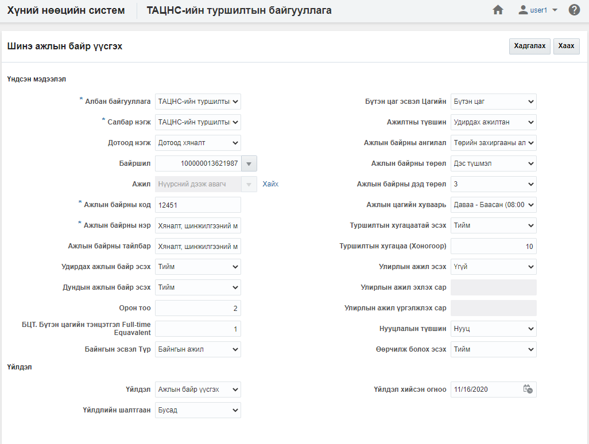
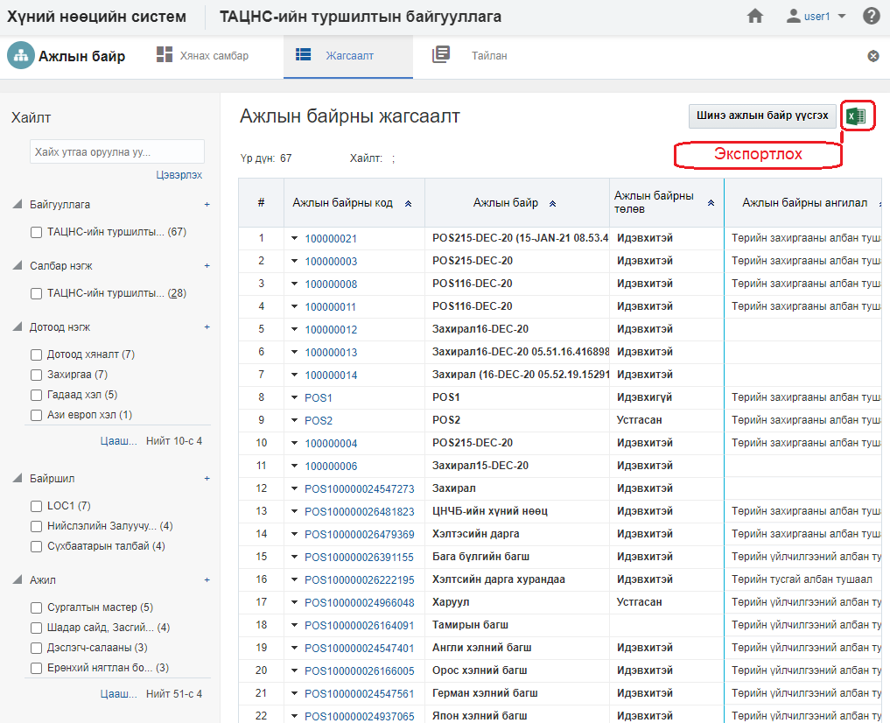
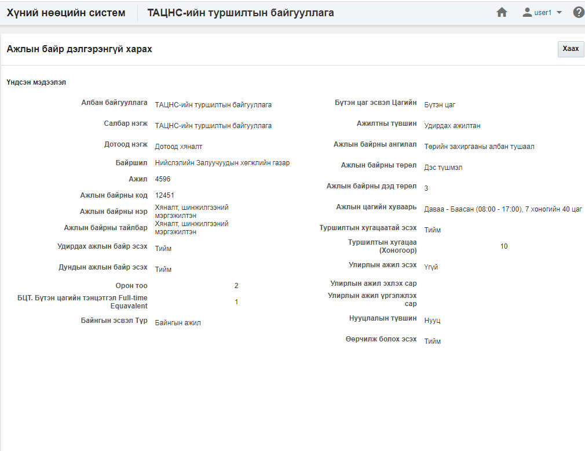
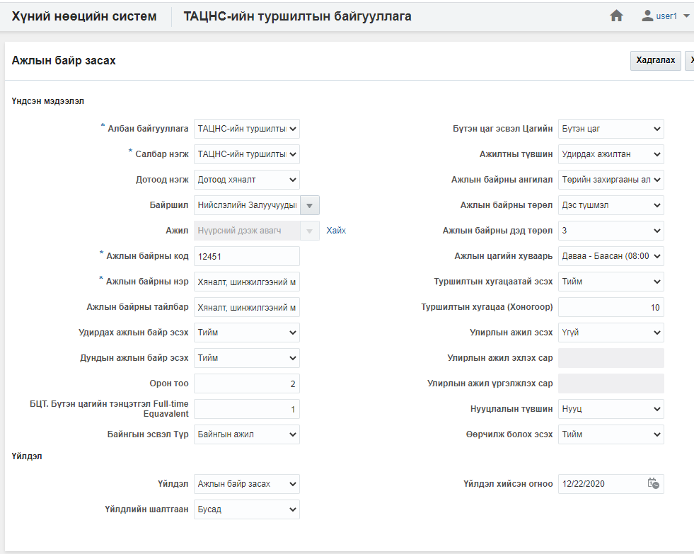
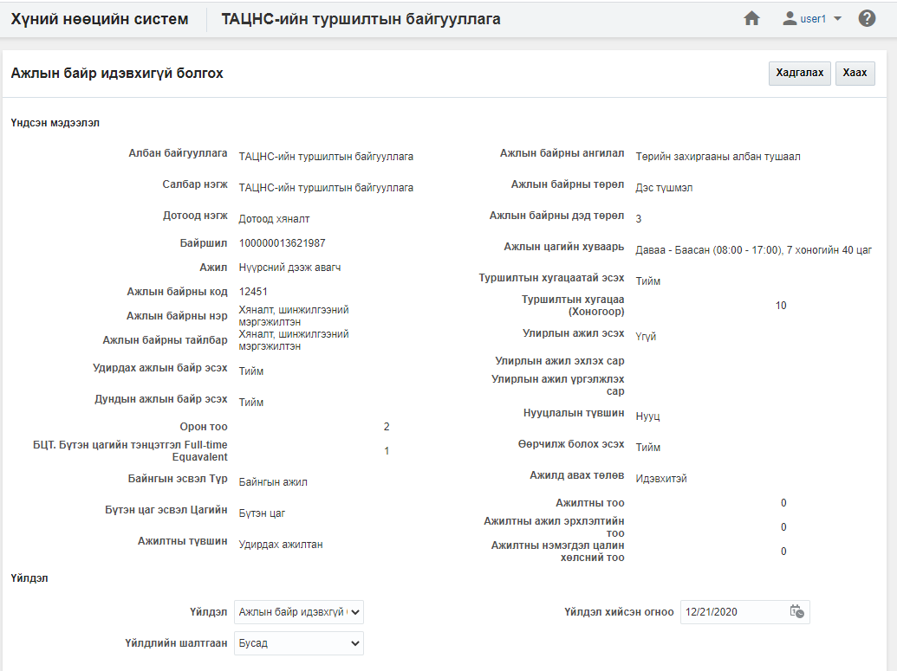
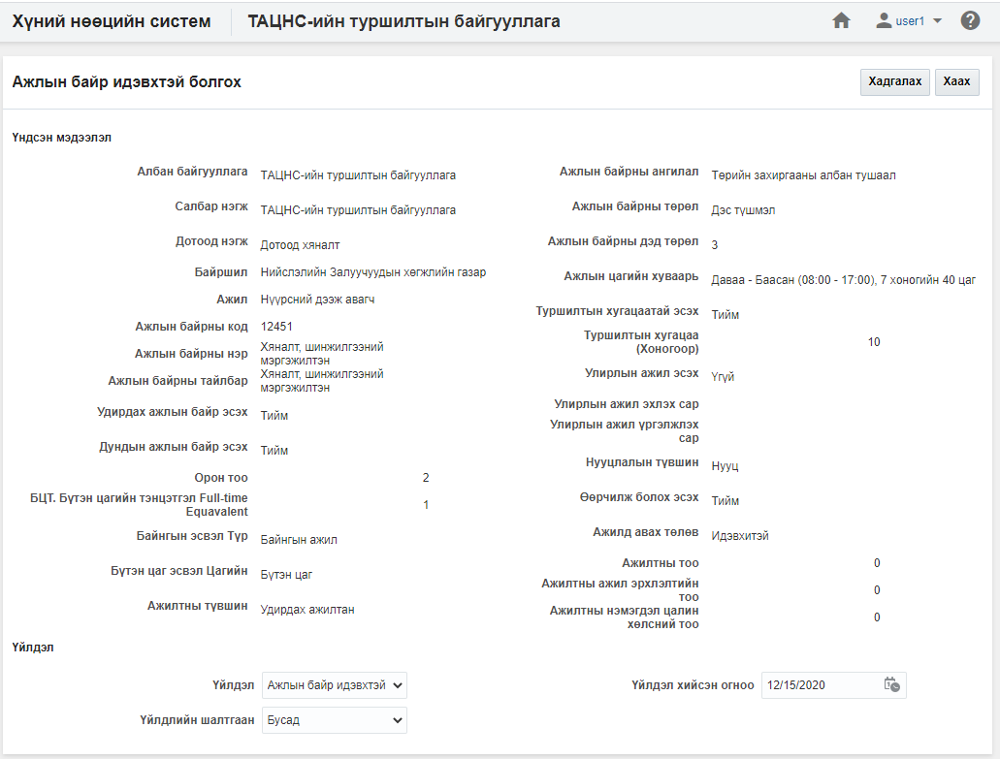
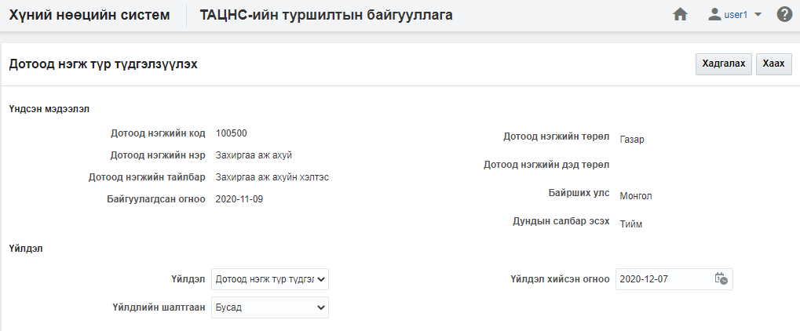
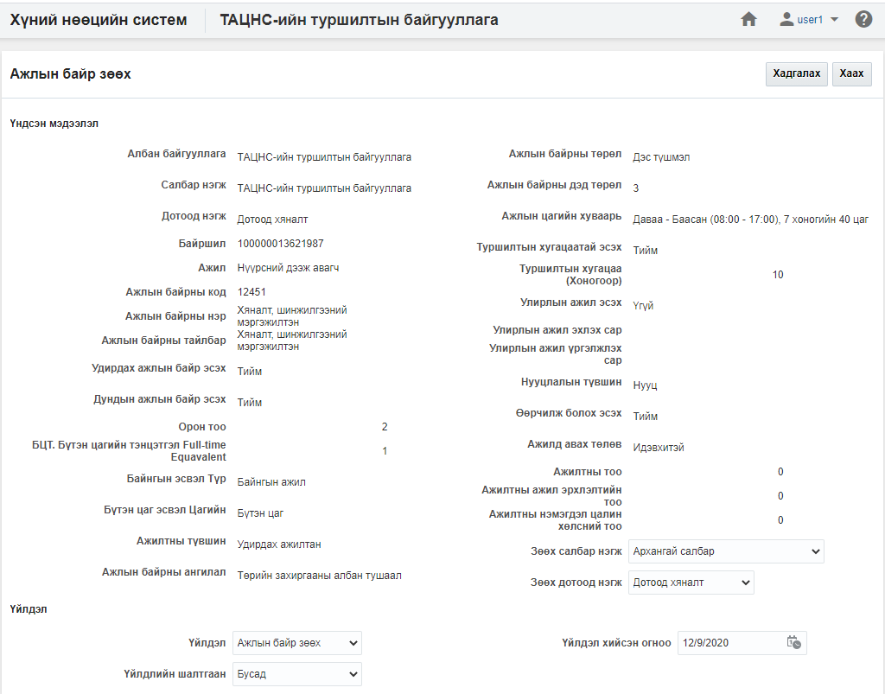

<h1 align="center">Ажлын байр модулийн үйлдэл</h1>

Ажлын байрны мэдээллийн өөрчлөлт, идэвхгүй болгох, зөөх, хуулбарлах, зөөх, устгах... зэрэг үйлдлүүдийг хэрэглэгчид зөвшөөрөгдсөн эрхийн дагуу хийж болно.

## Үйлдэл хийх арга зам
Үйлдлийг хийхдээ жагсаалт цонхноос 2 төрлийн арга замаар хийнэ.

- ### 1. Ерөнхий цэс

  Жагсаалтын цонхны баруун дээд буланд байршина.

  

- ### 2. Контекст цэс

  Жагсаалтын цонхны үр дүн харуулах хэсэгт мөр дэх жижиг сум хэлбэртэй цэсийг контекст цэс гэнэ.

  

## Ажлын байр модулийн үйлдлүүд
Ажлын байр модуль дээр дараах үйлдлүүдийг хийж болно.

**Үүнд:**

- [Шинэ ажлын байр үүсгэх](Positions/action.md?id=Ажлын-байр-үүсгэх)
- [Жагсаалт экспортлох](Positions/action.md?id=Жагсаалт-экспортлох)
- [Ажлын байрны профайль](Positions/action.md?id=Ажлын-байрны-профайль)
- [Ажлын байр засах](Positions/action.md?id=Ажлын-байр-засах)
- [Ажлын байр идэвхгүй болгох](Positions/inaction.md?id=Ажлын-байр-идэвхгүй-болгох)
- [Ажлын байр идэвхтэй болгох](Positions/action.md?id=Ажлын-байр-идэвхтэй-болгох)
- [Ажлын байр түр түдгэлзүүлэх](Positions/action.md?id=Ажлын-байр-түр-түдгэлзүүлэх)
- [Ажлын байр зөөх](Positions/action.md?id=Ажлын-байр-зөөх)
- [Ажлын байр хуулбарлах](Positions/action.md?id=Ажлын-байр-хуулбарлах)
- [Ажлын байр устгах](Positions/action.md?id=Ажлын-байр-устгах)

### Шинэ ажлын байр үүсгэх

**Шинэ ажлын байр үүсгэх** үйлдэл нь байгууллагад шинэ ажлын байр мэдээллийн санд нэмэх үйлдэл юм.

#### Үйлдлийн өмнөх нөхцөл
  Энэхүү үйлдлийг хийхээс өмнө ямар нөхцөл бүрдсэн байхыг энэ хэсэгт жагсаалтаар зааж байна. Үүнд:
  - Ажлын байрыг үүсгэх албан байгууллага, салбар нэгж, дотоод нэгж системд үүссэн байх

#### Үйлдлийн нөлөөлөл
  Энэхүү үйлдлийг хийх үед бусад мэдээлэлд хэрхэн нөлөөлөх нөлөөллийг заана. Үүнд:
  - Ажлын байрны хянах самбарын график тоон мэдээлэл өөрчлөгдөнө.
  - Ажлын байрны жагсаалтад шинэ бичлэг нэмэгдэнэ.
  - Ажлын байрны тайлангийн тоон мэдээлэл өөрчлөгдөнө.

### Жагсаалт экспортлох

**Жагсаалт экспортлох** үйлдэл нь хайлт шүүлтийн үр дүнг майкрософт эксел файлаар экспортлон авах үйлдэл юм.

#### Үйлдлийн өмнөх нөхцөл
  Энэхүү үйлдлийг хийхээс өмнө ямар нөхцөл бүрдсэн байхыг энэ хэсэгт жагсаалтаар зааж байна. Үүнд:
  - Экспортлох мэдээллээ зөв шүүсэн эсэхээ шалгах

#### Үйлдлийн нөлөөлөл
  Энэхүү үйлдлийг хийх үед бусад мэдээлэлд хэрхэн нөлөөлөх нөлөөллийг заана. Үүнд:
  - Систем дээр ямар нэгэн нөлөөлөл байхгүй байна

### Ажлын байрны профайль

**Ажлын байрны профайль** үйлдэл нь тухайн сонгосон ажлын байрны мэдээллийг нэг цонхноос авах боломжийг бүрдүүлнэ.

#### Үйлдлийн өмнөх нөхцөл
  Энэхүү үйлдлийг хийхээс өмнө ямар нөхцөл бүрдсэн байхыг энэ хэсэгт жагсаалтаар зааж байна. Үүнд:
  - Зөв ажлын байр сонгосон эсэхээ шалгах

#### Үйлдлийн нөлөөлөл
  Энэхүү үйлдлийг хийх үед бусад мэдээлэлд хэрхэн нөлөөлөх нөлөөллийг заана. Үүнд:
  - Систем дээр ямар нэгэн нөлөөлөл байхгүй байна

### Ажлын байр засах

**Ажлын байр засах** үйлдэл нь тухайн сонгосон ажлын байрны мэдээллийг өөрчлөх боломжийг бүрдүүлнэ.

#### Үйлдлийн өмнөх нөхцөл
  Энэхүү үйлдлийг хийхээс өмнө ямар нөхцөл бүрдсэн байхыг энэ хэсэгт жагсаалтаар зааж байна. Үүнд:
  - Зөв ажлын байр сонгосон эсэхээ шалгах

#### Үйлдлийн нөлөөлөл
  Энэхүү үйлдлийг хийх үед бусад мэдээлэлд хэрхэн нөлөөлөх нөлөөллийг заана. Үүнд:
  - Ажлын байрны хянах самбарын график тоон мэдээлэл өөрчлөгдөнө.
  - Ажлын байрны жагсаалтын мэдээлэл өөрчлөгдөнө.
  - Ажлын байрны тайлангийн тоон мэдээлэл өөрчлөгдөнө.

### Ажлын байр идэвхгүй болгох

**Ажлын байр идэвхгүй болгох** үйлдэл нь тухайн сонгосон ажлын байрны төлөвийг идэвхгүй төлөвт шилжүүлэх бөгөөд хэрэв ажлын байр нь идэвхгүй төлөвт шилжсэн бол тухайн ажлын байр дээр ямар нэгэн үйлдэл хийх боломжгүй болно. Энэ үйлдлийг зөвхөн **идэвхтэй төлөвтэй ажлын байр** дээр хийх боломжтой.

#### Үйлдлийн өмнөх нөхцөл
  Энэхүү үйлдлийг хийхээс өмнө ямар нөхцөл бүрдсэн байхыг энэ хэсэгт жагсаалтаар зааж байна. Үүнд:
  - Зөв ажлын байр сонгосон эсэхээ шалгах
  - Сонгосон ажлын байрны төлөв нь идэвхтэй эсэхийг шалгах

#### Үйлдлийн нөлөөлөл
  Энэхүү үйлдлийг хийх үед бусад мэдээлэлд хэрхэн нөлөөлөх нөлөөллийг заана. Үүнд:
  - Ажлын байрны хянах самбарын график тоон мэдээлэл өөрчлөгдөнө.
  - Ажлын байрны жагсаалтын мэдээлэл өөрчлөгдөнө
  - Ажлын байрны тайлангийн тоон мэдээлэл өөрчлөгдөнө.
  - Ажлын байрны өөрчлөх үйлдлүүд хийх боломжгүй болно.
  - Ажилтан, ажил эрхлэлтийн өөрчлөх үйлдлүүд хийх боломжгүй болно.
  - Цалин хөлсний өөрчлөх үйлдлүүд хийх боломжгүй болно.

### Ажлын байр идэвхтэй болгох

**Ажлын байр идэвхтэй болгох** үйлдэл нь тухайн сонгосон ажлын байрны төлөвийг идэвхтэй төлөвт шилжүүлэх үйлдэл юм. Энэ үйлдэл нь зөвхөн **идэвхгүй** ажлын байр дээр хийгдэх боломжтой.

#### Үйлдлийн өмнөх нөхцөл
  Энэхүү үйлдлийг хийхээс өмнө ямар нөхцөл бүрдсэн байхыг энэ хэсэгт жагсаалтаар зааж байна. Үүнд:
  - Зөв ажлын байр сонгосон эсэхээ шалгах
  - Сонгосон ажлын байрны төлөв идэвхгүй эсэхийг шалгах

#### Үйлдлийн нөлөөлөл
  Энэхүү үйлдлийг хийх үед бусад мэдээлэлд хэрхэн нөлөөлөх нөлөөллийг заана. Үүнд:
  - Ажлын байрны хянах самбарын график тоон мэдээлэл өөрчлөгдөнө.
  - Ажлын байрны жагсаалтад шинэ бичлэг нэмэгдэнэ.
  - Ажлын байрны тайлангийн тоон мэдээлэл өөрчлөгдөнө.
  - Ажлын байрны өөрчлөх үйлдлүүд хийх боломжтой болно.
  - Ажилтан, ажил эрхлэлтийн өөрчлөх үйлдлүүд хийх боломжтой болно.
  - Цалин хөлсний өөрчлөх үйлдлүүд хийх боломжтой болно.

### Ажлын байр түр түдгэлзүүлэх

**Ажлын байр түр түдгэлзүүлэх** үйлдэл нь тухайн сонгосон ажлын байрны төлөвийг түр түдгэлзүүлсэн төлөвт шилжүүлэх бөгөөд хэрэв ажлын байр нь түр түдгэлзүүлсэн төлөвт шилжсэн бол тухайн ажлын байр дээр ямар нэгэн үйлдэл хийх боломж түр хаагдана. Энэ үйлдлийг зөвхөн **идэвхтэй төлөвтэй ажлын байр** дээр хийх боломжтой.

#### Үйлдлийн өмнөх нөхцөл
  Энэхүү үйлдлийг хийхээс өмнө ямар нөхцөл бүрдсэн байхыг энэ хэсэгт жагсаалтаар зааж байна. Үүнд:
  - Зөв ажлын байрыг сонгосон эсэхээ шалгах
  - Сонгосон ажлын байрын төлөв нь идэвхтэй эсэхийг шалгах

#### Үйлдлийн нөлөөлөл
  Энэхүү үйлдлийг хийх үед бусад мэдээлэлд хэрхэн нөлөөлөх нөлөөллийг заана. Үүнд:
  - Ажлын байрны хянах самбарын график тоон мэдээлэл өөрчлөгдөнө.
  - Ажлын байрны жагсаалтын мэдээлэл өөрчлөгдөнө
  - Ажлын байрны тайлангийн тоон мэдээлэл өөрчлөгдөнө.
  - Ажлын байрны өөрчлөх үйлдлүүд хийх боломжгүй болно.
  - Ажилтан, ажил эрхлэлтийн өөрчлөх үйлдлүүд хийх боломжгүй болно.
  - Цалин хөлсний өөрчлөх үйлдлүүд хийх боломжгүй болно.

### Ажлын байр зөөх

**Ажлын байр зөөх** үйлдэл нь тухайн сонгосон ажлын байрыг бусад салбар нэгж, дотоод нэгжрүү зөөх үйлдэл юм. Өөрөөр хэлбэл байгууллагын бүтцийн өөрчлөлтөөр ажлын байр өөр салбар нэгж, дотоод нэгжид харьяалагдах болсноор тухайн ажлын байр дахь бүх бүртгэлийг хөдөлгөхгүйгээр өөрчлөх юм. 

#### Үйлдлийн өмнөх нөхцөл
  Энэхүү үйлдлийг хийхээс өмнө ямар нөхцөл бүрдсэн байхыг энэ хэсэгт жагсаалтаар зааж байна. Үүнд:
  - Зөв ажлын байр сонгосон эсэхийг шалгах

#### Үйлдлийн нөлөөлөл
  Энэхүү үйлдлийг хийх үед бусад мэдээлэлд хэрхэн нөлөөлөх нөлөөллийг заана. Үүнд:
  - Ажлын байрны хянах самбарын график тоон мэдээлэл өөрчлөгдөнө.
  - Ажлын байрны жагсаалтын мэдээлэл өөрчлөгдөнө.
  - Ажлын байрны тайлангийн тоон мэдээлэл өөрчлөгдөнө.

### Ажлын байр хуулбарлах

**Ажлын байр хуулбарлах** үйлдэл нь тухайн сонгосон ажлын байрыг хуулбарлан үүсгэж байгаа үйлдэл бөгөөд хэрэглэгчийн ажлыг хялбарчилна. 

#### Үйлдлийн өмнөх нөхцөл
  Энэхүү үйлдлийг хийхээс өмнө ямар нөхцөл бүрдсэн байхыг энэ хэсэгт жагсаалтаар зааж байна. Үүнд:
  - Зөв ажлын байр сонгосон эсэхийг шалгах

#### Үйлдлийн нөлөөлөл
  Энэхүү үйлдлийг хийх үед бусад мэдээлэлд хэрхэн нөлөөлөх нөлөөллийг заана. Үүнд:
  - Ажлын байрны хянах самбарын график тоон мэдээлэл өөрчлөгдөнө.
  - Ажлын байрны жагсаалтын мэдээлэл өөрчлөгдөнө.
  - Ажлын байрны тайлангийн тоон мэдээлэл өөрчлөгдөнө.

### Ажлын байр устгах

**Ажлын байр устгах** үйлдэл нь тухайн сонгосон ажлын байрыг буруу үүсгэсэн үед ашиглах бөгөөд тухайн ажлын байр болон түүнтэй холбоотой бүх мэдээллийг систем дээрээс бүр мөсөн устгах үйлдэл юм. Энэ үйлдлийг хийснээс хойш ажлын байрны төлөвийг [энд](legal/delete_policy.md) заагдсан хугацааны турш **устгасан төлөвт** байлгах бөгөөд түүний дараа систем автоматаар устгана.

#### Үйлдлийн өмнөх нөхцөл
  Энэхүү үйлдлийг хийхээс өмнө ямар нөхцөл бүрдсэн байхыг энэ хэсэгт жагсаалтаар зааж байна. Үүнд:
  - Зөв ажлын байр сонгосон эсэхийг шалгах
  - Сонгосон ажлын байрны төлөв нь идэвхтэй, түр түдгэлзүүлсэн төлөвт байгаа эсэхийг шалгах
  - Тухайн ажлын байрыг бусад  ажлын байр, ажлын байр, ажилтан, ажил эрхлэлт, цалин хөлс, сахилгын зөрчил, нөөцийн бүртгэл зэрэг бүртгэлүүдэд ашиглагдсан эсэхийг шалгах

#### Үйлдлийн нөлөөлөл
  Энэхүү үйлдлийг хийх үед бусад мэдээлэлд хэрхэн нөлөөлөх нөлөөллийг заана. Үүнд:
  - Ажлын байрны хянах самбарын график тоон мэдээлэл өөрчлөгдөнө.
  - Ажлын байрны жагсаалтын мэдээлэл өөрчлөгдөнө.
  - Ажлын байрны тайлангийн тоон мэдээлэл өөрчлөгдөнө.
  - Ажлын байрны өөрчлөх үйлдлүүд хийх боломжгүй болно.
  - Ажилтан, ажил эрхлэлтийн өөрчлөх үйлдлүүд хийх боломжгүй болно.
  - Цалин хөлсний өөрчлөх үйлдлүүд хийх боломжгүй болно.
  - Тухайн ажлын байрыг ашигласан бүх мэдээлэл устана.

