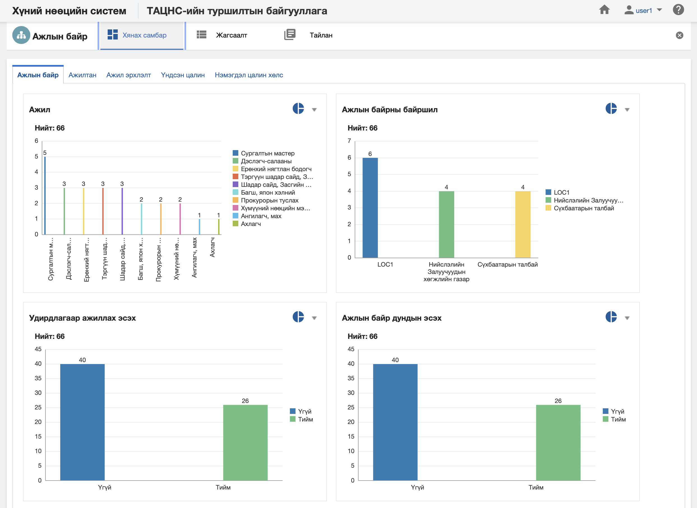

<h1 align="center">Ажлын байр модулийн хянах самбар</h1>

**Ажлын байр модулийн хянах самбар** нь тухайн ажлын байрны болон түүнд харъяалагдах мэдээллийг бодит цаг хугацааны мэдээлэл дээр хяналт, шинжилгээ хийх боломжийг олгоно.

> Хянах самбартай ажиллах талаар ерөнхий ойлголтыг [хянах самбартай ажиллах](how-it-works?id=_4-Хянах-самбартай-ажиллах) хэсгээс харна уу.

 

**Ажлын байр модулийн хянах самбар нь дараах таб анализуудаас бүрдэнэ.** 

|Хянах самбарын таб|Тайлбар|
|:-----|:------|
|**Ажлын байр**|Ажлын байрны мэдээллээр анализ хийх|
|**Ажилтан**|Ажлын байрны мэдээлэл болон ажилтны мэдээллээр кросс анализ хийх|
|**Ажил эрхлэлт**|Ажлын байрны мэдээлэл болон ажил эрхлэлтийн мэдээллээр кросс анализ хийх|
|**Үндсэн цалин**|Ажлын байрны мэдээлэл болон үндсэн цалингийн мэдээллээр кросс анализ хийх|
|**Нэмэгдэл цалин хөлс**|Ажлын байрны мэдээлэл болон нэмэгдэл цалин хөлсний мэдээллээр кросс анализ хийх|