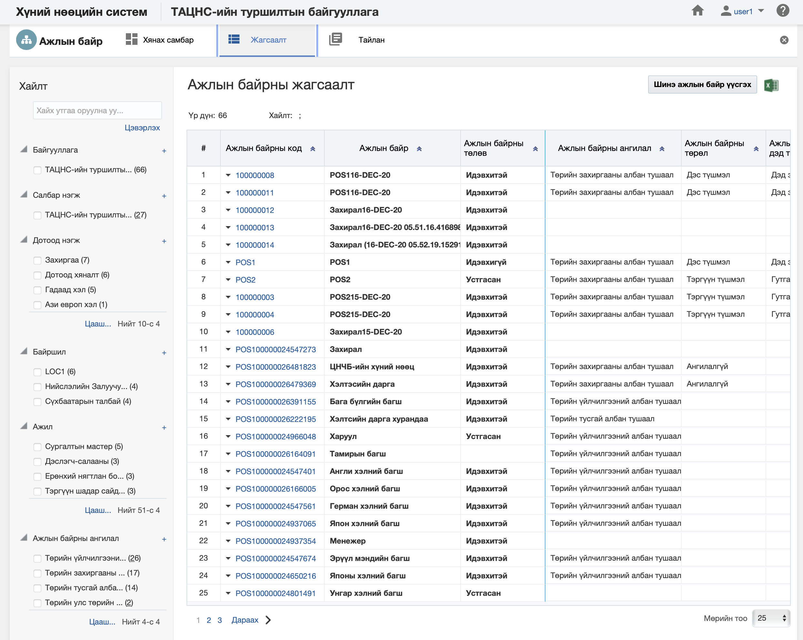
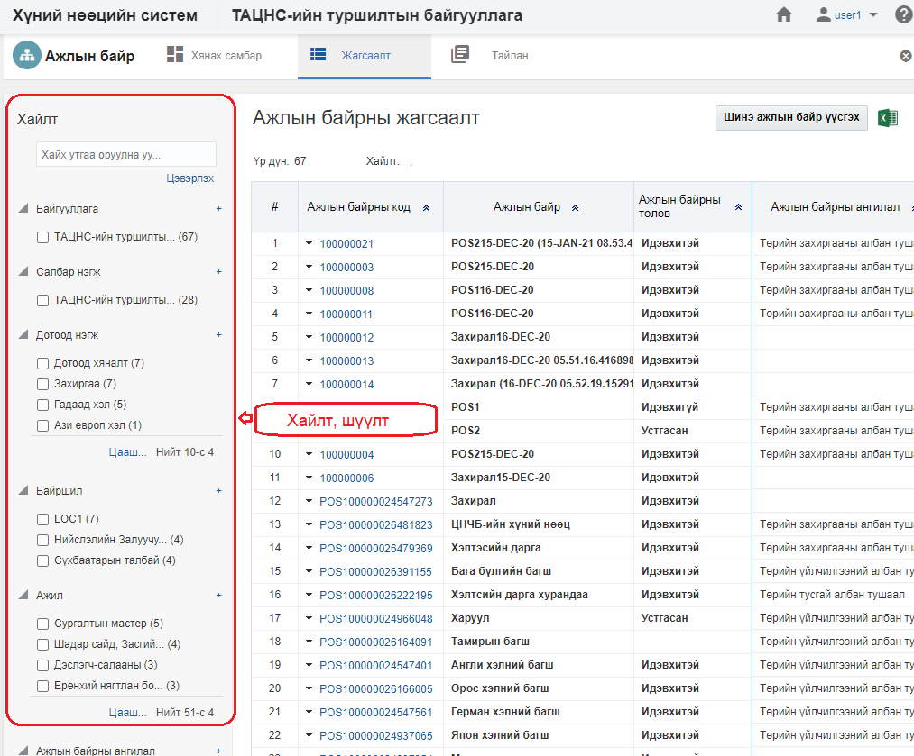
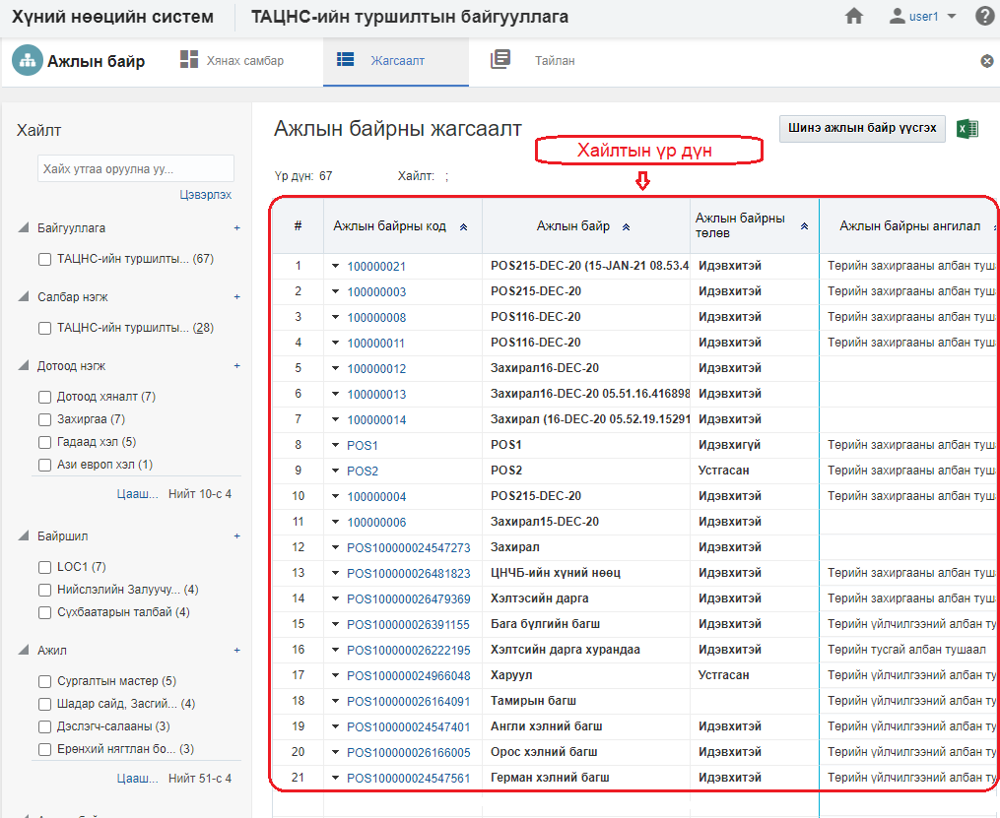

<h1 align="center">Ажлын байр модулийн жагсаалт, хайлт</h1>

Тухайн байгууллагад бүртгэсэн нийт ажлын байрны жагсаалтыг энэ хэсэгт харуулах ба хэрэглэгчийн эрх, үүргийн дагуу үйлдэл хийх боломжийг олгоно.

> Жагсаалт, хайлттай ажиллах талаар ерөнхий ойлголтыг [жагсаалт, хайлттай ажиллах](how-it-works?id=_3-Жагсаалт-хайлттай-ажиллах) хэсгээс харна уу.

Ажлын байрны жагсаалтын энэ хэсэгт үйлдлүүдийг хийнэ.

### Нарийвчилсан хайлт

Ажлын байрыг дараах төрлүүдээр нарийвчилан хайх боломжтой.

> Дээрх зурганд ажлын байрны хайлт, шүүлтийн хэсгийг харуулж байна.

#### Нарийвчилсан хайлтын төрөл:

- **Байгууллага**
     Байгууллага. Ажлын байрны байгууллага 
- **Салбар нэгж**
     Салбар нэгж. Ажлын байрны харьяалах салбар нэгж 
- **Ажлын байр**
     Ажлын байр. Ажлын байр дахь дотоод нэгж
- **Байршил**
     Байршил. Ажлын байрны байршлын мэдээлэл
- **Ажил**
     Ажил. Ажлын байрны ажлын нэр /ҮАМАТ-с/
- **Ажлын байрны ангилал**
     Ажлын байрны ангилал. Ажлын байрны ангилалын мэдээлэл
- **Ажлын байрны төрөл**
     Ажлын байрны төрөл. Ажлын байрны төрөл
- **Ажлын байрны дэд төрөл**
     Ажлын байрны дэд төрөл. Ажлын байрны дэд төрөл
- **Байнгын ажил/ Түр ажил**
     Байнгын ажил/ Түр ажил. Ажлын байр нь байнгын үү? Түр эсэхийн мэдээлэл
- **Бүтэн цагийн ажил/ Цагийн ажил**
     Бүтэн цагийн ажил/ Цагийн ажил. Бүтэн цагийн ажил/ Цагийн ажил эсэхийг ялгана.
- **Ажилтны түвшин**
     Ажилтны түвшин. Удирдах, гүйцэтгэх, туслах ажилтан гэсэн төрлүүдтэй
- **Удирдах ажлын байр эсэх**
     Удирдах ажлын байр эсэх. Ажлын байр нь удирдах эсэхийг тодорхойлно.
- **Туршилтын хугацаатай эсэх**
     Туршилтын хугацаатай эсэх. Ажлын байр нь туршилтын хугацаатай эсэх
- **Улирлын ажил эсэх**
     Улирлын ажил эсэх. Ажлын байр нь улирлаар ажилладаг эсэх
- **Нууцлалын түвшин**
     Нууцлалын түвшин. Ажлын байрны нууцлалын түвшин
- **Дундын ажлын байр эсэх**
     Дундын ажлын байр эсэх. Ажлын байр нь дундаа эсвэл дангаараа
- **Ажлын хуваарь**
     Ажлын хуваарь. Ажлын байрны ажлын хуваарь
- **Ажлын байрны төлөв**
     Ажлын байрны төлөв. Ажлын байр нь идэвхтэй, идэвхгүй, түр түдгэлзүүлэх..... гэсэн төлөвтэй.

### Жагсаалтын мэдээлэл

Ажлын байрны хайлтын үр дүнг жагсаалт хэлбэрээр харуулна.

> Дээрх зурганд ажлын байрны жагсаалтын үр дүнг харуулж байна.

#### Хайлтын үр дүнгийн мэдээлэл:

- **Ажлын байрны код**
     Ажлын байрны давхцахгүй код  
- **Ажлын байр**
     Ажлын байрны нэр  
- **Ажлын байрны төлөв**
     Ажлын байрны төлвийн мэдээлэл  
- **Ажлын байрны ангилал**
     Ажлын байрны ангилал. Ажлын байрны ангилал  
- **Ажлын байрны төрөл**
     Ажлын байрны төрөл. Ажлын байрны төрөл  
- **Ажлын байрны дэд төрөл**
     Ажлын байрны дэд төрөл. Ажлын байрны дэд төрөл  
- **Ажил**
     Ажил. Ажлын байрны ажил /ҮАМАТ-08 жагсаалтыг харуулдаг/  
- **Байршил**
     Байршил. Ажлын байрны байршлын мэдээлэл  
- **Дотоод нэгж**
     Дотоод нэгж. Ажлын байрны харьяалах дотоод нэгж  
- **Салбар нэгж**
     Салбар нэгж. Ажлын байрны харьяалах салбар нэгж  
- **Байгууллага**
     Ажлын байр харьяалах байгууллагын нэр  
- **Ажлын байр**
     Ажлын байрд харьяалах ажлын байр  
- **Ажилтан**
     Ажлын байрд харьяалах ажилтан  
- **Удирдах ажлын байр эсэх**
     Удирдах ажлын байр эсэх. Удирдах ажлын байр эсэхийг тэмдэглэж ялгана.  
- **Дундын ажлын байр эсэх**
     Дундын ажлын байр эсэх. Дундын ажлын байр эсэхийг тэмдэглэж ялгана.  
- **Орон тоо**
     Орон тоо. Ажлын байрны орон тоо  
- **БЦТ**
     БЦТ. Ажлын байрны бүтэн цагийн тэнцэтгэл  
- **Байнгын ажил/ Түр ажил**
     Байнгын ажил/ Түр ажил. Ажлын байрны Байнгын ажил эсвэл Түр ажил эсэхийг ялгана.  
- **Бүтэн цагийн ажил /Цагийн ажил**
     Бүтэн цагийн ажил /Цагийн ажил. Ажлын байр нь бүтэн цагийн, цагийн эсэхийг ялгана.  
- **Ажилтны түвшин**
     Ажилтны түвшин. Ажлын байр нь удирдах, гүйцэтгэх, туслахын аль нь болохыг тодорхойлно.  
- **Ажлын хуваарь**
     Ажлын хуваарь. Ажлын байр дахь 7 хоногийн ажиллах цаг болон ажил эхлэх болон дуусах огноо  
- **Туршилтын хугацаатай эсэх**
     Туршилтын хугацаатай эсэх. Ажлын байр нь туршилтын хугацаатай эсэхийг харуулна.  
- **Туршилтын хугацаа (хоногоор)**
     Туршилтын хугацаа (хоногоор). Ажлын байр туршилтын хугацаатай бол хугацааг нь хоногоор оруулна   
- **Улирлын ажил эсэх**
     Улирлын ажил эсэх. Ажлын байр нь улирлынн ажил эсэх   
- **Улирлын ажил эхлэх сар**
     Улирлын ажил эхлэх сар.Ажлын байр улирлынх бол ажил эхлэх сар  
- **Улирлын ажлын хугацаа (сараар)**
     Улирлын ажлын хугацаа (сараар). Ажлын байр улирлынх бол улирлын ажлын хугацааг сараар  
- **Нууцлалын түвшин**
     Нууцлалын түвшин. Ажлын байрны нууцлалын түвшин  
- **Ажилтан**
     Ажилтан. Ажлын байранд ажил эрхлэлттэй ажилтны тоо      
    - **Ажилтны ажил эрхлэлт**
     Ажилтны ажил эрхлэлт. Ажлын байр дахь ажилтны ажил эрхлэлтийн тоо  
- **Ажилтны нэмэгдэл цалин, хөлс**
     Ажилтны нэмэгдэл цалин, хөлс. Ажлын байр дахь ажилтны нэмэгдэл, цалин хөлс  