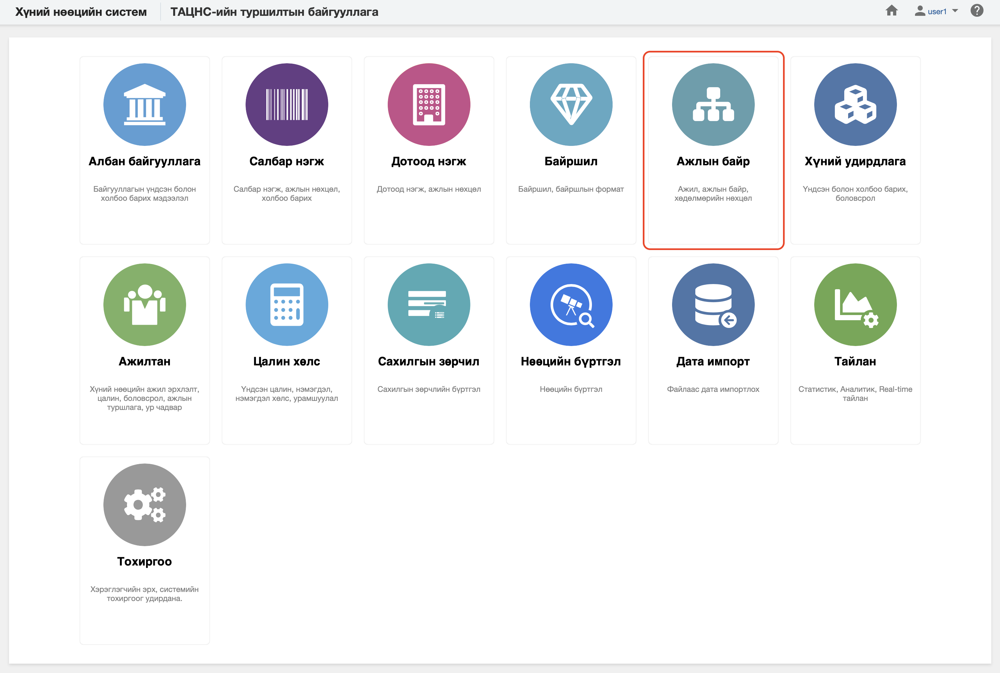

<h1 align="center">Ажлын байр модуль</h1>

  Байгууллага өөрийн зорилго, зорилтод хүрэхийн тулд салбар нэгж, дотоод нэгжид удирдах, гүйцэтгэх, туслах түвшинд ажлын байр, орон тоогоо төлөвлөж
  бүтцээ тодорхойлдог. Ажлын байр, орон тоо бүртгэж үүсгэх, өөрчлөх, удирдахыг төрийн албаны хүний нөөцийн нэгдсэн системд **ажлын байр** модулиар зохион байгуулна. 
 

Төрийн албаны хүний нөөцийн нэгдсэн системийн ажлын байр модуль нь дараах хэсгээс бүрдэнэ.

Үүнд:

- [Хянах самбар](positions/dashboard.md)
- [Жагсаалт, хайлт](positions/list.md)
- [Тайлан](positions/report.md)
- [Үйлдэл](positions/action.md)
