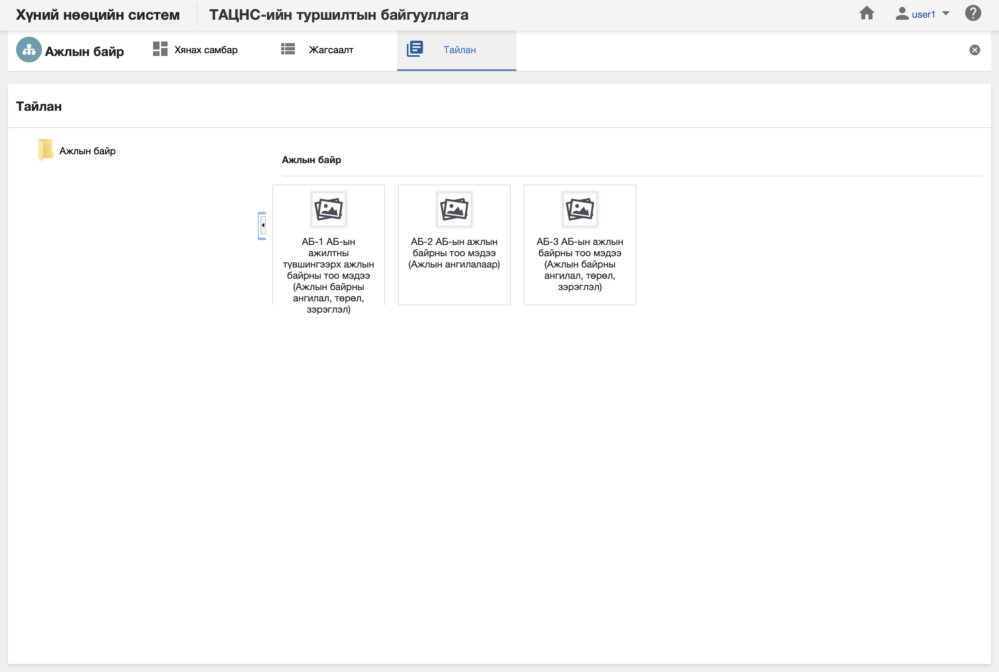

<h1 align="center">Ажлын байр модулийн тайлан</h1>

Албан байгууллагын ажлын байр дэх мэдээлэлд шинжилгээ хийж дата шинжилгээний үр дүнг урьдчилан бэлтгэсэн тайлангуудын загвараар гаргана.

> Тайлантай хэрхэн ажиллах талаар ерөнхий ойлголтыг [тайлантай ажиллах](how-it-works?id=_5-Тайлантай-ажиллах) хэсгээс харна уу.

Ажлын байр дээр дараах тайлангуудыг урьдчилан тодорхойлсон байна.

**Үүнд:**

- **АБ-1 Ажлын байрны тоо мэдээ (Ажлын байрна ангилал, төрөл, дэд төрөл)**
   Байгууллагын ажлын байрны тоог тайлангийн үзүүлэлтээр гаргах тайлан (Ажлын байрна ангилал, төрөл, дэд төрөл)  
- **АБ-2 Ажлын байрны тоо мэдээ (Ажлын ангилалаар)**
   Байгууллагын ажлын байрны тоог тайлангийн үзүүлэлтээр гаргах тайлан (ажлын ангилалар)  
- **АБ-3 Ажлын байрны тоо мэдээ**
   Байгууллагын ажлын байрны тоог тайлангийн үзүүлэлтээр гаргах тайлан (Ажлын байрны ангилал, төрөл, дэд төрөл)  

