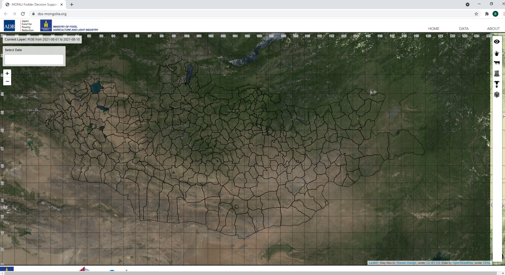
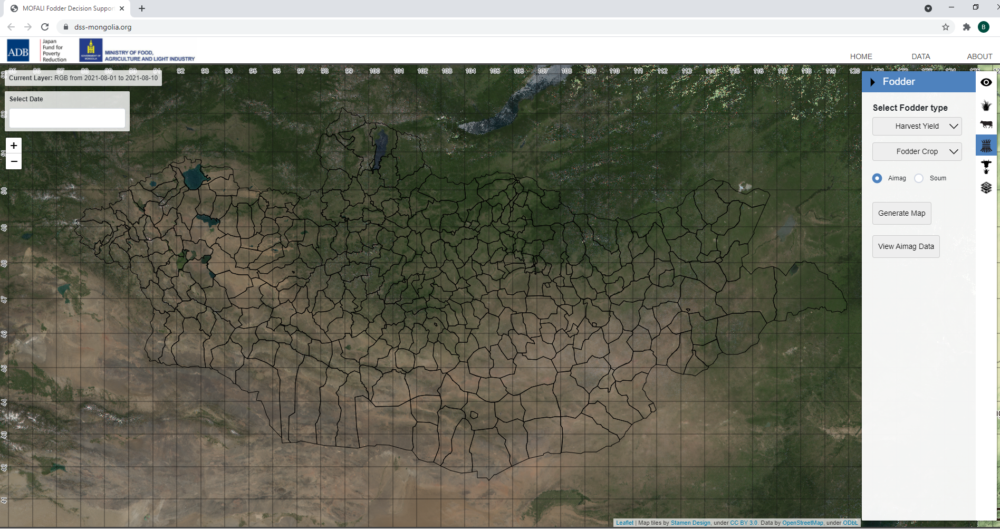
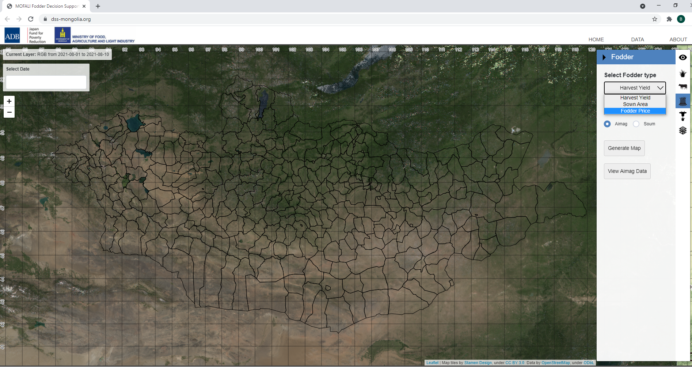
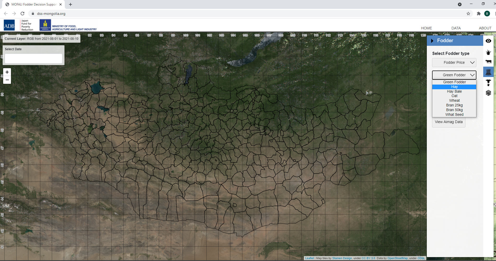
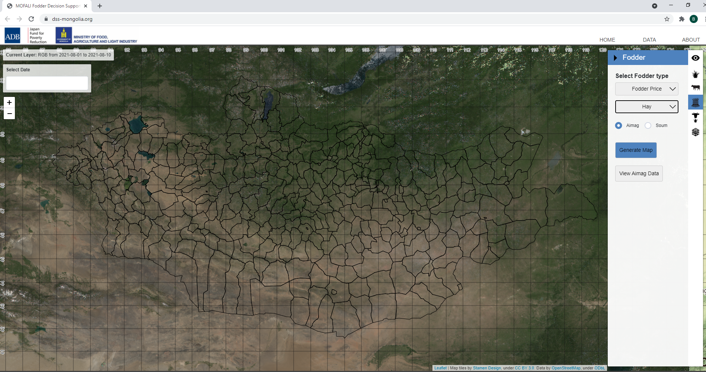
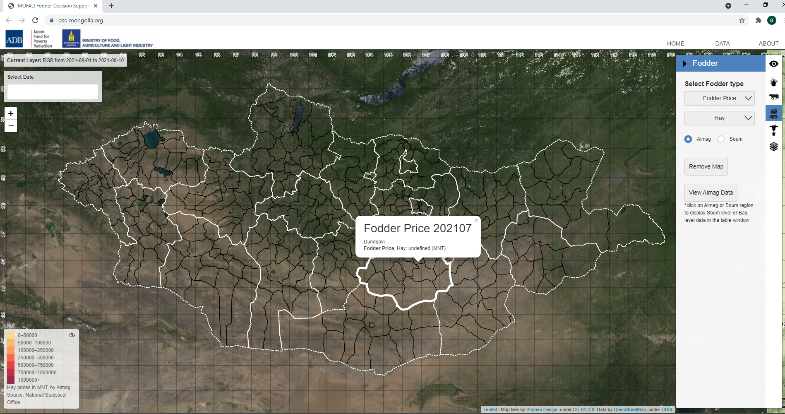

<h1 align="center">DSS-ээс үнийн мэдээлэл авах заавар</h1>

***Тэжээлийн үнийн мэдээллийн талаар дараах холбоосоор харна уу.***  
https://dss-mongolia.org/ 
 

**Вебсайтаас үнийн мэдээлэл харах заавар.**

1. Дээрх холбоос дээр дарахад дараах цонх нээгдэнэ.

2. Цэсэн дэх Тэжээлийн хэсэг буюу **Fodder** гэсэн сонголт дээр дарна. 

3. **Select fodder type** хэсгээс Тэжээлийн үнийн мэдээлэл буюу **Fodder price** хэсгийг сонгоно.

4. Малын тэжээлийн төрлөө сонгоно. 

5. **Generate map** хэсэг дээр дарахад Газрын зураг өөрчлөгдөж харагдана.

6. Дурын аймаг дээр дарахад тухайн аймгийн тэжээлийн шинэчлэгдсэн үнийн мэдээлэл гарж ирнэ.

