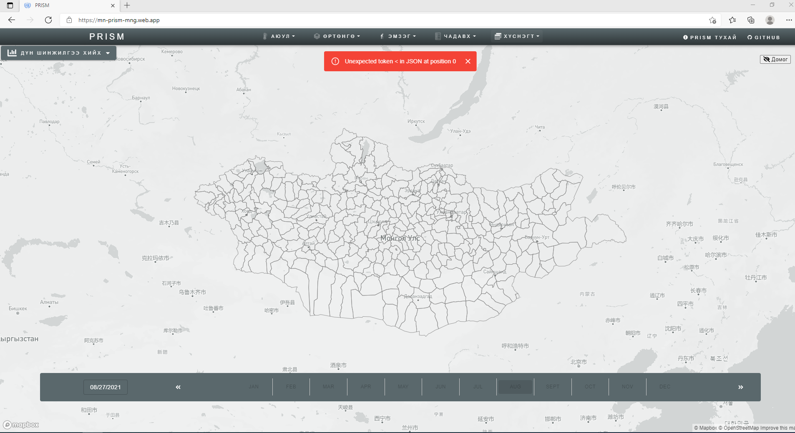
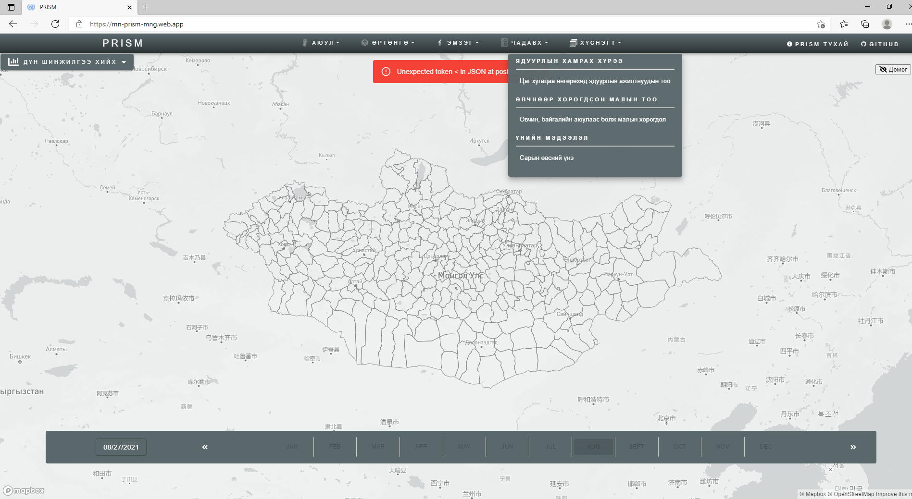
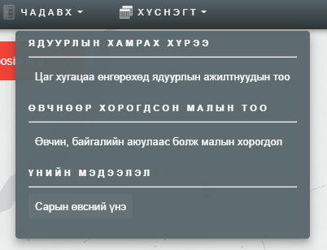
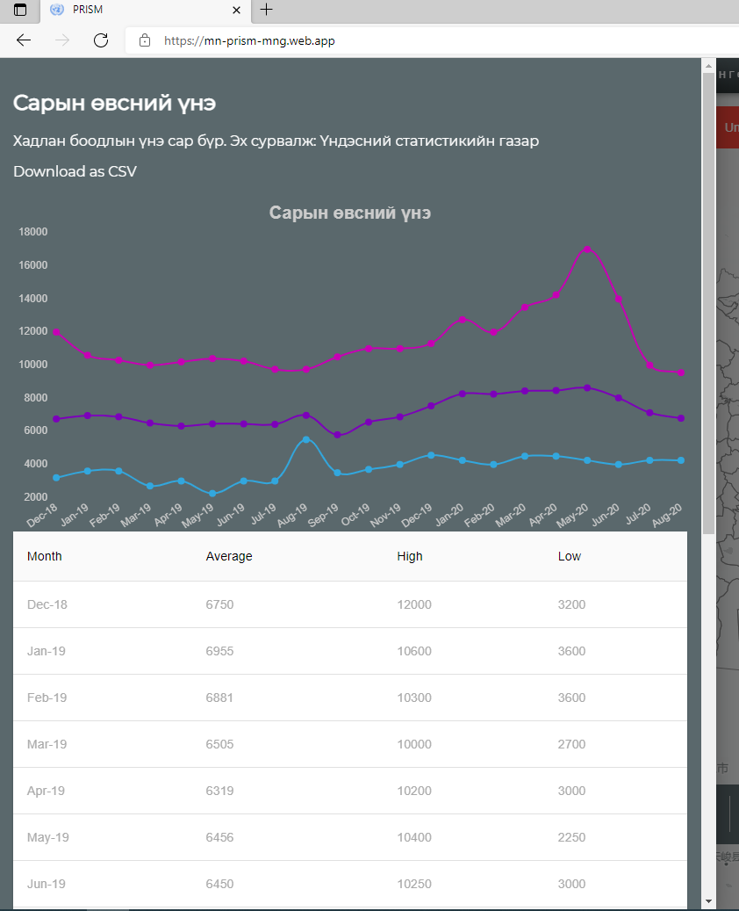

<h1 align="center">Үнийн мэдээлэл</h1>

***Тэжээлийн үнийн мэдээллийн талаар дараах холбоосоор харна уу.***  
https://mn-prism-mng.web.app/
 

**Вебсайтаас үнийн мэдээлэл харах заавар.**

1. Дээрх холбоос дээр дарахад Нүүр хуудас дараах байдлаар гарж ирнэ.  

  
 

2. *Хүснэгт* цэсэн дээр дарна уу.  

  
 

3. *Сарын өвсний үнэ* сонголт дээр дарна уу.  

  
 

4. Тухайн сарын тэжээлийн үнэ дараах байдлаар харагдана.  

  
 