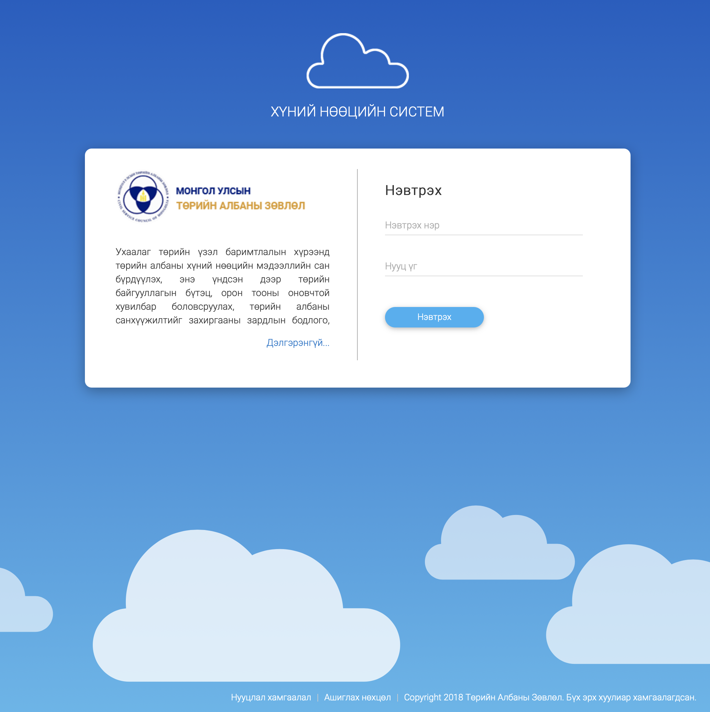

<h1 align="center">Хэрхэн эхлэх вэ?</h1>

Та Төрийн албаны хүний нөөцийн нэгдсэн системийг ашиглахдаа өөрийн төхөөрөмжнөөс веб хөтөч ашиглан **hr.csc.gov.mn** хаягруу хандалт хийнэ. 

Эхлэхээс өмнө [системийн шаардлага](basics.md?id=Системийн-шаардлага) хэсгээс хэрэглэгч систем ашиглахдаа ямар шаардлага хангасан байхыг харна уу.

## Системд нэвтрэх

Веб хөтчийг ашиглан **hr.csc.gov.mn** хаягаар хандаж хэрэглэгчийн нэр, нууц үгийг ашиглан системд нэвтэрнэ.

> Системд нэвтрэх хэрэглэгчийн эрхийг Төрийн албаны зөвлөлийн хариуцсан мэргэжилтэнгээс авна.

## Системтэй ажиллах

Системд нэвтэрсний дараа системийн нүүр хуудас дараах байдлаар харагдана.

> Системтэй хэрхэн ажиллах талаар [Хэрхэн ажиллах вэ?](how-it-works.md) хэсгээс, системийн модулиудтай ажиллах талаар [Системийн модуль](modules.md) хэсгээс дэлгэрэнгүй мэдээллийг харна уу.

## Системээс гарах

Системээс гарах үйлдэл нь дараах хоёр янз байна:

- **Одоо ашиглаж байгаа веб хөтчөөс гарахдаа**
  Баруун дээд буланд байх хэрэглэгчийн нэр дээр дарж, гарч ирсэн цонхноос системээс гарах сонголтыг сонгоно.

- **Нийт нэвтэрсэн бүх веб хөтчөөс гарахдаа**
  Системийн тохиргооны хэсгээс бүх нэвтрэлтээс гарах сонголтыг сонгоно.