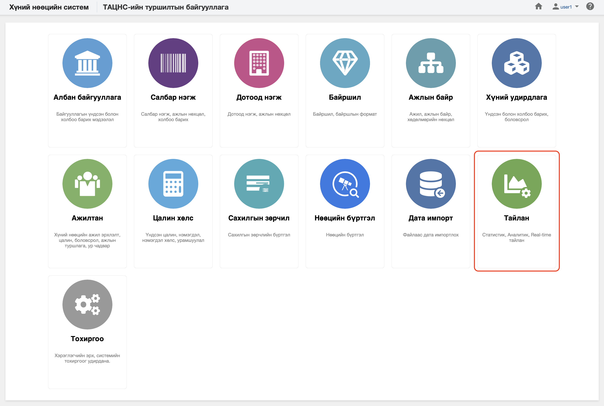

<h1 align="center">Тайлан модуль</h1>

Төрийн албаны хүний нөөцийн нэгдсэн системийн модулиудын мэдээлэлд шинжилгээ хийж дата шинжилгээний үр дүнг урьдчилан бэлтгэсэн тайлангуудын загвараар гаргасан тайланг **ТАЙЛАН** модульд харуулна. 
 

Төрийн албаны хүний нөөцийн нэгдсэн системийн тайлан модуль нь дараах хэсгээс бүрдэнэ.

Үүнд:

- [Албан байгууллага](../legal_entities/report.md)
- [Салбар нэгж](../business_units/report.md)
- [Дотоод нэгж](../departments/report.md)
- [Байршил](../locations/report.md)
- [Ажлын байр](../positions/report.md)
- [Ажилтан](../workers/report.md)
- [Цалин хөлс](../salaries/report.md)
- [Хүний бүртгэл](../people/report.md)
- [Сахилгын зөрчил](../disciplinaries/report.md)
- [Нөөцийн бүртгэл](../resources/report.md)
