<h1 align="center">Нөөцийн бүртгэл модулийн үйлдэл</h1>

Нөөцийн бүртгэлийн мэдээллийн өөрчлөлт, идэвхгүй болгох, зөөх, залруулах, түр түдгэлзүүлэх, идэвхтэй болгох, устгах... зэрэг үйлдлүүдийг хэрэглэгчид зөвшөөрөгдсөн эрхийн дагуу хийж болно.

## Үйлдэл хийх арга зам
Үйлдлийг хийхдээ жагсаалт цонхноос 2 төрлийн арга замаар хийнэ.

- ### 1. Ерөнхий цэс

  Жагсаалтын цонхны баруун дээд буланд байршина.

  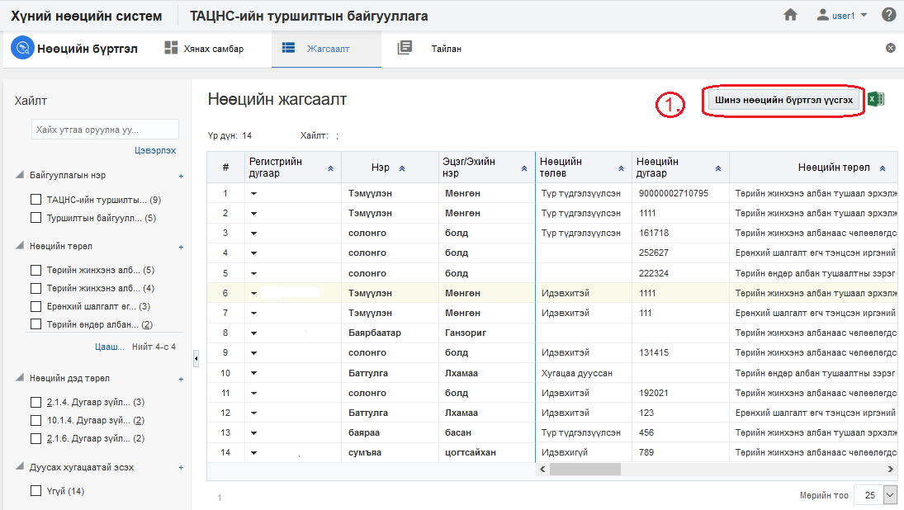

- ### 2. Контекст цэс

  Жагсаалтын цонхны үр дүн харуулах хэсэгт мөр дэх жижиг сум хэлбэртэй цэсийг контекст цэс гэнэ.

  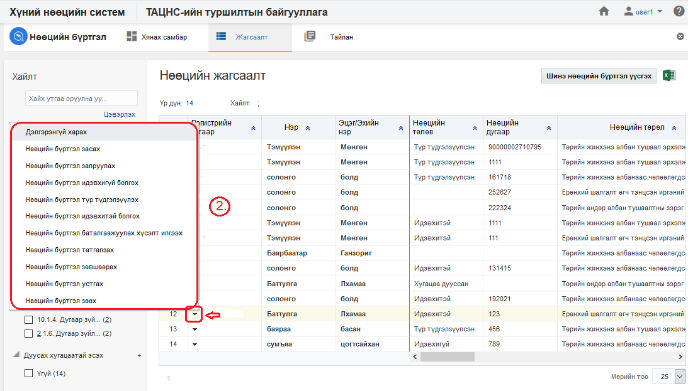

## Нөөцийн бүртгэлийн үйлдлүүд
Нөөцийн бүртгэл модуль дээр дараах үйлдлүүдийг хийж болно.

**Үүнд:**

- [Шинэ нөөцийн бүртгэл үүсгэх](Resources/action.md?id=Шинэ-нөөцийн-бүртгэл-үүсгэх)
- [Жагсаалт экспортлох](Resources/action.md?id=Жагсаалт-экспортлох)
- [Нөөцийн бүртгэлийн профайль](Resources/action.md?id=Нөөцийн-бүртгэлийн-профайль)
- [Нөөцийн бүртгэл засах](Resources/action.md?id=Нөөцийн-бүртгэл-засах)
- [Нөөцийн бүртгэл залруулах](Resources/inaction.md?id=Нөөцийн-бүртгэл-залруулах)
- [Нөөцийн бүртгэл идэвхгүй болгох](Resources/inaction.md?id=Нөөцийн-бүртгэл-идэвхгүй-болгох)
- [Нөөцийн бүртгэл түр түдгэлзүүлэх](Resources/action.md?id=Нөөцийн-бүртгэл-түр-түдгэлзүүлэх)
- [Нөөцийн бүртгэл идэвхтэй болгох](Resources/action.md?id=Нөөцийн-бүртгэл-идэвхтэй-болгох)
- [Нөөцийн бүртгэл баталгаажуулах хүсэлт илгээх](Resources/action.md?id=Нөөцийн-бүртгэл-баталгаажуулах-хүсэлт-илгээх)
- [Нөөцийн бүртгэл татгалзах](Resources/action.md?id=Нөөцийн-бүртгэл-татгалзах)
- [Нөөцийн бүртгэл зөвшөөрөх](Resources/action.md?id=Нөөцийн-бүртгэл-зөвшөөрөх)
- [Нөөцийн бүртгэл устгах](Resources/action.md?id=Нөөцийн-бүртгэл-устгах)
- [Нөөцийн бүртгэл зөөх](Resources/action.md?id=Нөөцийн-бүртгэл-зөөх)

### Шинэ нөөцийн бүртгэл үүсгэх

**Шинэ нөөцийн бүртгэл үүсгэх** үйлдэл нь байгууллагад шинэ нөөц мэдээллийн санд нэмэх үйлдэл юм.

#### Үйлдлийн өмнөх нөхцөл
  Энэхүү үйлдлийг хийхээс өмнө ямар нөхцөл бүрдсэн байхыг энэ хэсэгт жагсаалтаар зааж байна. Үүнд:
  - Нөөцийн бүртгэлийг үүсгэх албан байгууллага системд үүссэн байх

#### Үйлдлийн нөлөөлөл
  Энэхүү үйлдлийг хийх үед бусад мэдээлэлд хэрхэн нөлөөлөх нөлөөллийг заана. Үүнд:
  - Нөөцийн бүртгэлийн хянах самбарын график тоон мэдээлэл өөрчлөгдөнө.
  - Нөөцийн бүртгэлийн жагсаалтад шинэ бичлэг нэмэгдэнэ.
  - Нөөцийн бүртгэлийн тайлангийн тоон мэдээлэл өөрчлөгдөнө.

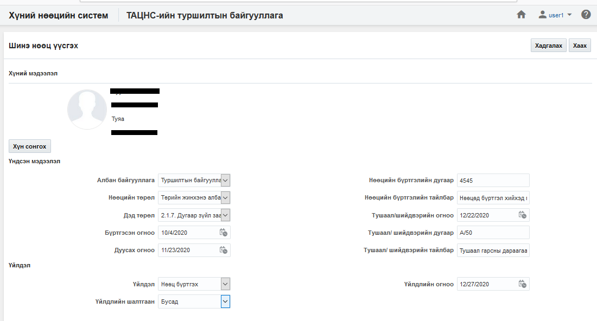

### Жагсаалт экспортлох

**Жагсаалт экспортлох** үйлдэл нь хайлт шүүлтийн үр дүнг майкрософт эксел файлаар экспортлон авах үйлдэл юм.

#### Үйлдлийн өмнөх нөхцөл
  Энэхүү үйлдлийг хийхээс өмнө ямар нөхцөл бүрдсэн байхыг энэ хэсэгт жагсаалтаар зааж байна. Үүнд:
  - Экспортлох мэдээллээ зөв шүүсэн эсэхээ шалгах

#### Үйлдлийн нөлөөлөл
  Энэхүү үйлдлийг хийх үед бусад мэдээлэлд хэрхэн нөлөөлөх нөлөөллийг заана. Үүнд:
  - Систем дээр ямар нэгэн нөлөөлөл байхгүй байна

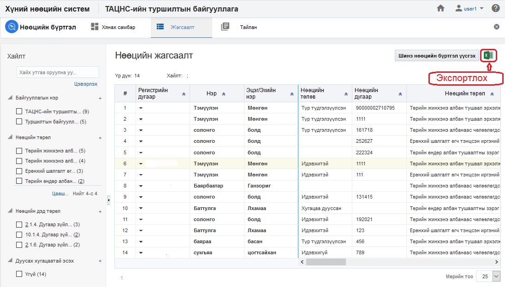

### Нөөцийн бүртгэлийн профайль

**Нөөцийн бүртгэлийн профайль** үйлдэл нь тухайн сонгосон нөөцийн мэдээллийг нэг цонхноос авах боломжийг бүрдүүлнэ.

#### Үйлдлийн өмнөх нөхцөл
  Энэхүү үйлдлийг хийхээс өмнө ямар нөхцөл бүрдсэн байхыг энэ хэсэгт жагсаалтаар зааж байна. Үүнд:
  - Зөв хүн сонгосон эсэхээ шалгах

#### Үйлдлийн нөлөөлөл
  Энэхүү үйлдлийг хийх үед бусад мэдээлэлд хэрхэн нөлөөлөх нөлөөллийг заана. Үүнд:
  - Систем дээр ямар нэгэн нөлөөлөл байхгүй байна

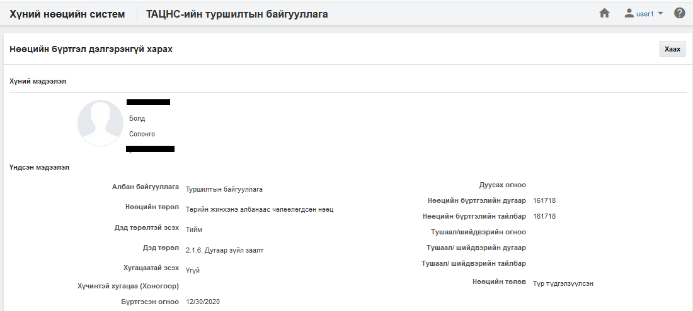

### Нөөцийн бүртгэл засах

**Нөөцийн бүртгэл засах** үйлдэл нь тухайн сонгосон нөөцийн мэдээллийг өөрчлөх боломжийг бүрдүүлнэ.

#### Үйлдлийн өмнөх нөхцөл
  Энэхүү үйлдлийг хийхээс өмнө ямар нөхцөл бүрдсэн байхыг энэ хэсэгт жагсаалтаар зааж байна. Үүнд:
  - Зөв хүнийг сонгосон эсэхээ шалгах

#### Үйлдлийн нөлөөлөл
  Энэхүү үйлдлийг хийх үед бусад мэдээлэлд хэрхэн нөлөөлөх нөлөөллийг заана. Үүнд:
  - Нөөцийн бүртгэлийн хянах самбарын график тоон мэдээлэл өөрчлөгдөнө.
  - Нөөцийн бүртгэлийн жагсаалтын мэдээлэл өөрчлөгдөнө.
  - Нөөцийн бүртгэлийн тайлангийн тоон мэдээлэл өөрчлөгдөнө.

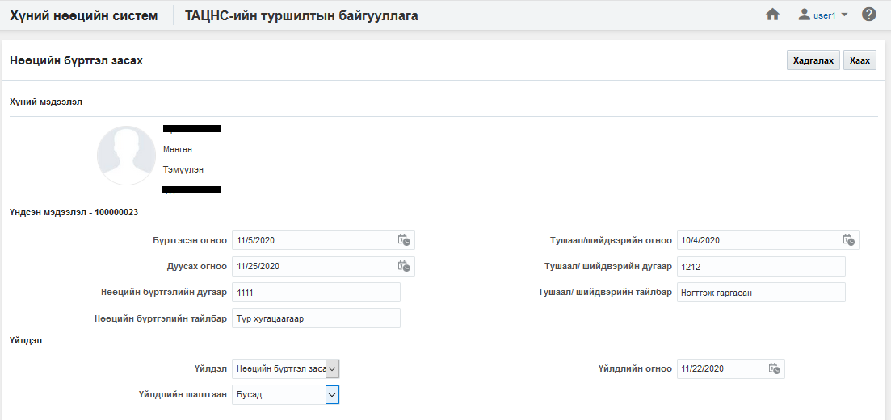

### Нөөцийн бүртгэл залруулах

**Нөөцийн бүртгэл залруулах** үйлдэл нь тухайн сонгосон нөөцийг залруулга хийх боломжийг бүрдүүлнэ. Энэ нь өмнө оруулсан мэдээллийг дарж залруулга хийж байгаа үйлдэл юм.

#### Үйлдлийн өмнөх нөхцөл
  Энэхүү үйлдлийг хийхээс өмнө ямар нөхцөл бүрдсэн байхыг энэ хэсэгт жагсаалтаар зааж байна. Үүнд:
  - Зөв хүн сонгосон эсэхээ шалгах

#### Үйлдлийн нөлөөлөл
  Энэхүү үйлдлийг хийх үед бусад мэдээлэлд хэрхэн нөлөөлөх нөлөөллийг заана. Үүнд:
  - Нөөцийн бүртгэлийн хянах самбарын график тоон мэдээлэл өөрчлөгдөнө.
  - Нөөцийн бүртгэлийн жагсаалтын мэдээлэл өөрчлөгдөнө.
  - Нөөцийн бүртгэлийн тайлангийн тоон мэдээлэл өөрчлөгдөнө.

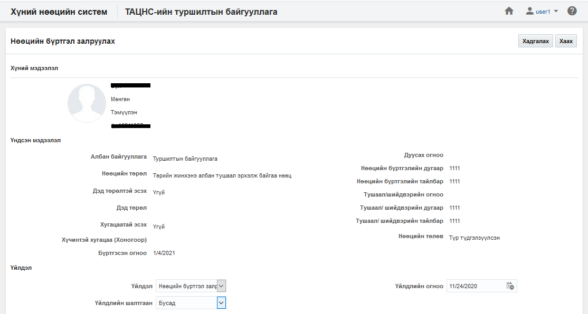

### Нөөцийн бүртгэл идэвхгүй болгох

**Нөөцийн бүртгэл идэвхгүй болгох** үйлдэл нь тухайн сонгосон нөөцийн төлөвийг идэвхгүй төлөвт шилжүүлэх бөгөөд хэрэв нөөцийн бүртгэл нь идэвхгүй төлөвт шилжсэн бол тухайн нөөцийн бүртгэл дээр ямар нэгэн үйлдэл хийх боломжгүй болно. Энэ үйлдлийг зөвхөн **идэвхтэй төлөвтэй нөөцийн бүртгэл** дээр хийх боломжтой.

#### Үйлдлийн өмнөх нөхцөл
  Энэхүү үйлдлийг хийхээс өмнө ямар нөхцөл бүрдсэн байхыг энэ хэсэгт жагсаалтаар зааж байна. Үүнд:
  - Зөв хүн сонгосон эсэхээ шалгах
  - Сонгосон нөөцийн бүртгэлийн төлөв нь идэвхтэй эсэхийг шалгах

#### Үйлдлийн нөлөөлөл
  Энэхүү үйлдлийг хийх үед бусад мэдээлэлд хэрхэн нөлөөлөх нөлөөллийг заана. Үүнд:
  - Нөөцийн бүртгэлийн хянах самбарын график тоон мэдээлэл өөрчлөгдөнө.
  - Нөөцийн бүртгэлийн жагсаалтын мэдээлэл өөрчлөгдөнө
  - Нөөцийн бүртгэлийн тайлангийн тоон мэдээлэл өөрчлөгдөнө.
  - Нөөцийн бүртгэлийн өөрчлөх үйлдлүүд хийх боломжгүй болно.

### Нөөцийн бүртгэл түр түдгэлзүүлэх

**Нөөцийн бүртгэл түр түдгэлзүүлэх** үйлдэл нь тухайн сонгосон нөөцийн бүртгэлийн төлөвийг түр түдгэлзүүлсэн төлөвт шилжүүлэх бөгөөд хэрэв нөөцийн бүртгэл нь түр түдгэлзүүлсэн төлөвт шилжсэн бол тухайн нөөцийн бүртгэл дээр ямар нэгэн үйлдэл хийх боломж түр хаагдана. Энэ үйлдлийг зөвхөн **идэвхтэй төлөвтэй нөөцийн бүртгэл** дээр хийх боломжтой.

#### Үйлдлийн өмнөх нөхцөл
  Энэхүү үйлдлийг хийхээс өмнө ямар нөхцөл бүрдсэн байхыг энэ хэсэгт жагсаалтаар зааж байна. Үүнд:
  - Зөв хүн сонгосон эсэхээ шалгах
  - Сонгосон нөөцийн бүртгэлийн төлөв нь идэвхтэй эсэхийг шалгах

#### Үйлдлийн нөлөөлөл
  Энэхүү үйлдлийг хийх үед бусад мэдээлэлд хэрхэн нөлөөлөх нөлөөллийг заана. Үүнд:
  - Нөөцийн бүртгэлийн хянах самбарын график тоон мэдээлэл өөрчлөгдөнө.
  - Нөөцийн бүртгэлийн жагсаалтын мэдээлэл өөрчлөгдөнө
  - Нөөцийн бүртгэлийн тайлангийн тоон мэдээлэл өөрчлөгдөнө.
  - Нөөцийн бүртгэлийн өөрчлөх үйлдлүүд хийх боломжгүй болно.

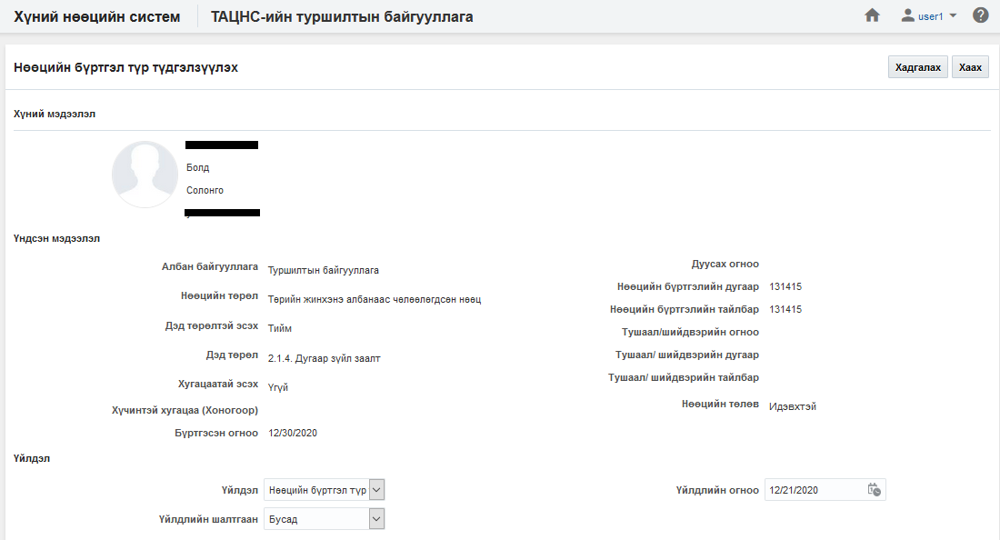

### Нөөцийн бүртгэл идэвхтэй болгох

**Нөөцийн бүртгэл идэвхтэй болгох** үйлдэл нь тухайн сонгосон нөөцийн бүртгэлийн төлөвийг идэвхтэй төлөвт шилжүүлэх үйлдэл юм. Энэ үйлдэл нь зөвхөн **идэвхгүй** нөөцийн бүртгэл дээр хийгдэх боломжтой.

#### Үйлдлийн өмнөх нөхцөл
  Энэхүү үйлдлийг хийхээс өмнө ямар нөхцөл бүрдсэн байхыг энэ хэсэгт жагсаалтаар зааж байна. Үүнд:
  - Зөв хүн сонгосон эсэхээ шалгах
  - Сонгосон нөөцийн бүртгэлийн төлөв идэвхгүй эсэхийг шалгах

#### Үйлдлийн нөлөөлөл
  Энэхүү үйлдлийг хийх үед бусад мэдээлэлд хэрхэн нөлөөлөх нөлөөллийг заана. Үүнд:
  - Нөөцийн бүртгэлийн хянах самбарын график тоон мэдээлэл өөрчлөгдөнө.
  - Нөөцийн бүртгэлийн жагсаалтын мэдээлэл өөрчлөгдөнө.
  - Нөөцийн бүртгэлийн тайлангийн тоон мэдээлэл өөрчлөгдөнө.
  - Нөөцийн бүртгэлийн өөрчлөх үйлдлүүд хийх боломжтой болно.

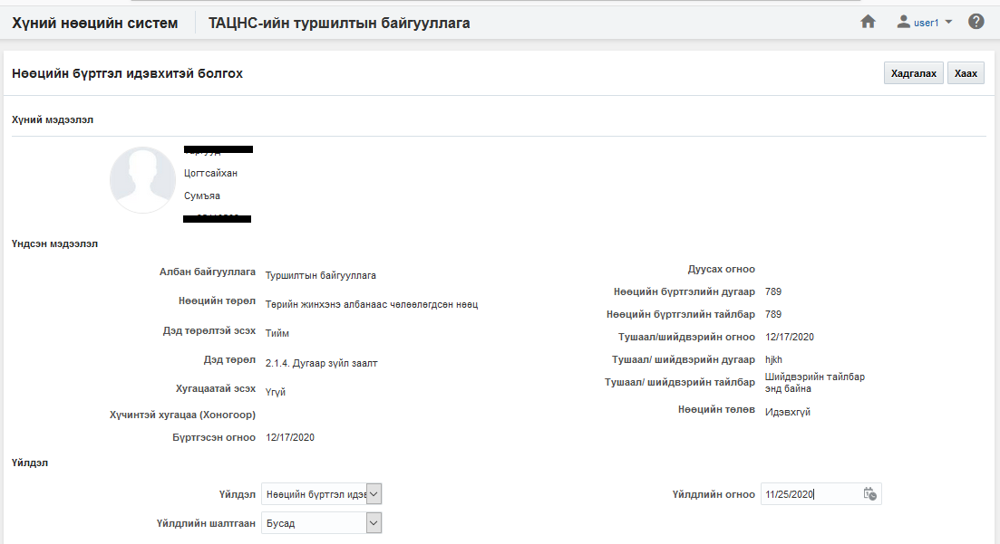

### Нөөцийн бүртгэл баталгаажуулах хүсэлт илгээх

**Нөөцийн бүртгэл баталгаажуулах хүсэлт илгээх** үйлдэл нь тухайн сонгосон нөөцийн бүртгэлийн төлөвийг зөвшөөрөх болон татгалзах төлөвт шилжүүлэх үйлдэл юм. Энэ үйлдэл нь зөвхөн **шинэ** болон **татгалзсан** нөөцийн бүртгэл дээр хийгдэх боломжтой.

#### Үйлдлийн өмнөх нөхцөл
  Энэхүү үйлдлийг хийхээс өмнө ямар нөхцөл бүрдсэн байхыг энэ хэсэгт жагсаалтаар зааж байна. Үүнд:
  - Зөв хүн сонгосон эсэхээ шалгах
  - Сонгосон нөөцийн бүртгэлийн төлөв шинэ эсвэл татгалзсан эсэхийг шалгах

#### Үйлдлийн нөлөөлөл
  Энэхүү үйлдлийг хийх үед бусад мэдээлэлд хэрхэн нөлөөлөх нөлөөллийг заана. Үүнд:
  - Нөөцийн бүртгэлийн хянах самбарын график тоон мэдээлэл өөрчлөгдөнө.
  - Нөөцийн бүртгэлийн жагсаалтын мэдээлэл өөрчлөгдөнө.
  - Нөөцийн бүртгэлийн тайлангийн тоон мэдээлэл өөрчлөгдөнө.

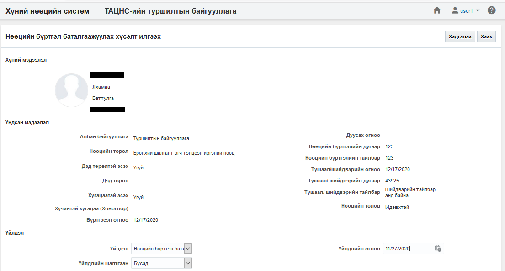

### Нөөцийн бүртгэл татгалзах
**Нөөцийн бүртгэл татгалзах** үйлдэл нь тухайн сонгосон нөөцийг эрх бүхий этгээд татгалзах үйлдэл юм. Энэ үйлдэл нь нөөцийн бүртгэл баталгаажуулах үйлдэл хийсэн үед хийгдэнэ.

#### Үйлдлийн өмнөх нөхцөл
  Энэхүү үйлдлийг хийхээс өмнө ямар нөхцөл бүрдсэн байхыг энэ хэсэгт жагсаалтаар зааж байна. Үүнд:
  - Зөв хүн сонгосон эсэхийг шалгах
  - Сонгосон нөөцийн бүртгэлийн төлөв баталгаажуулах хүсэлт илгээсэн эсэхийг шалгах 

#### Үйлдлийн нөлөөлөл
  Энэхүү үйлдлийг хийх үед бусад мэдээлэлд хэрхэн нөлөөлөх нөлөөллийг заана. Үүнд:
  - Нөөцийн бүртгэлийн хянах самбарын график тоон мэдээлэл өөрчлөгдөнө.
  - Нөөцийн бүртгэлийн жагсаалтын мэдээлэл өөрчлөгдөнө.
  - Нөөцийн бүртгэлийн тайлангийн тоон мэдээлэл өөрчлөгдөнө.

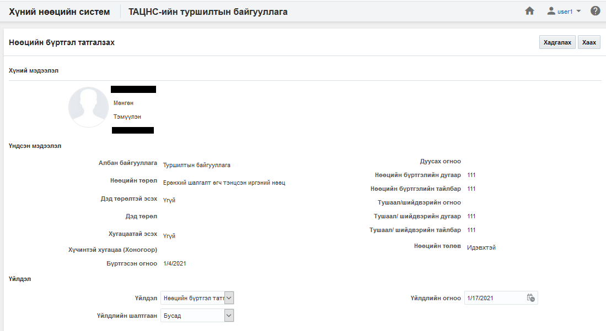

### Нөөцийн бүртгэл зөвшөөрөх

**Нөөцийн бүртгэл зөвшөөрөх** үйлдэл нь тухайн сонгосон нөөцийг зөвшөөрөх үйлдэл юм. Энэ үйлдэл нь нөөцийн бүртгэл баталгаажуулах үйлдэл хийсэн үед хийгдэнэ.

#### Үйлдлийн өмнөх нөхцөл
  Энэхүү үйлдлийг хийхээс өмнө ямар нөхцөл бүрдсэн байхыг энэ хэсэгт жагсаалтаар зааж байна. Үүнд:
  - Зөв хүн сонгосон эсэхийг шалгах
  - Сонгосон нөөцийн бүртгэлийн төлөв баталгаажуулах хүсэлт илгээсэн эсэхийг шалгах 

#### Үйлдлийн нөлөөлөл
  Энэхүү үйлдлийг хийх үед бусад мэдээлэлд хэрхэн нөлөөлөх нөлөөллийг заана. Үүнд:
  - Нөөцийн бүртгэлийн хянах самбарын график тоон мэдээлэл өөрчлөгдөнө.
  - Нөөцийн бүртгэлийн жагсаалтын мэдээлэл өөрчлөгдөнө.
  - Нөөцийн бүртгэлийн тайлангийн тоон мэдээлэл өөрчлөгдөнө.

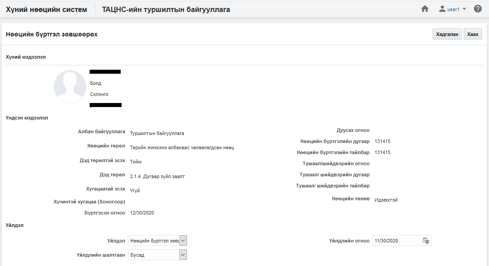

### Нөөцийн бүртгэл устгах

**Нөөцийн бүртгэл устгах** үйлдэл нь тухайн сонгосон нөөцийн бүртгэлийг буруу үүсгэсэн үед ашиглах бөгөөд тухайн нөөцийн бүртгэл болон түүнтэй холбоотой бүх мэдээллийг систем дээрээс бүр мөсөн устгах үйлдэл юм. Энэ үйлдлийг хийснээс хойш нөөцийн бүртгэлийн төлөвийг [энд](legal/delete_policy.md) заагдсан хугацааны турш **устгасан төлөвт** байлгах бөгөөд түүний дараа систем автоматаар устгана.

#### Үйлдлийн өмнөх нөхцөл
  Энэхүү үйлдлийг хийхээс өмнө ямар нөхцөл бүрдсэн байхыг энэ хэсэгт жагсаалтаар зааж байна. Үүнд:
  - Зөв хүн сонгосон эсэхийг шалгах
  - Сонгосон нөөцийн бүртгэлийн төлөв нь идэвхтэй, идэвхгүй, түр түдгэлзүүлсэн төлөвт байгаа эсэхийг шалгах

#### Үйлдлийн нөлөөлөл
  Энэхүү үйлдлийг хийх үед бусад мэдээлэлд хэрхэн нөлөөлөх нөлөөллийг заана. Үүнд:
  - Нөөцийн бүртгэлийн хянах самбарын график тоон мэдээлэл өөрчлөгдөнө.
  - Нөөцийн бүртгэлийн жагсаалтын мэдээлэл өөрчлөгдөнө.
  - Нөөцийн бүртгэлийн тайлангийн тоон мэдээлэл өөрчлөгдөнө.

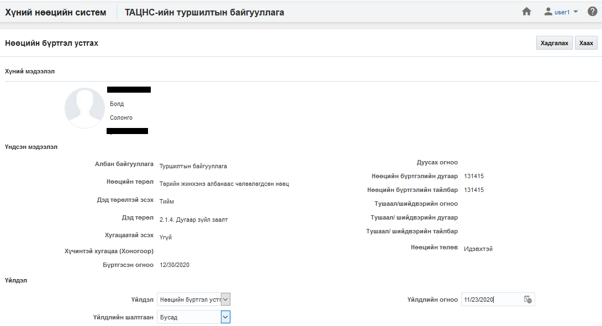

### Нөөцийн бүртгэл шилжүүлэх

**Нөөцийн бүртгэл шилжүүлэх** үйлдэл нь тухайн сонгосон нөөцийг бусад нөөцийн төрөл, дэд төрөл рүү шилжүүлэх үйлдэл юм. Өөрөөр хэлбэл бүртгэсэн нөөцийн төрөл, дэд төрлийг өөрчилж шилжүүлэх үйлдэл юм.

#### Үйлдлийн өмнөх нөхцөл
  Энэхүү үйлдлийг хийхээс өмнө ямар нөхцөл бүрдсэн байхыг энэ хэсэгт жагсаалтаар зааж байна. Үүнд:
  - Зөв хүн сонгосон эсэхийг шалгах

#### Үйлдлийн нөлөөлөл
  Энэхүү үйлдлийг хийх үед бусад мэдээлэлд хэрхэн нөлөөлөх нөлөөллийг заана. Үүнд:
  - Нөөцийн бүртгэлийн хянах самбарын график тоон мэдээлэл өөрчлөгдөнө.
  - Нөөцийн бүртгэлийн жагсаалтын мэдээлэл өөрчлөгдөнө.
  - Нөөцийн бүртгэлийн тайлангийн тоон мэдээлэл өөрчлөгдөнө.

