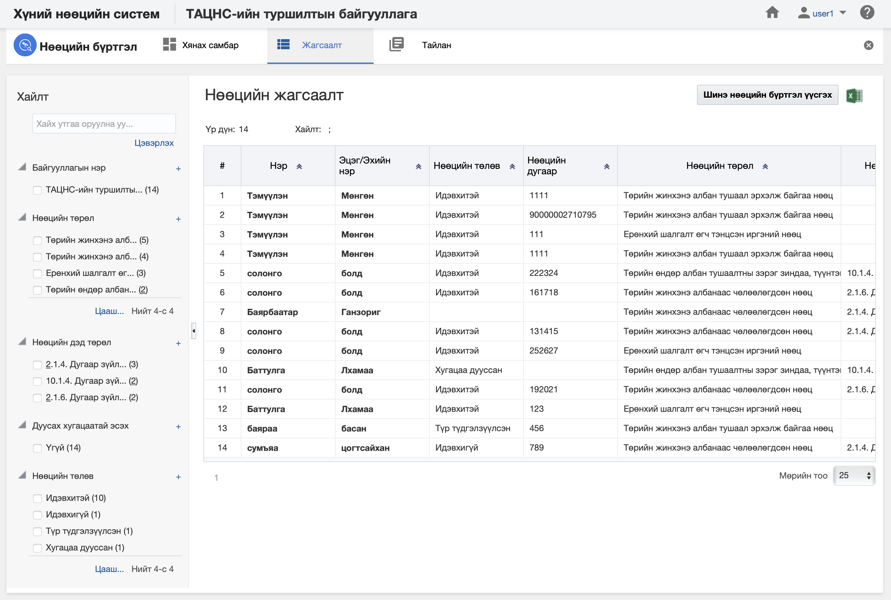
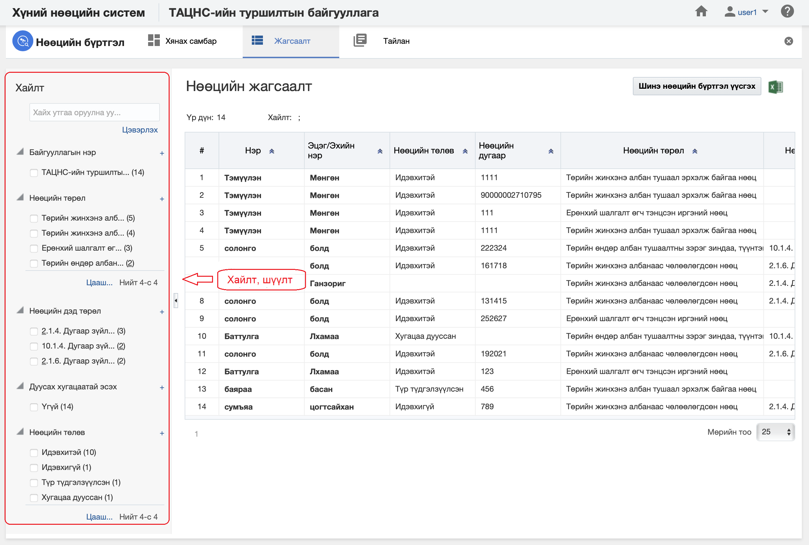
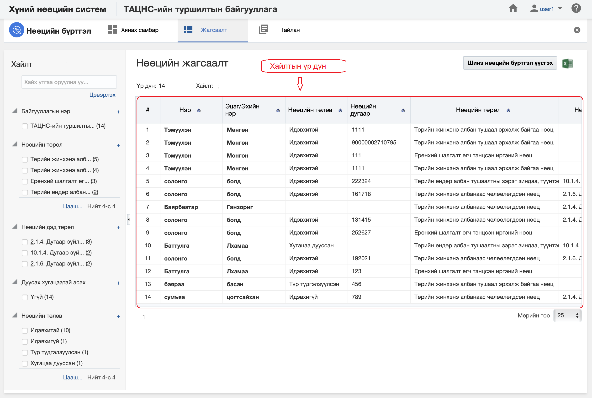

<h1 align="center">Нөөцийн бүртгэл модулийн жагсаалт, хайлт</h1>

Тухайн байгууллагад бүртгэсэн нийт нөөцийн бүртгэлийн жагсаалтыг энэ хэсэгт харуулах ба хэрэглэгчийн эрх, үүргийн дагуу үйлдэл хийх боломжийг олгоно.

> Жагсаалт, хайлттай ажиллах талаар ерөнхий ойлголтыг [жагсаалт, хайлттай ажиллах](how-it-works?id=_3-Жагсаалт-хайлттай-ажиллах) хэсгээс харна уу.

Нөөцийн бүртгэлийн жагсаалтын энэ хэсэгт үйлдлүүдийг хийнэ.

### Нарийвчилсан хайлт

Нөөцийн бүртгэлийг дараах төрлүүдээр нарийвчилан хайх боломжтой.

> Дээрх зурганд нөөцийн бүртгэлийн хайлт, шүүлтийн хэсгийг харуулж байна.

#### Нарийвчилсан хайлтын төрөл:

- **Байгууллага**
     Байгууллага. Нөөцийг бүртгэх байгууллага 
- **Нөөцийн төрөл**
     Нөөцийн төрөл. Нөөц нь Төрийн жинхэнэ албан тушаал эрхэлж байгаа нөөц, Удирдах албан тушаалтны нөөц, Төрийн жинхэнэ албанаас түр болон чөлөөлөгдсөн нөөц, Ерөнхий шалгалт өгч тэнцсэн иргэний нөөц, Төрийн зардлаар их, дээд сургуульд суралцуулж төгссөн иргэний нөөц төрлүүдтэй.
- **Нөөцийн дэд төрөл**
     Нөөцийн дэд төрөл. Нөөцийн сонгогдсон төрлөөс шалтгаалж нөөцийн дэд төрлийн ангилал өөрчлөгдөж гарна.
- **Дуусах хугацаатай эсэх**
     Дуусах хугацаатай эсэх. Нөөцийн бүртгэлийн дуусах хугацаатай эсэхийг тэмдэглэнэ.
- **Нөөцийн төлөв**
     Нөөцийн төлөв. Нөөцийн бүртгэл нь идэвхтэй, идэвхгүй, түр түдгэлзүүлсэн, хугацаа дууссан..... гэсэн төлөвтэй.

### Жагсаалтын мэдээлэл

Нөөцийн бүртгэлийн хайлтын үр дүнг жагсаалт хэлбэрээр харуулна.

> Дээрх зурганд нөөцийн бүртгэлийн жагсаалтын үр дүнг харуулж байна.

#### Хайлтын үр дүнгийн мэдээлэл:

- **Регистрийн дугаар**
     Регистрийн дугаар. Нөөцөд бүртгэлтэй байгаа хүний регистрийн дугаар
- **Нэр**
     Нэр. Нөөцөд бүртгэлтэй хүний нэр
- **Эцэг /эх/-ийн нэр**
     Эцэг /эх/-ийн нэр. Нөөцөд бүртгэлтэй хүний эцэг /эх/-ийн нэр
- **Нөөцийн төлөв**
     Нөөцийн төлөв. Нөөцөд бүртгэлтэй хүний нөөцийн бүртгэл дэх төлөв.
- **Нөөцийн дугаар**
     Нөөцийн дугаар. Нөөцийн бүртгэл дэх хүний давхцахгүй дугаар
- **Нөөцийн төрөл**
     Нөөцийн төрөл. Нөөцөд бүртгэлтэй хүний нөөцийн төрөл
- **Нөөцийн дэд төрөл**
     Нөөцийн дэд төрөл. Нөөцөд бүртгэлтэй хүний нөөцийн дэд төрөл
- **Бүртгэсэн огноо**
     Бүртгэсэн огноо. Нөөцөд бүртгэсэн огноо
- **Дуусах огноо**
     Дуусах огноо. Нөөцийн дуусах огноо
- **Тушаал /шийдвэрийн дугаар**
     Тушаал /шийдвэрийн дугаар. Нөөцөд бүртгэсэн тушаал /шийдвэрийн дугаар
- **Тушаал /шийдвэрийн огноо**
     Тушаал /шийдвэрийн огноо. Нөөцөд бүртгэсэн тушаал /шийдвэрийн огноо
- **Тушаал /шийдвэрийн тайлбар**
     Тушаал /шийдвэрийн тайлбар. Нөөцөд бүртгэсэн тушаал /шийдвэрийн тайлбар
- **Нөөцийн бүртгэлийн тайлбар**
     Нөөцийн бүртгэлийн тайлбар. Нөөцийн бүртгэлийн тайлбар