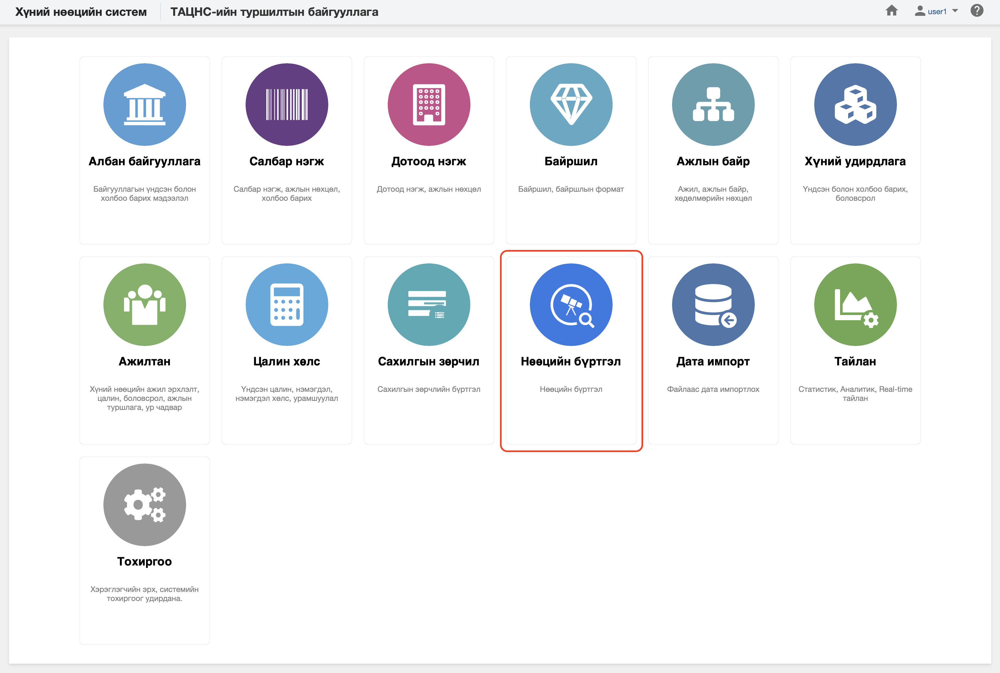

<h1 align="center">Нөөцийн бүртгэл модуль</h1>

Байгууллага нь нөөцөд хүнийг бүртгэх, мэдээллийг өөрчлөх, удирдахыг төрийн албаны хүний нөөцийн нэгдсэн системд **нөөцийн бүртгэл** модулиар зохион байгуулна. 
 

Төрийн албаны хүний нөөцийн нэгдсэн системийн нөөцийн бүртгэл модуль нь дараах хэсгээс бүрдэнэ.

Үүнд:

- [Хянах самбар](resources/dashboard.md)
- [Жагсаалт, хайлт](resources/list.md)
- [Тайлан](resources/report.md)
- [Үйлдэл](resources/action.md)
