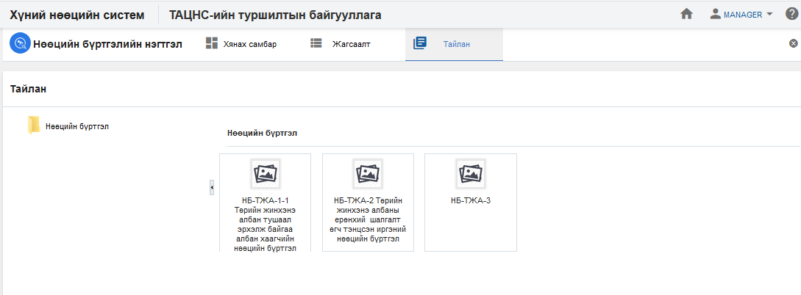

<h1 align="center">Нөөцийн бүртгэл модулийн тайлан</h1>

Албан байгууллагын нөөцийн бүртгэл дэх мэдээлэлд шинжилгээ хийж дата шинжилгээний үр дүнг урьдчилан бэлтгэсэн тайлангуудын загвараар гаргана.

> Тайлантай хэрхэн ажиллах талаар ерөнхий ойлголтыг [тайлантай ажиллах](how-it-works?id=_5-Тайлантай-ажиллах) хэсгээс харна уу.

Нөөцийн бүртгэл дээр дараах тайлангуудыг урьдчилан тодорхойлсон байна.

**Үүнд:**

- **НБ-ТЖА-1 Нөөцийн бүртгэлийн тоо мэдээ (Төрийн жинхэнэ албан тушаал эрхэлж байгаа албан хаагчийн нөөцийн бүртгэл)**
   Байгууллагын нөөцийн бүртгэлийн тоог тайлангийн үзүүлэлтээр гаргах тайлан (Төрийн жинхэнэ албан тушаал эрхэлж байгаа албан хаагчийн нөөцийн бүртгэл)  
- **АБ-2 Нөөцийн бүртгэлийн тоо мэдээ (Төрийн жинхэнэ албаны ерөнхий шалгалт өгч тэнцсэн иргэний нөөцийн бүртгэл)**
   Байгууллагын нөөцийн бүртгэлийн тоог тайлангийн үзүүлэлтээр гаргах тайлан (Төрийн жинхэнэ албаны ерөнхий шалгалт өгч тэнцсэн иргэний нөөцийн бүртгэл)  
- **НБ-ТЖ-3 Нөөцийн бүртгэлийн тоо мэдээ**
   Байгууллагын нөөцийн бүртгэлийн тоог тайлангийн үзүүлэлтээр гаргах тайлан   

