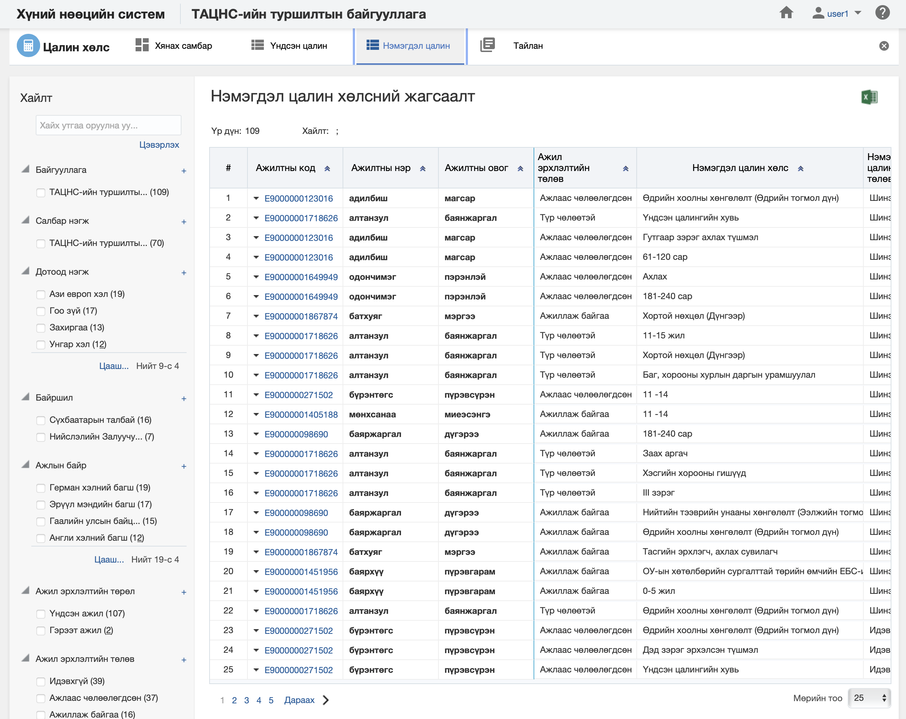
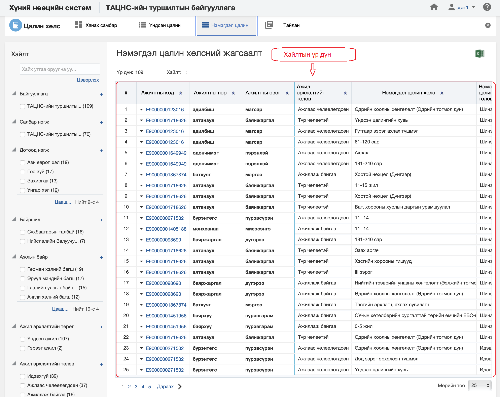

<h1 align="center">Нэмэгдэл цалин хөлсний жагсаалт, хайлт</h1>

Тухайн байгууллагад бүртгэсэн нийт ажилтны нэмэгдэл цалин хөлсний жагсаалтыг энэ хэсэгт харуулах ба хэрэглэгчийн эрх, үүргийн дагуу үйлдэл хийх боломжийг олгоно.

> Жагсаалт, хайлттай ажиллах талаар ерөнхий ойлголтыг [жагсаалт, хайлттай ажиллах](how-it-works?id=_3-Жагсаалт-хайлттай-ажиллах) хэсгээс харна уу.

Ажилтны нэмэгдэл цалин хөлсний жагсаалтын энэ хэсэгт үйлдлүүдийг хийнэ.

### Нарийвчилсан хайлт

Ажилтны нэмэгдэл цалин хөлсийг дараах төрлүүдээр нарийвчилан хайх боломжтой.

> Дээрх зурганд нэмэгдэл цалин хөлсний хайлт, шүүлтийн хэсгийг харуулж байна.

#### Нарийвчилсан хайлтын төрөл:

- **Байгууллага**
     Байгууллага
- **Салбар нэгж**
     Салбар нэгж
- **Дотоод нэгж**
     Дотоод нэгж
- **Байршил**
     Байршил
- **Ажлын байр**
     Ажлын байр
- **Ажил эрхлэлтийн төрөл**
     Ажил эрхлэлтийн төрөл
- **Ажил эрхлэлтийн төлөв**
     Ажил эрхлэлтийн төлөв
- **Нэмэгдэл цалин хөлс**
     Нэмэгдэл цалин хөлс
- **Олгох давтамж**
     Олгох давтамж
- **Тооцох суурь**
     Тооцох суурь
- **Мөнгөн тэмдэгт**
     Мөнгөн тэмдэгт
- **Нэмэгдэл цалин хөлсний төлөв**
     Нэмэгдэл цалин хөлсний төлөв. Нэмэгдэл цалин хөлсний төлөв нь идэвхтэй, идэвхгүй... гэх мэт төлөвтэй байна
- **Цалингийн схем**
     Цалингийн схем
- **Цалингийн зэрэглэл**
     Цалингийн зэрэглэл
- **Цалингийн шатлал**
     Цалингийн шатлал
- **Цалин бодолтын төлөв**
     Цалин бодолтын төлөв.
- **Удирдах ажилтан эсэх**
     Удирдах ажилтан эсэх
- **Байнгын ажил/ Түр ажил**
     Байнгын ажил/ Түр ажил
- **Бүтэн цагийн ажил/ Цагийн ажил**
     Бүтэн цагийн ажил/ Цагийн ажил
- **Ажилтны түвшин**
     Ажилтны түвшин. Удирдах, гүйцэтгэх, туслах ажилтан гэсэн төрлүүдтэй
- **Ажлын байрны ангилал**
     Ажлын байрны ангилал
- **Ажлын байрны төрөл**
     Ажлын байрны төрөл
- **Ажлын байрны дэд төрөл**
     Ажлын байрны дэд төрөл
- **Ажлын хуваарь**
     Ажлын хуваарь
- **Туршилтын хугацаатай эсэх**
     Туршилтын хугацаатай эсэх.
- **ҮЭ-ийн гишүүн эсэх**
     ҮЭ-ийн гишүүн эсэх
- **ХХОАТ төлөх эсэх**
     ХХОАТ төлөх эсэх
- **Даатгуулагчийн төрөл**
     Даатгуулагчийн төрөл

### Жагсаалтын мэдээлэл

Ажилтны нэмэгдэл цалин хөлсний хайлтын үр дүнг жагсаалт хэлбэрээр харуулна.

> Дээрх зурганд нэмэгдэл цалин хөлсний жагсаалтын үр дүнг харуулж байна.

#### Хайлтын үр дүнгийн мэдээлэл:

- **Ажилтны код**
     Ажилтны код
- **Ажилтны нэр**
     Ажилтны нэр
- **Ажилтны эцэг /эх/-ийн нэр**
     Ажилтны эцэг /эх/-ийн нэр. Ажилтны эцэг /эх/-ийн нэр
- **Ажил эрхлэлтийн төлөв**
     Ажил эрхлэлтийн төлөв
- **Нэмэгдэл цалин хөлс**
     Нэмэгдэл цалин хөлс
- **Нэмэгдэл цалин хөлсний төлөв**
     Нэмэгдэл цалин хөлсний төлөв. Нэмэгдэл цалин хөлсний төлөв нь идэвхтэй, идэвхгүй... гэх мэт төлөвтэй байна
- **Тооцох суурь**
     Тооцох суурь
- **Хувь**
     Хувь
- **Мөнгөн дүн**
     Мөнгөн дүн
- **Мөнгөн тэмдэгт**
     Мөнгөн тэмдэгт
- **Олгох давтамж**
     Олгох давтамж
- **Олгож эхлэх огноо**
     Олгож эхлэх огноо
- **Олгож дуусах огноо**
     Олгож дуусах огноо
- **Холбоотой ажил эрхлэлт**
     Холбоотой ажил эрхлэлт
- **Албан тушаал**
     Албан тушаал
- **Байгууллага**
     Байгууллага
- **Салбар нэгж**
     Салбар нэгж
- **Дотоод нэгж**
     Дотоод нэгж
- **Байршил**
     Байршил
- **Ажлын байр**
     Ажлын байр
- **Цалингийн схем**
     Цалингийн схем. Ажилтны цалингийн схем
- **Цалингийн зэрэглэл**
     Цалингийн зэрэглэл. Ажилтны цалингийн зэрэглэл
- **Цалингийн шатлал**
     Цалингийн шатлал. Ажилтны цалингийн шатлал
- **Цалинтай эсэх**
     Цалинтай эсэх. Ажилтны цалинтай эсэх
- **Цалин бодолтын төлөв**
     Цалин бодолтын төлөв
 **Удирдах ажилтан эсэх**
     Удирдах ажилтан эсэх
- **Байнгын ажил/ Түр ажил**
     Байнгын ажил/ Түр ажил
- **Бүтэн цагийн ажил /Цагийн ажил**
     Бүтэн цагийн ажил /Цагийн ажил. Ажлын байр нь бүтэн цагийн, цагийн эсэхийг ялгана.
- **Ажилтны түвшин**
     Ажилтны түвшин. Ажлын байр нь удирдах, гүйцэтгэх, туслахын аль нь болохыг тодорхойлно.
- **Ажлын байрны ангилал**
     Ажлын байрны ангилал. Ажилтны ажлын байрны ангилал мэдээлэл
- **Ажлын байрны төрөл**
     Ажлын байрны төрөл. Ажилтны ажлын байрны төрөл
- **Ажлын байрны дэд төрөл**
     Ажлын байрны дэд төрөл. Ажилтны ажлын байрны дэд төрөл
 **Удирдах ажилтны нэр**
     Удирдах ажилтны нэр
- **Удирдах ажилтны эцэг /эх/-ийн нэр**
     Удирдах ажилтны эцэг /эх/-ийн нэр
- **Удирдах ажилтны албан тушаал**
     Удирдах ажилтны албан тушаал
- **Туршилтын хугацаатай эсэх**
     Туршилтын хугацаатай эсэх. Ажлын байр нь туршилтын хугацаатай эсэхийг харуулна.
- **Туршилтын хугацаа эхлэх огноо**
     Туршилтын хугацаа эхлэх огноо
- **Туршилтын хугацаа дуусах огноо**
     Туршилтын хугацаа дуусах огноо
- **Туршилтын хугацаанд цалинжих хувь**
     Туршилтын хугацаанд цалинжих хувь
- **ХХОАТ төлөх эсэх**
     ХХОАТ төлөх эсэх. Ажилтан ХХОАТ төлөх эсэх
- **Даатгуулагчийн төрөл**
     Даатгуулагчийн төрөл. Даатгуулагчийн мэдээлэл 
- **Даатгуулагчийн төрөл эхлэх огноо**
     Даатгуулагчийн төрөл эхлэх огноо 
- **Даатгуулагчийн төрөл дуусах огноо**
     Даатгуулагчийн төрөл дуусах огноо 
- **ҮЭ-ийн гишүүн эсэх**
     ҮЭ-ийн гишүүн эсэх