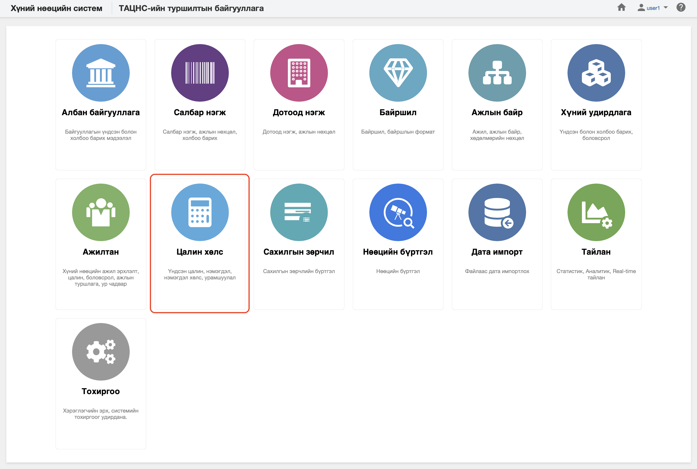

<h1 align="center">Цалин хөлс модуль</h1>

Ажилтны үндсэн болон нэмэгдэл цалин хөлстэй холбоотой мэдээллийг бүртгэх, өөрчлөх үйл ажмллагааг төрийн албаны хүний нөөцийн нэгдсэн системд  **цалин хөлс** модуль зохион байгуулж удирдана.
 

Төрийн албаны хүний нөөцийн нэгдсэн системийн цалин хөлс модуль нь дараах хэсгээс бүрдэнэ.

Үүнд:

- [Хянах самбар](salaries/dashboard.md)
- [Үндсэн цалин](salaries/salary_list.md)
- [Нэмэгдэл цалин хөлс](salaries/compensation_list.md)
- [Тайлан](salaries/report.md)
- [Үйлдэл](salaries/action.md)